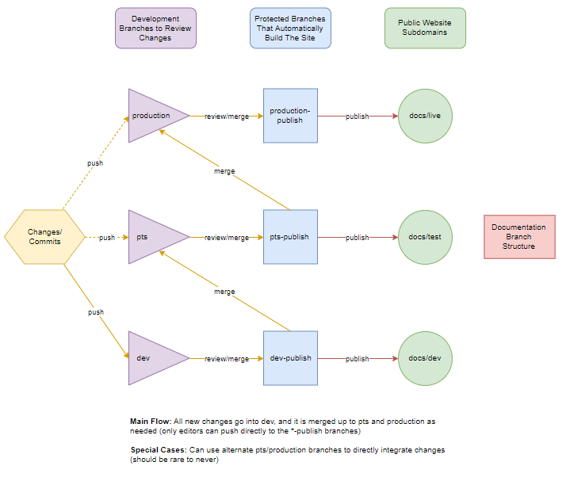

# Contributing

Thanks for contributing! Your assistance is much appreciated. There are a couple
things to cover first. If you've come directly from the website you can safely
ignore the below, this document is intended for people who want to make larger
changes. Specifically it covers:

- The basics of editing and adding new pages
- Which branch to commit to
- Other details (e.g. how to link videos)

## File Editing

You can edit a markdown file directly through GitLab, so it's very easy!

- Select the `.md` file you want to edit.
- Click on the `Edit` or `Web IDE` icons in the top right.
- Make your changes.
  - Here's how [markdown](https://daringfireball.net/projects/markdown/syntax) works, for those not familiar.
  - Additional tools provided by [extensions](https://squidfunk.github.io/mkdocs-material/extensions/admonition/)
- Make sure the changes look good (change the tab on the top to 'Preview changes').
- Add a helpful commit message and add it!

Note that this flow is best for simple changes, for larger ones you should clone
the repository and commit changes with a pull request.

## New Pages

If you want to add a new page, create a markdown file (`.md` extension). Then,
to make it findable, simply add it to the index of pages.

- Go to `mkdocs.yml` and follow the existing format.

In case that isn't enough explanation, here is more info:

If it is a page in an existing folder:

- Go to `nav: -ExistingFolder:`
- Add in a new (indented) line with `- Page Name: 'ExistingFolder/pagename.md'`

If it is in a new folder, add `-FolderName:` to the `nav:` root, like the others.

## Branch Structure

### Branch Workflow

There are multiple version of the Core documentation, and therefore multiple
branches on this repository that correspond to each.

- [Prod](https://docs.manticoreplatform.com/) - the live, production state (useful
for all current or newly created games)
- [PTS](https://pts-publish--manticore-docs.netlify.com/)- the public test server
version (useful for details on impending updates)
- [Dev](https://dev-publish--manticore-docs.netlify.com/) - for in-development,
bleeding edge changes (useful for internal development, or for particularly
invested developers to know what upcoming changes are on the horizon)

**For now just create a pull-request to production for all changes**. When we get
closer to public launch and the various environments become more relevant this
will change and we will use the whole flow.

#### Branch Details

Each state of the published website has a corresponding branch-pair on GitHub, a
commit-able version and a `*-publish` version. So the pair of `production` and
`production-publish` is one example. The `*-publish` version is a protected
branch and _cannot_ be pushed to directly! Instead, all changes must go through
the main branch (`production`), then merged into the publish one
(`production-publish`) via an approval process by the documentation team. This
ensures quality on all public sources of documentation. The (slightly-outdated)
picture below gives a visual representation of this flow.

When a branch is merged to *-publish, it will use --no-ff, so as to not clutter
up the history, and simply allow upstream commits for builds.

#### Full Setup

[Install python and pip](https://www.makeuseof.com/tag/install-pip-for-python/) if you don't have them already.

- Navigate to the location you want to clone this project to (e.g. `cd folder/to/clone-into/`)
- Clone this project from GitHub (e.g. `git clone https://gitlab.com/manticore-games/platform-documentation`)
- `pip install -r requirements.txt` --installs required files
- `mkdocs serve` --starts server, which watches for changes upon saving and updates live
- Navigate to `http://127.0.0.1:8000/`

If you need a standalone and lightweight Markdown editor,
[Typora](https://typora.io/) is a good one.

Base styling provided by
[material](https://squidfunk.github.io/mkdocs-material/).

### Files

Videos must be under 100MB and sourced in the Google Drive under
CoreUserDocumentation/DocsVideos. Click on the video, in the upper right corner
click on the three dots -> open in new window -> three dots -> embed item ->
paste that html code in the docs. Eventually we will embed YouTube links, but
for now this works for tiny (but private) clips.

Pictures: Specs/ideal workflow is WIP. For now drop them in the `img/` folder
and reference as expected. Optimization will likely be handled by the host (Netlify).