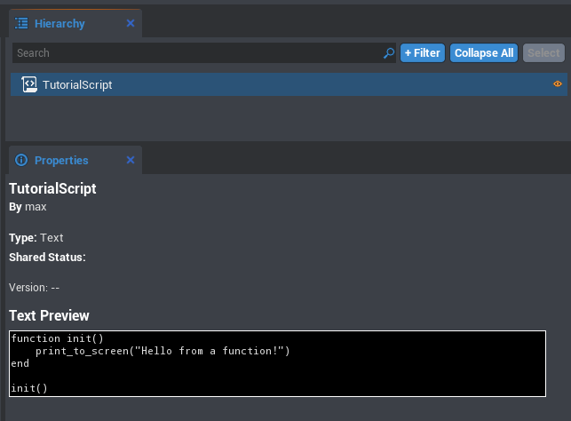
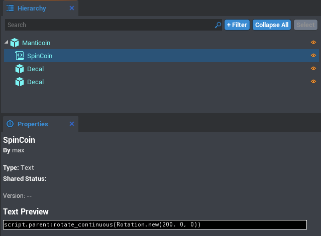

# Tutorial

Now that you've completed the [Lua Primer](lua_primer.md), it's time to get scripting in Core!

## My First Script


### Creating the Script

1. Open up the editor and click the `+New Script` button
    * This will place a new script in the Asset Manifest
* Rename your script to `TutorialScript`
    * You can rename scripts by clicking on the script in the Asset Manifest and pressing `F2`
* Open up the script by double clicking on it
    * By default this happens via our inbuilt editor
    * You can also configure scripts to open in an external editor by default by
    going to `Edit -> Preferences --> External Script Editor`
        * Atom, VSCode, and ZeroBrane all have auto-complete support

### Writing the Script

1. Delete everything in the script. We don't need any of the placeholder code
* Type `print_to_screen("Hello World!")`
* Save the script (`CTRL+S`)

### Running the Script

1. To add your script to the game, drag it from the Asset Manifest to the top of the Hierarchy
* Press `Play` at the top of the editor, and see your message appear on screen!

### Hello World Breakdown

* We made a script
* We populated it with code
    * The function `print_to_screen(string s)` prints the parameter `s` to the viewport. This is one of many of the built-in Core API functions
* We placed the script into the Hierarchy so that it executes when the game runs

Now let's add our own function!

---

## Functions

Let's change `TutorialScript` so the `print_to_screen` call is within a function. We'll call this function `init`, for simplicity.

```lua
-- Our first function!
function init()
    print_to_screen("Hello from a function!")
end
```

!!! note
    In case you've forgotten from the [Lua Primer](lua_primer.md), putting `--` at the beginning of a line makes that line a comment, which is a line of code that isn't read by the computer. You don't have to include these lines, since they're just for leaving notes in your code for yourself and other humans.

If you save and run this code, nothing will happen. How utterly boring! This is because the function is never called in our code. To get our function to work, we can add a function call to the end of the script.

```lua
-- Calling the function
init()
```

You should now have the following:

```lua
-- Our first function!
function init()
    print_to_screen("Hello from a function!")
end

-- Calling the function
init()
```

***Now*** if you save and run this, you'll see your message appear on the screen! Excellent.

!!! note
    Lua prefers functions to be declared before they're called. In this tutorial, we'll make sure to keep all our function declarations at the top of files, like we did with `TutorialScript`.

If you are having issues, check to see if your `TutorialScript` looks like this in the Properties view:



---

## Core API

The next step is to use the Core API to modify objects in the world. We'll start small, with a coin the player can pick up.

### Adding Manticoin

Luckily for you, the marketplace houses many assets you can use in your own games to speed up production and cut down on the amount of work required by you. One of these assets is the `Manticoin`, which we'll use for this project, instead of making our own coin.

To add the `Manticoin` asset to your project, head over to the `Shared Content` tab inside the editor. Type "Manticoin" into the search bar, and click on the one by "max." All you have to do to add it to your project is to click the "Add to Project" button, which is a big plus (+).

!!! note
    The editor will prompt you to save before it adds it to your project.

Next, just like we did with TutorialScript, drag it from the Asset Manifest to the Hierarchy. Now that we have a coin in our world, our goal here is to get our coin to spin slowly in the air, rather than just sitting there being boring. The way to do this is, you guessed it, with a script.

### SpinCoin Script

Let's make a new script, call it `SpinCoin`, and put it one level below the main `Manticoin` object. Like before, delete the current contents, and add the following line of code:

```lua
script.parent:rotate_continuous(Rotation.new(200, 0, 0))
```

We'll explain what this line does in a moment, but for now, quickly make sure your `Manticoin` object looks similar to the following:



Running this should continuously rotate the coin in the air. Shiny!

Okay, so what did we just do?

### Spin Breakdown

* `script` -> references the script object, i.e. the asset you dragged into the hierarchy
* `script.parent` -> references the script's parent object, i.e. the item one level above the script in the Hierarchy (in this case the Manticoin object)
* `rotate_continuous()` -> Every **CoreObject** (things like Scripts, Objects, etc.) has methods available to it. `rotate_continuous` is one of these, and we invoke it with the `:` syntax. It requires a `Rotation` parameter to work
    * Methods are basically just functions that belong to an object
* `Rotation.new(number pitch, number yaw, number roll)` -> Here we create a rotation vector to rotate by a pitch of 200, spinning the coin along the y axis by the requisite speed. `Rotation` is a **Core Class** that has the method `.new`, which takes in parameters for the pitch, yaw, and roll. `.new` returns a `Rotation`, which is exactly what we need to pass in to `rotate_continuous()`. How convenient!

### Spin Cleanup

Writing all that in one line of code makes it a bit confusing, so let's rewrite it to be more clear and explicit.

```lua
-- Get the object one level above the script in the hierarchy, in this case our coin
local coin = script.parent
-- Create a rotation along the x axis
local spin_rotation = Rotation.new(200, 0, 0)
-- Rotate the coin using our previously defined rotation
coin:rotate_continuous(spin_rotation)
```

Yay, we've got it working! Now if only we could collect these coins...

---

## Picking Up Coins

### Adding a Trigger

1. Create a `Trigger` via Object -> Trigger
* Put that trigger as a child of the coin
* Adjust the hitbox via the scale so it is slightly larger than the coin
    * Select the `Trigger` in the hierarchy and press `R` to change to scale mode. Drag the handles to adjust the scale

### Handling Triggers

Let's make a script called `PickupCoin` and place it as the child of the trigger. Delete the script's current code and add the following:

```lua
-- When a player hits the coin, increment a resource on the player and remove the coin
function handleOverlap(trigger, object)
	if (object ~= nil and object:is_a("Player")) then
        object:add_resource("Manticoin", 1)
        trigger.parent:destroy()
	end
end
```

This function takes in the `trigger` that was activated and the `object` that collided with it. We first check to make sure that the orject is not `nil` and that it is a `Player`. If it is a `Player`, [explain add_resource]. Finally, we use `:destroy()` to remove the trigger's parent (the `Manticoin` object) from the game.

We still have one more line of code to assign `handleOverlap` to the trigger.

```lua
-- Whenever an object collides with the trigger, run this function
script.parent.on_begin_overlap:connect(handleOverlap)
```

`on_begin_overlap` is an event that exists within Trigger objects. By using `:connect()` in the code above, we are able to let the event know about `handleOverlap` and call it when the event gets executed.

If you save and press Play, you'll notice that while the coin now disappears on contact, nothing else seems to happen. This is because aren't displaying anything to the player.

### Displaying Coin Count

Let's modify `TutorialScript` to display this info. Add the following code:

```lua
-- Print out 'Player name: {coin count}' every 5 seconds
function tick()
    wait(5)
    local players = game:get_players()
    local num_players = #players
    for i = 1,num_players do
        local num_coins = players[i]:get_resource("Manticoin")
        print_to_screen(players[i].name..": "..tostring(num_coins or 0))
    end
end
```

!!! note
    You can delete what we previously had in `TutorialScript` if you'd like.

Now when you walk over the coin, you'll pick it up, and the amount will be displayed every 5 seconds. The `for` loop will show the score of each `Player`, since Core comes equipped with multiplayer functionality right out of the box.

Next up is to add a UI element to display this information instead of the bland `print_to_screen` call we have now.

---

## Using UI Objects

UI Objects are 2D elements that can be used to show Heads Up Displays (HUD), buttons, and messages to the player. We can leverage these instead of `print_to_screen` to have more control over what the user sees.

### Creating a UI Text

1. In order to use UI elements, we need a UI Canvas. This can be found in Object -> 2D UI... -> Create UI Canvas
* Right click in the Hierarchy and create a `Client Context`
    * Since we only have one `Client Context` in this project, we won't be changing the name
* Make the `Client Context` a child of the UI Canvas
* Go to Object -> 2D UI... -> Create UI Text
* Move the Text Control in the Hierarchy so it's a child of the `Client Context`

_[NOTE(bret): Should the Canvas be inside or outside of the Client Context?]_

!!! info
    While visually similar in the Hierarchy, Client Context is different from a folder - the easiest way to think about it is that its contents will be unique to each client. In other words, the server doesn't care about it.

### Customizing UI Text

_[NOTE(bret): Write this yo! Change font size, position, maybe color, etc]_

_[NOTE(bret): Also make sure we have an image of what it will look like in the game]_

### Updating UI Text

Create a new script called `DisplayCoins` and add the following code

```lua
-- Display the player's coin amount

wait()  -- Wait a tick for players to connect
local player = game:get_local_player()

-- Every 0.1 seconds update the coin count display
function tick()
    wait(0.1)
    local score = player:get_resource("Manticoin")
    local displayString = player.name..": "..tostring(score or 0)
    script.parent.text = displayString
end

--[===[
    Note: For performance we'd ideally write code that only updates the
    UI when the coin count changes, but this example favors simple code
    over robust systems
--]===]
```

!!! note
    Calling `wait()` without sending in an argument will default to a single tick

Now that we have the code to display it, let's add `DisplayCoins` as a child of the Text Control. The folder structure at this point should look like this:


Feel free to play around and customize how the Text Control looks. Using UI is a fantastic way to give your game a unique and professional feel.

Now let's make a simple map and populate it with coins.

---

## Map

Add your objects, put it in a static group (group allows you to grab one object and move all of them). Add a sky. Done.

_[NOTE(bret): This needs expanding. Is a map == a terrain? Do we "need" a map for this tutorial, or just more coins? Maybe the terrain part could be in an "extras"/"more"/"enhancements" category at the end since it's good to know and makes a game unique, but not necessary for getting something working]_

## Win State

### Generating Coins

Okay, now to populate the map with coins. There are a few ways to do this. We're going to manually populate the map, but writing a script to place them would add variance between rounds. When you're done with the tutorial, you could write a script to use random or procedural generation to place them automatically!

Make a folder called `Coins` and add the `Manticoin` object as a child. and copy Manticoins to scatter them over the map (the shortcut of Ctr+W to duplicate may be helpful for this)

!!! note
    Folders and groups are very similar, but have one huge distinction: folders treat their children as independent objects, whereas a group will treat them as part of a larger whole. Trying to select a single object in a group will select the entire group, making _all_ items in the group be modified by any changes you make.

Now we will write a script to make the game round-based.

### Game Logic Script

Create a script called `CoinGameLogic` and put it into the top of the scene. Here's the entire hierarchy at this point:


!!! note
    The order of items in the Hierarchy is the order in which they'll be executed. Scripts dealing with game logic are best placed at the top!

    _[NOTE(bret): Is this correct? Will it always be this way?]_

We are going to update the game when the player has picked up all the possible coins. First, we'll need a new Text Control which we'll name `CoinUI` which will only show up when the game is over, alerting the player all coins have been collected.

_[NOTE(bret): We'll need to either set the text to "" at the beginning of the script or show how to edit that in Properties]_

Add the following code to `CoinGameLogic`:

```lua
-- Get the folder containing all the coin objects
local coinFolder = game:find_object_by_name("Coins")

-- Every second check for how many coins are left in the scene
function tick()
	wait(1)
	local coinsLeft = #coinFolder.children
	if coinsLeft == 0 then
		game:find_object_by_name("CoinUI").text = "All Coins Found!"
	end
end
```

`game:find_object_by_name()` searches the hierarchy for the object with the name passed in. The first time we use it to find `coinFolder`. We then look at how many coins are left by seeing how full the folder of coins in the hierarchy is (`.children` gets the child elements, and `#` checks the length of the array, which is many there items it has).

_[NOTE(bret): Maybe we add something that actually makes the user "win" - we could grab some part of the reset, and then explain to the user that even though the game has rounds and a win state, we need to go through and respawn the coins]_

## Reset

Lastly, let's add in the logic to reset the map (i.e. add the coins back) after they all have been picked up.

Currently we are deleting the coins when they are picked up. We could spawn in new coins at the old locations, but that would involve storing references to the old locations, which adds a bunch of boilerplate code. Sometimes you need to rewrite code as your game changes, and that's exactly what we're going to do!

An easier solution would be to just hide the coins from the map when they are picked up, and then un-hide them when resetting the map. Fortunately, this is not only a simple thing to do in Core, but is a very quick change.

### Resetting Coins

Open up the `PickupCoin` script, and change the line of `trigger.parent:destroy()` to `trigger.parent.enabled = false`. This will make it so that when we collide, instead of destroying the `Manticoin`, it disables it. Disabling an object makes it basically not present in the scene. The two biggest things for us is that it disables the collision and visibility, so players won't be able to collide with it or see it after it's been collected.

Next, create a UI element to display information when the round resets. We'll call it `RoundUI` and make it a sibling of `CoinUI` (in other words, set it as a child of your `Client Context`). Like `CoinUI`, let's set the Text property to be blank by default (we'll add text to it later programatically).

The last step is to add the resetting logic to our main `CoinGameLogic` script.

Next we need to add the logic to reset the map, which for us simply means looping through all the coins and setting their `.enabled` property to be true. The logic will be quite similar to getting the coin count. Here it is as a function:

```lua
-- Set all coins to be enabled
function ResetMap()
	for _,coin in pairs(coinFolder.children) do
		if coin ~= nil then
			coin.enabled = true
		end
	end
end
```

### Updating Coins Left Detection

You might notice that our old code for checking the number of coins left won't work anymore, as we are setting a property on each of the coins (`.enabled`) rather than deleting the object entirely. Add the following function:

```lua
-- Get the amount of coins that are enabled in the scene
function GetCoinsLeft()
    local count = 0
    for _,coin in pairs(coinFolder.children) do
        if coin ~= nil and coin.enabled then
            count = count + 1
        end
    end
    return count
end
```

This function will return how many coins are left. All that's left to do is to add these function calls to our main tick loop and update the UI, and we'll be done!

### Connecting all the Reset Code

```lua
-- Check for the round end by looking for the amount of coins left
-- If the game should end, display a UI element, countdown, then reset the map
function tick()
	local players = game:get_players()
	local coinsLeft = GetCoinsLeft()

	if coinsLeft == 0 then
		local uiText = game:find_object_by_name("RoundUI")
		uiText.text = "All Coins Found!"
		wait(3)
		for i = 3,0,-1 do
			wait(1)
			uiText.text = "New round in "..tostring(i).." seconds"
		end
		ResetMap()
		uiText.text = ""
	end
end
```

And there we go! We have a complete game!

## Conclusion

Finally, you can check out the game by going [here](https://staging.manticoreplatform.com/games/b8efe9e824994eae963d618cdbcabbd1) and clicking on 'edit' to download a copy of the game to play around with yourself!

_[NOTE(bret): Perhaps a Part 2 with more stuff like terrain, sound effects, more UI, etc? There were some great tutorials for Game Maker (before it lost the space) produced for the 7.0 version of the software. A lot of their tutorials were broken into parts, with part 1 usually being super bare bones, then each one adding features or polish. There were example files for each part. Could be something to consider doing for our tutorials as well :)]_

_[Also, I still have them on a hard drive if we ever wanted to use them as reference materials. ]_