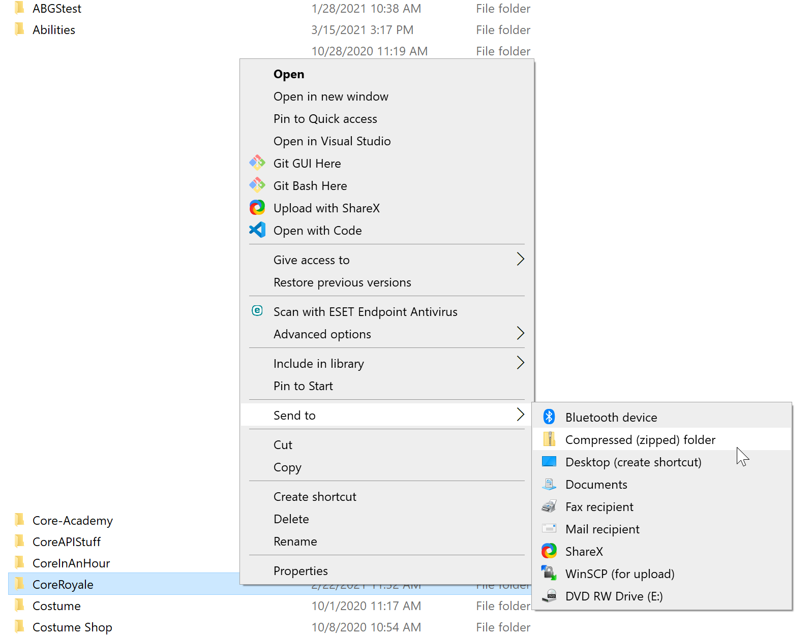
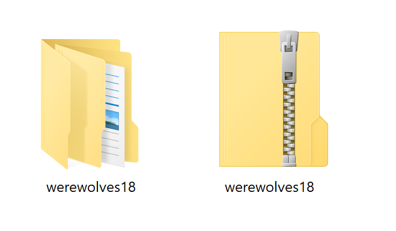
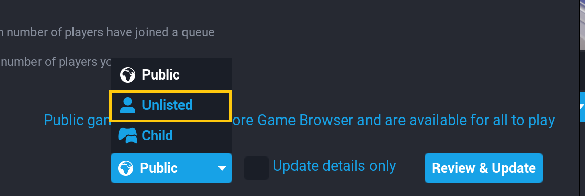

# Backing Up and Deleting Core Projects

Core projects are saved in local files on the PC where they are created, and are not backed up when they are saved or published. To protect these project files, there are multiple ways of uploading your project to a cloud drive or even storing it on a portable hard drive, including using Git and GitHub. See the [GitHub Tutorial](../tutorials/github.md) for detailed instructions on getting started with GitHub.

The simplest solution to this problem, however, is to make a compressed version of the project and upload it to a cloud drive.

## Finding the Core Project Files

For a detailed breakdown of what all these folders do and how changes in the Core Editor are reflected in the files, see the [Project Files Reference](project_files.md).

### Open the Project File using the File Explorer

1. Open **My Documents**.
2. Find and open the folder called **My Games**.
3. Inside, you should find a folder called **Core** (it may be **CORE**).
4. Open the **Saved** folder.
5. Open the **Maps** folder.
6. In this folder, you should have one folder for each saved project in the Core Editor.

### Open the Project File from the Core Editor

1. Open your project in the Core Editor.
2. Click **File** in the top menu bar.
3. Select **Show Project in Explorer**.

## Saving a Zipped Project to A Cloud Drive

### Make a Compressed (Zipped) Folder

To make a zipped folder, start by finding the project in the **Maps** folder using either of the methods from the previous section. Once you have found the folder, navigate up to the Maps folder by clicking the up arrow icon in the File Explorer or press ++Alt+Arrow-Up++.

{: .center loading="lazy" }

1. Right click the outer project folder. Its name should match the name of your Core project.
2. Mouse over **Send to** and select **Compressed (zipped) folder**.
3. A new folder with the same name should appear in the **Maps** folder, with a zipper icon on top of it.

{: .center loading="lazy" }

Once you have compressed the file, you can upload it to any cloud drive service you use, like Google Drive or DropBox, or even send it by e-mail and through messenger services, like Discord.

## Deleting a Game

The local version of your game is what allows you to make updates to the content, and the meta information about your game, like the description and screenshots. Deleting this file will not delete the project, but it will remove your access to changing it.

!!! warning "Avoid deleting local project files before you have made the game unlisted"

Creators cannot delete games from the servers, but you can unlist a game so that players can no longer search for it and it will not appear on your public profile.

### Unlist a Game

To set a game to unlisted the process is the same as [publishing](publishing.md):

1. Open your project in the **Core Editor**.

2. Click the  **Publish Game** button in the top right corner of the editor.
{: .image-inline-text .image-background}

3. In the drop-down menu near the **Publish** button, change the game from **Public** or **Child** to **Unlisted**.

{: .center loading="lazy" }

You can also delete the contents of the game and publish a blank version to fully remove it, but it is best to keep your project file and publish data if you want to have control over changing it in the future.

## Learn More

[GitHub Tutorial](../tutorials/github.md) | [Publishing](publishing.md) | [Project Files](project_files.md)
