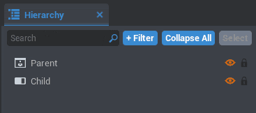

# Introduction to the CORE Editor

!!! warning
    Flagged for Review.
    Incomplete or outdated information may be present.

## Setup & Installation

To get started, you'll need two things, the installer and an account. You can get both from [our website](https://coregames.com/). As soon as you are registered, you'll find a download link to the installer in the user dropdown menu in the top right corner.

Please check your spam folder if you don't see a verification email for your CORE account in your inbox. If you need further help troubleshooting, please join the [CORE Creator Discord](https://discord.gg/85k8A7V) where we have live support!

!!! note
    It is recommended to install CORE on the default path. Please do not direct CORE to install in "Program Files" or "Program Files (x86)". If you install elsewhere and run into problems, please let us know! 

## Launcher

Now you'll have a new icon in your startmenu, CORE Launcher. If you want to start working on a project, launching CORE directly is the way to go, if you want to play games others made, you just head to [coregames.com](https://www.coregames.com/games) and hit "**Play**" on any game you like. Your browser will prompt you to open CORE, you hit okay and CORE will launch directly into the game.

## Editor

If you decide to work on something new, you start the Editor directly via CORE Launcher. When you open up the editor you'll see the following screen:

{: .center}

1. Character - Your place to customize your CORE Avatar.
2. Create - Where games directly authored by you live.
3. Games - A link to the game browser on [coregames.com](https://www.coregames.com/games).
4. Documentation - A link to our [documentation platform](https://docs.coregames.com) that in addition to our API also houses a ton of tutorials to get you started.
5. Discord - A link to the [CORE Creator Discord](https://discord.gg/85k8A7V).
6. Feedback - A link to [a form to submit feedback](https://docs.google.com/forms/d/e/1FAIpQLSdpHIY56by19xUTSJjLiCY64SOz5SOxhJU4Cf0HvODOkB0dhg/viewform).
7. User Dropdown - Here you can log out or exit CORE.

Now to create a new project, click on the big "**Create New**" button, select "**Empty Project**" and give it a name. Now you're in the Editor!

{: .center}

The best way to start is by making a map. Then we'll add functionality with a simple game. Lastly, we'll see how using Communiy Content can expedite this
entire process. The editor is divided into different windows or "**Views**" which have distinct roles. If you close a view, you can re-open it via the drop-down toolbar at the top left of the screen.

!!! info "Icons are used to visually represent information, you can view a full list of the icons contained within CORE in our [icon glossary](../icons.md)."

We'll now go over each in more depth in their respective sections.

### Toolbar

The basic functions like Undo, Redo, Move, Rotate, Scale, Snap To Grid, Grid Size, World / Local Space, Performance, Play, Pause, Multiplayer and Editor Settings live here.

#### Preferences

Here you can change several things:

* General Settings include options for using an external code editor, syntax highlighting and auto complete.
* Player Controls lets you change your key bindings
* Gameplay Settings have camera sensitivity and Y-Axes inversion and more.

### Main Viewport

The Main Viewport is where you are designing your game.

### Asset Manifest

The Asset Manifest is split into three parts, it is the place to add new content to your game.

#### Project Content

This contains everything that you added to your project, including stuff from CORE and Community content as well as your own assets.

#### CORE Content

Within the CORE content tab you can select an asset type from the drop down menu, then press the "**+**" icon to expand the different categories within that type. These categories include all assets provided by CORE.

    <video autoplay loop muted playsinline>
        <source src="../../img/EditorManual/core_content.mp4" type="video/mp4">
    </video>

#### Community Content

To access assets created by other creators, open the "**Community Content**" view. You can browse content based on a variety of search criteria. These shareable content items are called "**Templates**" and may include scripts, visuals, or even complete games.

{: .center}

To learn more about templates, including how to make your own to share, checkout our [template guide](../tutorials/gameplay/collaboration_reference.md).

### Hierarchy

The Hierarchy view includes all of the objects in your game. If you add an object, for example a "**Trigger**", it will appear here.

{: .center}

You can parent objects by dragging them onto each other. See the example below where we make the "**Child**" object into a child of the "**Parent**" object.

{: .center}

When an object is a child of another, it will be affected by its parent's position, scale, and visibility. See how in the example the child is automatically hidden when we choose to hide the parent.

### Properties

The Properties window is where all the details of a selected object can be found, and changed. Things like world position and visibility can be altered here.

{: .center}

### Event Log

The Event Log is a way to quickly view the results of your code, any script can call the `print()` function to output text directly to this view!

{: .center}

## Summary

Here are a few links to get you started on certain areas in CORE:

* [Art Intro](../tutorials/art/art_reference.md)
* [Scripting Intro](../tutorials/gameplay/lua_reference.md)
* [Community Content](community_content.md)
