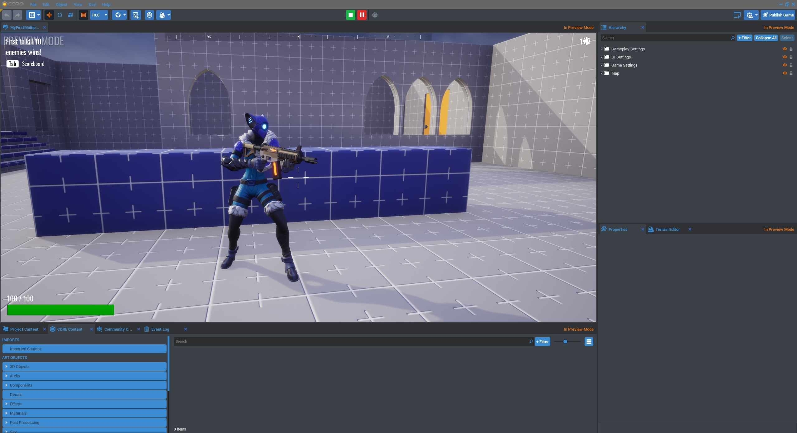
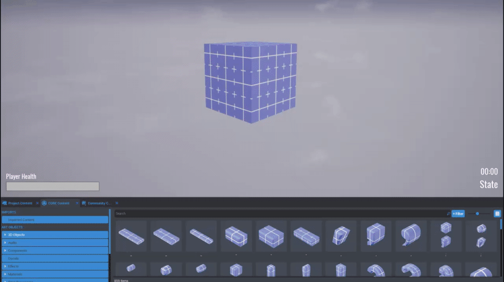
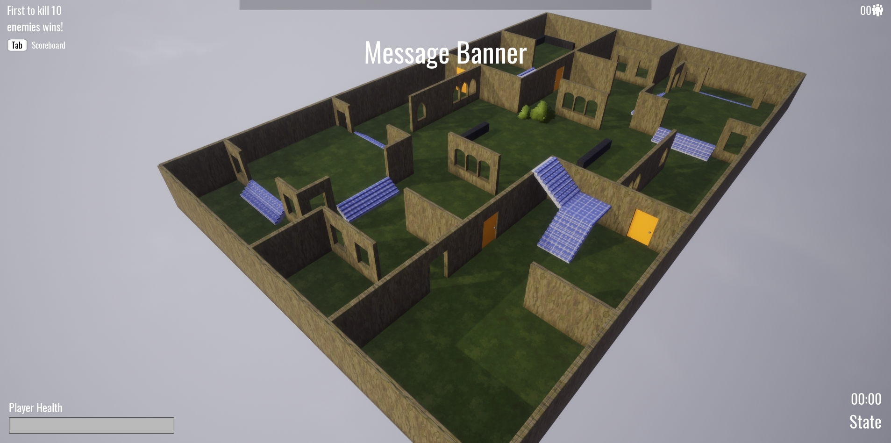
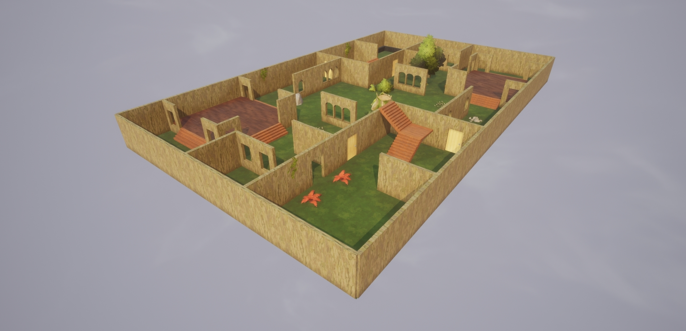

# My First Multiplayer Game

!!! warning
    Flagged for Review.
    Incomplete or outdated information may be present.

## Overview

Welcome to CORE! We're excited to have you in Closed Alpha and can't wait to see what you create. To get you started, we're going to walk you through creating your first multiplayer game in CORE... in 10 minutes!

{: .center}

* **Completion Time:** 10 minutes
* **Knowledge Level:** Beginner! No experience necessary!
* **Skills you will learn:**
    * Editor Basics
    * CORE Content (Props & Materials)
    * Player Movement Settings
    * Community Content
    * Publishing

## Create a New Game

To get started, we're going to create a new project.

1. Click on **Create New**.

    {: .center}

2. Select the **Deathmatch** framework!

    {: .center}

3. Name your project `MyFirstMultiplayerGame` or whatever you like! Then, click Create.

    {: .center}

### Explore the Map

The Deathmatch framework gives a great starting point! Let's try it out ourselves.

1. Behold the magnificence of this whiteboxed, free-for-all game framework! Let's jump in by pressing **Play**.

    {: .center}

2. Out of the box, you have a character who can move and jump! Explore the map by moving your character with the <kbd>WASD</kbd> keys and jumping with <kbd>Space</kbd>. Shoot the default gun with your left mouse click and interact with the door with <kbd>F</kbd>.

    {: .center}

3. But we're all by ourselves. 😞 That's no fun, so let's test out the multiplayer experience by simulating two clients! Near the pause button, click on the **Multiplayer Preview Mode** button and select 2 Players.

    {: .center}

4. Let's press Play again! CORE will launch multiple windows, one for each player. You control whichever character is in the active window.

    {: .center}

!!! tip
    Note that you can use <kbd>Alt</kbd> + <kbd>Enter</kbd> to toggle between fullscreen and windowed mode. You can also use <kbd>Win</kbd> + <kbd>Arrow</kbd> to dock the screens side by side like above!

## Make It Your Own

So we have a whiteboxed map, and that's great and important in testing design! Now, let's customize the map and make it our own.

1. Navigate to the **CORE Content** window. You have access to a massive library of 3D assets, materials, and more for your game creation in CORE!

    {: .center}

    !!! note
        If you can't find the "CORE Content" window or accidentally close it, you can reopen the window by going to View > Core Content in the toolbar at the top of the editor.

2. Click on "3D Objects" and then drag and drop props into the editor viewport! In this example, we're going to place some bushes.

    {: .center}

3. You can move, rotate, and scale all these objects! `W` activates Translation Mode to move objects; `E` activates Rotation mode; and `R` activates Scale Mode to resize objects. Let's click and drag on an arrow to move the object along that axis.

    {: .center}

4. Press Play. Currently, if you try to move through a bush, you'll be stopped once you collide with the object.

    {: .center}

5. Bushes are great as environmental props to hide players, but it'd be great to let players push past them to surprise enemies in this game! Let's click on a Bush and check out the Properties window. By default, this Bush is "Collideable" but with a simple click, we can turn that off.

    {: .center}

!!! note
    If you can't find the "Properties" window or accidentally close it, you can reopen the window by going to View > Properties in the toolbar at the top of the editor.

### Designing Your Level

Let's take this time to build out our own game! We're going to apply materials to whiteboxed scene, add more props, and add a sky to finish off the scenery.

1. Let's check out the Materials library within **CORE Content**! It's fast and easy to drag and drop any material onto an object to apply it.

    {: .center}

2. But there's a really fast way to apply materials to all the objects in our game! To the right of the editor, game objects are listed in the "Hierarchy." Let's use the search bar to find all the "Wall" objects. Then, click the "Select" button to the right.

    {: .center}

3. Search for "Bark Oak 01" (or choose any material you like!) and drag it back into the hierarchy where all the selected walls are currently highlighted.

    {: .center}

4. Looking good! Let's practice some more. Try searching the Hierarchy for "windows", using the Select button, and applying the same material.

    {: .center}

5. Let's switch out this whitebox floor! Search the hierarchy for "floor", use the "Select" button to select all floor pieces, and drag and drop the material "Grass Clumps" onto the selected floor.

    {: .center}

6. Now, it's your turn! Apply a material to the stairs and add more props to your game! Remember you can scale, rotate, and transform objects as well as explore an object's Properties!

    {: .center}

    !!! info "How do I make my own material?"
        If you want to learn more about customizing materials, check out our [Custom Material tutorial](../tutorials/art/custom_materials.md).

7. Awesome! This scene looks rather dark though. Let's make it more vibrant with some better lighting! In "Core Content," search for sky. Then, drag and drop "Sky Whimsical Sunny Saturation."

    {: .center}

!!! tip
    In CORE, you even have tons of customizable post process effects and VFX. Search for "Advanced Bloom Post Process" in CORE Content and try it out!

### Customizing the Gameplay

The map's in good shape now! Let's change up the gameplay itself now. There are lot of props on the map now, so let's give the player more power to hop over them.

1. Find the "Player Settings" in the "Game Settings" folder or search the Hierarchy for it.

    {: .center}

2. In the Properties window of "Player Settings," change the Jump Max Count to 2 so all players have a double jump! Press Play and try it out with <kbd>Space</kbd>.

    {: .center}

3. Great! Now, let's make this game have shorter rounds since 10 Kills may take a while. Let's go into the "Gameplay Settings" folder and select "Round Kill Limit."

    {: .center}

4. In the Properties window, change the "KillLimit" custom property to 3. Now, if you playtest, the winner will be whoever gets 3 kills first!

    {: .center}

5. Game rounds now end at 3 kills, but in the upper-left corner of the screen it still says "First to kill 10 enemies wins!". Let's change that UI text to match the Round Kill Limit. In "UI Settings", find "Game Instructions" and click on the "UI Text Box." In Properties, change the Text field to 3.

    {: .center}

6. Let's move the "Player Start" where players spawn to be further apart. Press `V` to toggle gizmo visibility-- you can now see the camera, spawn points, and trigger boxes.

    {: .center}

!!! tip
    With the shortcut key `0`, you can create a spawn point at your cursor's location. Check out more editor shortcuts [here](../editor_keybindings.md)!

### Choose Your Weapon from Community Content

1. Navigate to **Community Content**, where creators can publish and share their creations with the community! Let's search for a weapon and then click on the `Import` button to download the template into your local project. In this example, the "Tree Gun" by Buckmonster will be imported.

    {: .center}

    !!! note
        If you can't find the "Community Content" window or accidentally close it, you can reopen the window by going to View > Community Content in the toolbar at the top of the editor.

2. Locate your imported weapon in **CORE Content** under the "Imported" category.

    {: .center}

3. Now, in the "Gameplay Settings" folder in the hierarchy, locate the "Starting Weapon" folder. In Properties, there is an "EquipmentTemplate" custom property which currently is the "Basic Rifle".

    {: .center}

4. To swap out the starting weapon, drag and drop your imported gun's template into the "EquipmentTemplate" field.

    {: .center}

5. Press Play and test our your awesome new gun... that shoots tree!

    {: .center}

!!! info "That's too cool. How do I make my own weapon?"
    It's easy! Check out our [Basic Weapons Tutorial](../tutorials/gameplay/weapons.md).

## Publishing Your Game

Almost there! Now to make your game live for the world.

1. Locate the `Publish` button in the top right of the editor and press it.

    {: .center}

2. Fill out all the relevant information! Give your game a name, write up a description blurb, add relevant tags, and take a screenshot for your game! For your game's screenshots, you can either take snapshots in-editor with the camera button or select an image file from your directory via the folder button.

    {: .center}

3. Click "Publish" in the bottom right corner. Anytime you're republishing the game with changes or updates, you can follow the exact same flow, except with a "Review & Update" button instead. When your game has been successfully published, a new window will pop up!

    {: .center}

4. Your game's now live! Visit your game's page and press play to try it out online.

    {: .center}

## Next Steps

Congrats! You've made your first multiplayer game! 🎉

Now's the best part: playtesting! Come invite people to join you in-game in the #playtest channel on :fab fa-discord: [Discord](https://discordapp.com/invite/3H4j3YJ). Manticore devs will be hanging out there too, and we can't wait to see what you create! If you need any help or have questions, there'll be live support there too.

Excited? Check out these tutorials to build out your game:

* Sculpt your own world! Check the [Terrain Tutorial](../tutorials/gameplay/weapons.md).
* Create your own Weapon! Try out the [Basic Weapon Tutorial](../tutorials/gameplay/weapons.md).
* Learn how to add player Abilities! Let players celebrate and [Dance Dance Dance](../tutorials/gameplay/abilities.md)!
