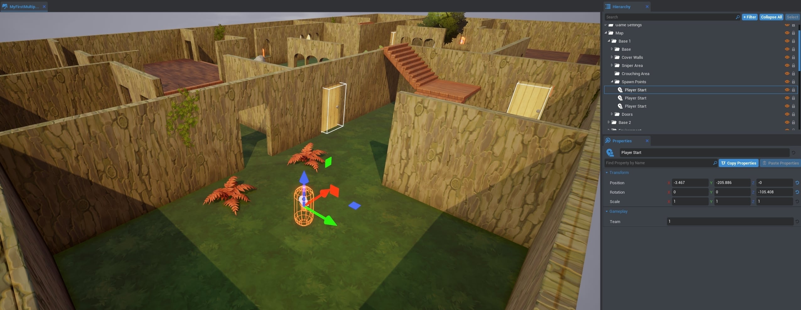

# Build Your First Game In Core

<lite-youtube videoid="-rIbd612sUM" playlabel="Build Your First Game In Core"></lite-youtube>
{: .video-container }

## Overview

Jump in and build a game using Core's Deathmatch framework. Customize as much or as little as you want to build this multiplayer arena shooter.

- **Completion Time:** 10 minutes.
- **Previous Knowledge:** [Installing Core](installing_core.md).
- **Skills you will learn:**
    - Core Frameworks
    - Core Content
    - Manipulating Objects
    - Applying Materials
    - Collision
    - Player Settings
    - Game Settings
    - Spawn Points

## Start a New Project

To get started, use the **Create** menu to make a new project

### Click **Create New**

{: .center loading="lazy" }

1. With Core open, click the **Create** Tab on the left side menu.
2. Click **Create New Game**.

### Select the **Deathmatch** framework

{: .center loading="lazy" }

<!-- ### Create a new Project

{: .center loading="lazy" } -->

1. Click **View Frameworks** in the **Core Game Frameworks** option.
2. Click **Deathmatch**.
3. Name your project. `MyFirstGame` works well, but choose any name.
4. Click **Create**.

## Explore the Project

The Deathmatch framework gives you a complete game arena and shooter functionality out of the box.

{: .center loading="lazy" }

### Test Player Movement

- Press  or ++equal++ to preview your project as a player.
{: .image-inline-text .image-background }
- Press ++tab++ to pause the preview.
- Press  or ++equal++ to stop the preview.
{: .image-inline-text .image-background }

As in any Core game project, you already have a working character controller.

- Move the character with the ++W++, ++A++, ++S++, and ++D++ keys.
- Jump with ++Space++.
- Crouch with ++C++.
- Ride a mount with ++G++.

### Test Shooter Mechanics

Besides player movement, **Deathmatch** also gives each player a gun to shoot, and the ability to open and close doors.

- Shoot the default gun with the left mouse button.
- Open and close a door with ++F++.

{: .center loading="lazy" }

### Test Multiplayer Gameplay

Core projects also include multiplayer networking by default. Because this is a crucial component of this game, it is important to test using **Multiplayer Preview Mode** as much as possible.
{: .center loading="lazy" }

1. Click  to switch the Preview Mode to Multiplayer.
    {: .image-inline-text .image-background }

2. Press  to start the preview. This will open a separate game window for each player.
    {: .image-inline-text .image-background }

    {: .center loading="lazy" }

!!! tip
     You can use ++Alt+enter++ to toggle between fullscreen and windowed mode. You can also use ++Win+Arrow++ to dock the screens side by side.

## Customize the Arena

### Explore Core Content

Core gives you a massive library of 3D assets, materials, sounds, and components for making games, which can be found in the **Core Content** Window.

!!! note
    You can reopen the **Core Content** window by going to **Window** > **Core Content** in the top menu bar.

1. Click **Core Content**.
2. Drop down the **3D Objects** menu to see the props and objects that can be added to the scene.
3. Click on the **Nature** subcategory.
4. Choose a bush and some other props to drag into the scene.

    <video autoplay loop muted playsinline poster="/img/EditorManual/Abilities/Gem.png">
        <source src="/img/MyFirstMultiplayer/DragDropBushes.webm" type="video/webm" />
        <source src="/img/MyFirstMultiplayer/DragDropBushes.mp4" type="video/mp4" />
    </video>

### Create Hiding Places

You can move, turn, and resize objects.

-  or ++W++ activates Translation Mode.
{: .image-inline-text .image-background }
-  or ++E++ activates Rotation Mode.
{: .image-inline-text .image-background }
-  or ++R++ activates Scale Mode.
{: .image-inline-text .image-background }

    <video autoplay loop muted playsinline poster="/img/EditorManual/Abilities/Gem.png">
        <source src="/img/MyFirstMultiplayer/MoveBushes.webm" type="video/webm" />
        <source src="/img/MyFirstMultiplayer/MoveBushes.mp4" type="video/mp4" />
    </video>

1. Click on the bush and press ++G++ to move it.
2. Use the arrows to move it into a good hiding place for a player.
3. Press ++R++ to change the size of the bush.
4. Click and drag the white box at the center of the bush to resize it proportionately.
5. Move, rotate, and scale the rest of the objects to enhance the scene.

### Turn Off Collision

By default, Core objects have collision, so players can't just walk into bushes yet.

1. Test this by pressing  to preview the game.
{: .image-inline-text .image-background }
2. Look at your props from a player perspective. You should be able to walk up to a bush, but collide with it once you touch it.
3. Click on the bush to select it, and open the **Properties** window.
4. Find the **Collision** property and change it to **Force Off**.

    <video autoplay loop muted playsinline poster="/img/EditorManual/Abilities/Gem.png">
        <source src="/img/MyFirstMultiplayer/NoCollisonBush.webm" type="video/webm" />
        <source src="/img/MyFirstMultiplayer/NoCollisonBush.mp4" type="video/mp4" />
    </video>

You should now be able to walk into a bush. Test this in **Multiplayer Preview Mode** to see how well it works for concealment.

!!! note
    You can reopen the **Properties** window by going to **Window** > **Properties** in the top menu bar.

## Finishing the Arena

### Add a Material to an Object

**Materials** allow you to add colors and textures to the objects in the scene, by dragging and dropping them onto objects.

1. In the **Core Content** window, drop down the **Materials** menu to see the options.
2. Pick a material, and drag it onto one of the objects in the scene.

    <video autoplay loop muted playsinline poster="/img/EditorManual/Abilities/Gem.png">
        <source src="/img/MyFirstMultiplayer/MaterialExample.webm" type="video/webm" />
        <source src="/img/MyFirstMultiplayer/MaterialExample.mp4" type="video/mp4" />
    </video>

### Cover the Walls

You can apply a material to multiple objects by selecting them.

- Use ++shift+Left Click++ to select more objects.
- Left click and drag to select objects in an area.

    <video autoplay loop muted playsinline poster="/img/EditorManual/Abilities/Gem.png">
        <source src="/img/MyFirstMultiplayer/WoodWalls.webm" type="video/webm" />
        <source src="/img/MyFirstMultiplayer/WoodWalls.mp4" type="video/mp4" />
    </video>

1. In the **Hierarchy** window, type "wall" into the search bar to show only the objects named **Whitebod Wall 01**.
2. Press ++enter++ to select everything from the search.
3. Choose a material, and drag it onto one of the walls.

!!! note
    You can also select the entire list by clicking the first object in the list, then holding ++shift++ and scroll down to click the last.

### Give Everything a Material

You can continue using these techniques to complete the appearance of your Deathmatch arena. Try searching for each of these labels to apply materials in groups:

- `stairs`
- `window insert`
- `floor`

{: .center loading="lazy" }

!!! info
    You can customize materials and how they apply to objects. Learn more in the [Custom Material Tutorial](custom_materials.md).

## Customizing Gameplay

In this final section, you will find different ways to change the gameplay itself.

### Add Double Jumping

{: .center loading="lazy" }

1. Find **Player Settings** by searching for it in the **Hierarchy**.
2. Open the **Properties** window to see all the settings that can be changed for each player
3. In the **Jump** section, change **Jump Max Count** to `2`,
4. Press  to test out double-jumping with ++Space++.
{: .image-inline-text .image-background }

{: .center loading="lazy" }

### Change The Round Kill Limit

In the top left corner of the screen in game, you can see that you win the Deathmatch by killing 10 opponents. This can be changed in **Game Settings**.

{: .center loading="lazy" }

1. Search for **Round Kill Limit** in the **Hierarchy**.
2. Open the **Properties** window.
3. Find the **KillLimit** property and change it to `2`.
4. Start a **Multiplayer Preview** of your game, and see if you win by shooting an opponent twice.
{: .image-inline-text .image-background }

{: .center loading="lazy" }

### Change the UI Instructions

Although the game now ends after two kills, the instructions shown on the screen still tell players to shoot for ten.

1. Search for **UI Text Box** under **Game Instructions** in the **Hierarchy**.
2. Open the **Properties** window.
3. Change the **Text** property to match your game's win condition.

{: .center loading="lazy" }

### Move the Player Start

Let's move the "Player Start" where players spawn to be further apart. Press ++V++ to toggle gizmo visibility -- you can now see the camera, spawn points, and trigger boxes.

1. Search for **Spawn Point** in the **Hierarchy**.
2. Move the spawn points around the map the same way you would any object.

{: .center loading="lazy" }

!!! tip
    Press ++0++ to create a spawn point at your cursor's location. There are more [Editor Shortcuts](editor_keybindings.md) that can streamline your game creation flow.

## Publishing a Game

You now have a complete and unique deathmatch-style game. If you are ready to test it with real human players, then [publish your game](publishing.md).

## Next Steps

[Publish a Game](publishing.md) | [Terrain Tutorial](environment_art.md) | [Basic Weapon Tutorial](weapons.md) | [Abilities Tutorial](abilities.md)
