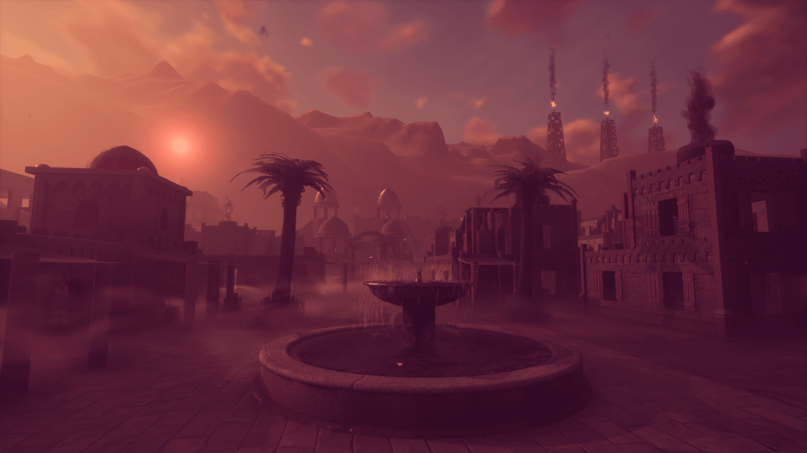

# Create Amazing Games in Core

Welcome to the official documentation of Core&trade;, the community-focused game creation tool!

Core is a new game creation platform by [Manticore Games](https://www.manticoregames.com) that allows anyone to create, share, and play high quality online games.

_Start Here: [Create your first game](getting_started/my_first_multiplayer_game.md)_
{: .image-cluster .hero-image}

    <figure>
        <a href="tutorials/gameplay/weapons/" title="Weapons">
            
            <figcaption><em>Build a Weapon</em></figcaption>
        </a>
    </figure>
    <figure>
        <a href="tutorials/art/environmental_art/" title="Environmental Art">
            
            <figcaption><em>Craft an Environment</em></figcaption>
        </a>
    </figure>
    <figure>
        <a href="tutorials/gameplay/abilities/" title="Abilities">
            <video autoplay loop muted playsinline poster="img/EditorManual/Abilities/Gem.png">
                <source src="img/EditorManual/Abilities/unarmed_wave.mp4" type="video/mp4" alt="Create an Ability"/>
            </video>
            <figcaption><em>Create an Ability</em></figcaption>
        </a>
    </figure>

## About Core

Core is a one-stop shop with everything you need to create and publish high quality games. Creators of all skill levels can use Core to make something both beautiful and fun.

Core combines professional-grade tools with a radically accessible interface. These include:

- **Built-in multiplayer**: share and play with friends anywhere in the world
- **One-click publishing**: launch your game with the push of a button
- **Community content**: Bolster your creation with objects, scripts, and even entire games shared by other creators
- **Every tool you need**: VFX, audio, materials, textures, skyboxes, terrain sculpting, heightmaps, scripting, UI,  you name it

{: .image-cluster}

## About the Alpha

**Core is in Closed Alpha**, which means it is only available to a select group of creators. If you’re reading this, you’re one of them!

As one of the first to make games in Core, you are an explorer in uncharted territory. There will be surprises, there will be changes, and there will be bugs of unusual size. The goal of this journey is to provide feedback that pushes Core to be as great as it can be.

Most importantly, we’re all here to **make games and community content that future players will love**.

Some things to keep in mind:

- There will be bugs - help us find them!
- :fab fa-discord: [Join the community](https://discord.gg/85k8A7V) and help us shape the product in real time.
- [Share your feedback](https://docs.google.com/forms/d/e/1FAIpQLSdpHIY56by19xUTSJjLiCY64SOz5SOxhJU4Cf0HvODOkB0dhg/viewform) with us often. No detail or thought is too small!

In addition, while we will work hard to avoid them, please keep in mind the following possibilities:

- We may need to bring the servers down
- Assets may change
- We may need to wipe content during Alpha

## The Core Alpha is Confidential

**Everything you see in Core, in this documentation, and in the games Core creates is strictly confidential.**

We’re excited to share these very early stages of Core with you. We ask that you respect confidentiality so that we can be as transparent as possible with the community.

## About the Documentation

This documentation is continuously written and edited by both Manticore as well as members of the community. Contributions are more than welcome!
If you want to help out, just email [docs@manticoregames.com](mailto:docs@manticoregames.com) with the name of your GitHub account to get set up.

## Organization of the Documentation

- The **Getting Started** section is the main purpose of this documentation, as it contains all the
  necessary information on how to [install](getting_started/editor_intro.md) Core and using the engine to make games.
- The **Community** section points to various community channels like Reddit and Discord and contains
  a list of recommended third-party tutorial links.
- The **Tutorials** section can be read as needed, in any order. It contains both
  full games and various feature-specific tutorials. This is the best place to go for information on
  larger projects. It includes the [Light Bulb](tutorials/gameplay/lua_basics_lightbulb.md) tutorial, which should be the entry point for all new users. In addition to this you may also want to take a look at our collection of various example projects and templates on the [examples](tutorials/examples.md) page.
- The **Core API** section is intended for all users looking to add gameplay elements, as it
  contains all the information you need to know about scripting in Core. It includes sections on Lua
  (including a primer for programmers and resources for complete beginners), as well as best
  practices and debugging tools.

Have fun reading and making games with Core!
