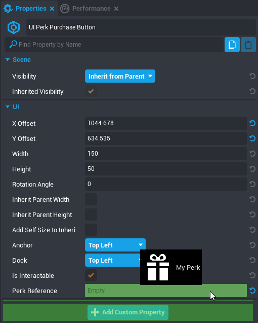

# Perks

## Overview

Perks are a system to create in-game purchases that allow players to support game creators and enable exclusive content. To become eligible to use Perks in game, creators need to meet certain [minimum requirements](joining_perks.md) and apply to join the [Perks Program](perks_program.md).

## Types of Perks

Perks have separate types based on when and how often a player can purchase them.

### Permanent

**Permanent Perks** can only be purchased once by each player.

### Limited-Time

**Limited Time Perks** can be purchased only once during their duration, but can then be purchased again after they expire.

### Repeatable

**Repeatable Perks** can be purchased any number of times by players.

For more information about Perk types, see [About In-Game Perks](https://support.coregames.com/hc/en-us/articles/360060361453-About-In-Game-Perks) in the Core Help Center.

## Creating Perks

Perks are created and edited through the **Perks Manager** window. They can be associated with just one project, or many projects by the same creator.

### Create a Perk

{: .center loading="lazy" }

1. Open the **Perks Manager** by clicking **Windows** in the top menu bar and selecting **Perks Manager**.
2. Click the **Create New Perk** button in the bottom of the window.
3. Give the perk a name and select the type.
4. Change the **Duration** field only if it is a Limited-Time Perk, to match how long it should last.
5. Change the **Price** to the number of Core Credits the perk should cost.
6. Keep the **Add to Current Project** option turned on to use the Perk.

!!! info
    There is no limit to how many projects you can add a Perk to.

Your new Perk will now appear in the **My Perks** section of the **Project Content** window.

### Add a Perk Reference

To change a player's experience based on the Perks they have, you will need to reference that Perk in a script.

1. Create or select a script in the Hierarchy, and open the **Properties** window.
2. From **Project Content**, open the **My Perks** section and find your Perk.
3. Click and drag your Perk from **Project Content** onto the **Add Custom Property**

{: .center loading="lazy" }

### Scripting with Perks

You can use the `player:HasPerk(perkReference)` function to find out if a player has a Perk, and `player:GetPerkCount()` to get the total number of repeatable Perks a player has purchased.

To learn more about the functions and events associated with perks, see [the Player type in the Core API Reference](../api/player.md).

## Testing Perks

Creators can test your perks in a local project to make sure that they are working as intended, using the **Perks Testing** window.

### Enable Perks for Testing

{: .center loading="lazy" }

1. Open the **Perks Manager** window by clicking **Window** in the top menu bar, and select **Perk Testing**
2. Enable the Perk for **Player 1** if you want to test when just one player has the Perk.
3. Enable the Perk for **Player 2+** to test when all players

!!! info
    You can also open the **Perk Testing** window directly from the **Window** menu.

{: .center loading="lazy" }

### Test in Multiplayer Preview

Once you have enable perks in the testing menu, start a multiplayer preview. If you granted a perk to **Player 1**, you should see it on **Bot1** in the first preview window, and any in-game benefits that you have granted based on whether a player has unlocked those perks should be present in that window. For **Player 2+**, all of the Multiplayer Preview instances should have players who own that perk, including ones that are added in after the preview starts.

## Adding a Perks Purchase Button

Perks can only be purchased using a **UI Perk Purchase Button**, and use a standardized dialogue to confirm a purchase.

### Add a Perk Purchase Button to a Project

1. In the **Game Objects** section of **Core Content**, open the **Perks Tools** category.
2. Find the **UI Perk Purchase Button** object and drag it into your Hierarchy.
3. Open the **My Perks** section of **Project Content** to find your Perk.
4. With the **UI Perk Purchase Button** selected, open the **Properties** window.
5. Drag the perk you want associated with the button from **My Perks** to the **Perk Reference** property of the Perk Purchase Button.

!!! warning
    Adding a Perk Reference as a Custom Property will **NOT** enable the button to charge for the Perk. It must be added to the **Perk Reference** field in the UI Perk Purchase Button's properties.

{: .center loading="lazy" }

## Activating Perks

Perks exist in several different states that allow you to control whether players can activate them. Perks need to be associated with a published game before they can be used, which means there are multiple steps to making a perk purchasable by players.

### Inactive Perks

!!! warning
    Perks must be published as **inactive** before they are activated!

When perks are created they start out as **inactive**. Perks need to be associated with a project before they are activated, and to do that they must be published in an inactive state.

### Steps to Activating a Perk

1. Create a Perk through the **Perks Manager**.
2. Make sure the Perk has **Add to Current Project** selected.
3. Publish the game.
4. Open the **Perks Manager** again, and select **Active** from the drop down box in the **Status** column.

{: .center loading="lazy" }

!!! warning
    Once a Perk is activated, it can not be instantly deactivated, and is subject to the [Terms of Service](https://support.coregames.com/hc/en-us/articles/1500000105081-Joining-the-Perks-Program) agreements related to Perks.

## Editing and Suspending Perks

Perks cannot be instantly deactivated while players have active perks. Instead, they must be moved to a **Disabled** state, where they remain active for players who have already purchased them, but are no longer purchasable by new players.

To make changes to an active Perk, you must first suspend it.

### Suspend an Active Perk

1. In the **Perks Manager** find your perk.
2. In the **Status** column, select **Suspended**.

{: .center loading="lazy" }

### Deactivate a Perk

If a suspended perk has no active users associated with it, it can be safely deactivated.

1. In the **Perks Manager** find your perk.
2. In the **Status** column, select **Deactivated**.

### Disabled and Banned Perks

Perks can become disabled or banned if they cause significant support tickets or appear to violate the Terms of Service.

If a perk is disabled or banned, you can submit a request in the [Core Help Center](https://support.coregames.com/hc/en-us) to fix it.

### Perk States

The Perks {: style="width: 2em;" } color in the **My Perks** section of **Project Content** will indicate the current status of the Perk in your project.
{: .image-inline-text .image-background }

{: .center loading="lazy" }

---

## Learn More

[The Perks Program](perks_program.md) | [Core API Reference](../api/player.md) | [Joining the Perks Program](joining_perks.md) | [About In-Game Perks](https://support.coregames.com/hc/en-us/articles/360060361453-About-In-Game-Perks) | [Guidelines for Creating Perks](perks_rules.md)
