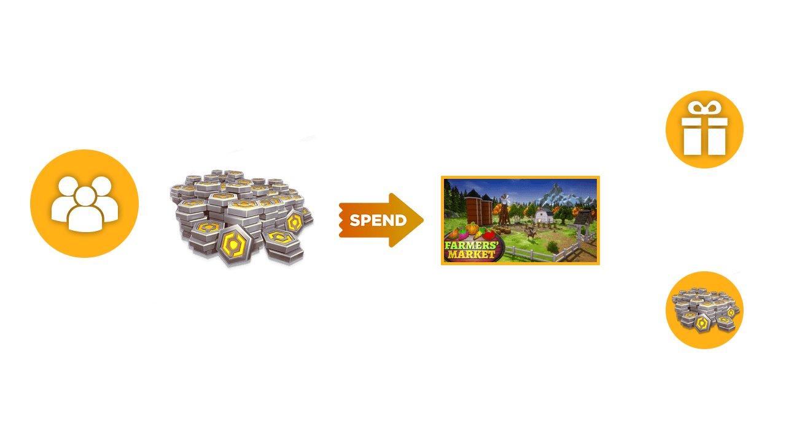
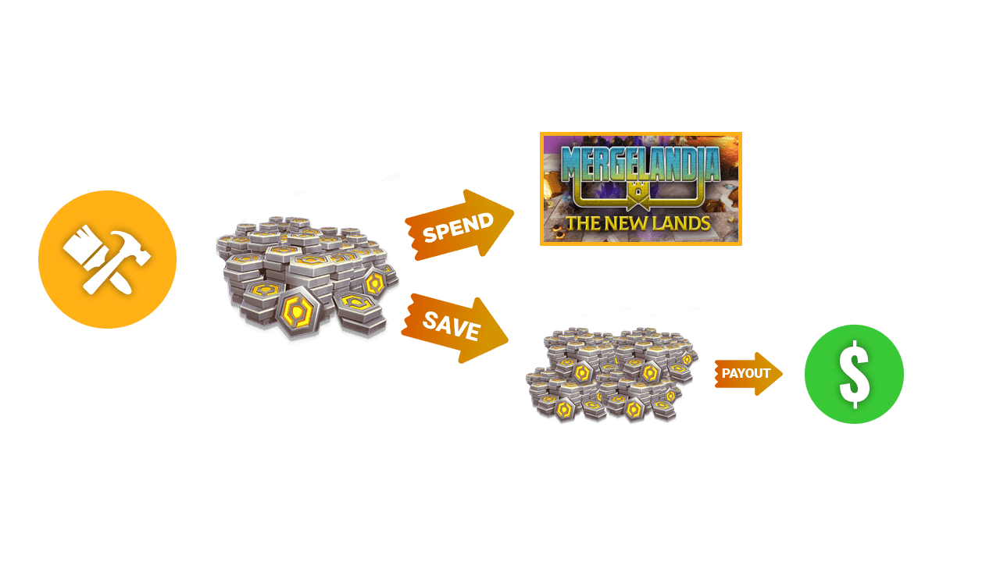
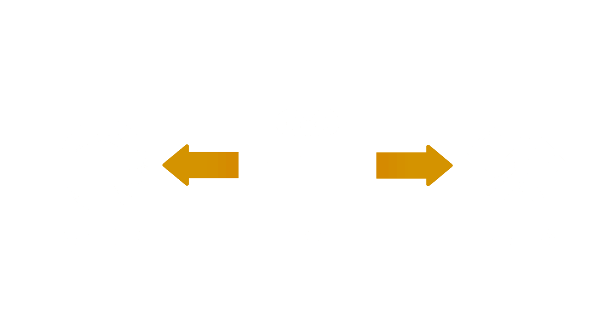

# About the Perks Program and Monetization

The Perks Program enables Core creators to make money with their games using a complete monetization system that can be customized to any game type. [Joining the program](joining_perks.md) gives access to [**Perks**](implementing_perks.md) and the [**Reward Points**](reward_points_reference.md) system. Both [**Perks**](implementing_perks.md) and [**Reward Points**](reward_points_reference.md) are in-game purchases built specifically for Core.

To qualify for adding Perks to your games, there are two requirements:

- Have an account for at least 30 days
- Average 50 daily active users (DAU) across all of your games over a period of 30 days

!!! note
    Members of the earlier Creator Payouts Pilot Program will automatically gain access to Perks.

Creators in the Perks Program have access to Core’s Perks system, which enables creators to sell in-game benefits to players in exchange for Core Credits. Core creators can then redeem Core Credits earned through the sale of Perks for real world money.

## How Perks Work

{: .center loading="lazy"}

Creators can monetize their games through Perks, which allow them to sell in-game benefits to players for Core Credits. There are three types of perks, separated by how often your players are able to purchase them:

- Permanent: Purchases that unlock a permanent benefit, such as cosmetics, upgrades, and game access.
- Repeatable: One-time-use purchases such as consumables, boosts, and virtual currencies.
- Limited Time: Time-bound purchases that grant benefits over 7, 15, or 30 days, such as a battle pass.

!!! note
    Limited Time Perks do not automatically renew.

Creators control what kind of perks they use and how to add them to their games. There is no limit to the number of Perks a creator can have, and one Perk can apply to several of a creator’s games.

Perks are added using the Core editor, where the creator can set the price, behavior, and appearance. The creator can customize it further using [Lua and the Core API](../api/player.md). The Perks system also includes a full testing suite for testing purchases, daily analytics reports, giving the creator complete control over how to design their game’s monetization.

When a player buys a Perk, Core handles the transaction from start to finish. The Credits go to the creator’s account, at which point the creator can spend them in other Core games or in the Core shop.

To learn more about how to create Perks for your game, see the [Perks reference](implementing_perks.md)

## Redeeming Core Credits

{: .center loading="lazy"}

Creators directly receive all the Core Credits that are spent on Perks. When the creator accumulates credits above a payout threshold, they become eligible for converting credits to real-world currency. These can be initiated through the [Creator Dashboard](https://www.coregames.com/create/dashboard).

See the [Core Credits redemption](https://support.coregames.com/hc/en-us/articles/1500000063422-Earned-vs-Purchased-Core-Credits) Help Center article for more information.

## Creator Revenue Split

> Core shares revenue with creators in an even 50/50 split.

{: .center loading="lazy"}

Creators can receive this split by opting to convert their Core Credits to real-world currency as described above. When converting, creators receive 50% of the revenue spent on their Perks.

### Why 50%

By developing on Core, creators can build anything from a deep traditional MMO with a monthly subscription to simulation games with in-game cosmetic purchases, a completely free to play shooter or even a series of arcade games. In addition to development tools, Core provides server hosting, multiplayer networking, and instant publishing to the Core storefront. With Perks, Core also covers all transaction costs, such as credit card processing fees, customer support, and engine royalties for the underlying Unreal engine.

Most development platforms provide only a subset of those benefits, passing the cost of the rest to creators. Other UGC platforms, such as Roblox, take a much larger share of revenue – or don’t allow monetization at all.

{: .center loading="lazy"}

{: .center loading="lazy"}

By using Core, creators get a larger share of revenue compared to other similar platforms while also having access to the full stack of tools to build, publish, and grow their games.

## Applying to the Perks Program

Once you have reached the minimum DAU to qualify, you can [apply to the Perks Program](joining_perks.md) here. For tips on how to improve your game to meet the minimum DAU requirement, check out the [improving your game to increase DAU guide](../tutorials/improving_your_game.md).

---

## Learn More

[Implementing Perks](implementing_perks.md) | [Creator Analytics](creator_analytics.md) | [How to Join the Perks Program](https://support.coregames.com/hc/en-us/articles/1500000063182-How-to-Join-the-Perks-Program) | [Enrolling in the Perks Program](https://support.coregames.com/hc/en-us/articles/1500000063581-Enrolling-in-the-Perks-Program) | [Guidelines for Creating Perks](perks_rules.md)
