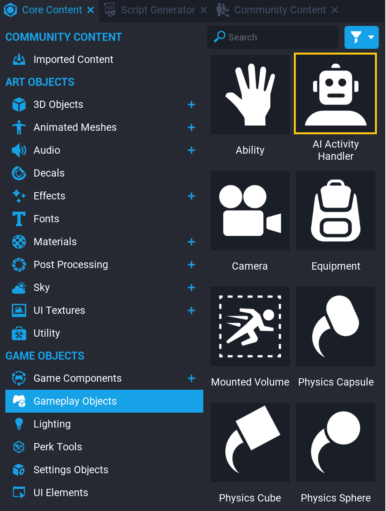
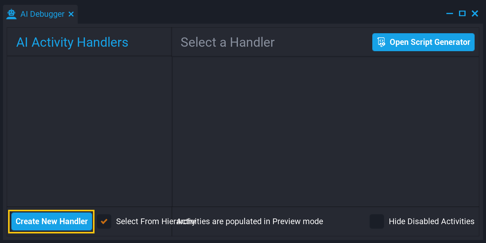
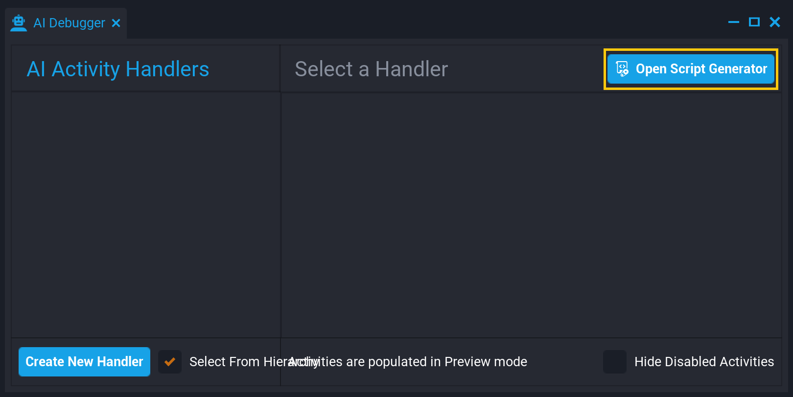
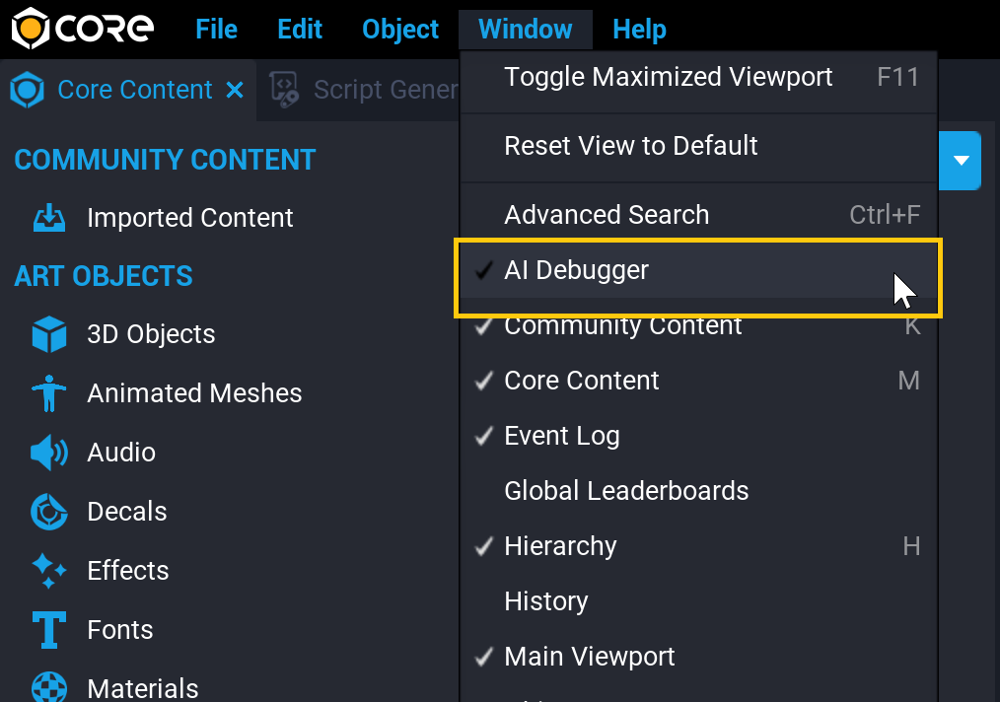

# Artificial Intelligence in Core

AI is a multifaceted system currently in development that will be releasing different modules in this and upcoming patches to help creators implement Artificial Intelligence in their games. The modules shipped in this patch are [AIActivityHandler](../api/aiactivityhandler.md) and the AIDebugger.

## AI Activity System

The AIActivityHandler is an Hierarchy object that creates a new AIActivityHandler that can have multiple AIActivity objects associated with it. An AIActivityHandler can have activities registered, and the activity with the highest priority becomes the active state. For example, moving from.

!!! note
    It has always been possible to build a system similar to the AI Activity System using pure Lua, the new AIActivity and AIActivityHandler types allow creators to do this with a new, cleaner interface that interacts with the AIDebugger and upcoming new AI systems.

### Create a New AIActivityHandler

#### Using Core Content

The AI Activity Handler object is in **Core Content** in the **Gameplay Objects** section of **GAME OBJECTS**. Searching **Core Content** for `activity` is another way to find the activity handler.

Drag the **AI Activity Handler** into the **Hierarchy** to create a new [AIActivityHandler](../api/aiactivityhandler.md).

{: .center loading="lazy" }

#### Using the AI Debugger

Open the **Window** menu to find the **AI Debugger** window to create a new **AI Activity Handler** and add it to the Hierarchy. Press the **Create New Handler** button to do this in one step.

{: .center loading="lazy" }

### AIActivity

Each AI Activity Handler manages different AIActivities, which are Core API types with multiple properties including **priority**, that allow the handler to decide which activity it should choose. Each AIActivity also has distinct phases that allow you to execute code when an activity starts, is running, and when it stops. See [AIActivity in the Core Lua API](../api/aiactivity.md).

#### Create a new AIActivity

**AI Activities** get assigned to an **AI Activity Handler** using the `AddActivity` function from a Lua script. The **Script Generator** in the **AI Debugger** window has a code template to help get started.

{: .center loading="lazy" }

#### AI Activity Handler Tutorial

There is a complete tutorial available for learning the AIActivityHandler through building a TicTacToe game. See the [AI Activity Tutorial](ai_activity_tutorial.md) to learn more.

## AI Debugger

The AI Debugger is a window that allows creators to see all AI Activity Handlers, create new ones, and enable/disable them for preview.

### Open the AI Debugger

To find the AI Debugger, open the **Window** menu in the top menu toolbar and select **AI Debugger**.

{: .center loading="lazy" }

---

## Learn More

[AIActivityHandler Tutorial](ai_activity_tutorial.md) | [AIActivityHandler in the Core Lua API](../api/aiactivityhandler.md) | [AIActivity in the Core Lua API](../api/aiactivity.md)
