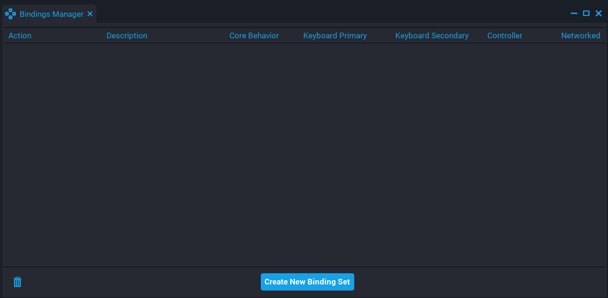
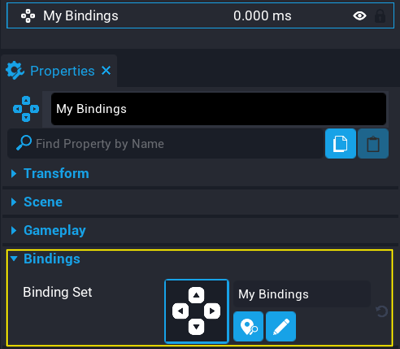
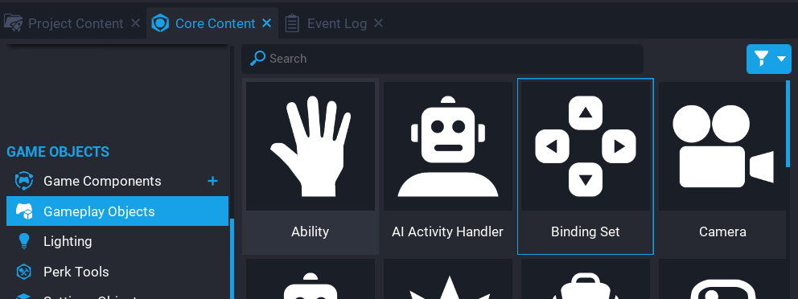
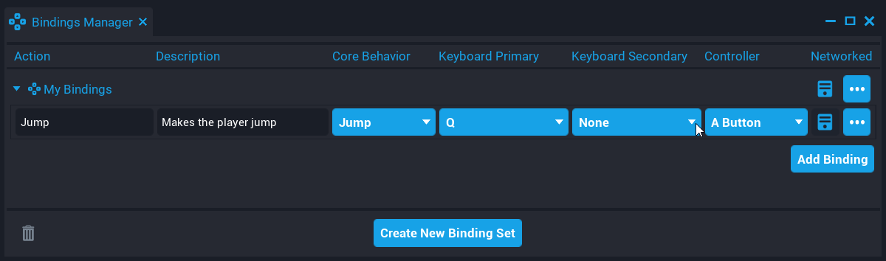
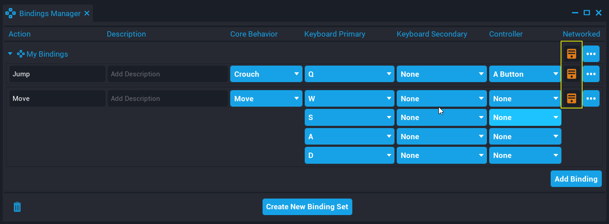

# Binding Sets

A **Binding Set** contains a set of actions a creator has defined for the game and the default key bindings to trigger those actions.

New **Core** projects created, will contain a **Binding Set** that will have the default **Core** bindings set up already in the **Hierarchy**. This will allow creators to modify the default **Binding Set** to customize it for their game, or remove it and create their own. If there is no **Binding Set** in the **Hierarchy**, the default controls will be used.

## Opening the Bindings Manager Window

From the **Window** menu, select **Bindings Manager** to open up the **Bindings Manager** window. The **Bindings Manager** window allows the creator to create **Binding Sets** and bindings for a **Binding Set**.

{: .center loading="lazy" }

## Creating a Binding Set

A **Binding Set** needs to be placed into the **Hierarchy**. A new **Binding Set** will not overwrite an existing **Binding Set** that is in the **Hierarchy**. For example, if one **Binding Set** has ++Space++ set to perform the **Jump** action, and another **Binding Set** has ++Space++ set to perform the **Crouch** action, then both actions will be performed.

### Bindings Manager

A **Binding Set** can be created from the **Bindings Manager** window by clicking on the button **Create new Binding Set**. When a **Binding Set** is created, it will be added to **My Binding Sets** in **Project Content**.

{: .center loading="lazy" }

**Binding Sets** created this way will have the property **Binding Sets** under **Bindings** already set up with the asset reference when placed into the **Hierarchy**.

{: .center loading="lazy" }

### Binding Set Component

A **Binding Set** can be created by dragging the **Binding Set** component from **Gameplay Objects** under **GAME OBJECTS** into the **Hierarchy**. This object will not have the **Binding Set** asset reference created, the creator would need to create a new set of bindings, and drag the asset onto the property.

{: .center loading="lazy" }

## Adding a Binding

A binding can be a specific key, button, or directional control that performs an action.

Adding a binding to a **Binding Set** can be done from the **Bindings Manager** window by clicking on **Add Binding**.

{: .center loading="lazy" }

For example, setting the key ++Q++ to perform the **Jump** action.

1. Add **Basic Binding**.
2. Select **Jump** from the **Core Behavior** drop down.
3. Set the letter ++Q++ from the **Keyboard Primary** drop down.

{: .center loading="lazy" }

When a new binding is added, the action name and description can be set. The action name should be something that identifies what this action does. This identifier can be used in Lua to determine which action triggered the event.

Bindings support a secondary key and controller input. Meaning that the player can perform an action using 2 different keys or use controller input (that is a button).

### Core Behavior

When creating a binding, a **Core Behavior** needs to be selected so that the **Binding Set** knows which action to perform when the binding is triggered. When a **Core Behavior** is selected, the binding will get auto-filled with the default **Core** values for the keyboard and controller inputs.

{: .center loading="lazy" }

### Binding Types

There are 3 different types of bindings that can by created.

| Binding Type        | Description                                                                                                                                                         |
| ------------------- | ------------------------------------------------------------------------------------------------------------------------------------------------------------------- |
| Basic Binding       | Basic bindings have a value of either `0` or `1`, pressed or released, and act like buttons.                                                                        |
| Axis Binding        | Axis bindings can take on any `number` value, not just `0` or `1`, like a gamepad trigger held half way, or how fast the mouse's scroll wheel is moving up or down. |
| Directional Binding | Directional bindings are for 2D controls like moving the player or rotating the camera and have a `Vector2` value.                                                  |

### Networked Bindings

Bindings can be networked so the value and input events are replicated to the server. Replicated bindings allow creators to use specific **Input** functions and events in a server script using Lua. Networked bindings can be set individually or for all child bindings of a **Binding Set** in the **Bindings Manager**.

{: .center loading="lazy" }

For information on which events and functions work with networked bindings, see the [Input API](../api/input.md).

### Enable / Disable Bindings

Bindings can be enabled or disabled at startup by clicking on the checkbox in the **Enable** column of the **Bindings Manager** window. These can be controlled by a Lua script that can also enable and disable an action.

```lua
Input.EnableAction("Jump")
```

{: .center loading="lazy" }

## Deleting a Binding

A binding can be deleted from a **Binding Set** by accessing the options menu and selecting **Delete Binding** from the **Bindings Manager** window.

{: .center loading="lazy" }

## Deleting a Binding Set

A **Binding Set** can be deleted from **My Binding Sets** in **Project Content**, or by selecting **Delete Binding Set** from the option menu in the **Bindings Manager** window.

{: .center loading="lazy" }

## Restoring a Deleted Binding Set

Any **Binding Sets** that have been deleted in the current editor session, can be restored by viewing the list of deleted **Binding Sets**.

{: .center loading="lazy" }

A deleted **Binding Set** can be restored by clicking on the **Restore** button.

{: .center loading="lazy" }

## Using Input Functions and Events

The **Input** namespace has various functions and events that can be used with bindings from **Binding Sets**.

For example, listening for when an action has been pressed using `actionPressedEvent`.

```lua
local function OnActionPressed(player, action, value)
    print("Pressed", player, action, value)
end

Input.actionPressedEvent:Connect(OnActionPressed)
```

See the [Input API](../api/input.md) for all the events and functions.

## Detecting Input Type

Detecting what input device a player is using, can allow creators to customize the UI depending on the player's input device.

The input type can be determined by checking the returned value from `Input.GetCurrentInputType` and `Input.inputTypeChangedEvent`. For example, detecting the player input device to customize the UI depending on if they input device is keyboard or controller.

<div class="mt-video" style="width:100%">
    <video autoplay muted playsinline controls loop class="center" style="width:100%">
        <source src="/img/BindingSets/input_device_example.mp4" type="video/mp4" />
    </video>
</div>

??? "Example Code"
    ```lua
    -- Client side script

    local TRIGGER = script:GetCustomProperty("Trigger"):WaitForObject()
    local VEHICLE = script:GetCustomProperty("Vehicle"):WaitForObject()

    -- Interact panel UI
    local INTERACT_MESSAGE = script:GetCustomProperty("InteractMessage"):WaitForObject()

    -- Controller UI (child of interact panel)
    local CONTROLLER = script:GetCustomProperty("Controller"):WaitForObject()

    -- Keyboard UI (child of interact panel)
    local KEYBOARD = script:GetCustomProperty("Keyboard"):WaitForObject()

    -- Updated if player is inside the trigger
    local insideTrigger = false

    -- Updated if the player is in the vehicle
    local isInVehicle = false

    -- Get input device
    local inputDevice = Input.GetCurrentInputType()

    -- Simulate switching input device to controller
    Task.Spawn(function()
        inputDevice = 1
        print("Input device switched to controller")
    end, 5)

    -- On overlap of the vehicle trigger, change the interact UI based on
    -- the input device
    TRIGGER.beginOverlapEvent:Connect(function(trigger, obj)
        if Object.IsValid(obj) and obj:IsA("Player") then
            insideTrigger = true

            INTERACT_MESSAGE.visibility = Visibility.FORCE_ON

            if inputDevice == InputType.KEYBOARD_AND_MOUSE then
                KEYBOARD.visibility = Visibility.FORCE_ON
                CONTROLLER.visibility = Visibility.FORCE_OFF
            else
                KEYBOARD.visibility = Visibility.FORCE_OFF
                CONTROLLER.visibility = Visibility.FORCE_ON
            end
        end
    end)

    -- When leaving the trigger, turn off the UI
    TRIGGER.endOverlapEvent:Connect(function(trigger, obj)
        if Object.IsValid(obj) and obj:IsA("Player") then
            insideTrigger = false

            INTERACT_MESSAGE.visibility = Visibility.FORCE_OFF

            if inputDevice == InputType.KEYBOARD_AND_MOUSE then
                KEYBOARD.visibility = Visibility.FORCE_OFF
            else
                CONTROLLER.visibility = Visibility.FORCE_OFF
            end
        end
    end)

    -- Detect the action pressed
    Input.actionPressedEvent:Connect(function(player, action, value)
        if action == "Interact" and insideTrigger then
            if isInVehicle then
                isInVehicle = false

                -- Tell server script to remove the driver
                Events.BroadcastToServer("RemoveDriver")
            else
                isInVehicle = true

                -- Tell server script to set the driver
                Events.BroadcastToServer("SetDriver")
            end
        end
    end)
    ```

## Migrating an Existing Project to use Binding Sets

Projects created before **Binding Sets** were added to **Core** can be migrated to use **Binding Sets**, [here's how to convert](https://forums.coregames.com/t/migrating-to-binding-sets/2033) to a Binding Set.

## Learn More

[Input API](../api/input.md)
