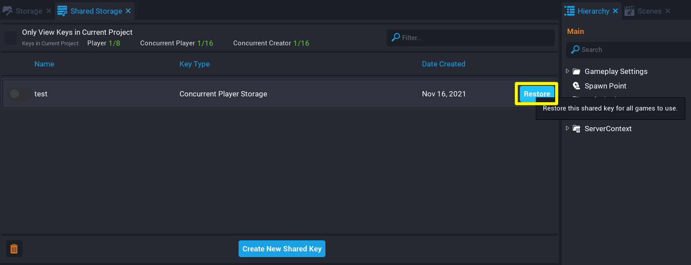

# Concurrent Storage

**Concurrent Storage** allows creators to wite data to a table for players or games concurrently. Meaning the games will have the ability to write data when the player is offline (or online but on a different server), or write data that is shared across game instances.

Creators can have **up to 16** concurrent shared player keys, and **up to 16** concurrent shared creator keys. In each project creators can select which keys are active through the **Shared Storage** window. Active keys can be found in the **Project Content** window in the **My Shared Keys** folder, and are accessed in scripts by their [Net Reference](../api/netreference.md).

Check the [Storage API](../api/storage.md) for how to use concurrent storage from Lua scripts.

## Manage Concurrent Shared Storage Keys

Similar to [Player Shared Storage](../references/shared_storage.md), Concurrent Storage can have shared keys for the player and creator that can be managed from the **Shared Storage** window from the **Window** menu.

{: .center loading="lazy" }

## Create Concurrent Shared Storage Key

Concurrent shared storage keys can be created from the option menu when clicking on the **Create New Shared Key** button from the **Shared Storage** window.

{: .center loading="lazy" }

1. In the top menu bar, open the **Window** menu and select **Shared Storage** to open the window.
2. In the bottom of the **Shared Storage** window, click the **Create New Shared Key** button.
3. From the option panel, select either **Concurrent Player Storage** or **Concurrent Creator Storage**.
4. Give the concurrent key a name and press **Create**.

## Delete Concurrent Shared Storage Key

A concurrent shared storage key can be deleted from the **My Shared Keys** folder in the **Project Content** window, or from the **Shared Storage** window by selecting **Delete Key** from the option menu.

{: .center loading="lazy" }

## Restore a Concurrent Shared Storage Key

Any shared key that has been deleted in the current editor session, can be restored by viewing the list of deleted keys.

{: .center loading="lazy" }

A deleted shared key can be restored by clicking on the **Restore** button.

{: .center loading="lazy" }

## Enable Concurrent Storage

To use the Concurrent Storage API, creators must place a **Game Settings** object in the **Hierarchy**, and check either of these properties from the **Properties Window**.

| Property | Description |
| -------- | ----------- |
| Enable Concurrent Player Storage | Allows the game to store and maintain a table per player across different game servers and sessions, and use shared keys of type Concurrent Player Storage. |
| Enable Concurrent Creator Storage | Allows the game to use shared keys of type Concurrent Creator Storage to store and maintain global tables across different game servers. |

{: .center loading="lazy" }

## Get a Concurrent Shared Storage Key NetReference

To save data to a concurrent shared storage key, creators will need to use its **NetReference** to refer to it in a script. See the [NetReference API](../api/netreference.md) for more information about this object type.

{: .center loading="lazy" }

1. Select the script in the **Hierarchy**, and open the **Properties** window.
2. Open the **My Shared Keys** folder in the **Project Content** window.
3. Select and drag the key onto the **Custom Properties** panel of the script **Properties** to add it as a custom property.
4. Copy the generated code in the script's **Properties** window into the script itself.

{: .center loading="lazy" }

## Concurrent Storage Types

### Concurrent Player Storage

Concurrent player storage works similar to [Persistent Storage](../references/persistent_storage.md). The concurrent storage API can get and set data for a player that is online, but also with the added benefit of getting and setting data while the player is offline, and on different game instances.

### Concurrent Shared Player Storage

Concurrent shared player storage works similar to [Shared Storage](../references/shared_storage.md). The concurrent storage API can get and set, and share between the creators games. The difference with concurrent storage, is that the shared key can be updated while the player is offline.

### Concurrent Shared Creator Storage

Concurrent shared creator storage allows for creators to get and set data to a shared key that is available across different game servers. For example, if a player on one server finds a special enemy (i.e. for an event), other players on different server instances can be notified and also have the enemy spawned.

## Learn More

[Storage API](../api/storage.md) | [Offline Storage Reference](../references/offline_storage.md) | [NetReference API](../api/netreference.md) | [Persistent Storage Reference](../references/persistent_storage.md) | [Shared Storage Reference](../references/shared_storage.md)
