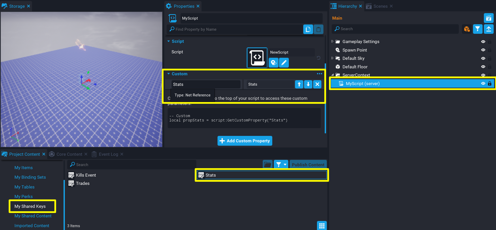

# Concurrent Storage

**Concurrent Storage** allows creators to write data to a table for players or games the player is offline (or online but on a different server), or write data that is shared across game instances and not associated with a player.

- For data associated with players that only need to be changed when they are online, but can still be read offline, see the [Persistent Storage reference](persistent_storage.md).
- For data shared across multiple games, but still associated with specific players, see the [Shared Storage reference](shared_storage.md).

Creators can have **1** concurrent player key per game, **up to 16** concurrent shared player keys, and **up to 16** concurrent creator keys. In each project, creators can select which keys are active through the **Shared Storage** window. Active keys can be found in the **Project Content** window in the **My Shared Keys** folder, and are accessed in scripts by their [Net Reference](../api/netreference.md).

Check the [Storage API](../api/storage.md) for how to use concurrent storage from Lua scripts.

## Manage Concurrent Shared Storage Keys

Similar to [Player Shared Storage](../references/shared_storage.md), Concurrent Storage can have shared keys for the player and creator that can be managed from the **Shared Storage** window from the **Window** menu.

{: .center loading="lazy" }

## Create Concurrent Shared Storage Key

Concurrent shared storage keys can be created from the options menu when clicking on the **Create New Shared Key** button from the **Shared Storage** window.

{: .center loading="lazy" }

1. In the top menu bar, open the **Window** menu and select **Shared Storage** to open the window.
2. At the bottom of the **Shared Storage** window, click the **Create New Shared Key** button.
3. From the options panel, select either **Concurrent Player Storage** or **Concurrent Creator Storage**.
4. Give the concurrent key a name and press **Create**.

## Delete Concurrent Shared Storage Key

A concurrent shared storage key can be deleted from the **My Shared Keys** folder in the **Project Content** window, or the **Shared Storage** window by selecting **Delete Key** from the options menu.

{: .center loading="lazy" }

## Restore a Concurrent Shared Storage Key

Any shared key that has been deleted in the current editor session, can be restored by viewing the list of deleted keys.

{: .center loading="lazy" }

A deleted shared key can be restored by clicking on the **Restore** button.

{: .center loading="lazy" }

## Enable Concurrent Storage

To use the Concurrent Storage API, creators must place a **Game Settings** object in the **Hierarchy** and check either of these properties from the **Properties Window**.

| Property | Description |
| -------- | ----------- |
| Enable Concurrent Player Storage | Allows the game to store and maintain a table per player across different game servers and sessions, and use shared keys of type Concurrent Player Storage. |
| Enable Concurrent Creator Storage | Allows the game to use shared keys of type Concurrent Creator Storage to store and maintain global tables across different game servers. |

{: .center loading="lazy" }

## Get a Concurrent Shared Storage Key NetReference

To save data to a concurrent shared storage key, creators will need to use its **NetReference** to refer to it in a script. See the [NetReference API](../api/netreference.md) for more information about this object type.

{: .center loading="lazy" }

1. Select the script in the **Hierarchy**, and open the **Properties** window.
2. Open the **My Shared Keys** folder in the **Project Content** window.
3. Select and drag the key onto the **Custom Properties** panel of the script **Properties** to add it as a custom property.
4. Copy the generated code in the script's **Properties** window into the script itself.

{: .center loading="lazy" }

## Concurrent Storage Types

### Concurrent Player Storage

Concurrent player storage works similar to [Persistent Storage](../references/persistent_storage.md). The concurrent storage API can get and set data for a player that is online, but also with the added benefit of getting and setting data while the player is offline, and on different game instances.

You can use Concurrent Player Storage to create features like:

- Offline / Cross Server Player to Player trading.
- Offline / Cross Server Player vs Player base raid.
- Offline / Cross Server Player to Player farm help and visit.
- Player offline notifications.

### Concurrent Shared Player Storage

Concurrent shared player storage works similar to [Shared Storage](../references/shared_storage.md). The concurrent storage API can get and set, and share between the creator's games. The difference with concurrent storage is that the shared key can be updated while the player is offline and across different game instances.

You can use Concurrent Shared Player Storage to create features like:

- Offline / Cross Server Player to Player trading.
- Offline / Cross Server Player vs Player base raid.
- Offline / Cross Server Player to Player farm help and visit.
- Player offline notifications.

### Concurrent Creator Storage

Concurrent creator storage allows for creators to get and set data to a shared key that is available across different game servers. For example, if a player on one server finds a special enemy (that is for an event), other players on different server instances can be notified and also have the enemy spawned.

You can use Concurrent Creator Storage to create features like:

- Cross Game and In-Game global data.
- Global player list across Servers and Games.
- Global shared currency, items, etc.
- Auction house.
- Persistent world.

## Read and Write Limits

There is no request limit for reads, but if they are requested a lot they will end up cached and might be a few seconds out of date.

For writing, any single data has a limit of about 8 writes a second across all servers. Higher bursts are supported but for sustained throughput 8 is about the max. That assumes the callback is efficient. If creators exceed the limit, then the writes will start queuing up and could start timing out.

To avoid getting a long queue, reduce data saving frequency.

## Playtesting & Debugging

To effectively test what happens on a server with concurrent storage calls, use message and error code when updating data. For every Set Concurrent data calls you get 3 variables returning to use: `new data`, `error code`, `error message`. Utilize the error code and message in order to create print calls for debugging purposes. Doing this allows you to revisit your server logs and check on saving issues or any other bugs you may not encounter when testing locally in single-player and multiplayer preview mode.

!!! warning "playerLeftEvent with set concurrent calls"
    When testing concurrent storage locally, make sure to test in local multiplayer preview with **Allow zero clients**, otherwise any set concurrent calls in the `playerLeftEvent` listener will fail due to the server being killed instantly. Make sure to close out each client window (Bot) first before closing the multiplier preview session.

## Learn More

[Storage API](../api/storage.md) | [Offline Storage Reference](../references/offline_storage.md) | [NetReference API](../api/netreference.md) | [Persistent Storage Reference](../references/persistent_storage.md) | [Shared Storage Reference](../references/shared_storage.md)
