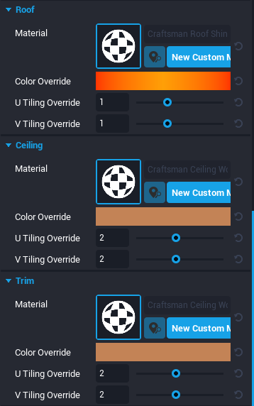

# Custom Materials in Core

## Overview

Materials are the way to change the appearance of an object, using a complete package of shaders and textures. Core has a variety of different materials to chose from, and each can be modified in different ways to create **custom materials**.

{: .center loading="lazy" }

## Applying Materials

### Find the Current Material

The material on an object can be found by in the **Properties** menu. Most shapes start out with the blue **Grid Basic** material, which is the default for all basic shapes.

{: .center loading="lazy" }

### Multiple Materials

Some objects have multiple material slots, such as the **Cube - Arcade 04** object, allowing you to further customize the look of your game.

{: .center loading="lazy" }

### Change Materials by Dragging and Dropping from Core Content

The easiest way to change materials is to drag the material onto an object in the **Main Viewport**. You can also drag the material into a specific slot in the **Properties** window.

{: .center loading="lazy" }

### Change Materials Using the Properties Window

The **Material Picker** allows you to select a new material for an object from a list of all the available materials.

1. Select the object and open the **Properties** window.
2. Double click the image of the material to open the **Material Picker**.
3. Select a material to be applied to the object.

{: .center loading="lazy" }

### Change the Color of a Material

The base color of a material can be changed using the **Material Override** property.

1. Open the object's **Properties** window and scroll to the appropriate material section.
2. Double click the colored box next to the **Material Override**.
3. Select a color in the **Color Picker** window that pops open, and click **OK** to apply the color to the material.

{: .center loading="lazy" }

## Smart Material

**Smart Materials** are textures that align to the world, rather than the object. This makes it easy to seamlessly connect two objects using the same material.

### Enable and Disable Smart Material

**Use Smart Material** is enabled by default on materials that have repeating patterns.

1. Select an object and open the **Properties** window.
2. Scroll down to the Material section.
3. Check or uncheck **Use Smart Material**.

{: .center loading="lazy" }

#### Smart Materials On

These two cubes both have the red brick material applied. Because they both have **Use Smart Material** checked, the brick pattern is projected the same way onto the two objects.

{: .center loading="lazy" }

#### Smart Materials Off

These two cubes both have the red brick material applied but they do not have "Use Smart Material" checked. The texture is aligned to the object, so it is stretched and looks different on these two differently sized cubes.

{: .center loading="lazy" }

### Z Fighting

Objects with different materials or objects not using the Smart Materials feature may exhibit **z-fighting**. This flickering is caused when different materials are layered over one another. Z-fighting can be distracting when playing games, so it's best to avoid it.

<div class="mt-video">
    <video autoplay loop muted playsinline poster="/img/EditorManual/Abilities/Gem.png">
        <source src="/img/Materials/image14.webm" type="video/webm" />
        <source src="/img/Materials/image14.mp4" type="video/mp4" />
    </video>
</div>

### U/V Tiling

When you uncheck **Use Smart Material**, two more customization options appear: **U Tiling Override** and **V Tiling Override**.

- **U Tiling Factor** controls how many times the pattern repeats on the X axis.
- **V Tiling Factor** controls how many times the pattern repeats on the Y axis.

#### U Tiling and V Tiling both set to 1

{: .center loading="lazy" }

#### U Tiling set to 3 and V Tiling set to 1

{: .center loading="lazy" }

#### U Tiling set to 1 and V Tiling set to 3

{: .center loading="lazy" }

#### U Tiling and V Tiling both set to 3

{: .center loading="lazy" }

## Custom Materials

Custom materials allow you to finely tune any Core material beyond one color and the U/V tiling.

### Create a Custom Material

There are two ways to create a custom material for your project.

#### From Core Content

1. Find a material to customize in **Core Content**.
2. Right-click and select **New Custom Material**.
3. Open the **Project Content** window and select **My Materials**.
4. Double click on the new custom material to open the **Material Editor**.

Your new custom material can be found in the My Content > Local Materials section under the Project Content tab. Edit your custom material by double clicking its name. It will be called "Custom -Name of Material-".

{: .center loading="lazy" }

#### From an Object

1. Select an object and open the **Properties** window.
2. Scroll down to the material.
3. Click the **New Custom Material** button.
4. Click the  icon to open the **Material Editor**.
{: .image-inline-text .image-background}

### Use the Material Editor

The **Material Editor** allows you to customize values for each type of material.

{: .center loading="lazy" }

Some materials have properties specific to them. For example, the ceramic materials have **Damage Amount** and **Cracks**, allowing for a more distressed look. Hover over any property name to read what it does.

{: .center loading="lazy" }

### Rename a Custom Material

Change the name of each custom material by editing the text field at the top of the **Material Editor**. This will allow you to easily find and re-use the material on different objects in the game.

## Materials and Scripts

With the introduction of the Materials API and [MaterialSlot](../api/materialslot.md), creators have the ability to edit and switch the material of a [StaticMesh](../api/staticmesh.md) or [AnimatedMesh](../api/animatedmesh.md) at runtime, and get / set properties of the material with scripts.

### Get the Material Slots

A [MaterialSlot](../api/materialslot.md) contains data about a material slot on a static or animated mesh.

Meshes can have an undefined range of material slots. For instance, a cube mesh would have one material slot while a roof mesh may have three: the roof, the ceiling, and the trim. Therefore, you need to get all of these material slots from the mesh to be able to change them.

This can be done with the `:GetMaterialSlots()` function (or `:GetMaterialSlot(string)` if you already know the name of the **MaterialSlot** you are trying to get) of [StaticMesh](../api/staticmesh.md) and [AnimatedMesh](../api/animatedmesh.md). Then, you can loop through those materials slots to either edit or ignore them.

For example, consider the **`Craftsman Roof 01 Corner In`** mesh. If you look at the properties panel while selecting a **CoreObject** that uses this mesh, you will see three different materials: **Roof**, **Ceiling**, and **Trim**.

{: .center loading="lazy" }

{: .center loading="lazy" }

This is reflected when using the `:GetMaterialsSlots()` function. This can be tested by setting the Roof as a custom property (named `RoofObject` in this example) and then looping through the material slots and printing the `slotName` of each one.

```lua
local RoofObject = script:GetCustomProperty("RoofObject"):WaitForObject()

for _, materialSlot in pairs(RoofObject:GetMaterialSlots()) do
    print(materialSlot.slotName)
end
```

The output of that script should be:

```txt
Building_Roof
Building_Ceiling
Shared_Trim
```

This shows there are three slots on that specific root object.

{: .center loading="lazy" }

However, if you did that with a cube, the output would simply be:

```txt
Shared_BaseMaterial
```

### Edit the Material Slot

With each material slot, there is a set of properties to edit and functions that can be called that will manipulate how the material appears.

!!! note
    If you get an error saying that you **`Attempted to modify a field on a non-networked object`**, then you must either make the object networked or put it into a context.<br><br>More information can be found in the [Networking Reference](../references/networking.md) and the [Contexts API](../api/contexts.md).

For instance, there is an option to change the color of the material slot using the `:SetColor(Color)` function of [MaterialSlot](../api/materialslot.md).

```lua
local RoofObject = script:GetCustomProperty("RoofObject"):WaitForObject()

for _, materialSlot in pairs(RoofObject:GetMaterialSlots()) do
    materialSlot:SetColor(Color.WHITE)
end
```

{: .center loading="lazy" }

What if you only want to change the color of one of the material slots, say just the `Building_Roof` material. There are two options: you can continue with the `for` loop or you can use the `:GetMaterialSlot(string)` function with just the name of the material slot you want to edit.

```lua
local RoofObject = script:GetCustomProperty("RoofObject"):WaitForObject()

local MATERIAL_SLOT_NAME = "Building_Roof"

-- Option 1
for _, materialSlot in pairs(RoofObject:GetMaterialSlots()) do
    if materialSlot.slotName == MATERIAL_SLOT_NAME then
        materialSlot:SetColor(Color.WHITE)
    end
end

-- Option 2
local roofMaterialSlot = RoofObject:GetMaterialSlot(MATERIAL_SLOT_NAME)
roofMaterialSlot:SetColor(Color.WHITE)
```

{: .center loading="lazy" }

### Replace the Material

In many cases, you may have already created materials using the in-editor tools and want to completely replace the material on the object with the one you created and have in the **Project Content** window.

This can be done with the `:SetMaterialForSlot(string, string)` function of [StaticMesh](../api/staticmesh.md)/[AnimatedMesh](../api/animatedmesh.md).

!!! note
    If you get an error saying that you **`Attempted to modify a field on a non-networked object`**, then you must either make the object networked or put it into a context.<br><br>More information can be found in the [Networking Reference](../references/networking.md) and the [Contexts API](../api/contexts.md).

First, add the custom material to the script as a custom property.

1. Open the **Project Content** window and navigate to the **My Materials** category.
2. Drag-and-drop the material you wish to replace with into the **Properties** window while the script is selected in either the **Hierarchy** or in the **Project Content**.
3. Name the custom property something that will be easy to reference; this example will use `Material`.

Then, reference the custom property in the script and set each material slot's material to the one you wish to replace it with.

```lua
local RoofObject = script:GetCustomProperty("RoofObject"):WaitForObject()
local Material = script:GetCustomProperty("Material")

for _, materialSlot in pairs(RoofObject:GetMaterialSlots()) do
    RoofObject:SetMaterialForSlot(Material, materialSlot.slotName)
end
```

{: .center loading="lazy" }

However, if you only want to change the color of one of the material slots, say just the `Building_Roof` material, there are two options. You can continue with the `for` loop or you can use the `:SetMaterialForSlot(string, string)` function with just the material and name of the material slot you want to edit.

```lua
local RoofObject = script:GetCustomProperty("RoofObject"):WaitForObject()
local Material = script:GetCustomProperty("Material")

local MATERIAL_SLOT_NAME = "Building_Roof"

-- Option 1
for _, materialSlot in pairs(RoofObject:GetMaterialSlots()) do
    if materialSlot.slotName == MATERIAL_SLOT_NAME then
        RoofObject:SetMaterialForSlot(Material, materialSlot.slotName)
    end
end

-- Option 2
RoofObject:SetMaterialForSlot(Material, MATERIAL_SLOT_NAME)
```

{: .center loading="lazy" }

### Get Material Property

Materials have their properties exposed at runtime that can be accessed using `GetProperty`.

```lua
local DEFAULT_FLOOR = script:GetCustomProperty("defaultFloor"):WaitForObject()

-- Get first slot from the default floor object

local slot = DEFAULT_FLOOR:GetMaterialSlots()[1]

-- Get the material

local material = slot:GetCustomMaterial()

-- Print out the roughness multiplier

print(material:GetProperty("roughness_multiplier"))
```

### Set Material Property

Materials can also have their properties set at runtime using `SetProperty`. This can lead to interesting ideas to make objects more dynamic in the world that can react to the players or the world around.

For example when it rains, objects become more shiny. By modifying the **Roughness Multiplier** property over time, an object can appear to be getting wetter.

```lua
local DEFAULT_FLOOR = script:GetCustomProperty("defaultFloor"):WaitForObject()

-- Get first material slot. Default Floor in a new project has only 1 slot.

local slot = DEFAULT_FLOOR:GetMaterialSlots()[1]

-- Get the material from the slot.

local material = slot:GetCustomMaterial()

-- How long the lerp will take.

local duration = 4

-- How long has passed.

local elapsed = 0

-- Lerped value updated each tick

local lerpedValue = 0

function Tick(dt)

    -- Check if the elapsed time is less than the duration.

    if elapsed < duration then
        lerpedValue = CoreMath.Lerp(1, 0, elapsed / duration)
    else
        lerpedValue = 0
    end

    -- Increment the elapsed time by adding the delta time which is the time since the last tick.

    elapsed = elapsed + dt

    -- Update the roughness for the material by using the lerped value

    material:SetProperty("roughness_multiplier", lerpedValue)
end
```

<div class="mt-video" style="width:100%">
    <video autoplay muted playsinline controls loop class="center" style="width:100%">
        <source src="/img/Materials/setproperty_roughness.mp4" type="video/mp4" />
    </video>
</div>

In the video above the roughness for the object will change over time to become more shiny.

## Learn More

[Environment Art](environment_art.md) | [Modeling Basics](modeling_basics.md) | [MaterialSlot API](../api/materialslot.md) | [StaticMesh API](../api/staticmesh.md) | [AnimatedMesh API](../api/animatedmesh.md) | [Networking Reference](../references/networking.md) | [Contexts API](../api/contexts.md)
