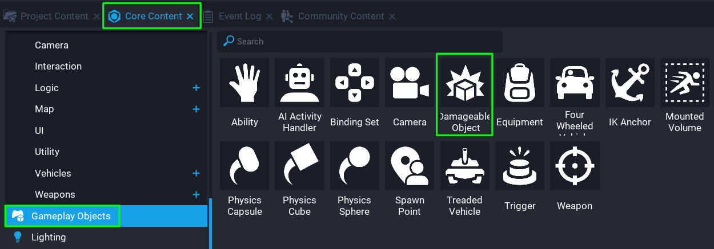
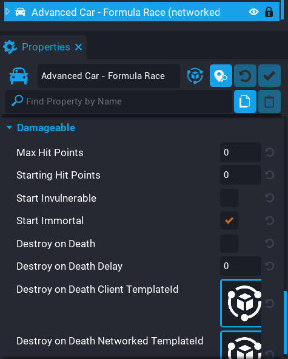

# Damageable Object

## Summary

The **Damageable Object** makes tracking damage and destroying objects very easy. Children of a **Damageable Object** that are hit by a projectile (or another damage source), will look for an ancestor that is a **Damageable** and automatically deduct the damage from health of the **Damageable**. You have control over what happens when the health of the **Damageable Object** reaches 0.

A benefit to **Damageable Objects**, is no scripting is needed to damage an object and destroy it. This can all be controlled from the custom properties, which makes it quick and easy to setup.

## Use Cases

There are many use cases for the **Damageable Object**. Here are a few examples of how the **Damageable Object** could be used in a game.

- Breakable Objects

    Some games have objects that can be broken and reveal loot for the player. For example, a Crate that can be destroyed by players. This can be done without any scripts.

- Dummy

    Letting players test their weapons out on a dummy that is immortal. This allows the players to see how their weapon handles, and what damage is does.

- Boss Fight

    A Boss that is immune until the shield has been destroyed. Using nested **Damageable Objects**, this is easy to do.

Here is an example of an NPC (Non-Player Character) that has a drone blocking the damage. The player needs to destroy the drone first, otherwise the NPC can not be damaged. Once the drone has been destroyed, the NPC can then receive damage, and be killed. When the drone or NPC is destroyed, a VFX (Visual Effect) is played for them which is handled by the **Damageable Object** by setting the **Destroy on Death Client TemplateId** property.

    <video autoplay muted playsinline controls loop class="center" style="width:100%">
        <source src="/img/DamageableObjects/demo.mp4" type="video/mp4" />
    </video>

## Where to find Damageable Object

The **Damageable Object** can be found in **Core Content**, under the category **Gameplay Objects**.

{: .center loading="lazy" }

## Networked Damageable Object

By default, a **Damageable Object** that is placed into your **Hierarchy** will be networked. This means it will have collision, and server side gameplay. In most cases, especially when creating AI Enemies that the player can damage, the **Damageable Object** will be networked.

## Client Only Damageable Object

A **Damageable Object** that is client only (i.e. placed into a **Client Context**), will have no collision, or server side gameplay. Damage can still be applied to the **Damageable Object** from a client script. This can be used for visuals, for example, the damage is sent from the server to the client which gets applied to the **Damageable Object**.

## The Damageable Properties

The **Damageable Object** uses the **Damageable** interface that unifies health, damage, and death behavior with players and some of objects (i.e. Vehicles, Physics Shape). Below are the properties of the **Damageable** interface that can be found on a few different objects in **Project Content**.

| Property Name | Description |
| ------------- | ----------- |
| Max Hit Points | Maximum hit points of the object. Values less than or equal to 0 will be ignored. |
| Starting Hit Points | The hit points of the object when the object is spawned. Cannot be greater than **Max Hit Points** or less than 0. |
| Start Invulnerable | When true, the object cannot take damage. |
| Start Immortal | The object doesn't automatically die when the hit points is less than or equal to 0. |
| Destroy on Death | If true, when the object dies, destroy the object. |
| Destroy on Death Delay | Time, in seconds, after the object dies when it will be automatically destroyed if **Destroy on Death** is true. |
| Destroy on Death Client TemplateId | Spawns the template on the client at the location of the Damageable after the death delay. This is the most efficient for visual-only effects. |
| Destroy on Death Networked TemplateId | Spawns a networked template at the location of the Damageable after the death delay. This is useful for spawning gameplay from a destroyed Damageable. |

## Objects that Implement Damageable Interface

Some objects implement the **Damageable** interface that allows for it to receive health, damage, and death behaviour. It's easy to tell which objects implement this interface by looking at the properties panel. If the properties panel for an object contain a **Damageable** category, then this means it implements the interface.

For example, add a Vehicle to the **Hierarchy** and look at the properties panel at the bottom.

{: .center loading="lazy" }

Below is a list of some of the objects that implement the **Damageable** interface.

- Vehicle
- Damageable Object
- Physics Shape

??? info "Vehicle and Physics shape will default to "invulnerable"."

## Learn More

<!-- TODO: Add learn more links here when we have them -->
