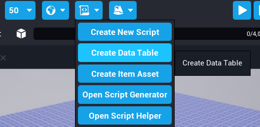
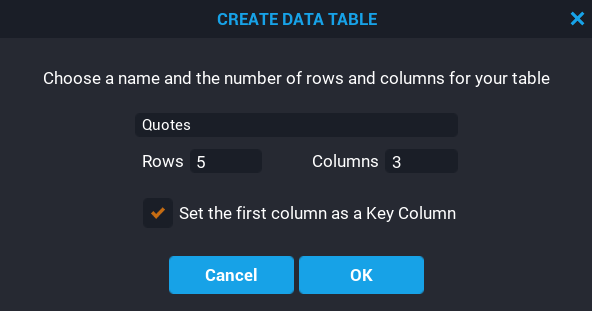
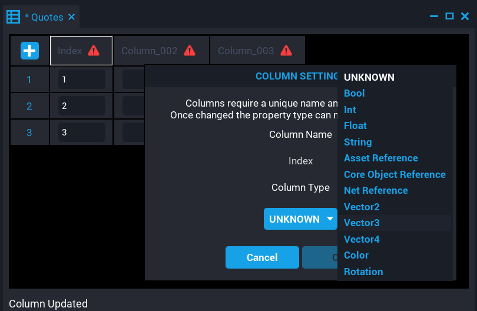
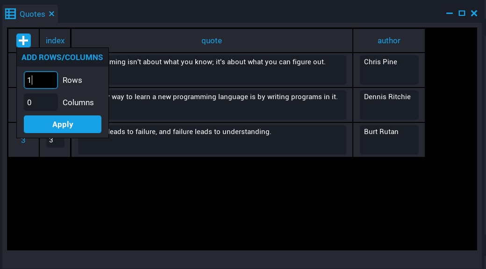

# Data Tables

Creators can create **Data Tables** that contain data in tabular form that contains rows and columns. A data table is a list where each item is also a list. For example, a player's inventory that has items, and each item has a name, description, quantity, and icon.

## Creating a Data Table

Creators can create a **Data Table** from within the **Project Content** window by right-clicking and selecting **Create Data Table**. Properties such as **Rows**, **Columns**, and setting the first column key are optional.

| Name | Description |
| ---- | ----------- |
| Data Table Name | The name of the data table. |
| Rows | The number of rows the data table has. |
| Columns | The number of columns the data table has. |
| First Column as Key | If enabled, the first column will be the key for the data table. |

{: .center loading="lazy" }

{: .center loading="lazy" }

## Editing a Data Table

<!-- vale Manticore.FirstPerson = NO -->
Created **Data Tables** get stored in **My Tables** under **Project Content**. To modify a data table, double click the data table, or right-click and select **Edit Table**.
<!-- vale Manticore.FirstPerson = YES -->
When editing a data table, a window will pop up that allows creators to modify the data table.

{: .center loading="lazy" }

### Editing Columns

Creators can edit the columns of a data table to change the column name and the data type the column will contain.

#### Edit Column Name

Creators can modify column names by double-clicking on the column name in the data table. Column names must be unique similar to how a Lua table can not have keys with the same name.

{: .center loading="lazy" }

#### Edit Column Type

Creators can modify the column type by clicking on the warning icon in the column header. The **Column Settings** window will pop up allowing creators to modify the type and the column name. All columns need a type, otherwise accessing any of the columns from a Lua script will show an error in the **Event Log**.

!!! warning "Creators can not open the column settings window after setting a column type. However, the CSV file allows creators to modify the column types outside of the editor."

{: .center loading="lazy" }

### Adding Columns and Rows

Creators can add more columns and rows to a data table by clicking on the {: .image-inline-text .image-background style="background-color: #17A2E7" } button and entering the amount of rows and columns to add.

{: .center loading="lazy" }

### Inserting Columns and Rows

Creators can insert columns and rows by right-clicking on a column or row. An options panel will pop up where creators can select to insert columns left or right, and rows above and below the current selection.


{: .image-cluster}

### Deleting Columns and Rows

Creators can delete columns and rows by right-clicking on a column or row. An options panel will pop up where creators can select to delete the column or row.


{: .image-cluster}

### Moving Columns and Rows

Creators can move columns and rows by right-clicking on a column or row and selecting move column left or right, or rows up or down from the options panel.


{: .image-cluster}

### Copy and Pasting Columns and Rows

Creators can copy and paste existing rows and columns into the data table by right-clicking and selecting **Copy** or **Paste** from the popup option panel.

{: .center loading="lazy" }

### Editing Outside of the Core Editor

A **Data Table** is a text file called a `CSV` (Comma-separated Values). This allows creators to easily modify the data of a data table. So adding large amounts of data would be easier by editing the CSV file rather than adding the rows in one by one manually.

In **Project Content**, right-clicking on a data table gives the options to **Show in Explorer**. Selecting this option will open up the location of the data table based on the current project.

{: .center loading="lazy" }

## Using Data Tables in Lua

Creators can add a **Data Table** to a script as an **Asset Reference** custom property. This allows creators to access the data from the data table from a Lua script.

!!! note "To access data from a data table, use the `require` function to require it."

```lua
local QUOTES_DATA_TABLE = require(script:GetCustomProperty("QuotesDataTable"))

for key, value in ipairs(QUOTES_DATA_TABLE) do
    print(key, value.index, value.quote .. " - " .. value.author)
end
```

{: .center loading="lazy" }

## Use Cases

- Consumables that the player can purchase from a shop.
- NPC Dialog entries.
- Crafting recipes.
- Loot tables with different rarities.
