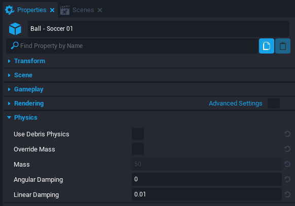

# Debris Physics

## Overview

**Debris Physics** is an option available to certain **Static Meshes**. Enabling the option causes the Static Mesh to simulate realistic physics with gravity and collision.

## Only Client Side

Debris Physics is only available in a **Client Context**. The movements in a simulation are not expected to be the same across different clients. Therefore, Debris Physics should not be used for determining gameplay outcomes. Due to it's zero networking cost and smooth visual quality, Debris Physics is ideal for a variety of gameplay.

## Examples

Here are some examples on how **Debris Physics** can be used:

- Visual Effects

    Every time a weapon is fired, a bullet casing **Static Mesh** with **Debris Physics** enabled can be launched from the weapon.

- Miscellaneous Items

    For most games, small items such as a water bottle are glanced over. Adding physics to these otherwise-ignored items, tends to enhance the realism.

- Explosions

    Having a group of items that scatter after an explosion, which works really well with **Damageable Objects**.

Here's an example video of a damageable truck exploding and sending its parts everywhere:

<!--- TODO add video of car being destroyed--->

<!--- info linking to gabe forum post/youtube video? --->

## Where to find Debris Physics

The **"Use Debris Physics"** option is found inside of a **Static Mesh's Properties** window under the **Physics** section.

!!! note
    The option will not be available unless the **Static Mesh** is a child component of a **Client Context**.

!!! warning
    Not all **Static Mesh** support **Debris Physics**. In those cases, the **Physics** section will not appear in the **Properties** window.

{: .center loading="lazy" }

## Debris Physics Options

The **Physics** section of the **Static Mesh's Properties** window has some settings to change the **Debris Physics**. Here they are explained below:

| Property Name | Description | Notes |
| --- | --- | --- |
| Use Debris Physics | Toggle for activating the Debris Physics option. | Can only be activated in a Client Context. |
| Override Mass | Toggle to manually change the mass of an object. | A default mass is calculated and used if inactive. |
| Mass | The custom mass to override the default mass. | Mass measured in kilograms. |
| Angular Damping | Drag force added for angular (rotational) movement. | Greater value results in a quicker stop, zero value results in no change, and negative value results in more movement over time. |
| Linear Damping | Drag force added for linear (positional) movement. | Greater value results in a quicker stop, zero value results in no change, and negative value results in more movement over time. |

## Adding Debris Physics

1. Add a **Static Mesh** into the **Hierarchy** (example: `Ball - Soccer 01` from **Core Content**).
2. Right click the **Static Mesh** and select **Create Network Context > New Client Context Containing This**.
3. Select the **Static Mesh** again and open the **Properties** window.
4. Activate the **Use Debris Physics** property under the **Physics** section.
5. Enter **Preview Mode** and interact with the **Static Mesh**.

    <video autoplay muted playsinline controls loop class="center" style="width:100%">
        <source src="/img/DebrisPhysics/DebrisPhysics_Soccer.mp4" type="video/mp4" />
    </video>

## Learn More

<!--- TODO add learn more links (static meshes api, physics object api, vehicle ref, damageable objects)
[DamageableObject](../api/damageableobject.md) | [Damageable](../api/damageable.md) | [Damage](../api/damage.md) | [AIActivity](../api/aiactivity.md) | [AIActivityHandler](../api/aiactivityhandler.md) | [Vehicles](../references/vehicles.md)
