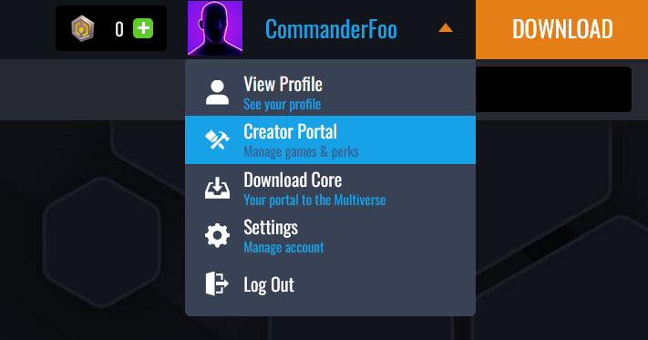
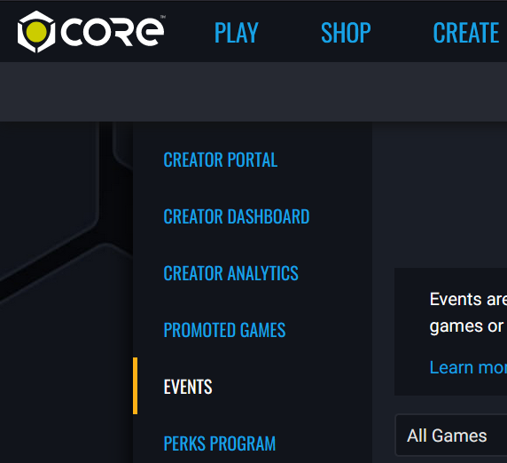
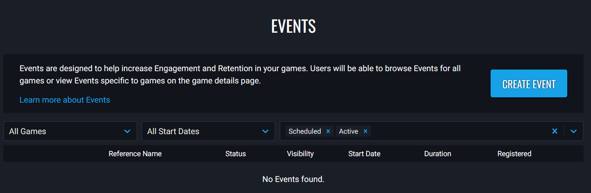
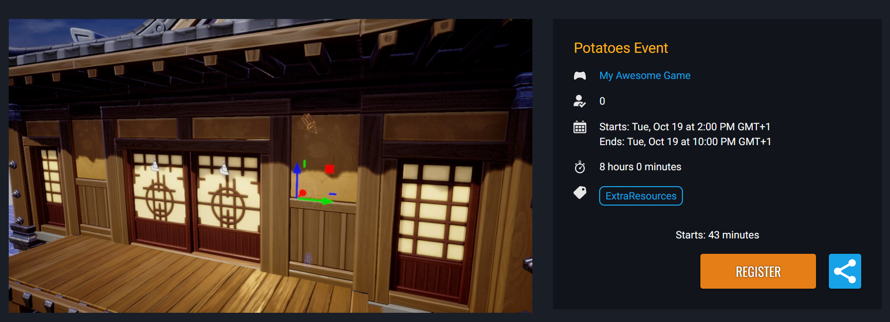

# Game Events

## Overview

Events are designed to help increase Engagement and Retention in your games. Users will be able to browse Events for all games or view Events specific to games on the game details page.

Events are available to everyone, however, Creators in the Perks Program will have the ability to create more events, and events with a longer length.

## Accessing the Events Page

Events are created from **Events** page in the **Creator Portal** area on the [Core Games Website](https://coregames.com). Accessing the **Creator Portal** can be done by logging in, and selecting **Creator Portal** from the drop down menu.

{: .center loading="lazy" }

{: .center loading="lazy" }

## Events List Page

When you access the **Events** page, there will see a list of all the events that have been created, along with filter options. By default, the **Scheduled** and **Active** filters for the event state will be selected so that the events list only contains events for the games that match those filters.

{: .center loading="lazy" }

## Creating an Event

On the **Events** page, click on the button **Create Event**, which will take you to the **Create Event** form. All the fields will need to be filled in for the event.

{: .center loading="lazy" }

### Events Per Game Limit

When a game is selected for the event, the drop down will display to the right of the game, how many events have been created, and the maximum amount that can be created for each game.

For creators in the Perk Program, 15 slots are available per game, and 5 slots available to creators not in the Perks Program. Slots will be freed up when events have finished, or been cancelled.

{: .center loading="lazy" }

### Event Timing Requirements

Events can have a minimum length of 30 minutes, and a maximum length of 24 hours. Creators that are in the Perks Program can create events that have a maximum length of 7 days.

If the end date of the event is over the maximum length allowed, an error will be displayed below the field.

**Event Start Date** can not be less than 5 minutes in the future, and **Event Start Date** can not be more than 30 days in the future.

If the date for a new event being created overlaps with an existing scheduled event for that game, then a error will show. Each game can only have one scheduled event.

### Event Form Fields

| Field Name | Description |
| ---------- | ----------- |
| **Select Game** | The game that the event is for. |
| **Event Title** | The title of the event. This will be public. |
| **Reference Name** | The event reference name. This will not be public. |
| **Event Details** | Information about the event that players might wish to know about. |
| **Start Date** | The starting date of the event. |
| **Start Time** | The starting time of the event. Local time. |
| **End Date** | The ending date of when the event will end. |
| **End Time** | The ending time of when the event will end. Local time. |
| **Tag** | Tags that will help players see what sort of event it is. |
| **Event Image** | The image that will be used for the event in the game thumbnail and landing page. A custom image for the event can be uploaded, or the default image can be used. |
| **Visibility** | The visibility of the event. If **Unlisted** then only those will direct link to the event page can register. |

{: .center loading="lazy" }

### Event Image

The image for an event can be different to the default image for the game. When an event has finished, or been cancelled, the image for the game will revert back to the default image.

To upload a custom image for the event, click on the upload button, and select the image to use for this event.

{: .center loading="lazy" }

### Preview & Publish

Once the event form has been filled out, clicking on the **Preview & Publish** button will show a preview of how the event will look to players, and an overview of the details. Clicking the **Schedule Event** button will create the event.

{: .center loading="lazy" }

## Event Options Menu

Each event listed on the **Events** page, will have a button on the right side that will open up an options menu specific to that event.

| Option | Description |
| ------ | ----------- |
| **Edit Event** | Edit event details. If an event is scheduled, then all the event details can be edited. But if the event is currently active, then there are some restrictions on what can be edited. Any field that can't be edited will be disabled. |
| **Cancel Event** | Cancels the event. A prompt will show to get confirmation. An event that is scheduled, or active can be cancelled at any time. |
| **Copy Game Event Id** | Copies the unique game event Id for this event, which can be used in the editor with the **UI Event RSVP Button**. This Id contains the game Id and Event Id separated by a hyphen (-). |
| **Copy Event Link** | Copies the URL to the event page for the game. |
| **View Event Details** | Opens up the event page for the game. |

{: .center loading="lazy" }

## Registering for an Event

Players can register for events from the [Events](https://coregames.com/events) page, or from inside **Core**. Players registering for an event will allow them keep track of specific events they are interested in, and receive notifications when events begin.

Players can also unregister from events at anytime, this will remove the event from the player's event list, and they will not receive a notification when the event begins.

{: .center loading="lazy" }

## UI Event RSVP Button

In the editor, there is a button component called **UI Event RSVP Button** that can be found in **Platform Tools**, in **Core Content**. This button can be used by players in game so they can register and unregister for an event. This button will also contain a countdown for when the event will begin.

Each game event created will have a **Game Event Id** that can be copied and added to the **Event ID** property of the **UI Event RSVP Button** in the **Properties Panel**. If no ID is entered, or is invalid, then the button will be disabled.

{: .center loading="lazy" }

{: .center loading="lazy" }

## Game Events API

There is an API that can be accessed from Lua scripts that can retrieve information about events. Information such as event name, description, amount of players registered, start and end dates are available.

For example, displaying a custom countdown timer for an event that will begin can be done by fetching the game event data.

```lua
-- UI Text to display the countdown.
local COUNTDOWN = script:GetCustomProperty("Countdown"):WaitForObject()

local gameID = "43e20f9cbf1243acac452a66ed5ac15z"
local eventID = "399a1c2db8c4478cb15b12925d2abc4z"

-- GetGameEvent requires the Game Id, and Event Id.
local eventData = CorePlatform.GetGameEvent(gameID, eventID)
local timestamp = 0

-- Check if the event data exists.
if eventData ~= nil then
    local eventStart = eventData:GetStartDateTime()

    -- GetStartDateTime returns a DateTime.
    timestamp = eventStart.secondsSinceEpoch
end

-- Update the countdown every frame.
function Tick()
    if eventData ~= nil then
        local diff = timestamp - DateTime.CurrentTime().secondsSinceEpoch

        local hrs = math.floor(diff / 3600)
        local mins = math.floor(diff / 60 % 60)
        local secs = math.floor(diff % 60)

        if diff > 0 then
            COUNTDOWN.text = string.format("Event Starts In: %02i:%02i:%02i", hrs, mins, secs)
        else
            COUNTDOWN.text = "Event Has Started"
        end
    end
end
```

<div class="mt-video" style="width:100%">
    <video autoplay muted playsinline controls loop class="center" style="width:100%">
        <source src="/img/GameEvents/countdown_example.mp4" type="video/mp4" />
    </video>
</div>

## Learn More

[CoreGameEvent](../api/coregameevent.md) | [CoreGameEventCollection](../api/coregameeventcollection.md) | [CoreGameEventState](../api/enums.mdcoregameeventstate)
