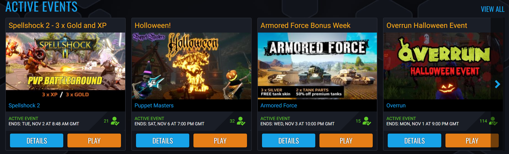
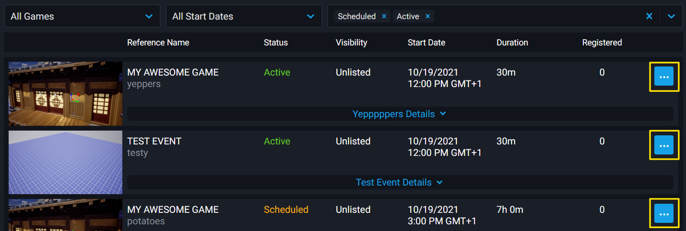
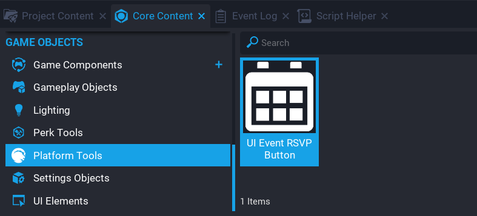

# Game Events

{: .center loading="lazy" }

## Overview

**Game Events** are designed to help increase engagement and retention in your games. Users will be able to browse events for all games or view events created for specific games on the game details page.

**Game Events** are available to everyone, however, Creators in the Perks Program will have the ability to create more events, and with a longer length.

**Game Events** are different to the [Events API](/api/events.md). The Events API is used for Broadcasting from Lua scripts.

## Accessing the Events Page

**Game Events** are created from the **Events** page in the **Creator Portal** area on the [Core Games Website](https://coregames.com). Accessing the **Creator Portal** can be done by logging in, and selecting **Creator Portal** from the drop down menu.

{: .center loading="lazy" }

{: .center loading="lazy" }

## Game Events List Page

When you access the **Events** page, there you will see a list of all the events that have been created, along with filter options. By default, the **Scheduled** and **Active** filters for the event state will be selected so that the events list only contains events for the games that match those filters.

{: .center loading="lazy" }

## Creating an Event

On the **Events** page, click on the button **Create Event**, which will take you to the **Create Event** form. All the fields will need to be filled in for the event.

{: .center loading="lazy" }

### Events Per Game Limit

When a game is selected for the event, the drop down will display to the right of the game, how many events have been created, and the maximum amount that can be created for each game.

For creators in the Perk Program, 15 current and future events are available per game, and 5 total events available to creators not in the Perks Program.

{: .center loading="lazy" }

### Event Timing Requirements

Events can have a minimum length of 30 minutes, and a maximum length of 24 hours. Creators that are in the Perks Program can create events that have a maximum length of 7 days.

If the end date of the event is over the maximum length allowed, an error will be displayed below the field.

**Event Start Date** can not be less than 5 minutes in the future, and **Event Start Date** can not be more than 30 days in the future.

If the date for a new event being created overlaps with an existing scheduled event for that game, then a error will show. Each game can only have one scheduled event.

### Event Form Fields

| Field Name | Description |
| ---------- | ----------- |
| **Select Game** | The game that the event is for. |
| **Event Title** | The title of the event. This will be public. |
| **Reference Name** | The event reference name. This will not be public. |
| **Event Details** | Information about the event that players might wish to know about. |
| **Start Date** | The starting date of the event. |
| **Start Time** | The starting time of the event. Local time. |
| **End Date** | The ending date of when the event will end. |
| **End Time** | The ending time of when the event will end. Local time. |
| **Tag** | Tags that will help players see what sort of event it is. |
| **Event Image** | The image that will be used for the event in the game thumbnail and landing page. A custom image for the event can be uploaded, or the default image can be used. |
| **Visibility** | The visibility of the event. If **Unlisted** then only those will direct link to the event page can register. |

{: .center loading="lazy" }

### Event Image

The image for an event can be different to the default image for the game. When an event has finished, or been cancelled, the image for the game will revert back to the default image.

To upload a custom image for the event, click on the upload button, and select the image to use for this event.

{: .center loading="lazy" }

### Preview & Publish

Once the event form has been filled out, clicking on the **Preview & Publish** button will show a preview of how the event will look to players, and an overview of the details. Clicking the **Schedule Event** button will create the event.

{: .center loading="lazy" }

## Event Options Menu

Each event listed on the **Events** page, will have a button on the right side that will open up an options menu specific to that event.

| Option | Description |
| ------ | ----------- |
| **Edit Event** | Edit event details. If an event is scheduled, then all the event details can be edited. But if the event is currently active, then there are some restrictions on what can be edited. Any field that can't be edited will be disabled. |
| **Cancel Event** | Cancels the event. A prompt will show to get confirmation. An event that is scheduled, or active can be cancelled at any time. |
| **Copy Game Event Id** | Copies the unique game event Id for this event, which can be used in the editor with the **UI Event RSVP Button**. This Id contains the game Id and Event Id separated by a hyphen (-). |
| **Copy Event Link** | Copies the URL to the event page for the game. |
| **View Event Details** | Opens up the event page for the game. |

{: .center loading="lazy" }

## Registering for an Event

Players can register for events from the [Events page](https://coregames.com/events), from the **Core** client, or in the games themselves if creators implement a UI Event RSVP Button. Players registering for an event, will allow them to keep track of specific events they are interested in, and receive notifications when events begin.

Players can also unregister from events at anytime, this will remove the event from the player's event list, and they will not receive a notification when the event begins.

{: .center loading="lazy" }

## UI Event RSVP Button

In the editor, there is a button component called **UI Event RSVP Button** that can be found in **Platform Tools**, in **Core Content**. This button can be used by players in game so they can register and unregister for an event. This button will also contain a countdown for when the event will begin.

Each game event created will have a **Game Event Id** that can be copied and added to the **Event ID** property of the **UI Event RSVP Button** in the **Properties** window. If no ID is entered, or is invalid, then the button will be disabled.

{: .center loading="lazy" }

{: .center loading="lazy" }

## Game Events API

The [CoreGameEvent](../api/coregameevent.md) API can be accessed from Lua scripts to retrieve information about events. Information such as event name, description, amount of players registered, start and end dates are available.

### Countdown Timer

For example, displaying a custom countdown timer for an event that will begin can be done by fetching the game event data.

```lua
-- UI Text to display the countdown.
local COUNTDOWN = script:GetCustomProperty("Countdown"):WaitForObject()

local eventID = "f103d21c132244c28442a658af80f8a1-07fd5df674564459a241babf72fbaa21"
local eventData = CorePlatform.GetGameEvent(eventID)
local timestamp = 0

-- Check if the event data exists.
if eventData ~= nil then
    local eventStart = eventData:GetStartDateTime()

    -- GetStartDateTime returns a DateTime.
    timestamp = eventStart.secondsSinceEpoch
end

-- Update the countdown every frame.
function Tick()
    if eventData ~= nil then
        local diff = timestamp - DateTime.CurrentTime().secondsSinceEpoch
        local days = math.floor(diff / 86400)
        local hrs = math.floor((diff % 86400) / 3600)
        local mins = math.floor((diff % 3600) / 60)
        local secs = math.floor(diff % 60)

        if diff > 0 then
            COUNTDOWN.text = string.format("Event Starts In: %02i:%02i:%02i:%02i", days, hrs, mins, secs)
        else
            COUNTDOWN.text = "Event Has Started"
        end
    end
end
```

The `eventID` value can be retrieved by copying the **Game Event Id** for the event from the Events page accessed from the creator portal.

<div class="mt-video" style="width:100%">
    <video autoplay muted playsinline controls loop class="center" style="width:100%">
        <source src="/img/GameEvents/countdown_example.mp4" type="video/mp4" />
    </video>
</div>

### Event RSVP

In **Core Content**, there is a [UIEventRSVPButton](../api/uieventrsvpbutton.md) that allows the player to click and RSVP to an event. Creators can change the **Game Event Id** for the button by setting the `eventId` property. Here's an example that displays a **UI Container** with the RSVP button if the player interacts with a **Trigger**.

```lua
--Script needs to be in Client Context for Game.GetLocalPlayer() to work
local RSVP_TRIGGER = script:GetCustomProperty("Trigger"):WaitForObject()
local RSVP_UI = script:GetCustomProperty("UIContainer"):WaitForObject()
local RSVP_BUTTON = script:GetCustomProperty("UIEventRSVPButton"):WaitForObject()
local EXIT_UI_BUTTON = script:GetCustomProperty("ExitButton"):WaitForObject()
local EVENT_ID = script:GetCustomProperty("EventId")

--Set the RSVP Button to the correct Game Event ID
RSVP_BUTTON.eventId = EVENT_ID

local localPlayer = Game.GetLocalPlayer()
local inTrigger = false

local function CloseUI()
    RSVP_UI.visibility = Visibility.FORCE_OFF

    if inTrigger then
        RSVP_TRIGGER.isInteractable = true
    else
        RSVP_TRIGGER.isInteractable = false
    end

    UI.SetCursorVisible(false)
    UI.SetCanCursorInteractWithUI(false)
end

local function OnInteracted(trigger, obj)
    if inTrigger and Object.IsValid(obj) and obj:IsA("Player") and obj == localPlayer then
        RSVP_UI.visibility = Visibility.FORCE_ON
        RSVP_TRIGGER.isInteractable = false

        UI.SetCursorVisible(true)
        UI.SetCanCursorInteractWithUI(true)
    end
end

local function OnExitTrigger(trigger, obj)
    if Object.IsValid(obj) and obj:IsA("Player") and obj == localPlayer then
        inTrigger = false
        CloseUI()
    end
end

local function OnEnterTrigger(trigger, obj)
    if Object.IsValid(obj) and obj:IsA("Player") and obj == localPlayer then
        RSVP_TRIGGER.isInteractable = true
        inTrigger = true
    end
end

EXIT_UI_BUTTON.clickedEvent:Connect(CloseUI)

RSVP_TRIGGER.interactedEvent:Connect(OnInteracted)
RSVP_TRIGGER.endOverlapEvent:Connect(OnExitTrigger)
RSVP_TRIGGER.beginOverlapEvent:Connect(OnEnterTrigger)
```

<div class="mt-video" style="width:100%">
    <video autoplay muted playsinline controls loop class="center" style="width:100%">
        <source src="/img/GameEvents/rsvp_example.mp4" type="video/mp4" />
    </video>
</div>

### Event Participants

Creators may want a list of player names that participated in an event. One way to do this is store each player in a [Leaderboard](../api/leaderboards.md) if the event is currently active. Here's an example that uses [Chat](../api/chat.md) commands to display a **Leaderboard** of players that were in the game while an event was occurring.

```lua
local LEADERBOARD = script:GetCustomProperty("Leaderboard")
local EVENT_ID = script:GetCustomProperty("EventID")

local eventData = CorePlatform.GetGameEvent(EVENT_ID)
local eventStartTime = 0
local eventEndTime = 0

--Only the creator has the ability to print event participants
local creatorName = "DoubleABattery"

local checkEventTask = nil

--Access the start and end time for the event
if eventData ~= nil then
    eventStartTime = eventData:GetStartDateTime().secondsSinceEpoch
    eventEndTime = eventData:GetEndDateTime().secondsSinceEpoch
end

function CheckEvent()
    if eventData ~= nil then
        --Submit all players if current time is between the start and end of an event
        local currentTime = DateTime.CurrentTime().secondsSinceEpoch
        if currentTime >= eventStartTime then
            if currentTime < eventEndTime then
                local allPlayers = Game.GetPlayers()
                for _, player in pairs(allPlayers) do
                    SubmitPlayer(player, currentTime)
                end
            else
                StopTask()
            end
        end
    else
        StopTask()
    end
end

--Stop the task once the event has ended or is invalid
function StopTask()
    checkEventTask:Cancel()
    checkEventTask = nil
end

function SubmitPlayer(player, time)
    if Leaderboards.HasLeaderboards() then
        Leaderboards.SubmitPlayerScore(LEADERBOARD, player, time)
    end
end

--Task repeats indefinitely every 10 seconds
checkEventTask = Task.Spawn(CheckEvent)
checkEventTask.repeatCount = -1
checkEventTask.repeatInterval = 10

--Need to check when a player joins in case the event ends before the task runs again
function OnPlayerJoined(player)
    if eventData ~= nil then
        local currentTime = DateTime.CurrentTime().secondsSinceEpoch
        if currentTime >= eventStartTime and currentTime < eventEndTime then
            SubmitPlayer(player, currentTime)
        end
    end
end

Game.playerJoinedEvent:Connect(OnPlayerJoined)

--Only the creator can print all participants by typing "/event" into chat
function PrintEventParticipants(player, data)
    if player.name == creatorName and data.message == "/event" then
        if Leaderboards.HasLeaderboards() then
            print("Printing Event Participants...")
            local entries = Leaderboards.GetLeaderboard(LEADERBOARD, LeaderboardType.GLOBAL)
            for _, entry in pairs(entries) do
                print(entry.name)
            end
        end
    end
end

Chat.receiveMessageHook:Connect(PrintEventParticipants)
```

<div class="mt-video" style="width:100%">
    <video autoplay muted playsinline controls loop class="center" style="width:100%">
        <source src="/img/GameEvents/leaderboard_example.mp4" type="video/mp4" />
    </video>
</div>

### Spawning Event Template

Events usually have items or activities that are temporary while the event is active such as a special boss fight. The start and end time of an event can be used to spawn a template if an event is active and destroy it once it has ended.

```lua
local TEMPLATE = script:GetCustomProperty("EventTemplate")
--Parent object is at the desired location for the template
local PARENT_OBJECT = script:GetCustomProperty("ParentObject"):WaitForObject()
local EVENT_ID = script:GetCustomProperty("EventID")

local eventData = CorePlatform.GetGameEvent(EVENT_ID)
local eventStartTime = 0
local eventEndTime = 0

--Used to store the spawned template and destroy once the event ends
local eventObject = nil
local checkEventTask = nil

--Handle spawning the template only once
local templateSpawned = false

if eventData ~= nil then
    eventStartTime = eventData:GetStartDateTime().secondsSinceEpoch
    eventEndTime = eventData:GetEndDateTime().secondsSinceEpoch
end

function CheckEvent()
    if eventData ~= nil then
        --Track if the event is currently active by comparing the current time
        local currentTime = DateTime.CurrentTime().secondsSinceEpoch
        local eventActive = currentTime >= eventStartTime and currentTime < eventEndTime
        if not templateSpawned and eventActive then
            eventObject = World.SpawnAsset(TEMPLATE, {parent = PARENT_OBJECT})
            templateSpawned = true
        end
        if templateSpawned and not eventActive then
            CleanupEvent()
        end
    else
        CleanupEvent()
    end
end

--Required to stop the task and remove event object once the event is no longer active
function CleanupEvent()
    if(Object.IsValid(eventObject)) then
        eventObject:Destroy()
    end
    checkEventTask:Cancel()
    checkEventTask = nil
end

--Task repeats indefinitely every 10 seconds
checkEventTask = Task.Spawn(CheckEvent)
checkEventTask.repeatCount = -1
checkEventTask.repeatInterval = 10
```

<div class="mt-video" style="width:100%">
    <video autoplay muted playsinline controls loop class="center" style="width:100%">
        <source src="/img/GameEvents/template_example.mp4" type="video/mp4" />
    </video>
</div>

## Learn More

[CoreGameEvent](../api/coregameevent.md) | [CoreGameEventCollection](../api/coregameeventcollection.md) | [CoreGameEventState](../api/enums.md#coregameeventstate) | [DateTime](../api/datetime.md)
