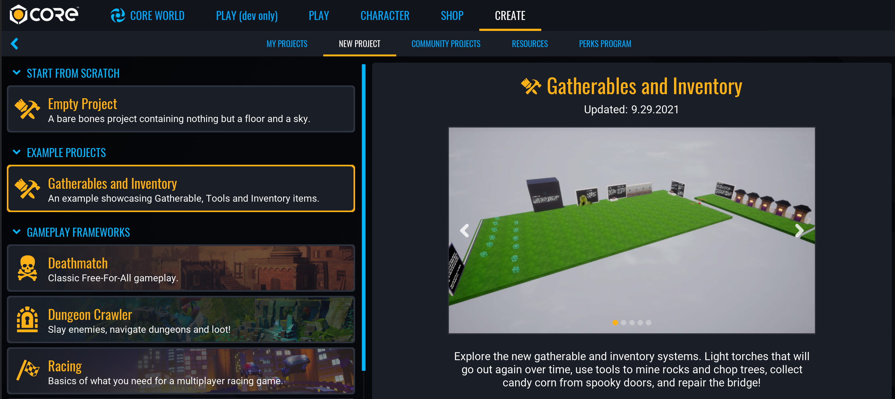
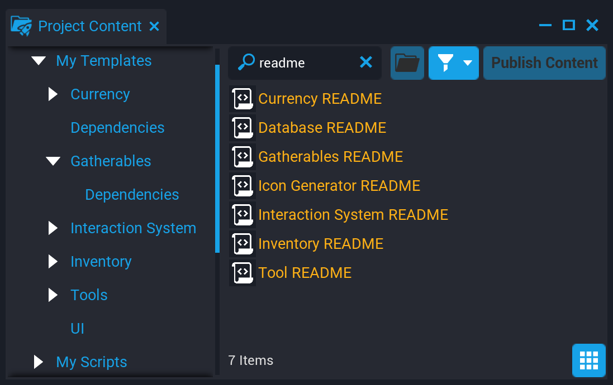
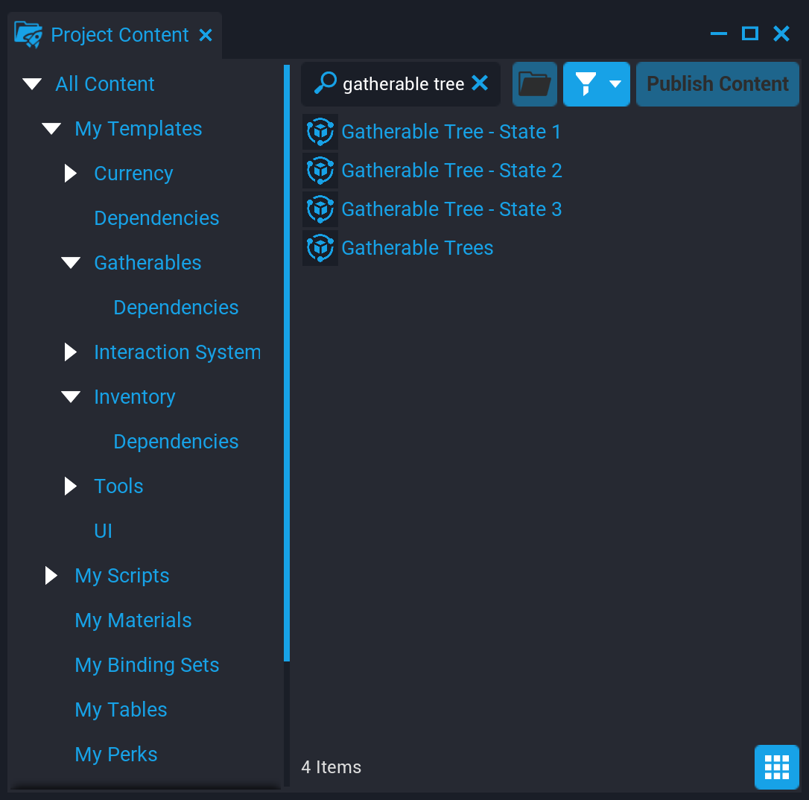

# Gatherables and Inventory

Gatherables are an easy way to create destroyable objects that can be collected. The **Gatherables and Inventory** Example Project provides connected modules to creators to make gatherable objects, tools, save them across sessions and display them in a visual, manipulatable inventory.

The **Gatherables and Inventory** modules do not require Lua scripting to use, but also provide API's so that advanced creators can use them to build their own systems.

Gatherables work by providing features through the Custom Properties of different objects in the Hierarchy. See the [Custom Properties reference](custom_properties.md) to learn more about how this works.

## Creating a New Gatherables Project

The **Gatherables and Inventory** Example Project can be found in the **CREATE** menu alongside the Empty and Framework project options.



1. In Core, click the **CREATE** tab at the top to open options for new and existing projects.
2. In the top bar menu of **CREATE**, select **NEW PROJECT**.
3. In the **EXAMPLE PROJECTS** section, select **Gatherables and Inventory**.
4. Give the project a name in the **Name** field and press the **CREATE** button.

!!! hint
    **Gatherables** can be moved from the example project into an existing project by selecting and copying all the added dependencies in the **Hierarchy** with ++Ctrl+C++ and pasting them into an existing project with ++Ctrl+V++

## Examples

The **Gatherables and Inventory** example contains two scenes that show different ways the Gatherables and related modules can be used to create gameplay.

### Start Preview

Press **Play** button or ++"="++ to start a local preview in the Gatherables - Inventory scene.

You should see objects spawn when the preview starts, with written instructions near each on how to interact with them.

### Open the Inventory

You should also see a UI Inventory Hotbar in the bottom of your screen. This inventory already contains three starting **Tools**, a Pickaxe, and Axe, and Steel and Flint.

Press ++I++ while the preview is running to see the full inventory. Mouseover each tool in the hotbar to see their names and how to use them. Items can also be moved between the inventory and hotbar.

Press ++1++, ++2++, or ++3++ with the preview running to swap which of three tools you are holding. Pressing any of the numbers for an empty space in the hotbar will swap you to the **Empty Hand** tool.

Once you have gathered objects from the examples, they will be added to your inventory and saved for the next time you preview the game. See the [Persistent Storage reference](persistent_storage.md) to learn more about how this works in Core.

!!! info "To remove all the gathered items and only keep the tools in your inventory, press the ++F1++ key while a preview is running."

### Open the Isometric Example Scene

The second example scene shows another way that Gatherables can be used, with a different camera profile.

1. Open the **Scenes** window and find the **Gatherables - Isometric** scene.
2. Click the menu icon and select **Load Scene**.


## README's

Each module of the Gatherables and Inventory system has its own detailed explanation inside the project. To find all the README files, open **Project Content** and search for `readme`. Double click each one to open in the script editor.



## Gatherable Objects

### Create a Gatherable Group

Gatherables can be created from any of the Gatherable Examples, but the **Gatherable Cube** was designed to be modified into a new object most easily.

1. In the **Project Content** window, open the **My Templates** section in the left-hand navigation.
2. In **My Templates**, open the **Gatherables** folder.
3. Select the **Gatherable Cube** template and drag it into the Viewport or Hierarchy.

### Change Gatherable Respawn Properties

Gatherables are most performant when they are together in a single gatherable group, which is possible as long as the share the same respawn characteristics listed in the [**Properties**](#properties) section.

1. Open the **Gatherable Cube** template group and find the **StaticContext (Open Me)** folder.
2. In the **StaticContext (Open Me)** folder, select the **Gatherables Group (Open Me)** group.
3. Open the **Properties** window to see the custom properties that will allow you to customize how your gatherable will respawn.

#### Respawn Properties

| Property | Description |
| --- | --- |
| **Respawn** | If true, gathered objects will respawn based on the other respawn properties and their RespawnSeconds property. |
| **RespawnPlayerMinDistance** | A Gatherable object will not respawn if any Player is closer than this distance. |
| **RespawnPlayerMaxDistance** | A Gatherable object will ignore Players farther than this distance when making visibility checks to determine if it can respawn. |
| **RespawnWhenNotVisible** | If true, Gatherable objects will only respawn when Players are facing away from them. |
| **RandomSpawn** | If true, Gatherables will randomly spawn based on the "RandomSpawnPercent". |
| **RandomSpawnPercent** | The percentage (0 - 100) of Gatherables in this group to spawn at any given time. |

### Change the Gathering Properties

You can choose which tools are valid to use with a gatherable object, as well as changing the audio and visual effects from when they are gathered and respawned.

1. Open the **Gatherable Cube** template group and find the **StaticContext (Open Me)** folder.
2. In the **StaticContext (Open Me)** folder, open the **Gatherables Group (Open Me)** group.
3. Select the **Gatherable Cube** group, and open the **Properties** window.

#### Change the Gatherable State

Gatherables can show up as multiple different world models as they are gathered. A Gatherable with only one state, like the **Gatherable Cube** disappears when it is gathered, whereas others, like **Gatherable Trees** and **Gatherable Stones** change their appearance each time they are gathered. To find an example of how these can look, search for `Gatherable Tree` in **Project Content** to find the three different models used as the tree is gathered.

)

1. Create models for each state your gatherable should have.
2. Create a new template for each state. These do not need to be networked, because they will be spawned in a Client Context. See the [Templates reference](templates.md) for more information.
3. Open the **Gatherable Cube** template group and find the **StaticContext (Open Me)** folder.
4. In the **StaticContext (Open Me)** folder, open the **Gatherables Group (Open Me)** group.
5. Select the **Gatherable Cube** group, and open the **Properties** window.
6. In the **States** section of the Gatherable Cube's properties, click and drag the template for your gatherable before it has been gathered into the **State1** property.
7. Add any intermediate state templates into the **State 2** and **State 3** properties.
8. Add a template to the **GatheredState** property to have a model for one the gatherable can't be gathered again.

### Change the Gatherable Drops

The **Gatherable Cube** has one drop by default: **1 Cube**. This drop can be modified and copied to create all the possible item drops your Gatherable should have.

1. Open the **Gatherable Cube** template group and find the **StaticContext (Open Me)** folder.
2. In the **StaticContext (Open Me)** folder, open the **Gatherables Group (Open Me)** group.
3. Open the **Gatherable Cube** group and find the script called **Drops**.

Gatherable drops are children of the **Drops** folder. Click the arrow next to the **Drops** folder to show children, in this case the script called **1 Cube (Custom Properties, Can Have Multiple)**.

!!! note
    Empty scripts are often used to store a collection of Custom Properties. Both the **Drops** script and the **1 Cube (Custom Properties, Can Have Multiple)** script do not actually contain Lua code, but exist in the Hierarchy so that creators can define drops using the **Properties** window.

Select **1 Cube (Custom Properties, Can Have Multiple)** and open the **Properties** window. You can change what item drops when the cube is gathered, the range of how many can drop, and the percentage chances of each drop.

Copy this drop and change the **ItemID** to allow dropping of different items at the same gatherable node. See the **Database** section to learn how to create new types of items.

## Tools

All Gatherables require a **tool** to harvest, but the empty hand tool is enabled by default and allows creators to use gatherables without require specific tools.

### Create a New Tool

To make tools that can be held and used with player animations in world, tools need an equipment template. See the [Equipment reference](../api/equipment.md) to learn more how to create these.

To add a new tool you need to create a reference in the **Tools Database**. See the **Database** section below for more information

## Database

### Add a Database

As in the example scenes, there are two types of database that can be added to a project, **Gatherables Database** and **Tools Database**. Both are needed to make the item systems and gathering possible. If you are starting from a new, empty scene, you will need to add these templates.

1. In **Project Content**, search for `database`.
2. Find the **Gatherables Database** template and add it to the scene.
3. Find the **Tools Database** template and add it to the scene.

### Add a New Item to the Database

The easiest way to add an item to the database is to duplicate an existing entry. However, the **ItemData** script is also a blank template version of these, can be used for both Gatherables and Tools.

1. Open the **Gatherables Database** or the **Tools Database** in the Hierarchy.
2. Select the **Items** script and click the arrow next to it to open it and see its children. All items in the database will be children of this script.
3. Duplicate one of the script children here, or drag a new **ItemData** script onto the **Items** script to add a new entry.
4. With the new entry script selected, open the **Properties** window.
5. Right-click the entry script and select **Rename** or press ++F2++ to rename your item. This name must be unique and not shared by any other gatherable or tool.
6. Change the other properties of this entry to match the way the item should work. Move your mouse over any of the properties for an explanation.

!!! note
    Empty scripts are often used to store a collection of Custom Properties. The **ItemData** scripts do not contain any Lua code, but are used instead to save information found in their custom properties to the items database.

## Currency

**Currency** is a drop in system (template) that provides ready to go Player Currency management without any code required. It also provides a full API for creators with scripting knowledge to allow them to expand on or change how the Currency works.

Any amount of Currencies can be added to a game, and you can use them for more than just visible currency amounts. For example, a Currency could be used to track the scores in a game.

The **Currency** template in **Project Content** can be added to the **Hierarchy** to create a new Currency.

### Add Currency

**Currency** can be added to your game by dragging out the **Currency** template. This template comes with settings and a UI for a Currency. The settings can be found on the Currency template if you select it in the Hierarchy. The UI can be moved, modified or deleted.

| Property | Description |
| -------- | ----------- |
| CurrencyId | The ID of the Currency. Must be unique within a scene. |
| Name | The name of the Currency. |
| StorageKey | An optional Shared Storage Key to save Currency data into. Default is Local Storage. |
| StartingAmount | The amount of this Currency a new Player will start with. |
| MaxAmount | The maximum amount of this currency a Player can have. 0 means no maximum. |
| DropTemplate | The template to use to display the dropped item in world. |
| DropItemPickupTemplate | The Item Pickup Template to use if this Currency is dropped in world. |
| VerboseLogs | If true, more detailed logs will be printed to the Event Log if errors or warnings occur. |
| IconCameraId | If **Is3DIcon** is true, this should match the **CameraId** of an **Icon Generator** in the scene. |
| IconAsset | The image or template to use for an icon. If **IsKitbashed2DIcon** is true, this should be a UI template. If **Is3DIcon** is true, this should be a 3D object template. If **IsImageIcon** is true, this should be an image/brush asset. |
| IsKitbashed2DIcon | If true, the **IconAsset** should point to a UI template. This template will be spawned as the icon. |
| Is3DIcon | If true, the **IconAsset** should point to a 3D object template. An image of this template will be used as the icon. |
| IsImageIcon | If true, the **IconAsset** should point to an image/brush asset. This will be used as the icon. |

### Currency Admin

The Currency Admin system will listen for chat commands from specific admin players. You can use commands to do most common Currency actions like adding and removing Currency from players. Commands will fail gracefully if they cannot be done. Commands can only be run on online Players.

See the **Currency README** in the Project Content for more information.

## Icons

The Icon Generator is a drop in component that will render 3D icons for use in **UIImage** objects. You can have several Icon Generators in the scene to allow for rendering icons in different styles. The Icon Generator will automatically clear unused icons to make sure only the relevant texture space is being used.

### Icon Generator Setup

1. Drop the **Icon Generator** template from **Project Content** into your scene and move it to an appropriate (hidden) area.
2. Fill in the **CameraId** Custom Property on the "Icon Generator" object. This ID will be used in the script to identify which generator to use for your render.

#### Creating an Object Template

Create a template for the object you want to render. Work on the template inside the Icon Generators **Icon Container** to have a visible bounding box to work within. Once you are finished, save your template and delete it from the container. The blue tinted bounding box indicates a safe area for what will get rendered into the final icon. The frame on the back also describes the bounds of the final icon.

#### Create Script

Create a script to use to render the object to the image.

To render the icon and apply it to the **UIImage** you just run the following script in a Client Context:

```lua

local ICON_MANAGER = require(script:GetCustomProperty("APIIconManager")) -- Asset Reference pointing to APIIconManager
local ICON_TEMPLATE = script:GetCustomProperty("IconTemplate") -- Asset Reference pointing to the object template
local CAMERA_ID = script:GetCustomProperty("CameraId") -- String set to the Camera Id on the Icon Generator you want to use
local IMAGE = script:GetCustomProperty("Image"):WaitForObject() -- Core Object Reference to a UIImage

-- Give the Icon Generator a frame to register
Task.Wait()

ICON_MANAGER.SetIcon(IMAGE, CAMERA_ID, ICON_TEMPLATE, CameraCaptureResolution.MEDIUM)
```

---

## Learn More

[Custom Properties reference](custom_properties.md) | [Equipment reference](../api/equipment.md) | [Persistent Storage reference](persistent_storage.md)
