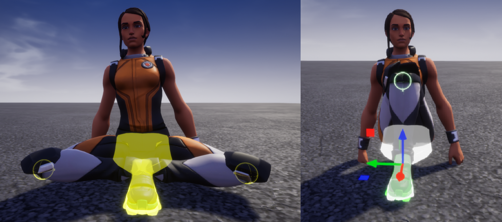
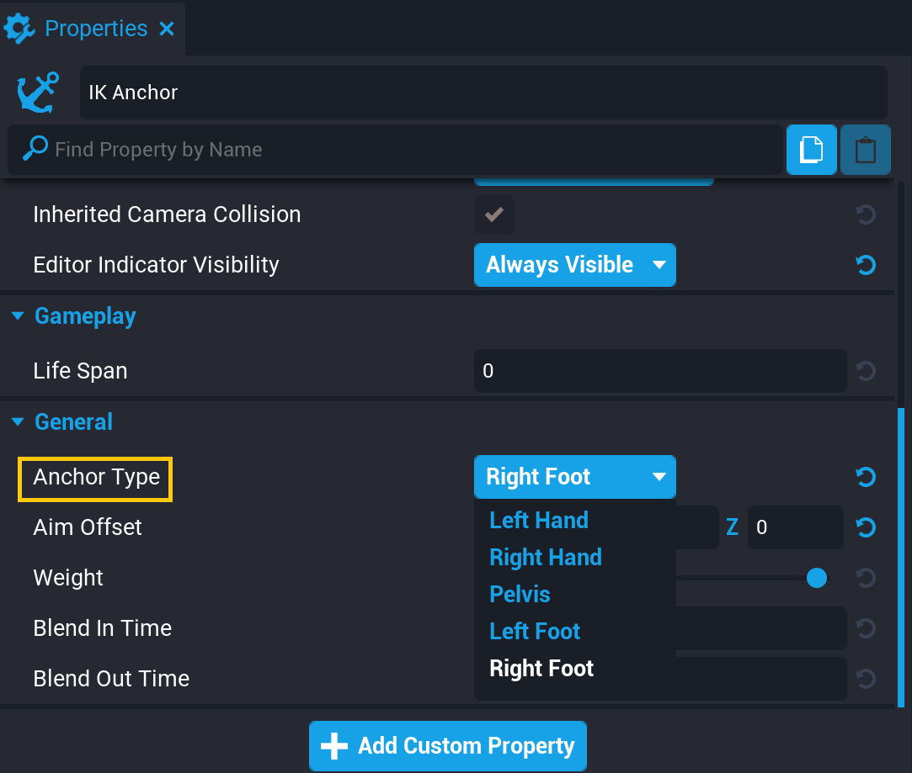

# IK and Custom Animations

## Overview

IK Anchors are a system for modifying player animations. Players can be animated by setting their `animationStance` property, or by creating an [**Ability**](../api/ability.md). **IK Anchors** allow creators to change the way specific joints move to create customized animations.

For a complete list of the existing player animations and animation stances, see [Player Animations and Sockets](../api/animations.md).

## IK Anchor Bones and Properties

IK Anchors work with a specific set of points (bones) on the player models and have properties that allow creators to customize the way they move the player skeleton.

### Bones

There are 5 different bones that IK Anchors can control:

- Left Hand
- Right Hand
- Pelvis
- Left Foot
- Right Foot

### Properties

| Property | Definition |
| --- | --- |
| Anchor Type | Which player bone should be controlled by the Anchor |
| Aim Offset | How the closest joint should bend relative to the Anchor |
| Weight | How much the bone should be controlled by the Anchor. At 0 it will not be affected at all, and at 1 it will move as close to the anchor as possible. |
| Blend In Time | How long it should take for the bone to transition when the Anchor is activated. |
| Blend Out Time | How long it should take for the bone to revert when the Anchor is deactivated. |

_Pelvis, left, and right foot anchored, with **Aim Offset** at Y = 50 and Y = -50 (fig. 1), and both at Z = 50 (fig. 2)_
{: .image-cluster}

## Adding IK Anchors

### Add an IK Anchor Object

The **IK Anchor** object can be found in the **Game Objects** section of **Core Content**, under **Game Components**.

{: .center loading="lazy" }

Select the **IK Anchor** and drag it into the Scene or **Hierarchy** to add it to the project.

{: .center loading="lazy" }

!!!tip
    To make the **IK Anchor** object visible in the world, press the ++V++ key while it is selected. To make your IK Anchors always visible, select them and in the **Properties** window change **Editor Indicator Visibility** to **Always Visible**.

### Select the Correct Socket

With the **IK Anchor** selected, open the **Properties** window. Change the **Anchor Type** property to match the bone that should be controlled.

{: .center loading="lazy" }

### Activate the IK Anchor

To make an **IK Anchor** start controlling a player's bone, call the `Activate` method with the target **Player**. See the [IKAnchor API entry](../api/ikanchor.md) to learn more and see examples of ways to use IK Anchors.

---

## Learn More

[IKAnchor in the Core Lua API](../api/ikanchor.md) | [Player Animations and Sockets](../api/animations.md) | [Player in the Core Lua API](../api/player.md) | [Abilities Tutorial](ability_tutorial.md)
