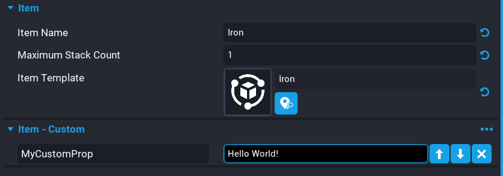
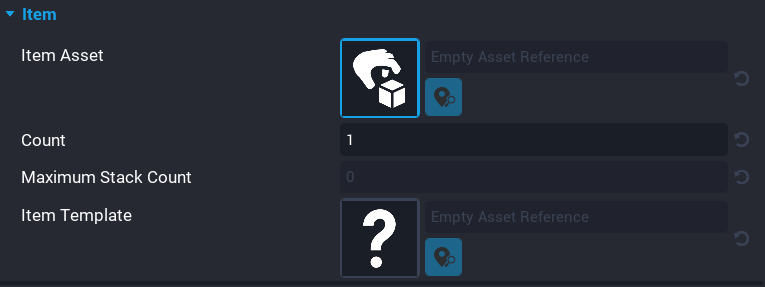

# Inventory

An **Inventory** in **Core** is a lightweight system used for tracking many items. Players can view and organize a list of items or resources they have collected. With these lists, players can discover whether they possess particular items (such as a key that opens a door), pay for trading, fulfill crafting requirements, maintain collections, and control other systems that require tracking what a player has acquired during the game.

## Inventory Object

<!-- vale Google.Passive = NO -->
The **Inventory Object** is a core object that represents the container for item objects. Items can be added directly to an inventory, picked up from an Item Object in the world, or transferred between inventories. Core objects and players can have any number of inventories.
<!-- vale Google.Passive = YES -->

Creators can create an **Inventory** from dragging the **Inventory** object from **Gameplay Objects** in **Project Content** into the **Hierarchy**, or right-clicking in the hierarchy and selecting **Inventory** from the **Gameplay Object** menu.

{: .center loading="lazy" }

### Inventory Properties

An inventory object in the hierarchy has an **Inventory** category in the **Properties** window.

<!-- vale Google.Passive = NO -->
| Property Name | Property Description |
| ------------- | -------------------- |
| Slot Count | The number of item stacks this inventory can hold. Any values less than 1 indicates no limit. |
| Pick Up Items On Start | If true, this inventory will attempt to pick up any child **ItemObjects** when it is spawned. This can be used to spawn an inventory that already contains items. |
<!-- vale Google.Passive = YES -->

### Assign Inventory

An inventory in the hierarchy that is not assigned to a player, is a public inventory. For example, a chest would contain a list of loot items that players can take and place into their inventory.

<!-- vale Google.Passive = NO -->
To give an inventory to a Core Object (such as a treasure chest), it is recommended that creators add an **Inventory Object** as a descendant of the core object.
<!-- vale Google.Passive = YES -->

If players need an inventory, spawning an **Inventory** object when the player joins the game would be a good method of making sure all players have an inventory. Players get assigned an inventory using the [`Assign`](../api/inventory.md) function.

!!! tip "To remove an inventory assigned to a player, use the `Unassign` function."

```lua
-- Inventory template.
local BACKPACK = script:GetCustomProperty("Backpack")

local function OnPlayerJoined(player)

    -- Spawn an instance of the inventory object into the world.
    local inventory = World.SpawnAsset(BACKPACK)

    -- Assign this player to that inventory spawned in.
    inventory:Assign(player)
end

Game.playerJoinedEvent:Connect(OnPlayerJoined)
```

## Item Assets

**Item Assets** are project-level definitions of items. With an item asset, creators can create and manage them in the world or between inventories.

<!-- vale Manticore.FirstPerson = NO -->
Creators can create an item asset from **Project Content** by right-clicking and selecting **Create Item Asset** from the menu, or selecting **Create Item Asset** from the **Script** {: .image-inline-text .image-background style="background-color: #17A2E7" } dropdown.

To view created item assets, select **My Items** in **Project Content**.
<!-- vale Manticore.FirstPerson = Yes -->

{: .center loading="lazy" }

### Item Asset Properties

**Item Assets** have properties that describe the item.

<!-- vale Google.Passive = NO -->
| Property Name | Property Description |
| ------------- | -------------------- |
| Item Name | The name of this item. If none is provided, the asset name will be used. |
| Maximum Stack Count | The maximum count allowed for a single stack of this item. |
| Item Template | The asset to spawn when this item exists in the world. |
<!-- vale Google.Passive = NO -->

{: .center loading="lazy" }

#### Custom Item Properties

Like script assets, **Item Assets** can have custom properties. These properties will exist on all item objects or inventory items in the scene. Just like normal custom properties, custom item properties can be static (unchangeable) or dynamic (changeable) during the game.

Custom Item Properties are automatically applied to item objects in the hierarchy or inventory items in an inventory. This data, including changed property values, persist when an item asset is spawned in the world, picked up and added to an inventory, traded between inventories, and dropped again.

{: .center loading="lazy" }

## Item Object

**Item Objects** are core objects that manifest items into the 3D world. When an item object is spawned (including when the item is initialized on game start), the item object will automatically spawn an instance of the Item Asset's item template.

Creators can create **Item Objects** by dragging the **Item Object** from **Project Content** which is found under **Gameplay Objects** into the **Hierarchy**.

Dropping an inventory item into the world using the `DropItem` or `DropSlot` functions will create an item object.

{: .center loading="lazy" }

### Item Object Properties

A selected **Item Object** will have the following properties in the **Properties** window.

| Property Name | Property Description |
| ------------- | -------------------- |
| Item Asset | The item asset which defines this item. |
| Count | The current number of items in this item stack. Minimum is 1.
| Item Template | The asset to spawn when this item exists in the world. This value is derived from the source ItemAsset. |

!!! warning "Custom properties added to an item object will be lost if the item object is added to an inventory. To preserve item properties, add custom properties to your item assets then the data will be preserved no matter if the item is in the world or an inventory."

{: .center loading="lazy" }

## Inventory Item

**Inventory items** are the data blobs stored by inventory objects and only exist during runtime. They inherit any custom properties of the item asset that defines them.

Creators working with inventory items will likely perform one or more of the following operations. Most functions can be performed by a slot (drop item in slot 2) or by an item asset reference (drop 6 apples).

1. Creators can get all inventory items from an inventory or the item in a specified slot.
2. Creators can drop inventory items from an inventory, this spawns them into the world as an Item Object.
3. Creators can transfer inventory items between inventories with the `Give` functions.
4. Creators can manually sort inventory items from one slot to another with the move function.
5. Creators can delete inventory items with the remove functions.

## Networking

In general, networking for these new types attempts to conform to all the existing Core patterns. This means that the context in which the objects reside will largely determine their networking behavior.

| Object | Networking |
| ------ | ---------- |
| `ItemObject` | This object is networked the same as any other Core Object. |
| `InventoryObject` | This object is networked the same as any other Core Object, with one special exception: If a Networked inventory has been assigned a player owner, its contents will only be communicated to that player’s client. When unassigned, its contents will go back to being networked to all players. |

In general, because these are dynamic objects, they can only exist in contexts that would normally be modifiable. This means that Inventories and Items may be used inside Networked, Server, Client, and Local contexts, but they may not be used inside Default or Static contexts.

## Simple Inventory Example

Below is a simple example of how to implement an inventory system for players that can pick up in-world items. Pressing ++Q++ will drop 1 item from the highest item in the inventory.

<div class="mt-video" style="width:100%">
    <video autoplay muted playsinline controls loop class="center" style="width:100%">
        <source src="/img/Inventory/preview.mp4" type="video/mp4" />
    </video>
</div>

<!-- vale Google.Acronyms = NO -->
??? "Server Script"
    ```lua
    -- Networked inventory template
    local BACKPACK = script:GetCustomProperty("Backpack")
    local players = {}

    -- Drop an item when the "Drop Item" action is performed.
    -- This can be added to your binding set.
    local function DropItem(player, action)

        -- Check the player is in the player's table and the input action is Drop Item.
        if players[player.id] ~= nil and action == "Drop Item" then

            -- Loop based on the total slots the inventory has.
            for i = 1, players[player.id].slotCount do

                -- Get the item based on the slot index.
                local item = players[player.id]:GetItem(i)

                -- Check the item is valid and has a count > 0.
                if item and item.count > 0 then
                    local templateId = item.itemTemplateId
                    local forward = player:GetViewWorldRotation() * Vector3.FORWARD
                    local ray_start = player:GetViewWorldPosition() + forward
                    local ray_end = ray_start + forward * 2000
                    local hit = World.Raycast(ray_start, ray_end)

                    if hit ~= nil then

                        -- Remove 1 from slot based on the index.
                        if players[player.id]:RemoveFromSlot(i, { count = 1 }) then
                            item = World.SpawnAsset(templateId, { networkContext = NetworkContextType.NETWORKED, position = hit:GetImpactPosition() })
                        end
                    end

                    break
                end
            end
        end
    end

    -- When a player joins the server spawn an inventory object and assign it to the player.
    local function OnPlayerJoined(player)
        local backpack = World.SpawnAsset(BACKPACK, { networkContext = NetworkContextType.NETWORKED })

        backpack:Assign(player)
        backpack.name = player.name
        players[player.id] = backpack
    end

    local function OnPlayerLeft(player)
        players[player.id]:Destroy()
    end

    Game.playerJoinedEvent:Connect(OnPlayerJoined)
    Game.playerLeftEvent:Connect(OnPlayerLeft)

    Input.actionPressedEvent:Connect(DropItem)
    ```

??? "Client Script"
    ```lua
    local SLOTS = script:GetCustomProperty("Slots"):WaitForObject()

    local localPlayer = Game.GetLocalPlayer()
    local inv = nil

    -- When the inventory has changed for the player, update the slots to show
    -- the item count.
    local function InventoryChanged(inv, slot)
        local item = inv:GetItem(slot)
        local childIcon = SLOTS:GetChildren()[slot]:FindChildByName("Icon")
        local childCount = SLOTS:GetChildren()[slot]:FindChildByName("Count")

        if item ~= nil then
            local icon = item:GetCustomProperty("icon")

            childIcon:SetImage(icon)
            childIcon.visibility = Visibility.FORCE_ON
            childCount.text = tostring(item.count)
        else
            childIcon.visibility = Visibility.FORCE_OFF
            childCount.text = ""
        end
    end

    -- Make sure the inventory is initialized.
    while inv == nil do
        inv = localPlayer:GetInventories()[1]
        Task.Wait()
    end

    for i, item in pairs(inv:GetItems()) do
        InventoryChanged(inv, item)
    end

    inv.changedEvent:Connect(InventoryChanged)
    ```
<!-- vale Google.Acronyms = Yes -->

## Learn More

[Inventory API](../api/inventory.md) | [InventoryItem API](../api/inventoryitem.md) | [ItemObject API](../api/itemobject.md) | [Networking](../references/networking.md)
