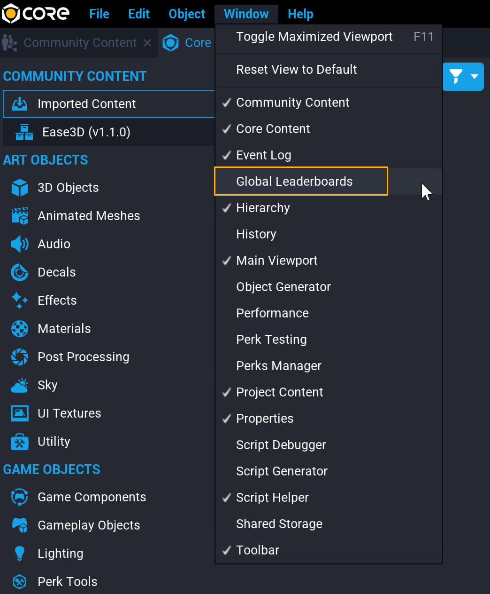
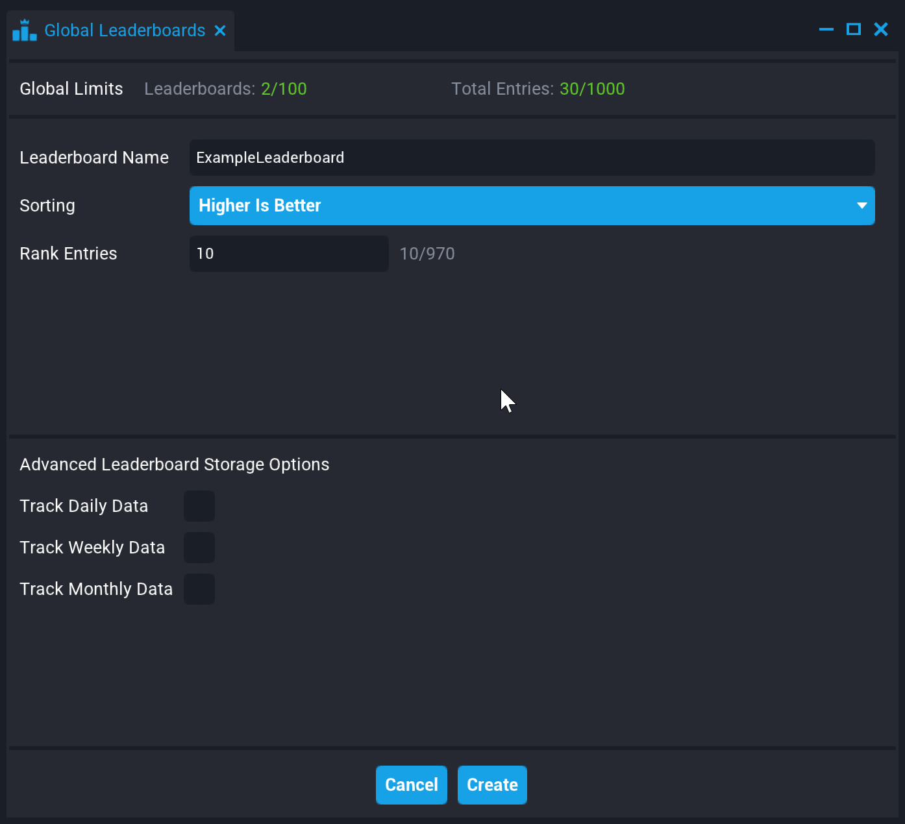
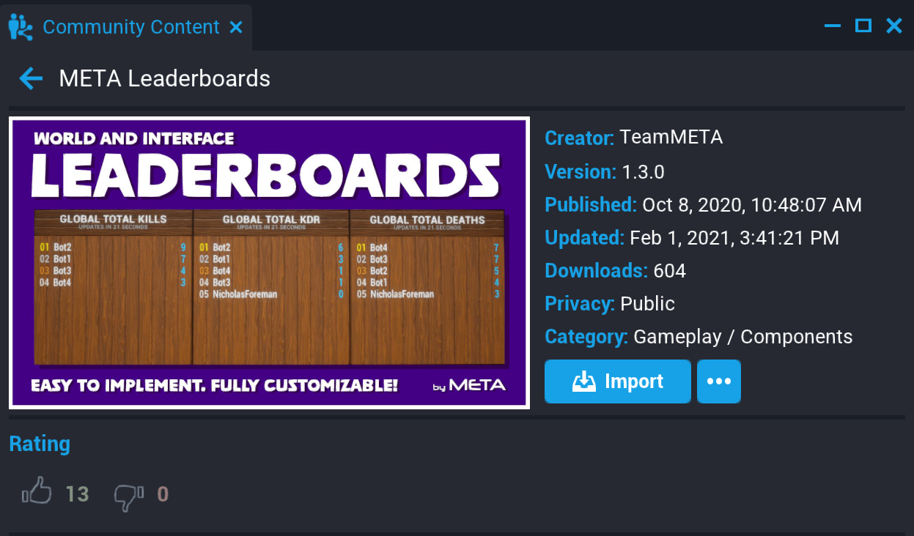

# Leaderboards

## Overview

**Global Leaderboards** store data for players across play sessions which is automatically sorted by the entry scores. This can be used to call out player excellence in metrics that fit your game, but can also be used for tracking data for players who are not currently connected to your game.

### Number of Entries

There is a limited number of Leaderboards and Leaderboard Entries per project, and entries per board.

#### Maximum Numbers

- Each Leaderboard can only have **one entry per player**.
- The maximum entries on a Leaderboard must be **between 10 and 100 entries**.
- One project can have **up to 100 Leaderboards**.
- Combined, Leaderboards in a project can have **up to 1000 total entries**.

### Daily, Weekly, Monthly Leaderboards

Each Leaderboard has the option to track **Daily**, **Weekly**, and **Monthly** scores, by creating a separate copy of the Leaderboard which deletes entries that are more than 1, 7, or 30 days old.

!!! note
    Each Daily, Weekly, or Monthly Leaderboard contributes to the total number of entries. that a project can have.

## Creating a Leaderboard

Leaderboards are created through the **Global Leaderboards** window, and can be referenced in scripts using a **NetRef**.

{: .center loading="lazy" }

### Create a New Leaderboard

1. Click **Window** in the top menu toolbar, and then select **Global Leaderboards**.
2. Click the **Create New Leaderboard** button.
3. Give the Leaderboard a name that reflects the information it tracks.
4. Choose **Higher Is Better** or **Lower is Better** depending on which should put a player at the top of the Leaderboard.
5. Specify how many total entries the Leaderboard should track in the **Rank Entries** field.
6. Check the boxes by **Track Daily Data**, **Track Weekly Data**, or **Track Monthly Data** to create additional copies of the Leaderboard that delete entries after a certain amount of time.

{: .center loading="lazy" }

### Add a NetReference as a Custom Property

To reference a Leaderboard in a script, use a [NetReference](../api/netreference.md).

<div class="figure-block">
    <figure>
        <video style="height: auto" autoplay loop muted playsinline poster="/img/EditorManual/Abilities/Gem.png">
            <source src="/img/Leaderboards/Leaderboards_AddNetRef.webm" type="video/webm" alt="Open the Global Leaderboard Window"/>
            <source src="/img/Leaderboards/Leaderboards_AddNetRef.mp4" type="video/mp4" alt="Open the Global Leaderboard Window"/>
        </video>
        <figcaption><em>Open the Global Leaderboard Window</em></figcaption>
    </figure>
</div>

1. In the Hierarchy, select the script that will reference the Leaderboard, and open the **Properties** window.
2. Open the **Global Leaderboards** window, and find the Leaderboard to add.
3. Select the name of the Leaderboard and click and drag it onto the **Custom Properties**.
4. Copy the generated variable reference in the box below, and add paste it in the contents of the script.

### Loading Leaderboards

Leaderboards do not instantly load, so the **HasLeaderboards** function can be used to check if it is loaded before displaying or adding new entries.

This code shows an example of using [**Task.Spawn** with **Task.Wait**](../api/task.md), to continue checking for a loaded Leaderboard before continuing to the next step

```lua
function loadLeaderboard()

    while not Leaderboards.HasLeaderboards() do -- just keep checking until this until the Leaderboards are loaded
        Task.Wait(1) -- wait one second
    end

    -- Code to display Leaderboard or add an entry goes here

end

-- spawn this task instead of just calling the function so that the Task.Wait doesn't make anything else wait.
Task.Spawn(loadLeaderboard)
```

### Add an Entry to a Leaderboard

The [Leaderboards **AddEntry**](../api/leaderboards.md) function allows you to submit a score for a player to the Leaderboard, which will automatically be sorted.

```lua
local propExampleLeaderboard = script:GetCustomProperty("ExampleLeaderboard") -- NetRef for the Leaderboard

-- example function for any event that would create a score for the Leaderboard
function WhenAPlayerScoresPoints(player, points)
    Leaderboards.SubmitPlayerScore(propExampleLeaderboard, player, points)
end

-- connect the WhenAPlayerScoresPoints() function to an event here
```

!!! note
    You can add a string of up to 8 characters of additional data as a fourth parameter. See the [Leaderboards namespace](../api/leaderboards.md) for more details.

### Displaying Leaderboard Entries

Leaderboards can be access by NetRef from client-side scripts, making it easy to show entries through UI Text Box and World Text. The Leaderboards **GetLeaderboard** method returns a table of [**LeaderboardEntry** objects](../api/leaderboardentry.md) which have name, id, score and additionalData properties that can be used to display the data.

You can create a text asset that is spawned for each Leaderboard entry, or create a group of texts ahead of time for the total number of entries, and update their `text` property.

```lua
local propExampleLeaderboard = script:GetCustomProperty("ExampleLeaderboard") -- NetRef for the Leaderboard

function showExampleLeaderboard()
    local entryTable = Leaderboards.GetLeaderboard()
    for _, entry in ipairs(entryTable) do
        print("name: " .. entry.name .. " score: " .. entry.score) -- This will only print to Event Log

        -- Create a UI Text or World Text asset to change here instead.

    end
end

-- call the showExampleLeaderboard function in a loadLeaderboard function like in the Loading Leaderboards example.
```

## Leaderboards on Community Content

### META World and Interface Leaderboards

{: .center loading="lazy" }

> Leaderboards is a component that simplifies the process of adding a global leaderboard to a game. It is as simple as dragging and dropping a leaderboard template into the hierarchy and adjusting to meet your needs.

---

## Learn More

[Persistent Storage Tutorial](../tutorials/persistent_storage_tutorial.md) | [Leaderboards Namespace in the Core API](../api/leaderboards.md) | [LeaderboardEntry Object in the Core API](../api/leaderboardentry.md) | [UI Reference](../references/ui.md) | [Task Namespace in the Core API](../api/task.md)
