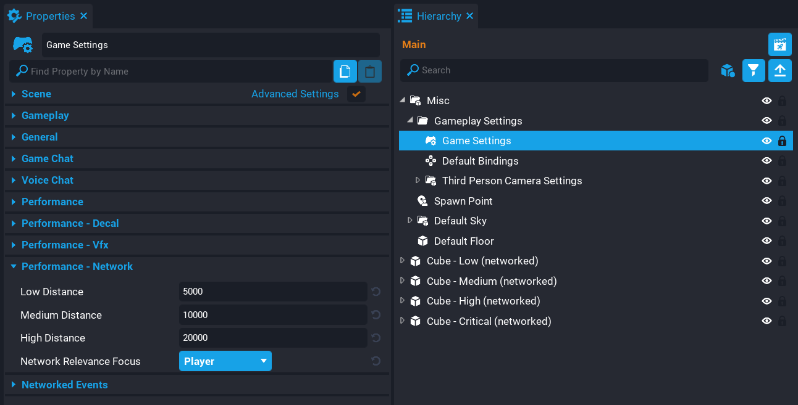
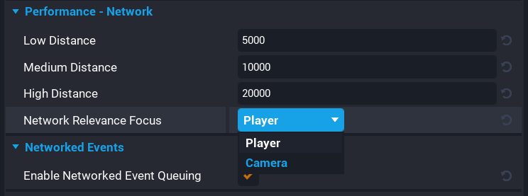
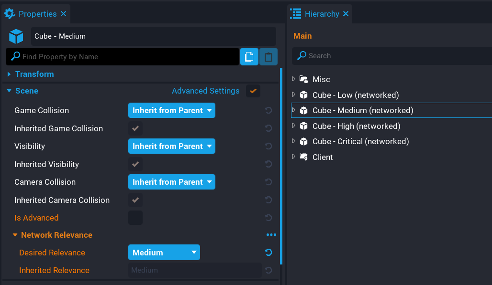

# Network Relevancy

## Overview

**Network Relevancy** in **Core** allows creators to set network relevancy for networked objects to reduce network data when the player is outside of predefined ranges. It does not make sense for players to receive network data for networked objects that are on the other side of the map. Whereas networked objects that the player can see or interact with will be relevant, meaning the player will receive network updates for those objects in range.

For further optimization of networked objects, look at the [dormancy](../tutorials/network_dormancy.md) feature which will make games more performant and utilize more networked behavior by only having certain networked objects replicate when needed.

In the example below (lowered distances), notice when the player gets further away from a networked object, they stop. Meaning the network data is not being sent to the player, which puts the object in a sleep state. As the player gets in range, it will start sending network data again.

    <video autoplay muted playsinline controls loop class="center" style="width:100%">
        <source src="/img/NetworkRelevancy/example_video.mp4" type="video/mp4" />
    </video>

## Testing Network Relevancy

For creators to test **Network Relevancy**, they will need to be in **Multiplayer Preview Mode**. Testing in **Local Preview Mode** will not work.

{: .center loading="lazy" }

## Game Settings

The **Game Settings** object found in the **Hierarchy** contains a **Performance - Network Relevancy** category in the **Properties** window where creators can change network relevancy distance and settings.

| Property | Description |
| -------- | ----------- |
| Low Distance | The distance at which objects with the Low relevance are put to sleep. |
| Medium Distance | The distance at which objects with the Medium relevance are put to sleep. |
| High Distance | The distance at which objects with the High relevance are put to sleep. |
| Network Relevance Focus | The object that the Network Relevance calculations are made in reference to. |

{: .center loading="lazy" }

### Network Relevance Focus

The **Network Relevance Focus** property allows creators to select between **Player** and **Camera** to determine which object the network relevance calculations are made in reference to.

When the **Network Relevance Focus** is set to **Player**, then the network relevance calculations are made from where the player is in the world. As the player moves further away from networked objects that have lower relevancy than **Critical**, then those objects will be put to sleep, meaning network traffic will be reduced for that player.

When the **Network Relevance Focus** is set to **Camera**, then the network relevance calculations are made from the active camera that is set for the player. This applies to override cameras as well, meaning, that if an override camera is set on the player, then the networked objects will be put to sleep based on the override camera position instead of the default player camera.

{: .center loading="lazy" }

## Setting Object Network Relevancy

To set the **Network Relevancy** for an object, creators will need to enable the **Advanced Settings** for the **Scene** category in the **Properties** window. When enabled, a new group will show in the properties window called **Network Relevance** where creators can set the **Desired Relevance** and see the **Inherited Relevance** for that object.

{: .center loading="lazy" }

### Desired Relevance

The **Desired Relevance** property is used to determine the furthest distance at which the networked object is replicated. Critical objects are never affected by distance. Distances are defined on the **Game Settings** object in the **Hierarchy**.

!!! tip "Networked objects will default to **Critical** network relevancy."

### Inherited Relevance

The **Inherited Relevance** property shows the network relevancy the object has inherited by the ancestor in the **Hierarchy**. Descendants of a networked object can have the same desired relevance or lower, but they can never be higher than the ancestor. For example, if the ancestor is set to **High** and a descendant is set to **Critical**, that descendant will default to the inherit relevancy (**High** in this case). However, the descendant can be set to **Medium** or **Low** which will override the inherited network relevancy.

### Dormant By Default

The **Dormant By Default** property when enabled will only use network bandwidth when created or when forced by a Lua API call. This allows creators to have greater control over which networked objects are replicated, and also the speed at which they get replicated.

Disabling a networked object's replication means that the server will not be checking to see if the object has changed, and will not send any new information about that object down to clients, until either the object has Replication enabled again, or until creators explicitly request the server replicate the object down to each client with a Lua API call.

## Learn More

[Networking](../references/networking.md) | [Performance Panel](../references/performance_panel.md) | [Profiler](../references/profiler.md)
