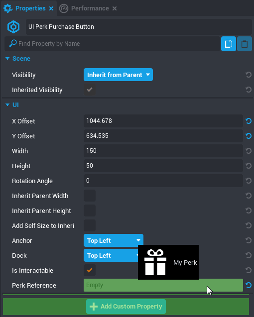
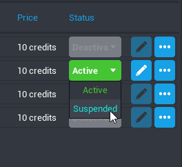

# Perks

## Aperçu

Les Perks sont le système permettant de créer des achats au sein du jeu, afin que les joueurs puissent soutenir les créateurs en échange de contenu exclusif. Pour utiliser les Perks dans un jeu, les créateurs doivent remplir [certaines conditions](../perks/joining.md) et postuler au [Perks Program](../perks/program.md).

## Types dePerks

Les Perks sont divisés en plusieurs types, basés sur le moment et la fréquence auxquels le joueur peut les acheter.

### Permanents

Chaque joueur ne peut acheter un **Permanent Perk** qu'une seule fois.

### Durée limitée

Les **Limited Time Perks** ne peuvent être achetés qu'une fois au cours d'une durée définie, puis rachetés au terme de cette durée.

### Répétables

Les **Repeatable Perks** peuvent être achetés autant de fois que le joueur le souhaite.

Pour plus d'informations sur les types de Perks, consultez l'article [À propos des Perks en jeu](https://support.coregames.com/hc/en-us/articles/360060361453-About-In-Game-Perks) dans le Centre d'assistance Core.

## Créer des Perks

Les Perks sont créés et modifiés via la fenêtre **Perks Manager**. Ils peuvent être associés à un ou plusieurs projet(s) du même créateur.

### Créer un Perk

{: .center loading="lazy" }

1. Ouvrez le **Perks Manager** en cliquant sur **Window** dans le menu supérieur puis en sélectionnant **Perks Manager**.
2. Cliquez sur le bouton **Create New Perk** en bas de la fenêtre.
3. Donnez un nom au Perk et sélectionnez son type.
4. S'il s'agit d'un Perk à durée limitée, modifiez le champ **Duration** afin qu'il corresponde au temps voulu.
5. Renseignez le prix dans la section **Price** du Perk en Core Credits.
6. Activez l'option **Add to Current Project** pour utiliser le Perk.

!!! info
    Le nombre de projets auxquels vous pouvez ajouter un Perk n'est pas limité.

Votre nouveau Perk apparaîtra maintenant dans la section **My Perks** de la fenêtre **Project Content**.

### Ajouter une référence à un Perk

Pour modifier l'expérience d'un joueur en fonction des Perks qu'il possède, vous devez avoir une référence vers ce Perk dans un script.

1. Créez ou sélectionnez un script dans la Hiérarchie, et ouvrez la fenêtre **Properties**.
2. Dans **Project Content**, ouvrez la section **My Perks** et localisez votre Perk.
3. Cliquez sur votre Perk dans **project Content** et glissez-le dans **Add Custom Property**.

{: .center loading="lazy" }

### Scripts et Perks

Vous pouvez utiliser la fonction `player:HasPerk(perkReference)` pour savoir si un joueur dispose d'un Perk, et la fonction `player:GetPerkCount()` pour connaître le nombre de Perks répétables qu'un joueur a achetés.

Pour en savoir plus sur les fonctions et événements associés aux Perks, consultez [Référence API de Core sur le type de joueur](../../api/player.md).

## Tester les Perks

Les créateurs peuvent tester les Perks dans un projet local pour s'assurer de leur bon fonctionnement, en utilisant la fenêtre **Perks Testing**.

### Autoriser le test des Perks

{: .center loading="lazy" }

1. Ouvrez la fenêtre **Perks Manager** en cliquant sur **Window** dans le menu supérieur, puis sélectionnez **Perks Testing**.
2. Activez le Perk pour **Player 1** si vous voulez le tester lorsqu'un seul joueur le possède.
3. Activez le Perk pour **Player 2+** pour le tester dans les conditions du multijoueur.

!!! info
    Vous pouvez ouvrir la fenêtre **Perks Testing** directement depuis le menu **Window**.

{: .center loading="lazy" }

### Tester en Aperçu multijoueur

Une fois les Perks activés dans le menu test, lancez un Aperçu multijoueur. Si vous avez accordé un Perk au **Player 1**, vous devriez le voir sur **Bot1** dans la première fenêtre d'aperçu. Tous les bénéfices en jeu accordés au joueur ayant débloqué ces Perks doivent être présents dans cette fenêtre. Concernant **Joueur 2+**, toutes les instances d'aperçu multijoueur doivent montrer des joueurs possédant ce Perk, y compris ceux ajoutés après le début de l'aperçu.

## Ajouter un bouton d'achat de Perks

Les Perks ne peuvent être achetés qu'en utilisant un **UI Perk Purchase Button**. Une boîte de dialogue sera utilisée pour confirmer l'achat.

## Ajouter un bouton d'achat de Perks à un projet

1. Dans la section **Game Objects** des **Core Content**, ouvrez la catégorie **Perks Tools**.
2. Trouvez l'objet **UI Perk Purchase Button** et glissez-le dans votre hiérarchie.
3. Ouvrez la section **My Perks** du **Project Content** pour trouver votre Perk.
4. Quand le **UI Perk Purchase Button** est sélectionné, ouvrez la fenêtre **Properties**.
5. Glissez le Perk que vous souhaitez associer au bouton de **My Perks** vers la propriété **Perk Reference** du Bouton d'achat.

!!! warning
    Ajouter une référence en tant que propriété personnalisée n'activera **PAS** le bouton d'achat du Perk. La référence doit pour cela être ajoutée au champ **Référence Perk** des propriétés du bouton d'achat.

{: .center loading="lazy" }

## Activer les Perks

Les Perks existent à plusieurs niveaux qui vous permettent de contrôler leur activation par le joueur. Pour pouvoir être utilisés, les Perks doivent être associés à un jeu publié, ce qui implique plusieurs étapes avant qu'un joueur ne puisse les acheter.

## Perks inactifs

!!! warning
    Les Perks doivent être publiés comme **inactifs** avant d'être activés!

Lorsqu'un Perk est créé, il est considéré comme **inactif**. Les Perks doivent être associés à un projet avant d'être activés et, pour cela, ils doivent être publiés à l'état inactif.

### Étapes d'activation d'un Perk

1. Créez un Perk avec la **Perks Manager**.
2. Vérifiez que l'option **Add to Current Project** du Perk est bien sélectionnée.
3. Publiez le jeu.
4. Ouvrez à nouveau la **Perks Manager** et sélectionnez **Active** dans le menu déroulant de la colonne **Status**.

{: .center loading="lazy" }

!!! warning
    Une fois que le Perk est activé, il ne peut pas être désactivé instantanément. De plus, il devient soumis aux [Conditions d'utilisation](https://support.coregames.com/hc/en-us/articles/1500000105081-Joining-the-Perks-Program) propres aux Perks.

## Modifier et suspendre les Perks

Les Perks actifs pour les joueurs ne peuvent pas être désactivés instantanément. Ils doivent d'abord passer par l'état **Désactivé**, dans lequel ils resteront actifs pour les joueurs les ayant achetés, tout en étant désormais indisponibles à la vente.

Pour modifier un Perk actif, vous devez d'abord le suspendre.

### Suspendre un Perk actif

1. Trouvez votre Perk dans la **Perks Manager**.
2. Sélectionnez **Suspended** dans la colonne **Status**.

{: .center loading="lazy" }

### Désactiver un Perk

Si un Perk suspendu n'a aucun utilisateur actif associé, il peut être désactivé en toute sécurité.

1. Trouvez votre Perk dans la **Perks Manager**.
2. Sélectionnez **Deactivated** dans la colonne **Status**.

### Perks désactivés et suspendus

Les Perks peuvent être désactivés ou suspendus s'ils causent de nombreuses requêtes d'assistance ou s'ils violent les Conditions d'utilisation.

Si un Perk est désactivé ou suspendu, vous pouvez soumettre une requête au [Centre d'assistance Core](https://support.coregames.com/hc/en-us) pour y remédier.

### États des Perks

La couleur d'un Perk {: style="width: 2em;" } dans la section **My Perks** du **Project Content** indique le statut actuel du Perk dans votre projet.
{: .image-inline-text .image-background }

{: .center loading="lazy" }

---

## En savoir plus

[Le système Perks Program](../perks/program.md) | [Référence de l'API Core](../../api/player.md) | [Participer au Perks Program](../perks/joining.md) | [À propos des Perks en jeu](https://support.coregames.com/hc/en-us/articles/360060361453-About-In-Game-Perks) | [Lignes directrices des Perks](../perks/rules.md)
