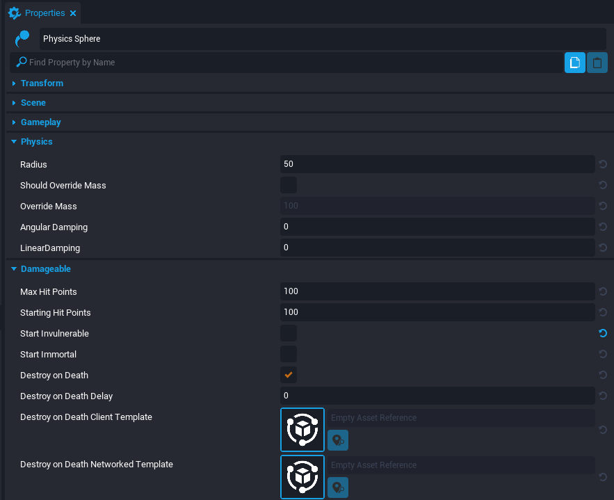
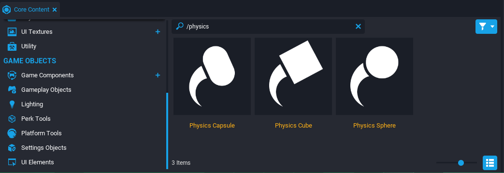
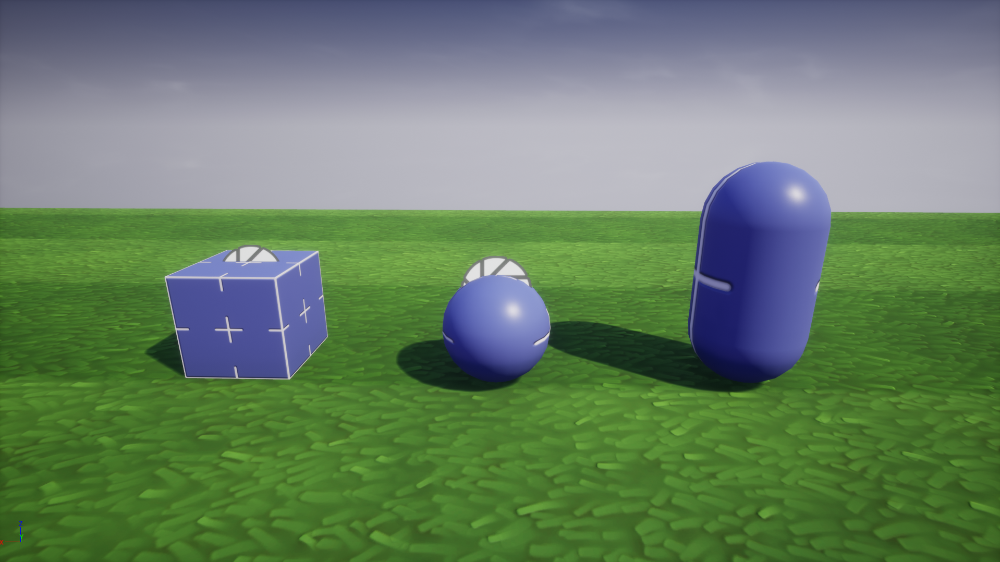

# Physics Objects

## Overview

The **Physics Object** is a [CoreObject](../api/coreobject.md) that has simulated physics to interact with gravity, players, and other objects. It also implements the [Damageable](../api/damageable.md) interface. This means it has properties, events, and functions for objects which can take damage and die.

By default, a **Physics Object** placed into the **Hierarchy** is [networked](../reference/networking.md). This means all clients will see the same physics simulation on the object. Although this is essential in most games, networked objects are the most performance-expensive type of object. They should only be used if necessary for the gameplay.

!!! tip "Network Dormancy"
    For further optimization of networked objects, look at the [dormancy](../tutorials/network_dormancy.md) feature which will make games more performant and utilize more networked behavior by only having certain networked objects replicate when needed.

A Physics Object's networking can be disabled and the object can be placed in a [Client Context](../api/contexts.md). This will cause the clients to see varying results when the object collides and simulates physics. It will also disable the object from receiving damage from networked weapons. Client-side physics is useful for visual effects similar to Debris Physics.

!!! note
    Physics Objects come with a child **ClientContext** that has a mesh shape. This mesh shape is only visual and does not affect the physics or collision of the Physics Object.

## Physics Objects Properties

**Physics Objects** have two important sections in the **Properties** window: Physics and Damageable.

{: .center loading="lazy" }

### Physics Section

The **Physics** section has properties to change the physical attributes of the object. This can be useful for changing the collision shape's size or the speed of the object.

| Property Name | Description | Notes |
| --- | --- | --- |
| Radius | The radius size of the Physics Sphere or the radius size of the Physics Capsule body. | Only available for Physics Sphere or Physics Capsule object. |
| Desired Length | The length of the Physics Capsule from opposing endcaps. | Only available for Physics Capsule object. Capped to at least twice the radius. |
| Cube Size | The size dimensions of the Physics Cube. | Only available for Physics Cube object. |
| Should Override Mass | Toggle to manually change the mass of an object. | A default mass is calculated and used if inactive. |
| Override Mass | The mass of the object if overriding default. | Mass measured in kilograms. |
| Angular Damping | Drag force added for angular (rotational) movement. | Greater value results in a quicker stop, zero value results in no change, and negative value results in more movement over time. |
| Linear Damping | Drag force added for linear (positional) movement. | Greater value results in a quicker stop, zero value results in no change, and negative value results in more movement over time. |

### Damageable Section

Physics Objects also implement **Damageable** properties. This can be useful to deal damage to the object and spawn a template when destroyed.

| Property Name | Description |
| ------------- | ----------- |
| Max Hit Points | Maximum hit points of the object. Values less than or equal to 0 will be ignored. |
| Starting Hit Points | The hit points of the object when the object is spawned. Cannot be greater than **Max Hit Points** or less than 0. |
| Start Invulnerable | When true, the object cannot take damage. |
| Start Immortal | The object doesn't automatically die when the hit points is less than or equal to 0. |
| Destroy on Death | If true, when the object dies, destroy the object. |
| Destroy on Death Delay | Time, in seconds, after the object dies when it will be automatically destroyed if **Destroy on Death** is true. |
| Destroy on Death Client TemplateId | Spawns the template on the client at the location of the Damageable after the death delay. This is the most efficient for visual-only effects. |
| Destroy on Death Networked TemplateId | Spawns a networked template at the location of the Damageable after the death delay. This is useful for spawning gameplay from a destroyed Damageable. |

## Adding Physics Objects

### Find Physics Object

**Physics Objects** can be found in the **Core Content** under the **Gameplay Objects** section. There are three different shapes available: capsule, cube, and sphere.

{: .center loading="lazy" }

### Add Physics Object

Select a **Physics Object** and drag it into the Scene or **Hierarchy** to add it to the project.

{: .center loading="lazy" }

!!! warning "Make sure to move the entire Physics Object and not just the child shape to avoid separation of the collision and mesh."

### Test the Physics

Play the project in **Multiplayer Preview Mode** and notice the physics among multiple clients.

    <video autoplay muted playsinline controls loop class="center" style="width:100%">
        <source src="/img/PhysicsObjects/PhysicsObjects_Test.mp4" type="video/mp4" />
    </video>

## Learn More

[Networking](../reference/networking.md) | [DamageableObject](../api/damageableobject.md) | [Contexts](../api/contexts.md) | [PhysicsObjects API](./api/physicsobject.md)
