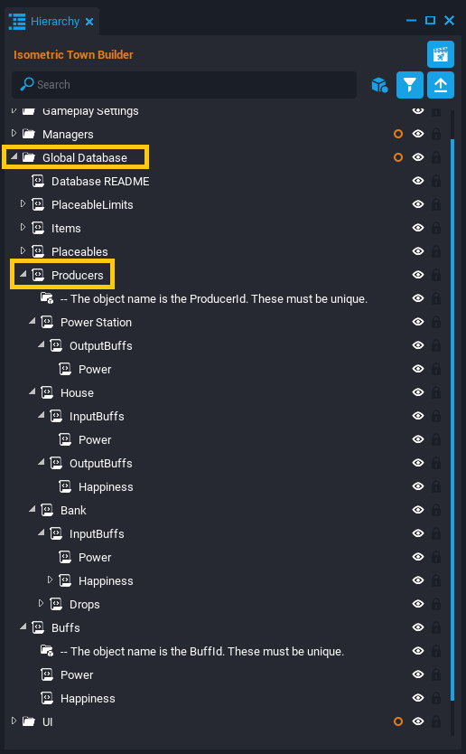
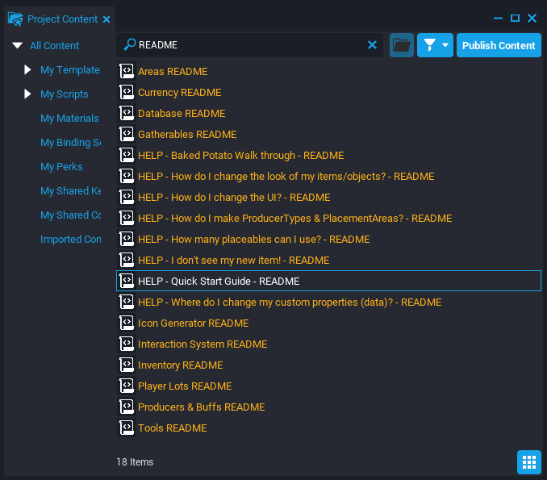

# Producers, Buffs and Areas Example

The **Producers, Buffs and Areas** Example Project builds on the [Gatherables and Inventory](gatherables.md) project to allow creators to design games around **producers** which transform items into different items over time, **buffs** which provide customizable restrictions on the producers, and **areas** which allow the world space to be divided into distinct pieces which can be loaded on demand.

These systems also use or depend on **gatherables**, **inventory**, **tools**, **currency**, and **databases** all of which you read about in the [Gatherables reference](gatherables.md).

## Creating a New Producers, Buffs and Areas Project

### Download from the CREATE Menu

The **Producers, Buffs and Areas** Example Project can be found in the **CREATE** menu alongside the Empty and Framework project options.

{: .center loading="lazy" }

1. In Core, click the **CREATE** tab at the top to open options for new and existing projects.
2. In the top bar menu of **CREATE**, select **NEW PROJECT**.
3. In the **EXAMPLE PROJECTS** section, select **Producers, Buffs and Areas**.
4. Give the project a name in the **Name** field and press the **CREATE** button.

### Contents of the Project

The project is divided into Scenes which showcase distinct ways the Producers, Buffs, and Areas systems can be used to create gameplay. To access the Scenes window, click **Window** in the top toolbar and select **Scenes**.

{: .center loading="lazy" }

#### Producers and Buffs

Open the main scene and hit play. Now find your player lot (signs are above the archways) and head over to explore it. You can explore the project example to example, reading the signs, and trying out the interactions.

#### Basic Camp Fire Example

This example has been stripped down just the parts used for the fire and cooking. Try everything out, then see if you can figure out how to add a new cookable food to the scene, lets say a potato. For further instructions, read the **Baked Potato Walkthrough** included in the Camp Fire Example.

#### Isometric Town Builder

<!-- vale Manticore.FirstPerson = NO -->
Look at the settings on the Power and Happiness Buffs, and then look over how the Producers are receiving and giving off the Buffs. You can try adding a coal mine that needs to give off a fuel Buff for the power plant to receive before it can give off power.
<!-- Vale.Manticore.FirstPerson = YES -->
{: .center loading="lazy" }

#### Producer and Buff Data Example

This example has all the possible data you can add to Producers and Buffs, as well as some small scripts that can make visible changes to your objects when Buffs are detected. If you are ever unsure what kinds of data you can put under something, this is a good scene to check.

It also has an example of just using a regular placed item that is not a Producer to give off a Buff (the statue). Look inside **Producer Base - Square Dirt (Client)** to find examples of little scripts that can react to Buffs.

#### Areas and Player Lots

Every example has **Player Lots** in it. They are needed to store which items the Player has placed in the world and what state they are in. They can also be used and combined with Areas in more advanced ways.

!!! hint Using Areas to Reduce Object Count
    Areas can be used without Player Lots. They are a way to load up art when you go through a portal to a new place. For example, you could have the furniture in your castle not load until a player visits. This will greatly reduce your scene object counts.

There are several examples of different lot/area combinations in this scene. If you are wondering what loads up the objects and how to specify the templates, trying looking for **Area Object Loader** and **Player Lot Object Loader** and then check the custom properties.

### Finding Project Instructions

There are detailed readmes for all of the systems used in the **Producers, Buffs and Areas** scenes. You can find all the internal documentation by opening the **Project Content** window and searching for `README`. The **HELP - Quick Start Guide - README** file can give you an idea of how to start, and direct you through the other resources available.

{: .center loading="lazy" }

---

## Learn More

[Gatherables Reference](gatherables.md) | [Scenes Reference](scenes.md) | [Templates Reference](templates.md) | [Interaction System Reference](interaction_system.md)
