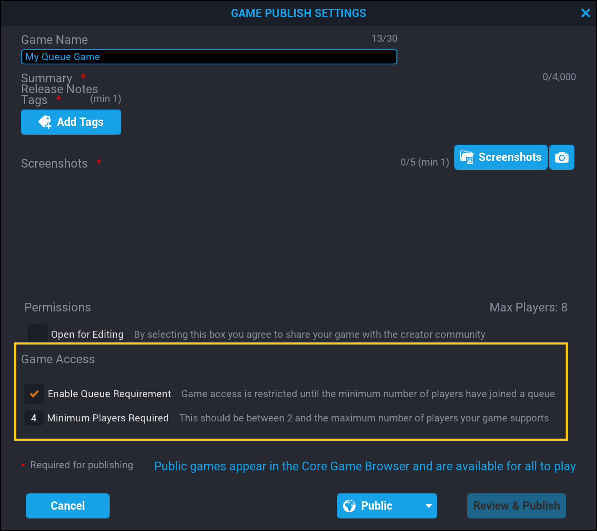
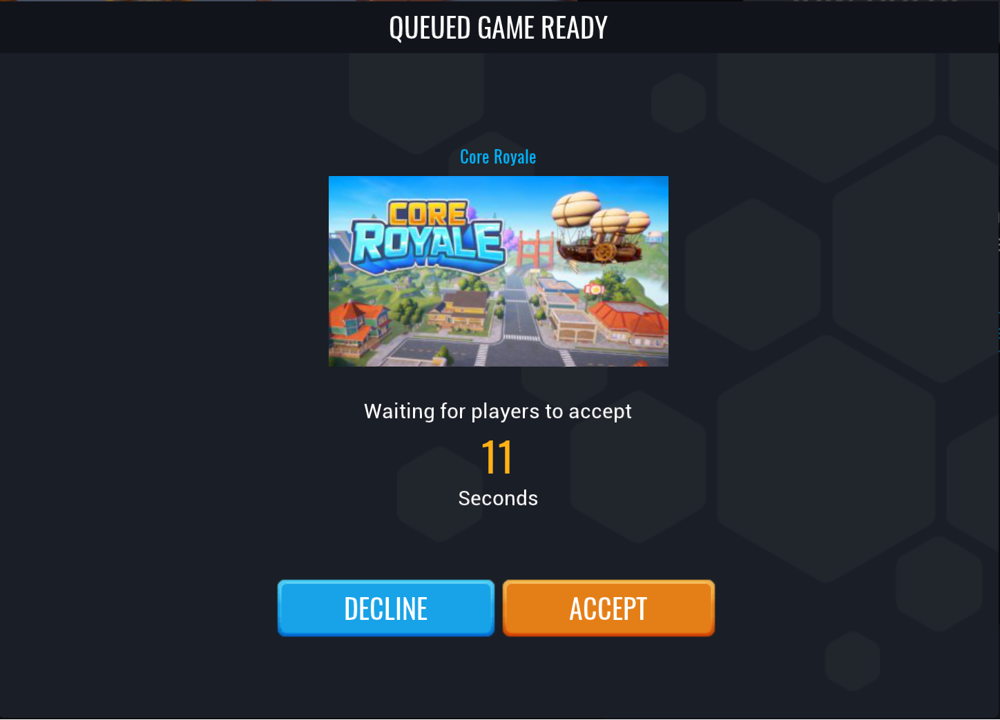

# Queued Games

## Overview

**Queues** allow creators to design games that are best played with a specific minimum number of players, without making the players wait around for more people to play. When players press **Play** to join a queued game, they can continue playing other games, or customizing characters until the minimum number of players is reached.

## Enabling Queueing

You can enable queueing for a game through the **Publish Menu**. Check the box labeled **Enable Queue Requirement** and specify the minimum number of players needed to play the game.

{: .center loading="lazy" }

## Player Experience

### Joining Queues

The process for joining a queued game is exactly the same as any other from a player perspective. When a player presses the play button, they will be added to a queue, and will display in their friends' lists as "Queing for ..." the game selected.

{: .center loading="lazy" }

Queueing players can access the **Game Queue Menu** in the same area as the **Friends** list to see all the games that they are currently queueing for.

{: .center loading="lazy" }

### Joining a Game

Once one of the queued games reaches the minimum number of players, players will see a pop-up menu with **QUEUED GAME READY** and options to **Decline** or **Accept** joining the game. If the game already has an instance with players that is not at maximum capacity, players will instantly join the game.

{: .center loading="lazy" }

Once a player joins a Queued game, they will be removed from all other game queues.

---

## Learn More

[The **isQueueEnabled** property in the Core API](../api/coregameinfo.md) | [Interconnected Games](interconnected_games.md)
