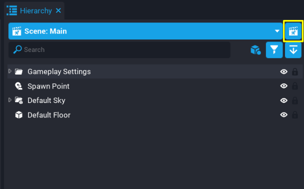
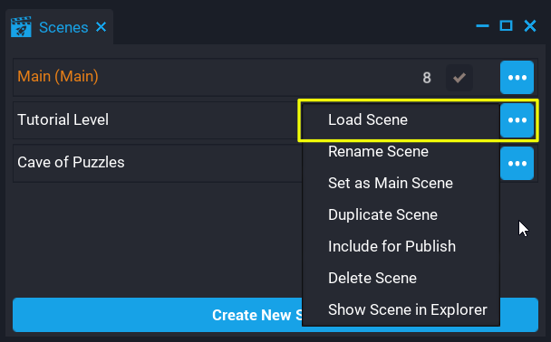
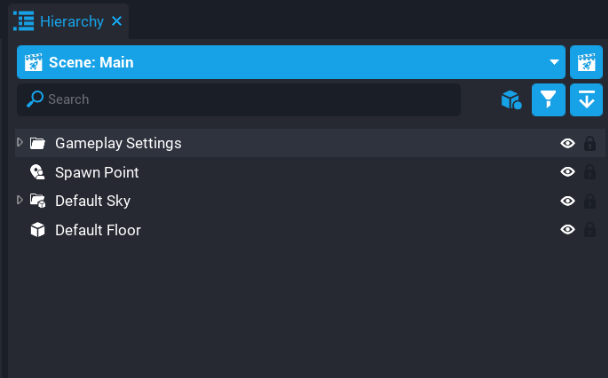
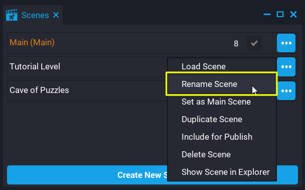
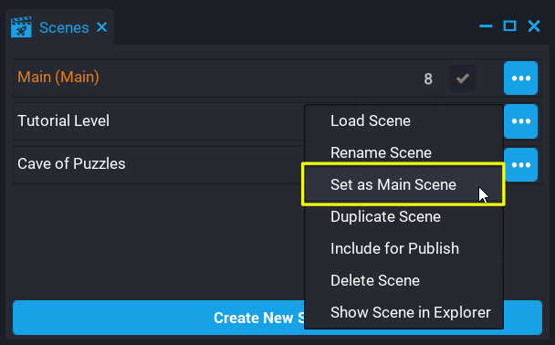
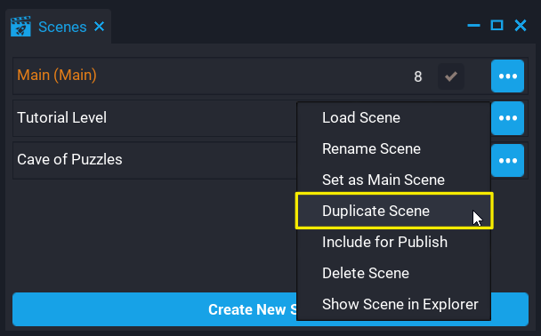
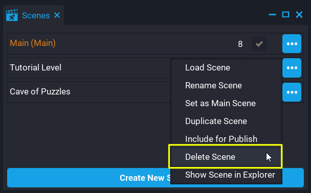
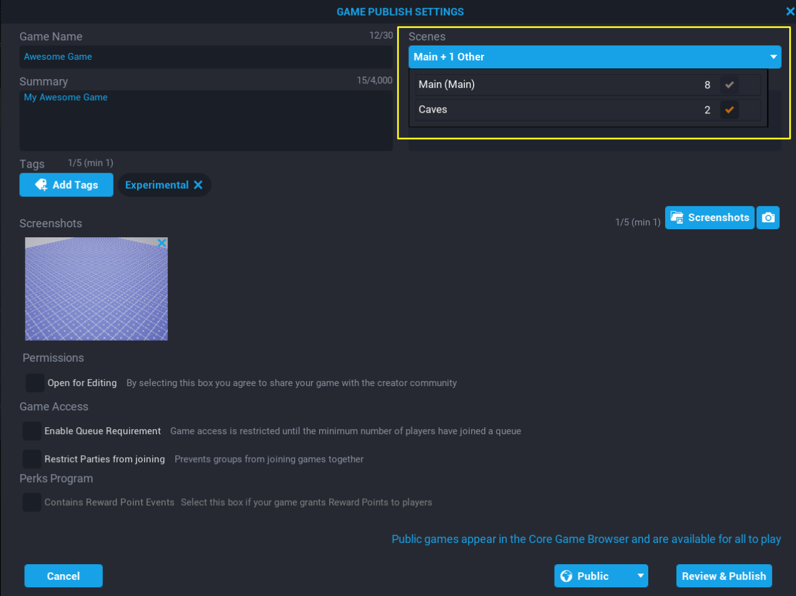

# Scenes

## Summary

A **Scene** is a way to have different assets and logic for a specific part of the game. Games can have many scenes (for example main menu, tutorial, different levels) that display different information, and usually, there is some way for a **Player** to get from one scene to the other.

All projects come with one scene by default called **Main**. This **Main** scene is active by default.

## Creating a Scene

Creators can create new scenes from the **Scenes** window. Clicking on the **Scenes** button at the top of the **Hierarchy** will open a window that will show a list of all scenes for the project, and a **Create New Scene** button at the bottom of that list.



*Scenes button (left), Scenes window (right)*
{: .image-cluster}

1. Open the **Scenes** window.
2. Click the **Create New Scene** button at the bottom of the **Scenes** window.
3. Enter a name for the new scene.

A newly created scene will give creators the option to choose to load that scene.

!!! info "Limits"
    - Support for up to 64 scenes per project.
    - Maximum total size of a game is 500 Megabytes.
    - Maximum size of a scene is 100 Megabytes.

## Loading a Scene

When loading a **Scene**, **Core** will unload all assets in the project **Hierarchy** (that is template instances, script instances, UI), and load all the assets for the scene that will be loaded. When loading a scene, make sure to save the current scene or progress will be lost. **Core** will notify the creator of any unsaved changes when attempting to switch scenes.

A **Scene** can be loaded by clicking on the scene name in the **Scene** window.

There are 2 other ways to load a scene:



*Option panel from the Scenes Window (left), Scenes dropdown in the Hierarchy (right)*
{: .image-cluster}

## Setting Max Players Per Scene

Each scene can have a different maximum amount of players allowed. For example, a social space scene could have 32 players, whereas another scene in your game could have 4 players.

Changing the maximum amount of players per scene can be done by loading the scene first, and then changing the **Max Players** field value. The **Scenes** window displays the maximum amount of players set for each scene.

{: .center loading="lazy" }

## Renaming a Scene

Any scene in the project can be renamed. Scenes can't share the same name as each other. If a scene is renamed to the same name as an existing scene in the project, then that new name will be appended an index. For example, if there is already a scene named "Tutorial", renaming another scene to "Tutorial" will be named "Tutorial_1".

1. Open the **Scenes** window.
2. Click the button to the right of the scene.
3. Click **Rename Scene** from the options menu and set the new name for the scene.

{: .center loading="lazy" }

## Setting the Main Scene

The main scene for a project is the scene that will be loaded for players by default when entering your game. Any scene created can be set up as the main scene for the project. For example, if there are 2 scenes that have a different theme (that is Christmas vs Summer), it is easy to change which scene is the main one and republish your project. When players load your game, they will load the main scene first.

1. Open the **Scenes** window.
2. Click the button to the right of the scene.
3. Click **Set as Main Scene** from the options menu.

After a scene has been set as the main scene, the name of that scene will also contain the text **Main** to indicate that scene is now the main scene for your project.

Scenes set to **Main Scene** will also be the first scene loaded when loading your project.

{: .center loading="lazy" }

## Duplicating a Scene

Duplicating a scene is a good way to use an existing scene as a base. All assets in the scene being duplicated will be copied over to the new scene. For example, creating a tutorial based on the first level of your game without needing to start a new scene from scratch.

When duplicating a scene, **Core** will name the duplicated scene the same name as the scene being duplicated but append an index to the end so it is unique. For example, duplicating the scene "Opening Level" will be named "Opening Level_1".

1. Open the **Scenes** window.
2. Click the button to the right of the scene.
3. Click **Duplicate Scene** from the options menu.

{: .center loading="lazy" }

## Include for Publish

Scenes can be included or excluded when publishing a game. This can be done from the **Scenes** window by clicking on the checkbox, or by selecting from the options menu.

If a scene is already set to **Include for Publish**, the option will change to **Exclude from Publish**.

1. Open the **Scenes** window.
2. Click the button to the right of the scene.
3. Click **Include for Publish** from the options menu.

{: .center loading="lazy" }

## Deleting a Scene

To delete a scene from your project, it can not be currently loaded or set as the main scene. When deleting a scene, all objects in the **Hierarchy** will be deleted. Objects such as template instances (including script instances) will be deleted from the **Hierarchy**, but not from **Project Content**. This means, any changes to a template that needs to be kept, should be updated before the scene is deleted.

!!! info "**Core** will confirm if the scene should be deleted."

1. Open the **Scenes** window.
2. Click the button to the right of the scene.
3. Click **Delete Scene** from the options menu.

{: .center loading="lazy" }

## Show Scene in Explorer

Each scene created is a physical folder on your system. Only scenes that have been saved can be revealed in the explorer.

1. Open the **Scenes** window.
2. Click the button to the right of the scene.
3. Click **Show Scene in Explorer** from the options menu.

{: .center loading="lazy" }

## Publishing Scenes

Publishing a game will allow creators to select which scenes to publish. If no scenes have been created, then the main scene will be selected by default. If there are new scenes added to your project, those scenes will need to be ticked in the **Scenes** window, or from the publishing window.

Click on the **Publish Game** button to bring up the **Game Publishing Settings**.

{: .center loading="lazy" }

The **Game Publishing Settings** window has a **Scenes** dropdown where creators can select which scenes should be included when publishing.

!!! info "When publishing any scenes that isn't the main scene, **Core** will only publish the assets used for that scene."

{: .center loading="lazy" }

## Transferring to a Scene

Transferring players between scenes can be done by calling `TransferToScene`. When calling this function, the scene name must be passed and must be named exactly as the scene is named.

!!! warning "`TransferToScene` does not work in preview mode or games played locally."

Below is an example. When a player overlaps the trigger, they will be transferred to the **Tutorial** Scene.

```lua
local TRIGGER = script:GetCustomProperty("trigger"):WaitForObject()

-- Name of scene to transfer too
local sceneName = "Tutorial"

-- Transfer player when they overlap the trigger
function OnOverlap(trigger, other)
    if other:IsA("Player") then
        other:TransferToScene(sceneName)
    end
end

TRIGGER.beginOverlapEvent:Connect(OnOverlap)
```

`TransferToScene` supports a second argument that allows creators to specify the spawn point based on a matching key. If no match is found, then players will spawn at the origin, (0, 0, 0).

```lua
other:TransferToScene(sceneName, {spawnKey = "TutorialArea"})
```

## Storage

Any data stored in **Storage** is transferred to the scene loaded. For example, if a player has inventory data, this means the scene can look at the **Storage** for the player to retrieve that data without needing to use a **Shared Storage Key**.

## Leaderboards

Any **Leaderboard** setup for your project will be available to all your scenes. For example, if there is a score that persists between scenes, then this can be submitted to a **Leaderboard** from any scene within your project.

## Parties

If players are in a party, and the party leader has the option **Play with Party** enabled, then when using `TransferToScene`, all party members will be transferred if the number of players in the party does not exceed the maximum players allowed for the scene.

## Migrating from Child Games to Scenes

Creators that have been using our Child Games system previously, [here's how to convert](https://forums.coregames.com/t/migrating-from-child-games-to-scenes/1900) to the new **Scenes** system.

## Learn More

[TransferToScene](../api/player.md) | [TransferAllPlayersToScene](../api/game.md) | [GetCurrentSceneName](../api/game.md)
