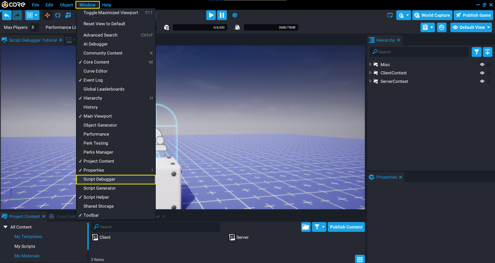
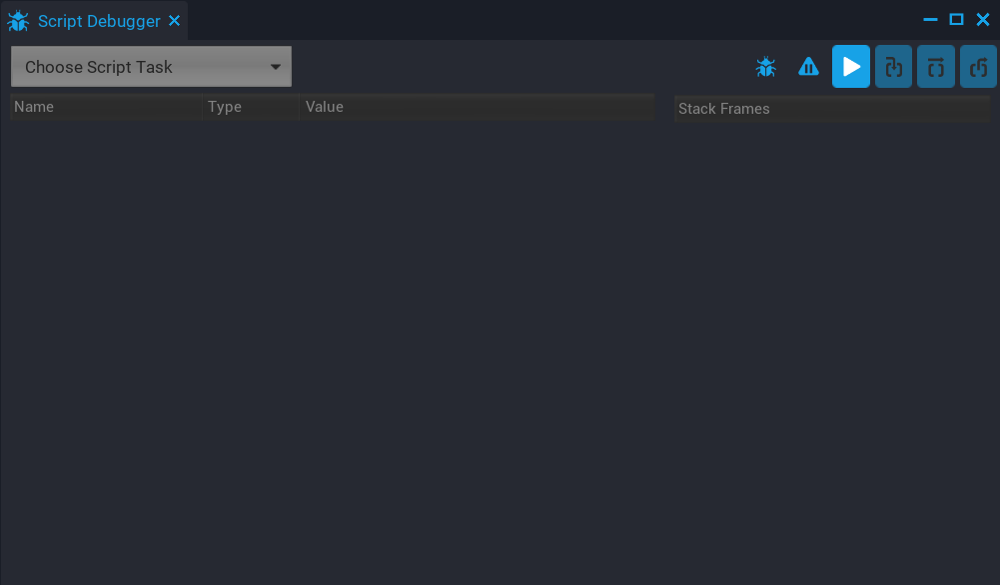
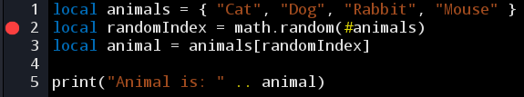
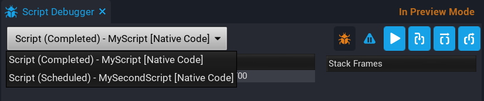
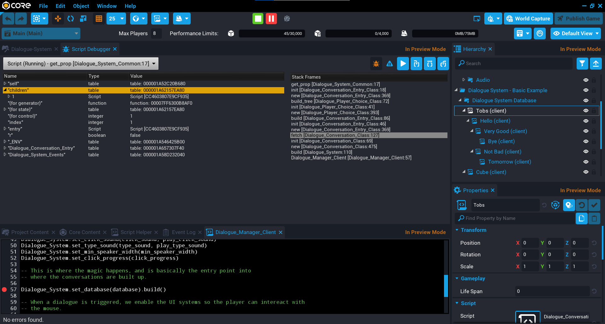

# Script Debugger

## Overview

The **Script Debugger** can help narrow down which lines of code have issues or bugs by allowing creators to pause script execution and move specifically through different lines of Core Lua scripts.

A common way to debug a game to find issues or bugs, is to use the `print` function to print out values to the **Event Log**.

## Opening the Script Debugger

From the **Window** menu, select **Script Debugger** to open up the **Script Debugger** window.

!!! info "Script Debugger and External Editors"
    The **Script Debugger** only works with the **Script Editor** in Core, and not external editors.

{: .image-cluster}

## Enabling the Script Debugger

The **Script Debugger** needs to be enabled so that breakpoints added will pause the execution of the game. This allows areas of interest in a script to be inspected that may contain an issue.

Clicking on the icon will enable the **Script Debugger**. When enabled, the icon will turn red , indicating that the **Script Debugger** is enabled. With the **Script Debugger** now enabled, any breakpoints added will pause execution of the game.
{: .image-inline-text .image-background }

!!! info "When disabling the **Script Debugger**, all breakpoints will also be disabled. This allows creators to disable all breakpoints without removing them. Next time the **Script Debugger** is enabled, the breakpoints will also be enabled."

## Enabling Pause on Error

The **Script Debugger** has the option to automatically pause the game when an error has occurred. This can be useful to have enabled when scripts in a game are causing an error. Clicking on the  icon will change to red , indicating that the **Script Debugger** will pause on error.
{: .image-inline-text .image-background }

## Adding and Removing Breakpoints

A breakpoint is a way to mark a specific line in a script for debugging. More than one marker can be set in a script, but only one can be set for each line. Markers can be set by left clicking with the mouse in the far left margin of the **Script Editor**.

### Adding a Breakpoint

A breakpoint can be added so the **Script Debugger** knows where to pause execution. Adding a breakpoint can be done by left clicking with the mouse in the far left margin of the **Script Editor**. On clicking in the margin, a red circle will be added to the margin, indicating that line has a breakpoint.

{: .center loading="lazy" }

### Removing a Breakpoint

Removing a breakpoint works the same way as adding a breakpoint. Clicking on the red circle in the far left margin of **Script Editor** will remove the breakpoint. When the game is played, the **Script Debugger** will not pause execution if no breakpoints are present.

## Stepping Through a Script

When script execution is paused, the **Script Debugger** can step through the script to examine line by line to inspect variables and objects to help find issues and bugs.

### Step Into

**Step Into** can be used to step through a script line by line. If the line contains a function, the **Script Debugger** will enter that function and continue line by line.
{: .image-inline-text .image-background }

### Step Over

**Step Over** will execute as one complete step. For example, if the current line is a function, then stepping over that function will move to the next line instead of stepping through each line of that function.
{: .image-inline-text .image-background }

### Step Out

**Step Out** is used to step out of a function. The **Script Debugger** will execute the current function, and pauses at the first line outside of that function.

For example, when part of a function needs to be debugged, stepping out will tell the **Script Debugger** to run the rest of that function.
{: .image-inline-text .image-background }

## Select a Running Script Task

The **Script Debugger** will pause execution for any scripts that have breakpoints set. The **Script Task** dropdown lists all the scripts that are either running, scheduled, or completed. Only scripts that are running can be stepped through.

The **Script Task** drop down will list all the scripts, and also indicate which one is currently running, scheduled, and which have completed.

{: .center loading="lazy" }

!!! warning "Script execution order in preview will not necessarily be the same for the public version of your game."

## Stack Frames

The **Stack Frames** panel in the **Script Debugger** window, shows the function calls that are currently on the stack for the current running script task. The **Stack Frames** panel shows the order in which the functions are getting called, which is a good way to see the execution flow of the script for the current task.

In the picture below, you can see the execution flow for the current running script.

{: .center loading="lazy" }

## Learn More

[Intro to Scripting](../tutorials/scripting_intro.md) | [Lua Scripting Tutorial](../tutorials/lua_basics_helloworld.md) | [Advanced Scripting in Core](../tutorials/race_timer.md) | [Performance Panel](../getting_started/performance_panel/) | [AI Activity Tutorial](tutorials/ai_activity_tutorial/)
