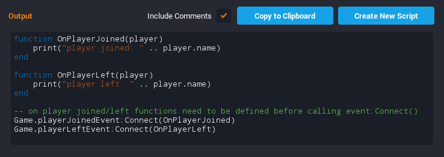
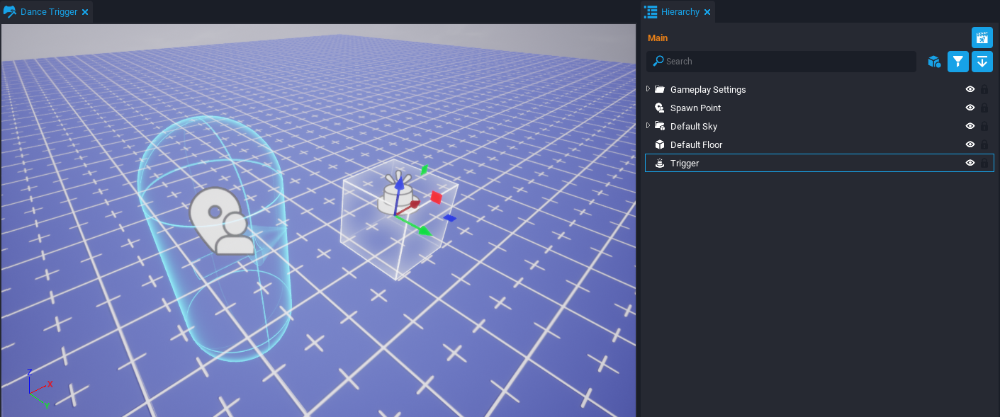
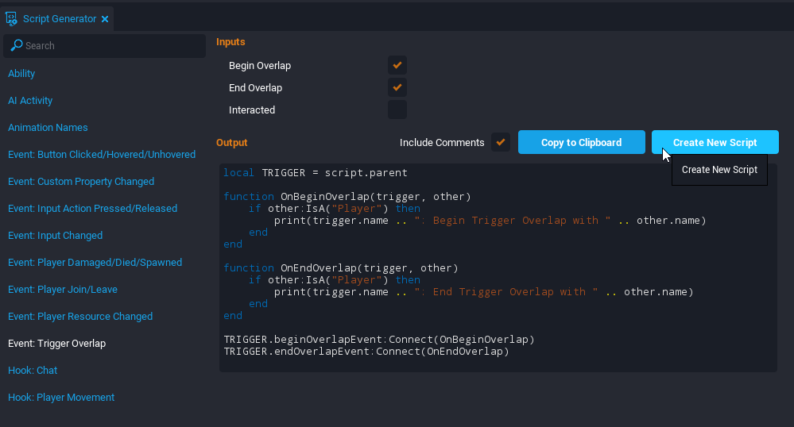
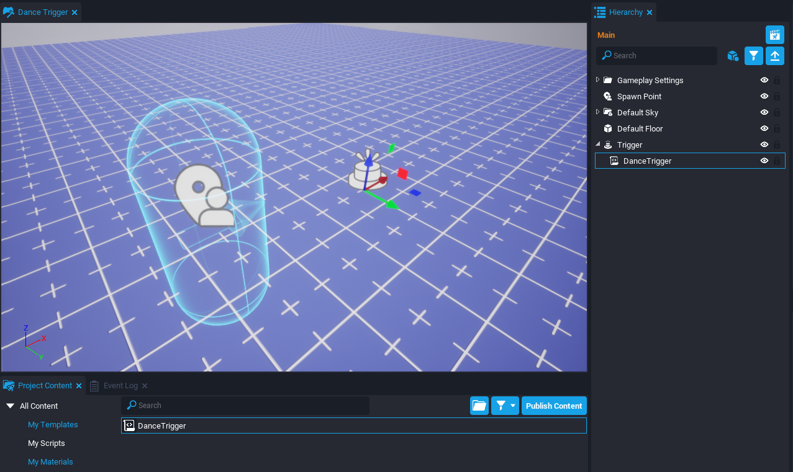
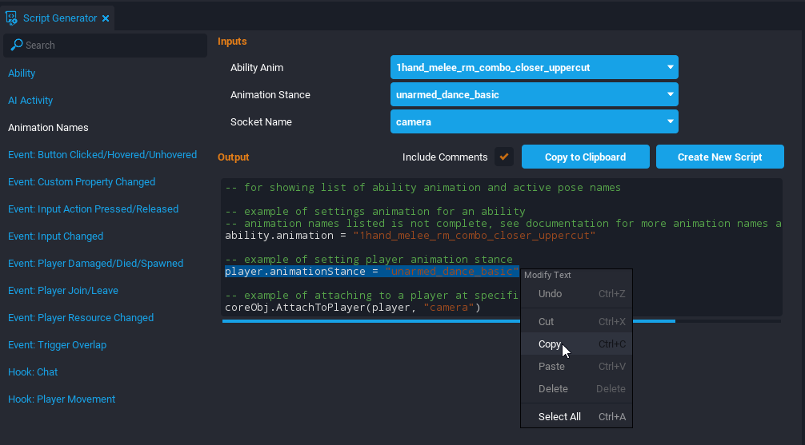
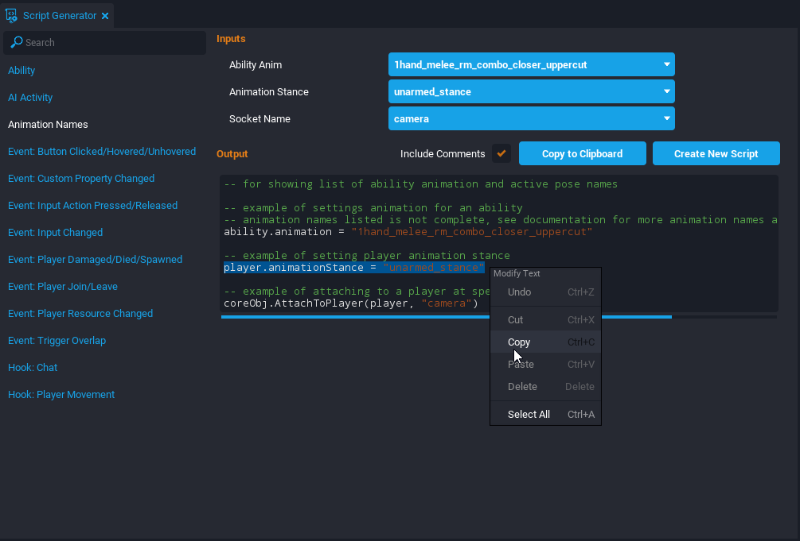

# Script Generator

## Overview

The **Script Generator** is a window in the Core Editor that has a number of sample [Scripts](../api/script.md) that can be used for common patterns. It is a great tool for scripting beginners to understand how to implement basic functionality. It is also helpful for advance users to easily add code that is frequently used. There are different types of scripts that can be generated and most of them use the **Event Log** to print default messages for testing.

## Script Generator Window

### The Window Location

There are two main ways to open the Script Generator window. The first method is to click the **Script** button {: .image-inline-text .image-background } and select **Open Script Generator**. The second method is to open the **Window** dropdown and select **Script Generator**.

<div class="mt-video" style="width:100%">
    <video autoplay muted playsinline controls loop class="center" style="width:100%">
        <source src="/img/ScriptGenerator/ScriptGenerator_Window.mp4" type="video/mp4" />
    </video>
</div>

### The Window Layout

The Script Generator window has three main sections.

1. A menu on the side to choose the **type** of script.
2. **Input** options to change the script.
3. The **output** code and some buttons to use the code.

!!! info "Some types of scripts do not have input options."

{: .center loading="lazy" }

#### Script Generator Types

The Script Generator has thirteen different types of scripts available. Some script types have suggested **parent objects** for the generated script to work properly.

| Script Generator Type | Description | Suggested Parent |
| --- | --- | --- |
| Ability | Creates functions that connect to the start of each phase for an Ability. Also has a function connecting to the Tick event of the Ability. | The Ability object. |
| AI Activity | Creates a table of functions that defines a new AIActivity to be managed by an AIActivityHandler. | The AIActivityHandler object. |
| Animation Names | Three examples for setting an Ability's Animation, setting a player's Animation Stance, and attaching an object to a player's Socket. | Depends on the example. |
| Event: Button Clicked/Hovered/Unhovered | Creates three functions that connect to the events of a UI Button being clicked, hovered, and unhovered by the mouse. | The UIButton object. |
| Event: Custom Property Changed | Creates a function that connects the event of a Networked object's custom property being changed. | The Networked object. |
| Event: Input Action Pressed/Released | Creates two functions that connects the event of a player pressing or releasing a binded action. | Depends on the example. |
| Event: Input Changed | Creates a function that connects to the event of the player changing the input (such as switching to keyboard and mouse). | Depends on the example. |
| Event: Player Damaged/Died/Spawned | When the player joins the game, it connects three functions for taking damage, dying, and spawning event. | Server context. |
| Event: Player Join/Leave | Creates two functions that connect to the events of a Player joining and leaving the game. | Server context. |
| Event: Player Resource Changed | When the player joins the game, it connects a function to a resource changing event. | Server context. |
| Event: Trigger Overlap | Creates three functions that connect to the events of a Trigger beginning an overlap, ending an overlap, and being interacted. | The Trigger object. |
| Hook: Chat | Creates a hook function that is called when receiving a chat message from a player. | Depends on the example. |
| Hook: Player Movement | Creates a hook function that is called when processing a player's movement. | Client context. |

#### Script Generator Input Options

Depending on the type of script, there may be options available to change the script to a creator's preference. One example is the **Ability** script type has options to include or exclude functions that connect to certain ability events. Another example is the **Animation Names** script type has a dropdown menu to choose an animation stance for the player.

!!! warning "The Animation option list is not complete, but the [Animations API](../api/animations.md) has all the animation names."

{: .center loading="lazy" }

#### Script Generator Output Code

The output section has the generated code that creators can highlight and copy. There are also three buttons above the script preview.

1. **Include Comments** checkbox will toggle comments that explains parts of the generated code.
2. **Copy to Clipboard** button copies the entire script to the clipboard. The script can be pasted using ++Ctrl+W++.
3. **Create New Script** button creates a new script with all the preview code inside of it.

{: .center loading="lazy" }

## Creating a Dance Trigger

This example will be using the **Script Generator** to make a script that uses a [Trigger](../references/triggers.md) to change a player's animation stance. The player starts dancing when it enters the trigger and stops dancing when it exits the trigger.

### Add a Trigger

Open the **Core Editor** to a new blank project. Add a **Trigger** object by pressing the keyboard shortcut ++9++. Move the trigger to be in front of the **Spawn Point** of the player.

!!! tip "Use the keyboard shortcut ++V++ to display Gizmos if the Trigger and Spawn Point are not visible."

{: .center loading="lazy" }

### Create the DanceTrigger Script

Open the **Window** dropdown menu and select **Script Generator** to open the Script Generator window. Set the **Script Type** to **Event: Trigger Overlap**. In the **Input** options, deactivate the **Interacted** checkbox. Then click the **Create New Script** button and name the script `DanceTrigger`.

{: .center loading="lazy" }

### Parent the DanceTrigger Script

Open the **Project Content** window and search for the **DanceTrigger** script. Drag and drop the script into the **Trigger** object inside the **Hierarchy** window.

!!! info "The script needs to be a child of the Trigger because the code tries to reference the Trigger as the parent."

{: .center loading="lazy" }

### Test the Trigger

The generated **DanceTrigger** script has code that will print messages to the **Event Log** when a player begins and ends an overlap with the trigger. Open the Event Log window and preview the project. Then notice if any messages are printed when the player overlaps the trigger.

<div class="mt-video" style="width:100%">
    <video autoplay muted playsinline controls loop class="center" style="width:100%">
        <source src="/img/ScriptGenerator/ScriptGenerator_Trigger.mp4" type="video/mp4" />
    </video>
</div>

### Copy the Animation Names Script

Open the **Script Generator** window and select the **Animation Names** script type. Set the **Animation Stance** option to **unarmed_dance_basic**. Select the line of code that changes the player's animation stance in the **Script Preview** section and copy it using the keyboard shortcut ++Ctrl+C++.

```lua
player.animationStance = "unarmed_dance_basic"
```

{: .center loading="lazy" }

### Paste the Copied Script

In the **Hierarchy**, right click the **DanceTrigger** script and select **Edit Script** to open the **Script Editor**. Underneath the print statement inside the `OnBeginOverlap` function, paste the copied code. In the pasted code, change the `player` variable to be named `other`.

```lua hl_lines="6"
local TRIGGER = script.parent

function OnBeginOverlap(whichTrigger, other)
    if other:IsA("Player") then
        print(whichTrigger.name .. ": Begin Trigger Overlap with " .. other.name)
        other.animationStance = "unarmed_dance_basic"
    end
end
```

??? "DanceTrigger"
    ```lua
    local TRIGGER = script.parent

    function OnBeginOverlap(whichTrigger, other)
        if other:IsA("Player") then
            print(whichTrigger.name .. ": Begin Trigger Overlap with " .. other.name)
            other.animationStance = "unarmed_dance_basic"
        end
    end

    function OnEndOverlap(whichTrigger, other)
        if other:IsA("Player") then
            print(whichTrigger.name .. ": End Trigger Overlap with " .. other.name)
        end
    end

    TRIGGER.beginOverlapEvent:Connect(OnBeginOverlap)
    TRIGGER.endOverlapEvent:Connect(OnEndOverlap)
    ```

!!! info "The `player` variable needs to be changed because in the `OnBeginOverlap` function there is a parameter named `other` that is referencing the Player overlapping the Trigger."

### Copy the Animation Names Script

Open the **Script Generator** window and select the **Animation Names** script type. Set the **Animation Stance** option to **unarmed_stance**. Select the line of code that changes the player's animation stance in the **Script Preview** section and copy it using the keyboard shortcut ++Ctrl+C++.

```lua
player.animationStance = "unarmed_stance"
```

{: .center loading="lazy" }

### Paste the Copied Script

In the **Hierarchy**, right click the **DanceTrigger** script and select **Edit Script** to open the **Script Editor**. Underneath the print statement inside the `OnEndOverlap` function, paste the copied code. In the pasted code, change the `player` variable to be named `other`.

```lua hl_lines="4"
function OnEndOverlap(whichTrigger, other)
    if other:IsA("Player") then
        print(whichTrigger.name .. ": End Trigger Overlap with " .. other.name)
        other.animationStance = "unarmed_stance"
    end
end
```

??? "DanceTrigger"
    ```lua
    local TRIGGER = script.parent

    function OnBeginOverlap(whichTrigger, other)
        if other:IsA("Player") then
            print(whichTrigger.name .. ": Begin Trigger Overlap with " .. other.name)
            other.animationStance = "unarmed_dance_basic"
        end
    end

    function OnEndOverlap(whichTrigger, other)
        if other:IsA("Player") then
            print(whichTrigger.name .. ": End Trigger Overlap with " .. other.name)
            other.animationStance = "unarmed_stance"
        end
    end

    TRIGGER.beginOverlapEvent:Connect(OnBeginOverlap)
    TRIGGER.endOverlapEvent:Connect(OnEndOverlap)
    ```

### Test the Project

Save the **DanceTrigger** script and preview the project. The player's animation stance should now change when entering and exiting the trigger.

<div class="mt-video" style="width:100%">
    <video autoplay muted playsinline controls loop class="center" style="width:100%">
        <source src="/img/ScriptGenerator/ScriptGenerator_Final.mp4" type="video/mp4" />
    </video>
</div>

## Learn More

[Getting Started](../getting_started/editor_intro.md) | [Triggers](../references/triggers.md) | [Animations API](../api/animations.md) | [Intro to Scripting](../tutorials/scripting_intro.md) | [Lua Scripting Tutorial](../tutorials/lua_basics_helloworld.md) | [Advanced Scripting in Core](../tutorials/race_timer.md)
