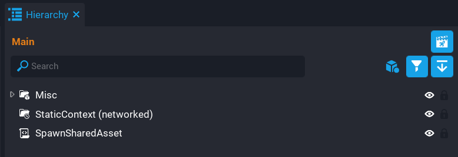

# Spawned Shared Assets

## Overview

 Shared Assets are a limited form of [`World.SpawnAsset()`](../api/world.md) that enable certain networked behavior very cheaply. The functions [`SpawnSharedAsset`](../api/networkcontext.md) and [`DestroySharedAsset`](../api/networkcontext.md) can only be called on the server, and the spawned object will exist on both the server and client. However, these are very much cheaper than networked objects. The object once spawned cannot be modified, like other objects within a static context. The only option parameters available are transform, position, rotation, and scale.

!!! tip "Network Dormancy"
    For more control on when a networked object should be replicated, consider using the [dormancy](../tutorials/network_dormancy.md) feature. This gives creators more control on when a networked object should be updated, which will make games more performant and utilize more networked behavior.

## Spawning Shared Assets

Spawned shared assets need to be spawned into a networked **Static Context**, otherwise, an error will occur if called on a non-networked Static Context or a Static Context that is a descendant of a **Client Context** or **Server Context**.

Below is an example of spawning a shared asset using `SpawnSharedAsset`, then after 2 seconds it is destroyed using `DestroySharedAsset` by passing in the shared asset to destroy.

```lua
local ASSET = script:GetCustomProperty("Asset")
local STATIC_CONTAINER = script:GetCustomProperty("StaticContainer"):WaitForObject() -- (1)

local obj = STATIC_CONTAINER:SpawnSharedAsset(ASSET) -- (2)

Task.Wait(2) -- (3)

STATIC_CONTAINER:DestroySharedAsset(obj) -- (4)
```

1. Networked **Static Context**.
2. Spawn shared asset and store a reference in the variable `obj` so it can be destroyed later.
3. Wait 2 seconds which pauses the script.
4. Destroy the shared asset by passing in the `obj` reference.

{: .center loading="lazy" }

## Learn More

[NetworkContext API](../api/networkcontext.md) | [World API](../api/world.md) | [Networking](../references/networking.md)
