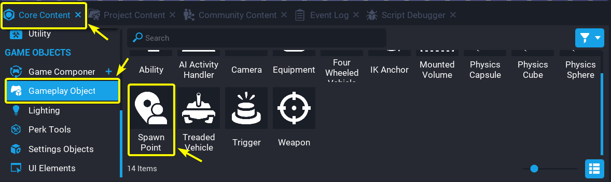

<style>
    .md-typeset table:not([class]) td {
        vertical-align: middle;
        width: 50%;
    }
</style>

# Spawn Point Reference

## Overview

**Spawn Points** represent locations that a player can spawn or respawn at. The **Spawned Settings** object is used to determine which **Spawn Point** a player will spawn/respawn at.

## Spawn Points

## Create a Spawn Point

The **Spawn Point** object can be found in the **Settings Objects** tab of the **Core Content** window. Drag the **Spawn Point** asset into the **Main Viewport** to create a **Spawn Point** object.

{: .center loading="lazy" }

<div class="mt-video">
    <video autoplay loop muted playsinline poster="/img/EditorManual/Abilities/Gem.png" class = "center" style="width: 50%">
        <source src="/img/SpawnPointReference/DragSpawnPointIntoViewport.mp4" type="video/mp4" />
    </video>
</div>

### Properties

The **Team** property determines what team the players that spawn at this spawn point will be on.

The **Key** property acts as an identifier for a spawn point. The value of the **Key** does not have to be unique, multiple spawn points can share the same **Key** value. When using the `Spawn` command a `spawnKey` parameter can be passed into the `Spawn` command. An example of how the `spawnKey` parameter is used, can be found below.

```lua
function OnJoin(player)
    player:Spawn({spawnKey="Spawn Key 1"})
end

Game.playerJoinedEvent:Connect(OnJoin)
```

The code snippet above will cause all players that join the game to randomly spawn at a spawn point with a **Key** value of "Spawn Key 1".

The **Player Scale Multiplier** controls how much larger or smaller players will be when they spawn at this spawn point. A value greater than 1 will make the players larger. A value smaller than 1 will make the players smaller.

The **Spawn Template** property is an asset reference property that refers to an asset that will be spawned whenever a player spawns at this spawn point.

## Spawn Settings

### Create Spawn Settings

The **Spawn Settings** object can be found in the **Settings Objects** tab of the **Core Content** window. Drag the **Spawn Settings** asset into the **Hierarchy** window to create a **Spawn Settings** object.

{: .center loading="lazy" }

<div class="mt-video">
    <video autoplay loop muted playsinline poster="/img/EditorManual/Abilities/Gem.png" class = "center" style="width: 50%">
        <source src="/img/SpawnPointReference/DragSpawnSettingsIntoHierarchy.mp4" type="video/mp4" />
    </video>
</div>

### Properties

#### Spawn Properties

The **Start Spawned** property determines if players should automatically spawn when they join the game.

The **Spawn Key** property specifies what spawn points can be used. Only spawn points with matching key values to **Spawn Key** will be considered by the **Spawn Settings** object when players are spawning.

#### Respawn Properties

The **Respawn Key** property specifies what spawn points can be used. Only spawn points with matching key values to **Respawn Key** will be considered by the **Spawn Settings** object when players respawn.

The **Respawn Delay** property determines how long players will have to wait before the player is respawned.

#### Spawn Mode and Respawn Mode options

There are seven settings available for the **Spawn Mode** and **Respawn Mode** properties.

{: .center loading="lazy" }

The **None** setting forces players to respawn at the spawn point that is located at the top of the hierarchy whenever the `Spawn` command is used. Players will not automatically respawn if the **Respawn Mode** is set to **None**.

The **In Place** setting forces players to respawn at the same place the player died. The player will spawn with the same rotation they had when they died.

The **Round Robin** setting orders spawn points in a list from top of the hierarchy to bottom. Players will then spawn at the spawn point at the beginning of this list. Every time a player respawns, the player will spawn at the next spawn point in the list. If a player has respawned at the last spawn point in the list, the player will then respawn at the spawn point located at the beginning of the list.

| Respawn Number         | Spawn Point                                                            |
|:----------------------:|:----------------------------------------------------------------------:|
| First time respawning  | {: .center loading="lazy" }   |
| Second time respawning | {: .center loading="lazy" } |
| Third time respawning  | {: .center loading="lazy" }   |
| Fourth time respawning | {: .center loading="lazy" }   |

The **Closest Spawn Point** setting forces players to respawn at the spawn point that is closest to them.

The **Farthest from Other Players** setting forces players to respawn at the spawn point farthest from all players.

The **Farthest from Enemy** setting forces players to respawn at the spawn point farthest from all enemy players.

The **Random Spawn Point** setting forces players to respawn at a random spawn point.

## Learn More

[Player](../api/player.md) | [Components](../api/components.md)
