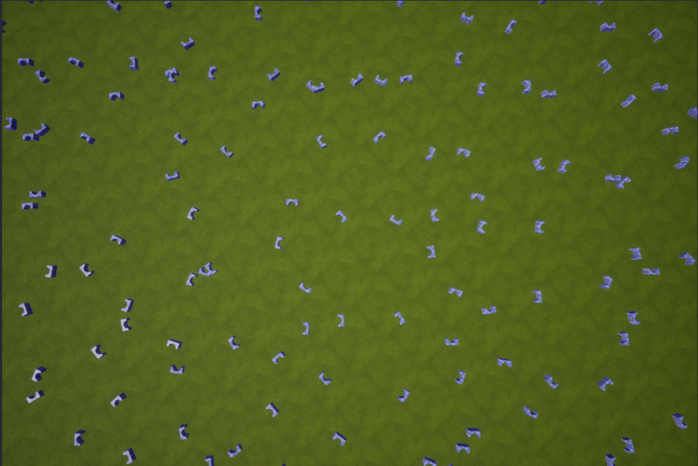
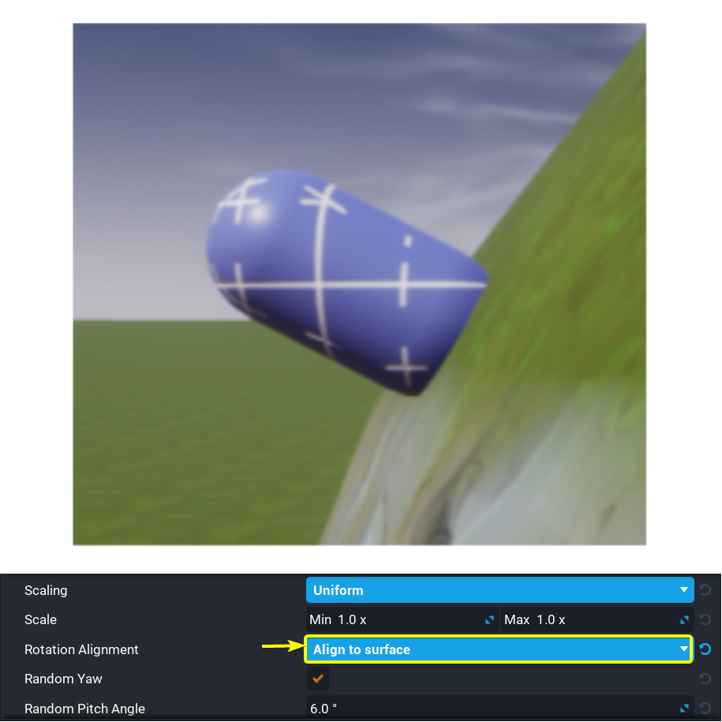
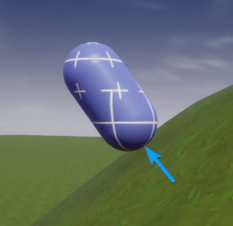
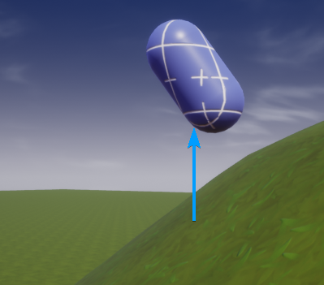

# Terrain in Core

## Overview

The **Terrain Creator** is used to generate large landscapes. Often, the terrain generated by the **Terrain Creator** is land that players can walk on. However, the **Terrain Creator** can also be used to generate land that cannot be walked on and exists solely as a background for the game world.

## Creating Terrain

Click on the terrain creator icon at the top of the Core Editor to open the **TERRAIN CREATOR** drop down menu.
{: .image-inline-text .image-background }

{: .center loading="lazy" }

The **TERRAIN CREATOR** drop down menu contains two options, **Generate New Terrain** and **Import From Heightmap**. The **Generate New Terrain** option will open the **GENERATE NEW TERRAIN** window which is used to create new terrain by modifying pre-existing terrain types. The **Import From Heightmap** option will open the **IMPORT TERRAIN HEIGHTMAP** window.
{: .image-inline-text .image-background }

{: .center loading="lazy" }

### The Terrain Generator

The **GENERATE NEW TERRAIN** window contains settings that are used to manipulate how the terrain will be generated.

The left left side of the **GENERATE NEW TERRAIN** window  contains list of different terrain types. The center of the **GENERATE NEW TERRAIN** window contains two sections, **General** and **Parameters**.

{: .center loading="lazy" }

#### Terrain Settings

The **General** section contains settings that will apply to all types of terrain. The **Voxel Size** setting determines how large the voxels of the terrain will be. A voxel is like a 3D pixel. The smaller the voxels are, the more detail the terrain can have. The **Terrain Size** setting determines how many voxels the terrain will have. The higher the voxel count, the larger the terrain can be. The downside of increasing the number of voxels is that the terrain use up more of the limited terrain memory space. Creators are limited between 50MB and 100MB of terrain memory space depending on the maximum number of players for the game.

The **Parameters** section contains settings that will vary depending on the terrain type selected. For example, the **Cube World** is the only terrain type with the **Edge Length** setting.

#### Terrain Types

Clicking on one of the terrain types from the list on the left side of the **GENERATE NEW TERRAIN** window will select that terrain type. Below are three sample images of what the different terrain types look like.

| Ravines          |  Rolling Hills          | Rocky Meadow |
|:----------------:|:-----------------------:|:------------:|
{: loading="lazy" style="max-width:15em" .center} |{: loading="lazy" style="max-width:15em" .center }| {: loading="lazy" style="max-width:15em" .center }

The **Generate** button will create a new terrain object using the settings in the **GENERATE NEW TERRAIN** window. The new terrain object will appear in **Hierarchy** window and may also be visible in the **Main Viewport**.

{: .center loading="lazy" }

The **Terrain** object in the **Hierarchy** window will probably appear **red**{: .Color_RED } because the **Terrain** object is missing a material. This will not stop the game from running. Assignment of materials to terrain will be addressed later in this reference guide.

!!!tip
    Double clicking on a terrain object in **Hierarchy** window will bring that terrain object into view in the **Main Viewport** window.

### Heightmaps

Heightmaps allows creators to generate terrain objects from `.png` images. The brightness of each pixel in the `.png` image controls how tall the point of terrain associated with that pixel will be.

#### Formatting Heightmaps

Heightmap images need to square **gray-scaled** `.png` images. The **Terrain Generator** will only accept heightmap images of the following sizes:

- 128 x 128
- 256 x 256
- 512 x 512
- 1024 x 1024

!!!tip
    There are multiple [websites](https://onlinepngtools.com/convert-png-to-grayscale) that can be used to convert `.png` images to **gray-scale** images."

#### Importing Heightmaps

To create a terrain object from a heightmap, first click on the  icon. Clicking on the **Import From Heightmap** in the **TERRAIN CREATOR** window will open the **IMPORT TERRAIN HEIGHTMAP** window.
{: .image-inline-text .image-background }

{: .center loading="lazy" }

The settings in the **IMPORT TERRAIN HEIGHTMAP** window determine how much influence the heightmap will have in the generation of terrain.

{: .center loading="lazy" }

 Below is an example of a heightmap `.png` file and the terrain generated from that heightmap `.png` file. This heightmap image was generously provided by the **Core** creator **docbdesign**.

*Heightmap Source Image (left) vs. Terrain Generated from Heightmap (right)*
{: .image-cluster }

The **Voxel Size** setting in the **IMPORT TERRAIN HEIGHTMAP** window determines how large the voxels of the terrain will be. Smaller voxel sizes will shrink the terrain but increase the amount of detail.

{: .center loading="lazy" }

The **Height Multiplier** setting in the **IMPORT TERRAIN HEIGHTMAP** window changes how much influence the brightness of a pixel has on the height of the generated terrain.

The **Height Offset** setting in the **IMPORT TERRAIN HEIGHTMAP** window determines what the default height of the generated terrain will be.

{: .center loading="lazy" }

Clicking on the the import file icon next to the **Heightmap** field will open a **File Explorer** window open in which any `.png` files can be selected from your computer. The **Import** button will generate a new terrain object using the **Heightmap**, **Weightmap**, **Voxel Size**, **Height Multiplier**, and **Height Offset** settings from the **IMPORT TERRAIN HEIGHTMAP** window. The [Weightmap](#Weightmaps) setting will be explained later in this reference.
{: .image-inline-text .image-background }

{: .center loading="lazy" }

{: .center loading="lazy" }

## Sculpting

The **Sculpt** tool is used to manually change the shape of terrain objects. Clicking on a terrain object in the **Hierarchy** window will display the properties of that terrain object in the **Properties** window. The **Properties** window for the terrain object contains a list of five tools modify terrain: **Sculpt**, **Pain**, **Foliage**, and **Optimize**.

{: .center loading="lazy" }

Clicking on the **Sculpt** tab will display the settings used to manually sculpt terrain and enable sculpting of terrain.

{: .center loading="lazy" }

If the **Sculpt** tab has been selected, clicking and hold the ++left-button++ of the mouse will extrude towards the camera of the **Main Viewport**.

    <video autoplay loop muted playsinline poster="/img/EditorManual/Abilities/Gem.png" class = "center">
        <source src="/img/TerrainReference/SculptTerrainSmiley.mp4" type="video/mp4" />
    </video>

### Additive Sculpting

Click on the additive sculpting icon to enable **Additive Sculpting**. Additive sculpting adds to the terrain by creating new terrain under the brush. The **Additive Sculpting** exists on both the **Surface** and **Shape** tools.
{: .image-inline-text .image-background }

{: .center loading="lazy" }

    <video autoplay loop muted playsinline poster="/img/EditorManual/Abilities/Gem.png" class = "center" style="width:50%">
        <source src="/img/TerrainReference/SculptTerrainSmiley.mp4" type="video/mp4" />
    </video>

### Destructive Sculpting

Clicking on the destructive sculpting icon will enable **Destructive Sculpting**. Destructive sculpting removes terrain under the brush. The **Destructive Sculpting** setting exists on both the **Surface** and **Shape** tools.
{: .image-inline-text .image-background }

{: .center loading="lazy" }

    <video autoplay loop muted playsinline poster="/img/EditorManual/Abilities/Gem.png" class = "center" style="width:50%">
        <source src="/img/TerrainReference/DestructiveModeTool.mp4" type="video/mp4" />
    </video>

## Brush Tools

The **Sculpt** tab contains six tools used to sculpt terrain: **Surface**, **Shape**, **Smooth**, **Trim**, **Flatten**, and **Level**. This reference will cover how the **Surface**, **Shape**, and **Smooth** function. Clicking on the name of the current tool in the **Tool** will open a drop down menu listing all six different sculpting tools. A sculpting tool can be selected from this drop down menu by clicking on the name of the desired tool.

{: .center loading="lazy" }

### Surface Tool

The **Surface** tool protrudes or indents terrain over an area on the surface of the terrain under the brush.

### Shape Tool

The **Shape** tool transforms the brush into a 3D mesh. The default mesh is the a sphere. Double clicking on the current shape will open the **STATIC MESH PICKER** window.

{: .center loading="lazy" }

The **STATIC MESH PICKER** window contains a list of the 3D meshes that can be use to replace the current shape. Select one of the models, and then press the **Done** button.

    <video autoplay loop muted playsinline poster="/img/EditorManual/Abilities/Gem.png" class = "center" style="width:50%">
        <source src="/img/TerrainReference/SelectArchFromStaticMeshes.mp4" type="video/mp4" />
    </video>

#### Shape Tool Alignment

The **Alignment** property in the **Brush** section of the **Shape** tool determines where the brush can paint. There are four different alignment settings: **Surface**, **View**, **Ground**, and **Up**.

Clicking on the button with the current alignment will open a dropdown menu of brush alignment options. Click one of the items in the dropdown menu to change the brush alignment.

{: .center loading="lazy" }

#### Surface Alignment

The **Surface** alignment option attaches the brush to the surface of the terrain.

#### Other Alignments

The **View**, **Ground**, and **Up** alignment options work differently from the **Surface** alignment because they allow enable the brush to create terrain in the air by painting on an invisible drawing plane.

| View Alignment      | Ground Alignment | Up Alignment|
|:-------------------:|:----------------:|:-------------:|
|{: style="width:15em" }|{: style="width:15em" }|{: style="width:15em" }
|The drawing plane is aligned with the camera|The drawing plane is parallel to the ground|The drawing plane always points towards the camera and is upright|
|
<video autoplay loop muted playsinline poster="/img/EditorManual/Abilities/Gem.png" class = "center" style="width:15em"><source src="../img/TerrainReference/ViewMode_Vid.mp4" type="video/mp4" /></video>
|
<video autoplay loop muted playsinline poster="/img/EditorManual/Abilities/Gem.png" class = "center" style="width:15em"><source src="../img/TerrainReference/GroundMode_Vid.mp4" type="video/mp4" /></video>
|
<video autoplay loop muted playsinline poster="/img/EditorManual/Abilities/Gem.png" class = "center" style="width:15em"><source src="../img/TerrainReference/UpMode_Vid.mp4" type="video/mp4" /></video>
|

The **green**{: style="color: green" } dashed lines in the diagrams above represent the **Distance to Camera** property. The **Distance to Camera** property determines how far the drawing plane should be from the camera. The **Air Mode** property must be enabled for the **Distance to Camera** property to be visible.

    <video autoplay loop muted playsinline poster="/img/EditorManual/Abilities/Gem.png" class = "center" style="width:50%">
        <source src="../img/TerrainReference/EnableAirMode.mp4" type="video/mp4" />
    </video>

Below is a side by side comparison between **Air Mode** being disabled and **Air Mode** being enabled. When **Air Mode** is disabled, the brush sticks to the surface of the terrain. When **Air Mode** is enabled, the brush ignores the terrain and sticks to the draw plane.

{: style="width:20%" }
{: style="width:20%" }
_Air Mode Disabled (left) vs Air Mode Enabled (right)_
{: .image-cluster }

### Smooth Tool

The **Smooth** tool will smooth terrain with sharp edges.

### Paint Tool

The **Paint** tool is used to manually paint materials onto the terrain. Up to four different materials can be painted on the terrain.

#### Generating Materials

The **Paint** tab in the **Properties** window of a terrain object contains settings used for switching between different painting materials and for changing the size and strength of the painting brush.

{: .center loading="lazy" }

In the **Paint** tab the following message may be displayed:
**The terrain material is not paintable!**{: .Color_RED }

This message indicates that the currently selected terrain object has no materials associated with it. Clicking on the **Create new terrain material** will open a **Material Editor** window used to associate materials with the terrain object.

{: .center loading="lazy" }

{: .center loading="lazy}

In the **Material Editor** there are four sections that correspond to the four different materials available when painting on terrain:

- **Material1**
- **Material2**
- **Material3**
- **Material4**

Double clicking on one of the checkered sphere image will open **MATERIAL PICKER** window. The **MATERIAL PICKER** window contains a list of different materials that can be applied to the current material slot.

{: .center loading="lazy" }

Select a material from the **MATERIAL PICKER** and the click on the **Done** button to update the current material slot with selected material from the **MATERIAL PICKER** window.

    <video autoplay loop muted playsinline poster="/img/EditorManual/Abilities/Gem.png" class = "center" style="width:50%">
        <source src="/img/TerrainReference/MaterialPicker.mp4" type="video/mp4" />
    </video>

The **Material Base** property determines what material will be displayed on the top of the terrain. The **Material Side** property determines what material will be displayed on the side of the terrain.

{: .center loading="lazy" }

#### Switching Materials

Clicking on the close window icon at the top left of the **Material Editor** window will save all changes to the terrain materials and close the **Material Editor** window.
{: .image-inline-text .image-background }

{: .center loading="lazy" }

Clicking on one of the four images next to the **Materials** in the **Palette** section will select that material for painting.

{: .center loading="lazy" }

The **Edit Materials** button will open the **Material Editor** window for the terrain materials so that changes can be made.

Pressing and hold the ++left-button++ of the mouse in the **Main Viewport** will fill in the area of terrain under the mouse over a period time.

    <video autoplay loop muted playsinline poster="/img/EditorManual/Abilities/Gem.png" class = "center" style="width:50%">
        <source src="/img/TerrainReference/UsePaintTool.mp4" type="video/mp4" />
    </video>

Many of the available materials have depth aspect to them. For example in the video above, the dirt material will sometimes display below the stone material. This is due to the fact that the materials built into **Core** have a depth property associated with each pixel. In the image below, the left side **Food Corn 01** material is at 100% strength on the left and completely covers the **Bricks Worn Stone 01** material. On the right side, the **Food Corn 01** material is at 50% strength on only partially covers the **Bricks Worn Stone 01** material depending on which spots of the **Food Corn 01** material are highest.

{: .center loading="lazy" }
*100% Strength Food Corn 01 material (left) vs 50% strength Food Corn 01 material (right)*
{: .image-cluster }

The strength of materials is even more so visible by using the **Debug Mode** in the terrain editor. In the **Paint** tab there is setting named **Show Debug Materials**. Clicking on the box next to **Show Debug Materials** will enable **Debug Mode** for the terrain. **Debug Mode** for terrain will give each material a specific color: **red**{: .Color_RED }, **green**{: .Color_GREEN}, **blue**{: .Color_BLUE}, or **black**.

{: .center loading="lazy" }

Below is the side by side comparison of the **Food Corn 01** at 100% and the **Food Corn 01** material at 50%. Since the **Bricks Worn Stone 01** material is the _first_ terrain material, the **Bricks Worn Stone 01** material appears as the color **red**{: .Color_RED }. Since the **Food Corn 01** material is the_second_terrain material, the **Food Corn 01** material appears as the color **green**{: .Color_GREEN }. The reasoning for these colorings will be further covered in the [Weightmaps](#Weightmaps) section. On the right side, the terrain is 50% **Food Corn 01** material and 50% **Bricks Worn Stone 01** causing it to appear a mix of **green**{: .Color_GREEN } and **red**{: .Color_RED } which is a **yellow**{: style="color:#D6D13E" } color.

{: .center loading="lazy" }

## Foliage

In the Core Terrain System, foliage are simple objects that are generated at random positions on a specific terrain material. In most cases, foliage will take the form of trees, boulders, and bushes. The foliage system will automatically generate and place the foliage on the terrain. Each foliage object is tied to a specific terrain material. Foliage objects will only spawn on the terrain material they are associated with.

The **Foliage** tab in the **Properties** window of the selected terrain object is used to configure the settings for generating foliage on a terrain object.

{: .center loading="lazy" }

{: .center loading="lazy" }

### Adding Foliage

Clicking on the **Add Foliage** button will open the **STATIC MESH PICKER** window. The **STATIC MESH PICKER** window contains a list of meshes that can be used as foliage. Select a mesh from this window and then click on the **Done** button.

{: .center loading="lazy" }

    <video autoplay loop muted playsinline poster="/img/EditorManual/Abilities/Gem.png" class = "center" style="width:50%">
        <source src="/img/TerrainReference/SelectArchFromStaticMeshes.mp4" type="video/mp4" />
    </video>

!!!note
    When adding foliage only use assets from the **STATIC MESH PICKER** window can be used. Custom templates cannot be used as foliage.

The object selected from the **STATIC MESH PICKER** window will now be randomly spread throughout the terrain as foliage. By default, the foliage added will be associated with the _first_ terrain material. This means that the foliage that was generated will only appear on terrain areas covered by the material in the first material slot of the terrain.

{: .center loading="lazy" }

### Removing Foliage

To remove foliage, right click on the foliage object. Then select the **Remove** option from the drop down list. Alternatively, painting over a foliage instance with a different terrain material will remove that foliage instance. This alternative method will only remove the foliage instance if the foliage instance is not associated with the newly painted terrain material.

    <video autoplay loop muted playsinline poster="/img/EditorManual/Abilities/Gem.png" class = "center" style="width:50%">
        <source src="/img/TerrainReference/RemoveFoliage.mp4" type="video/mp4" />
    </video>

### Foliage Properties

Clicking on a foliage object in the **Foliage** window will display the spawn settings for that foliage object.

#### Material Channel

The **Material Channel** property determines which terrain material the selected foliage object will spawn on top of. Click one of the four terrain materials to change which terrain material the foliage object should spawn on top of.

    <video autoplay loop muted playsinline poster="/img/EditorManual/Abilities/Gem.png" class = "center" style="width:50%">
        <source src="/img/TerrainReference/SwitchFoliageMaterialAssociation.mp4" type="video/mp4" />
    </video>

#### Spawn Settings

The **Distance Between Instances** property controls the density of placement for one type of foliage. The higher the **Distance Between Instances**, the more space there will be between instances of that foliage.

{: style="width:45%" }
{: style="width:45%" }
<em><strong>Distance Between Instances</strong> of <code>2 meters</code> (left) vs. <strong>Distance Between Instances</strong> of `7 meters` (right)</em>
{: .image-cluster }

The **Surface Alignment** property determines how the foliage will be oriented when generated. There are three different alignment options: **Align to terrain Up**, **Align to surface**, and **Random Align**. The **Align to terrain Up** option will align the foliage with the z-axis of the terrain. The **Align to surface** option will align the foliage perpendicularly to the slope of the specific point of terrain that the foliage instance is on. The **Random Align** will randomly assign the **Align to surface** or **Align to terrain up** for each foliage instance.

{: style="width:45%" }
{: style="width:45%" }
*Up Alignment (left) vs. Surface Alignment (right)*
{: .image-cluster }

The **Ground Slope Angle** controls the type of slope the foliage is allowed to spawn on. **Ground Slope Angle** can be used to prevent foliage like trees from spawning on the side of a cliffs. The **Group Slope Angle** property has two settings. The first setting is the minimum slope angle. The second setting is the maximum slope angle. The table below demonstrates how manipulating the first and second settings for the **Ground Slop Angle** property changes the locations that foliage spawns at.

| 0° - 30°  |  30° - 90° | 0° - 90° | 90° - 180° |
|:---------:|:----------:|:--------:|:----------:|
| {: style="min-width:15em" } | {: style="min-width:15em" } | {: style="min-width:15em" } | {: style="min-width:15em" } |

The **Local Z-Offset** property moves the foliage upwards or downwards based on the local z-axis of the foliage.

{: .center loading="lazy" }

{: .center loading="lazy" }

The **Global Z-Offset** property moves the foliage upwards or downwards based on the global z-axis of the game.

{: .center loading="lazy" }

{: .center loading="lazy" }

The **Random Yaw** property determines if the foliage objects should be randomly rotated around their local z-axis.

{: .center loading="lazy" }

The **Scaling** property allows for fine control over the minimum and maximum scales of each axis (X, Y, and Z) of every generated foliage object. There are three different scaling modes to choose from: **Free**, **Uniform**, and **XY Lock**. Each scaling mode enables the manipulation of the minimum and maximum scales for different combinations of the X, Y, and Z axes.

| Scaling Type   | Scaling Settings |
|:---------------|:----------------:|
| Free           | {: style="max-width: 100%" } |
| Uniform        | {: style="max-width: 100%" } |
| XY Lock        | {: style="max-width: 100%" } |

The **Height** property determines at what altitude the foliage can spawn. This property is extremely useful when creating terrain with bodies of water. This property could be used to prevent foliage like trees and bushes from spawning below the water level. There are two settings for this property. The first setting is the minimum height. The second setting is the maximum height.

{: .center loading="lazy" }

#### Foliage Materials

Foliage objects have one or more material slots that can be used to change the materials applied to the foliage objects. Clicking on a foliage object in the **Foliage** tab will display the settings for that foliage object. The **Materials** section of the foliage settings contains the materials applied to the foliage. Double clicking on the material icon of a material slot belonging to the selected foliage object will open the **MATERIAL PICKER** window. The **MATERIAL PICKER** window contains a list of materials that can be applied to the foliage/

{: .center loading="lazy" }

Click on a material from the **MATERIAL PICKER** window, then click on the **Done** button to apply that material to the selected material slot of the foliage object. Changes to the material slot will be reflected in all instances of that foliage object.

    <video autoplay loop muted playsinline poster="/img/EditorManual/Abilities/Gem.png" class = "center" style="width:50%">
        <source src="/img/TerrainReference/MaterialPicker.mp4" type="video/mp4" />
    </video>

#### Render Settings

The **Spawn Distance** setting controls the maximum distance that foliage can be rendered at. Below is a comparison between a **Spawn Distance** of `96 meters` and `128 meters`.

{: style="width:45%" }
{: style="width:45%" }
*Spawn Distance of `96 meters` (left) vs. Spawn Distance of `128 meters` (right)*
{: .image-cluster }

The **Cull Distance** property determines how **Core** will remove the foliage from view. This is done to decrease the time required to render all of the foliage on terrain. There are two settings for this property. The first setting determines the distance from the camera at which the foliage begins to disappear from view. The second setting determines the distance from the camera at which foliage will stop being drawn.

{: .center loading="lazy" }

The **Cast Shadows** property determines if the foliage should cast shadows. Enabling this property will increase the time required to render all of the foliage. A comparison between disabling **Cast Shadows** and enabling **Cast Shadows** can be seen below.

{: .center loading="lazy" }

{: style="width:20%" }
{: style="width:20%" }
*_Shadows Disabled (left) vs. Shadows Enabled (right)_*
{: .image-cluster }

### Optimize Tool

When designing terrain it is important to keep in mind the memory limit for terrain. As more terrain features and foliage are added to terrain, the terrain will take up more memory space. There is a bar at the top of Core Editor that indicates the remaining terrain memory space available for the current game.

{: .center loading="lazy" }

If this bar is ever **red**{: .Color_RED }, then the terrain will need to optimized to consume less memory space.

{: .center loading="lazy" }

The **Optimize** tool is used to reduce the memory space used by terrain.

{: .center loading="lazy" }

There are two options to reduce the memory used by terrain: **Optimize** and **Simplify Voxels**. The **Optimize** option will attempt to reduce the memory used by terrain without reducing the detail of the terrain. Clicking on the **Optimize** button will automatically optimize the terrain.

{: .center loading="lazy" }

The **Simplify Voxels** option is more effective than the **Optimize** option however, the **Simplify Voxels** option can reduce the detail of terrain. Clicking on the **Simplify Voxels** button will automatically simplify the terrain. Depending on the complexity of the terrain, the simplification of terrain voxels may take multiple minutes.

{: .center loading="lazy" }

## Weightmaps

Weightmaps are similar to heightmaps. Weightmaps store material data for terrain in the form of a `.png` file. To understand how this works it is important to know how data is stored in a `.png` file. The pixels in most `.png` files are made up of four color channels: **red**{: .Color_RED }, **green**{: .Color_GREEN }, **blue**{: .Color_BLUE }, and **alpha**. The strength of these color channels determine the color of each pixel in a `.png` image. For example, a high **red**{: .Color_RED } channel and **blue**{: .Color_BLUE } channel value will create a **magenta**{: .Color_MAGENTA } colored pixel. The **alpha** channel is used to determine the transparency of a specific pixel in a `.png` image. The image below demonstrates how differing the strength of the **red**{: .Color_RED }, **green**{: .Color_GREEN }, and **blue**{: .Color_BLUE } channels can create the **orange**{style="color:orange"} color in the Core logo.

{: .center loading="lazy" }

Weightmaps use these four color channels to automatically paint the terrain. Weightmaps tie each of the four color channels of the `.png` weightmap file to the four materials associated with the selected terrain.

- The **red**{: .Color_RED } channel is tied to the *first* material
- The **green**{: .Color_GREEN } channel is tied to the *second* material
- The **blue**{: .Color_BLUE } channel is tied to the *third* material
- The **alpha** channel is tied to the *fourth* material

    

        
    

    

        
    

    <em>
        <em>Materials Applied to the terrain</em> (left) vs. <em>Source Weightmap (right)</em>
    </em>

!!!note
    If the weightmap `.png` file uses the **alpha** channel, then the **Import Alpha Channel** property in the **IMPORT TERRAIN HEIGHTMAP** window must be enabled before generating terrain.

    {: .center loading="lazy" style="max-height:14em" }

Clicking on the import file icon next to the **Weightmap** field will open a **File Explorer** window in which you can select a `.png` file from your computer to use as a weightmap.
{: .image-inline-text .image-background }

{: .center loading="lazy" }

{: .center loading="lazy" }

Weightmap images need to square `.png` images. The **Terrain Generator** will only accept weightmap images of the following sizes:

- 128 x 128
- 256 x 256
- 512 x 512
- 1024 x 1024

## Learn More

[Environment Art](../tutorials/environment_art.md) | [Custom Materials](../references/custom_materials.md)
