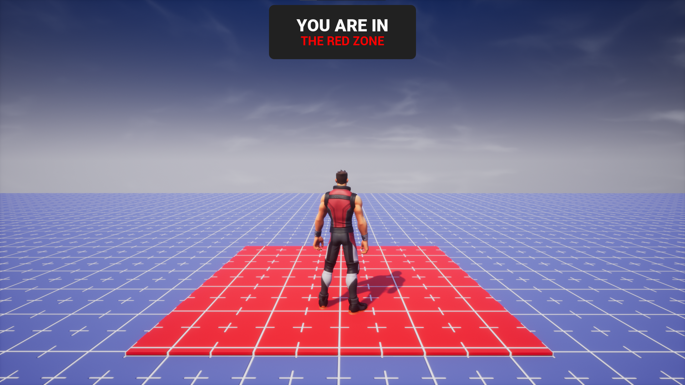
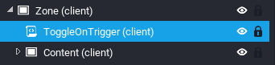
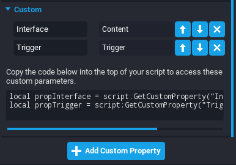
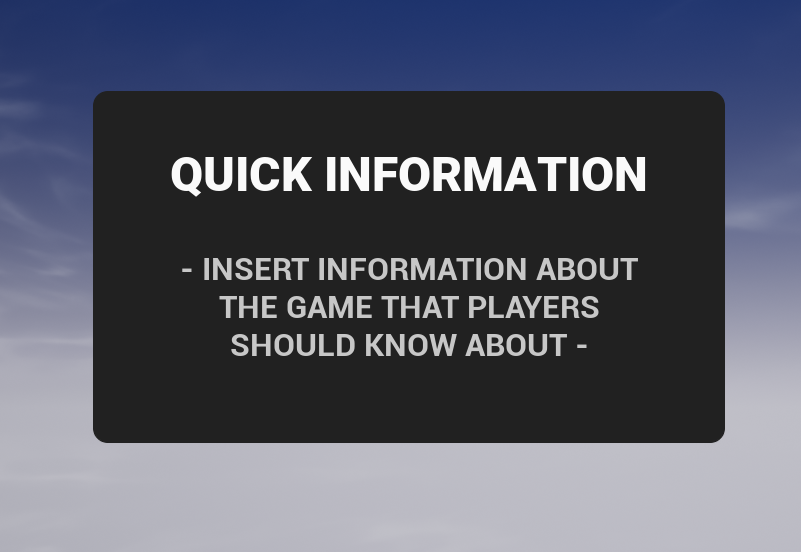
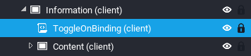
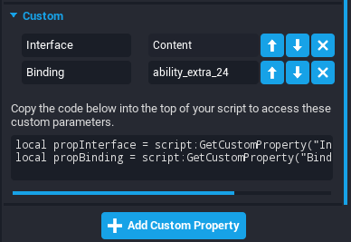
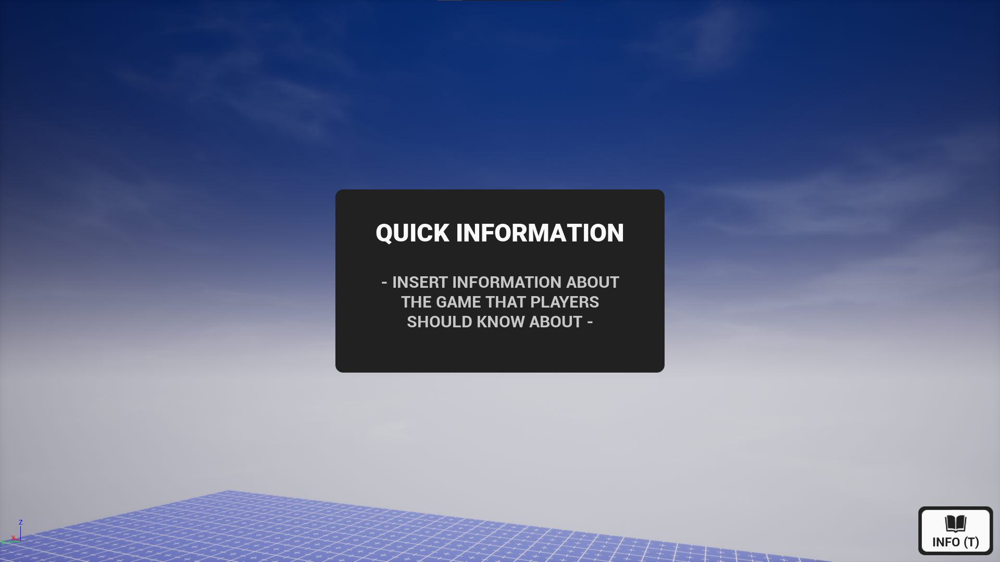
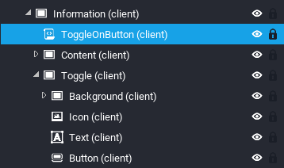
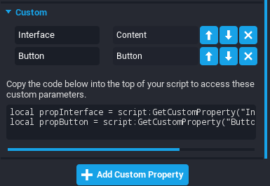
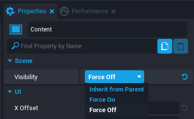

# User Interface in Core

## Overview

UI in Core includes all the 2D elements that can be used to build menus, notifications, dialogue boxes, and heads up displays (HUD's). Creating UI Elements is mostly a drag-and-drop process, where any UI element can be added to the scene with ease.

## UI Elements

### Control

A **Control** (UIControl) is a **CoreObject** which serves as a base class for other Controls. All UI classes include the properties within a Control such as the position and size properties.

More information can be found in the [UIControl API](../api/uicontrol.md)

### Container

All other UI elements must be a descendant of a **Container** (UIContainer) to be visible. It does not have a position or size. It is always the size of the entire screen. It has no properties or functions of its own, but inherits everything from CoreObject.

More information can be found in the [UIContainer API](../api/uicontainer.md)

#### Container Types

Containers have a **Content Type** which allow creators to specify the way the UI works and optimize performance. By default, Containers will have the **Dynamic** type, but can be made more performant by changing their type to **Static** in instances where they do not need to move.

##### UI Type Definitions

- **Static**: Used for any UI that does not need to move.
- **Dynamic**: Used for any UI that will move.
- **Texture**: For extremely complex UI with many elements to be rendered as a single texture, like Minimap UI.

!!! warning "Texture Content Type"
    The **Texture** Content Type has greater cost than the other UI Container Content Types, but this cost is fixed. It is recommended to only use **one** Texture per project.

### Panel

A **Panel** (UIPanel) can be used for containing and laying out other UI elements, such as images and text. It is optional and is best used for organization.

Panels also have an **Opacity** that will be applied to all elements inside of it.

More information can be found in the [UIPanel API](../api/uipanel.md)

### Scroll Panel

A **Scroll Panel** (UIScrollPanel) is a Panel that has a scroll bar for overflowing elements.

More information can be found in the [UIScrollPanel API](../api/uiscrollpanel.md)

### Image

An **Image** (UIImage) displays a given image (found in the **Core Content** window).

More information can be found in the [UIImage API](../api/uiimage.md)

#### Change the Image in the Editor

Like Materials on static mesh objects, there are two ways to change the image being displayed; either by dragging from the **UI Textures** category of **Core Content** or by selecting from the **Properties** window, and double-clicking the icon in the **Image** property.

#### Change the Image with Script

If you have an asset reference to an image (or its MUID), you can use the `UIImage:SetImage()` function.

Images can also be manually set to show a player's profile picture by using the `UIImage:SetPlayerProfile()` function.

#### Change the Color of an Image with Script

The color of an image can be changed dynamically by using the `UIImage:SetColor()` function.

### Text

A **Text** (UIText) displays text.

More information can be found in the [UIText API](../api/uitext.md)

#### Text Fonts

{: .center loading="lazy" }

#### Change the Font

Like Materials on static mesh objects, there are two ways to change the font of text; either by dragging from the **Fonts** category of **Core Content** or by selecting from the **Property Window**, and double-clicking the icon in the **Font** property.

The font can also be changed with script by using the `UIText:SetFont()` function.

#### Change the Text with Script

The content of the text (what is actually beind displayed) can be changed by setting a new value to the `UIText.text` property to a new string.

```lua
TextObject.text = "New Value"
```

#### Change the Color of Text with Script

The color of text can be changed dynamically by using the `UIText:SetColor()` function.

#### Get the Visual Size of a Text with Script

When the text is being rendered on the screen, you can get the amount of pixels that it takes up on the screen by using the `UIText:ComputeApproximateSize()` function.

### Progress Bar

A **Progress Bar** (UIProgressBar) displays a dynamically filled rectangle that can be used for things such as health indicators, loading screen, and much more.

More information can be found in the [UIProgressBar API](../api/uiprogressbar.md)

#### Change the Progress with Script

The progress is set by using a scale of `0` to `1` (meaning 50% would be `0.5`). This can be set by changing the value of `UIProgressBar.progress` to a new number in that range.

```lua
ProgressBarObject.progress = 0.6 -- 60%
```

### Button

A **Button** (UIButton) can be clicked and interacted with. This must be in a client context to function.

More information can be found in the [UIButton API](../api/uibutton.md)

#### Listening to Events

A button has several events that can be listened to that informs you if it was clicked, hovered, etc. You can listen to these by figuring out which one is needed (look at the API for reference) and connect it to a function.

An example using `UIButton.clickedEvent`

```lua
function OnButtonClicked(button)
    print(button.name, "clicked")
end

ButtonObject.clickedEvent:Connect(OnButtonClicked)
```

### Perk Purchase Button

A **Perk Purchase Button** (UIPerkPurchaseButton) is similar to a regular button but allows players to purchase perks within a game. It is designed to present a consistent purchasing experience for players across all games.

More information can be found in the [UIPerkPurchaseButton API](../api/uiperkpurchasebutton.md)

## Toggling UI With a Trigger

There may be situations you want to show **UI** when a player enters a certain area in the map. This can be done by utilizing **Triggers**.

In this example, the trigger will show a **UI** that informs the player that they are in a specific zone, the "Red Zone."

{: .center loading="lazy" }

### Create a Script

First, you need to create a script that will handle this implementation.

1. Create a script inside the **UI** that will be toggled using the trigger. The name of the script can be anything; this tutorial will be using `ToggleOnTrigger`.

{: .center loading="lazy" }

### Create Custom Properties for the UI and Trigger

Second, you need a reference to the **UI** and to the trigger so that you can implement the required trigger events that then toggle the **UI**.

1. While having the script selected in the hierarchy, in the **Properties** window, add a **CoreObjectReference** **Custom Property** to the script and name it `Interface`.
2. Drag-and-drop the **UI** from the **Hierarchy** into the **Custom Property** you just created.
3. While having the script selected in the hierarchy, in the **Properties** window, add a **CoreObjectReference** **Custom Property** to the script and name it `Trigger`.
4. Drag-and-drop the **Trigger** from the **Hierarchy** into the **Custom Property** you just created.

{: .center loading="lazy" }

### Create Variable References for the UI and Trigger

Now, it is time to begin coding. First, you need to create variables that refer the the **UI** and **Trigger** **Custom Properties**.

Add this to the top of your script:

```lua
local Interface = script:GetCustomProperty("Interface"):WaitForObject()
local Trigger = script:GetCustomProperty("Trigger"):WaitForObject()
```

### Create Variable Reference to Local Player

The **UI** should only become visible if the **Local Player** (you, for instance) enters the trigger. Otherwise, if any **Player** enters or exits the trigger, the **UI** will have some very odd behaviour.

Under the **Custom Property** references, add this to the script:

```lua
local LocalPlayer = Game.GetLocalPlayer()
```

### Connect Event When a Player Enters the Trigger

It is now time to show the **UI** when a **Player** enters the **Trigger**. This is used by utilizing the `Trigger.beginOverlapEvent` event.

At the bottom of the script, add this:

```lua
function OnBeginOverlap(trigger, player)

end

Trigger.beginOverlapEvent:Connect(OnBeginOverlap)
```

### Toggle the UI On if the Local Player is Inside

Now you can check to see if the **Player** that entered the trigger is the ***Local Player**.

Inside the `OnBeginOverlap` function, add this check:

```lua
if not player:IsA("Player") or player ~= LocalPlayer then
    return
end
```

The parameter is named `player` so it is easier to understand for the developer, but it is actually an **Object**, meaning it can be a **Player** or any **CoreObject** that enters it. Therefore, this will escape early if the object entering the **Trigger** is not a **Player**. This will also escape early if the **Player** entering the **Trigger** is not the **Local Player**.

Next, add this line of code to toggle the visibility of the UI to be inherit (visible only if all the objects it is inside is also visible):

```lua
Interface.visibility = Visibility.INHERIT
```

### Connect Event When a Player Leaves the Trigger

It is now time to hide the **UI** when a **Player** exits the **Trigger**. This is used by utilizing the `Trigger.endOverlapEvent` event.

At the bottom of the script, add this:

```lua
function OnEndOverlap(trigger, player)

end

Trigger.endOverlapEvent:Connect(OnEndOverlap)
```

### Toggle the UI Off if the Local Player is Inside

Now you can check to see if the **Player** that exited the trigger is the ***Local Player**.

Inside the `OnEndOverlap` function, add this check:

```lua
if not player:IsA("Player") or player ~= LocalPlayer then
    return
end
```

Next, add this line of code to toggle the visibility of the UI to be off:

```lua
Interface.visibility = Visibility.FORCE_OFF
```

### Hide the UI

Finally, you can disable the visibility of the UI so that when the **Player** spawns in, it is off by default.

1. Click the UI in the **Hierarchy**.
2. In the **Properties** window, change the **Visibility** to **Force Off**.

{: .center loading="lazy" }

### Final Code

```lua
local Interface = script:GetCustomProperty("Interface"):WaitForObject()
local Trigger = script:GetCustomProperty("Trigger"):WaitForObject()

local LocalPlayer = Game.GetLocalPlayer()

function OnBeginOverlap(trigger, player)
    if not player:IsA("Player") or player ~= LocalPlayer then
        return
    end

    Interface.visibility = Visibility.INHERIT
end

function OnEndOverlap(trigger, player)
    if not player:IsA("Player") or player ~= LocalPlayer  then
        return
    end

    Interface.visibility = Visibility.FORCE_OFF
end

Trigger.beginOverlapEvent:Connect(OnBeginOverlap)
Trigger.endOverlapEvent:Connect(OnEndOverlap)
```

## Toggling UI With a Binding

There may be situations you want to show **UI** when a player presses a certain button. This can be done by utilizing **Bindings**.

In this example, pressing ++T++ will show a **UI** that gives some quick information to the player about the game.

{: .center loading="lazy" }

### Create a Script

First, you need to create a script that will handle this implementation.

1. Create a script inside the **UI** that will be toggled using the trigger. The name of the script can be anything; this tutorial will be using `ToggleOnBinding`.

{: .center loading="lazy" }

### Create Custom Properties for the UI and Binding

Second, you need a reference to the **UI** and to the trigger so that you can implement the required trigger events that then toggle the **UI**.

1. While having the script selected in the hierarchy, in the **Properties** window, add a **CoreObjectReference** **Custom Property** to the script and name it `Interface`.
2. Drag-and-drop the **UI** from the **Hierarchy** into the **Custom Property** you just created.
3. While having the script selected in the hierarchy, in the **Properties** window, add a **String** **Custom Property** to the script and name it `Binding`.
4. Search the binding list for what binding you want to use. This example will be using ++T++, which is `ability_extra_24`.

{: .center loading="lazy" }

### Create Variable References for the UI and Binding

Now, it is time to begin coding. First, you need to create variables that refer the the **UI** and **Binding** **Custom Properties**.

Add this to the top of your script:

```lua
local Interface = script:GetCustomProperty("Interface"):WaitForObject()

local BINDING = script:GetCustomProperty("Binding")
```

`BINDING` is in all caps to hint that it is a constant; a variable that the value is no altered.

### Create Variable Reference to Local Player

The **UI** should only become visible if the **Local Player** presses the binding.

Under or between the **Custom Property** references, add this to the script:

```lua
local LocalPlayer = Game.GetLocalPlayer()
```

### Connect Event When a Player Presses a Binding

It is now time to show the **UI** when a **Player** enters the **Trigger**. This is used by utilizing the `Player.bindingPressedEvent` event.

At the bottom of the script, add this:

```lua
function OnBindingPressed(player, binding)

end

LocalPlayer.bindingPressedEvent:Connect(OnBindingPressed)
```

### Check the Binding

The `bindingPressedEvent` event fires when any binding is pressed so you need to check and see if it is the correct binding that you want it to be.

Do this by adding this to the top of the `OnBindingPressed` function:

```lua
if binding ~= BINDING then
    return
end
```

This will escape early if the two bindings do not match.

### Toggle the Visibility of the UI

Toggling the visibility of the **UI** can be done with a quick `if/else` statement.

Add this to the bottom of the function:

```lua
if Interface.visibility == Visibility.FORCE_OFF then
    Interface.visibility = Visibility.INHERIT
else
    Interface.visibility = Visibility.FORCE_OFF
end
```

### Hide the UI

Finally, you can disable the visibility of the UI so that when the **Player** spawns in, it is off by default.

1. Click the UI in the **Hierarchy**.

2. In the **Properties** window, change the **Visibility** to **Force Off**.

{: .center loading="lazy" }

### Final Code

```lua
local Interface = script:GetCustomProperty("Interface"):WaitForObject()

local LocalPlayer = Game.GetLocalPlayer()

local BINDING = script:GetCustomProperty("Binding")

function OnBindingPressed(player, binding)
    if binding ~= BINDING then
        return
    end

    if Interface.visibility == Visibility.FORCE_OFF then
        Interface.visibility = Visibility.INHERIT
    else
        Interface.visibility = Visibility.FORCE_OFF
    end
end

LocalPlayer.bindingPressedEvent:Connect(OnBindingPressed)
```

## Toggling UI With a Button

There may be situations you want to show **UI** when a player presses a button on the screen. This can be done by utilizing **Buttons**.

In this example, pressing the button will show a **UI** that gives some quick information to the player about the game.

{: .center loading="lazy" }

### Create a Script

First, you need to create a script that will handle this implementation.

1. Create a script inside the **UI** that will be toggled using the trigger. The name of the script can be anything; this tutorial will be using `ToggleOnButton`.

{: .center loading="lazy" }

### Create Custom Properties for the UI and Trigger

Second, you need a reference to the **UI** and to the trigger so that you can implement the required trigger events that then toggle the **UI**.

1. While having the script selected in the hierarchy, in the **Properties** window, add a **CoreObjectReference** **Custom Property** to the script and name it `Interface`.
2. Drag-and-drop the **UI** from the **Hierarchy** into the **Custom Property** you just created.
3. While having the script selected in the hierarchy, in the **Properties** window, add a **CoreObjectReference** **Custom Property** to the script and name it `Button`.
4. Drag-and-drop the **Button** from the **Hierarchy** into the **Custom Property** you just created.

{: .center loading="lazy" }

### Create Variable References for the UI and Button

Now, it is time to begin coding. First, you need to create variables that refer the the **UI** and **Button** **Custom Properties**.

Add this to the top of your script:

```lua
local Interface = script:GetCustomProperty("Interface"):WaitForObject()
local Button = script:GetCustomProperty("Button"):WaitForObject()
```

### Connect Event When a Player Presses the Button

It is now time to show the **UI** when a **Player** presses the **Button**. This is used by utilizing the `Button.clickedEvent` event.

At the bottom of the script, add this:

```lua
function OnButtonClicked(trigger, player)

end

Button.clickedEvent:Connect(OnButtonClicked)
```

### Toggle the Visibility of the UI

Toggling the visibility of the **UI** can be done with a quick `if/else` statement.

Add this to the function:

```lua
if Interface.visibility == Visibility.FORCE_OFF then
    Interface.visibility = Visibility.INHERIT
else
    Interface.visibility = Visibility.FORCE_OFF
end
```

### Enable the Cursor

If you do not already do this somewhere else in your game, you can enable the cursor using the `UI` namespace.

Add this to the bottom of your script:

```lua
UI.SetCanCursorInteractWithUI(true)
UI.SetCursorVisible(true)
```

### Hide the UI

Finally, you can disable the visibility of the UI so that when the **Player** spawns in, it is off by default.

1. Click the UI in the **Hierarchy**.
2. In the **Properties** window, change the **Visibility** to **Force Off**.

{: .center loading="lazy" }

### Final Code

```lua
local Interface = script:GetCustomProperty("Interface"):WaitForObject()
local Button = script:GetCustomProperty("Button"):WaitForObject()

function OnButtonClicked(trigger, player)
    if Interface.visibility == Visibility.FORCE_OFF then
        Interface.visibility = Visibility.INHERIT
    else
        Interface.visibility = Visibility.FORCE_OFF
    end
end

Button.clickedEvent:Connect(OnButtonClicked)

UI.SetCanCursorInteractWithUI(true)
UI.SetCursorVisible(true)
```

## Learn More

[UIControl](../api/uicontrol.md) | [UIText](../api/uitext.md) | [Events](../api/events.md)
