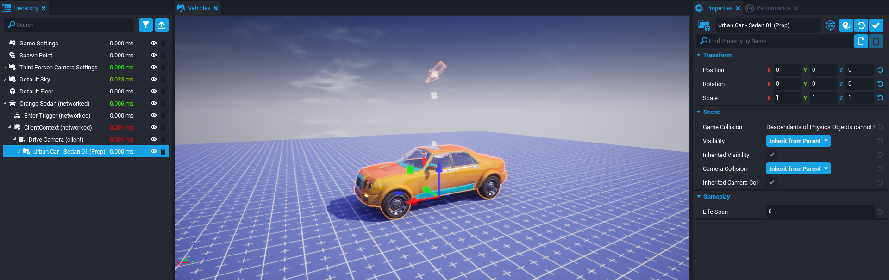
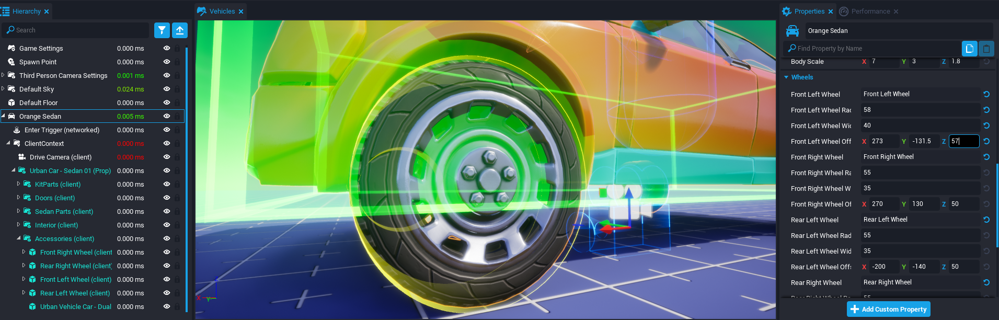

# Vehicle Reference

## Overview

**Vehicles** allow game creators to easily implement physics for tanks and automobiles. Creators could approximate a vehicle system a model of a vehicle to a player and use **Player Settings** to adjust movement physics. The Core Vehicle system streamlines the process of creating a car, truck, or even a tank with easy customization of its physics and interaction with the world.

## Types of Vehicles

### Four Wheeled Vehicles

**Four Wheeled Vehicles** provide everything you need to build 4WD cars, ATVs, and more. This vehicle object includes properties to define the shape of the vehicle, the location and size of the four wheels, physics properties such as mass and center of mass, and driving properties such as max speed, acceleration, and turn radius. The four-wheeled drive model simulates the rotation of the 4 tires on the driving surface.

### Treaded Vehicles

**Treaded Vehicles** can be used to build tanks. Like **Four Wheeled Vehicles**, you can define the shape of the collision box, mass, center of mass, and acceleration. The driving model for **Treaded Vehicles** simulates two tracks that turn independently as the vehicle moves and turns. **Treaded Vehicles** have two treads instead of four wheels.

Treads are defined by a tread radius, tread width, and tread position. **Treaded Vehicles** replace turn radius with a turn speed property that controls how quickly the tank can turn.

## Vehicle Properties

| Property                                 | Description |
| ---------------------------------------- | ----------- |
| **Max Speed**                                | The maximum potential speed of a vehicle on flat terrain. It is an approximation because the slope of the ground, the acceleration, the friction, mass, and other properties all impact the actual performance of the vehicle. A player should be able to achieve close to the speed set (in `cm/sec`) with this value.  Helpful tip: Multiply `MPH` by `44.704` and `KMH` by `27.778` to get `CM/sec`. |
| **Acceleration**                             | The amount of power the engine exerts to get up to max speed. This property is also an estimate since it is also affected by friction, mass, and max speed. This property is closely related to `cm/sec^2`.  Helpful tip: If you are trying to match a car's `0-60 `speed, you can use the formula: `desired speed / seconds`. For example, a Lamborghini can reach `0-60` in `2.5` seconds. That would be approximately `60 * 44.704` (to convert from `MPH` to `CM/Sec`) `/ 2.5`... or an acceleration value of approximately `1,073`. |
| **Friction**                                 | The amount of friction tires or treads have on the ground. The lower the friction, the more the vehicle will slide. The friction of the vehicle also interacts with the friction of the material the vehicle is driving on.  Helpful tip: A friction below `1` is very slippery. A friction above `5` is extremely sticky. |
| **Brake Strength**                           | The maximum deceleration of the vehicle when stopping. This force is applied every tick until the vehicle is stopped. |
| **Coast Brake Strength** | The deceleration of the vehicle when not applying gas. A value higher than Brake Strength has no effect. |
| **Mass**                                     | The resistance of the vehicle to changes in speed in `kg`. Heavier vehicles require more max speed and acceleration to get going and are affected less by other physics objects and slopes when they have momentum. Lighter vehicles might spin out faster but can get going much faster. |
| **Center of Mass Offset**                    | The average position of the mass, offset from the vehicle's position. A low center of mass makes a vehicle stable and hard to flip. A more forward or backwards center of mass can improve handling. Vehicles will flip and rotate around their center of mass. The center of mass is displayed when the vehicle is selected by the sphere helper object. |
| **Body Offset and Scale**                    | The collision box of the vehicle. The size of the box should be set with the scale offset and the position relative to the vehicle's pivot. |
| **Turn Radius** (**Four Wheeled Vehicles** Only) | The radius, in `cm`, measured by the inner wheels of the vehicle while making a complete turn. The lower the turn radius, the tighter the turn. The lower the turn radius, the more the wheels are able to turn and the tighter the turn radius. |
| **Turn Speed** (**Treaded Vehicles** Only)       | The tank's turn speed in `degrees/second` while moving or the approximate speed while turning in place. **Treaded Vehicles** turn differently whether they're turning in place or with momentum. When turning in place, the **Treaded Vehicle** rotates the treads in opposite directions. While moving forward or backwards, the treads will rotate at unequal speeds based on the amount of turning desired. The system blends between these methods based on the amount of speed being applied to the tank at the time. |

<!-- TODO: Warnings about properties that will appear to break your vehicle would be great -->

!!! info
    **Max Speed** divided by **Acceleration** is an estimate of how long it takes to get to full speed.

## Driver Properties

| Property                   | Description |
| -------------------------- | ----------- |
| **Enter Trigger**              | The trigger that a player interacts with to drive the vehicle. |
| **Exit Binding**               | The key binding that a player presses to exit the vehicle. By default, the input assigned is ++F++. |
| **Attach Driver**              | If `true`, attaches the player to the vehicle when driving. |
| **Animation Stance**           | The animation applied to a player when the player is driving. By default, **Four Wheeled Vehicles** use `unarmed_sit_car_low`. If the driver isn't attached, the stance has no impact on the driver. |
| **Hide Driver**                | If `true`, sets the driver visibility off when driving. If the driver isn't attached, this property has no effect. |
| **Position & Rotation Offset** | When attached, this adds a position and rotation to the driver relative to the vehicle origin. The blue capsule shows where the driver will be placed. Generally, stances work best when the bottom of the capsule is where the bottom of the character would be when the character is in the stance. |
| **Handbrake Binding**          | The action binding that will activate the handbrake. By default, the handbrake is set to ++SPACE++.  The handbrake only causes the rear wheels to brake. Normal braking is done by pressing ++S++ and when there is momentum, this will cause all 4 wheels to brake. |
| **Camera**                     | The camera that is activated when the vehicle is driven. The camera is disabled when the player exits the vehicle. |

## Creating a Four Wheeled Vehicle

Let's explore transforming a prop/model of a car into a fully functional **Four Wheeled Vehicle**.

### Add the Four Wheeled Vehicle to the Project

First, you need to add the base of the physics vehicle to the project.

1. In the **Core Content** window, search `Four Wheeled Vehicle`. The first result should be the template to add. Hold left-click on the template and drag it anywhere in your **Main Viewport** or in the **Hierarchy**.
2. Name this template anything you want it to be. This will refer to it in the future as `Orange Sedan`.

Within the **Orange Sedan** template, there is a **ClientContent**. This will contain all of the visuals for the car, such as the body and wheels.

!!! info
    The vehicle should not overlap the **Spawn Point** to avoid collision issues.

{: .center loading="lazy" }

### Find and Add a Prop Vehicle to the Orange Sedan

1. Find any vehicle in **Core Content** or **Community Content** that you wish to transform into a functioning vehicle. The examples here use **Urban Car - Sedan 01 (Prop)**.
2. Hold left-click on the prop vehicle you wish to transform and drag it into the **ClientContext** in the **Orange Sedan** group.

Once the prop vehicle is in the **ClientContext**, make sure the position of the prop vehicle is `0, 0, 0`.

!!! info
    You may have to add the prop vehicle somewhere else in the **Hierarchy** and then move it into the **ClientContext**.

{: .center loading="lazy" }

{: .center loading="lazy" }

### Deinstance the Prop Vehicle

To be able to edit the vehicle, it needs to be deinstanced.

Deinstance the prop vehicle by right-clicking on it then pressing **Deinstance This Object**.

{: .center loading="lazy" }

### Connect the Visual Wheels to the Orange Sedan

In the **Wheels** section of the **Properties** window for the **Orange Sedan**, there are **CoreObjectReferences** for each wheel, named `Front Left Wheel`, `Front Right Wheel`, `Rear Left Wheel`, and `Rear Right Wheel` respectively.

{: .center loading="lazy" }

#### Change the Names of the Visual Wheels

Change the names of each wheel to its respective location on the vehicle, such as `Front Left Wheel`.

1. Find the **Accessories** group within the prop vehicle.
2. For each wheel, look at where it is according to the orientation of the vehicle and change its name accordingly.

{: .center loading="lazy" }

#### Assign the Visual Wheels to the Wheels Properties of the Orange Sedan

Now that each wheel is named, drag-and-drop each wheel into the corresponding property in the **Wheels** section of the **Properties** window for the **Orange Sedan**.

{: .center loading="lazy" }

#### Adjust the Radius, Width, and Offset of Each Wheel

Now that the location and size of the wheels for the **Orange Sedan** are known, the **Wheel Radius**, **Wheel Width**, and **Wheel Offset** properties for each wheel can be altered as fit.

This has to be determined through trial-and-error and looking at the wheel visually. There is a yellow gizmo for each wheel that visualizes its collision. Try to match this as closely to the visual wheel as possible.

!!! hint
    If you do not see the gizmos, press ++V++ to enable them.

{: .center loading="lazy" }

### Adjust Vehicle Properties as Deemed Fit

Now that the visual prop is attached to the car and the visual wheels now correspond to the collision wheels, all there is left to do is adjust the other properties of the vehicle such as its **Max Speed**, **Acceleration**, **Body Scale**, and so on.

### Test the Vehicle Out

Once everything has been set up and to your liking, you can press the **Play** button and test out the vehicle for yourself!

---

## Learn More

[Vehicle Type and Examples on the Core Lua API](../api/vehicle.md)
