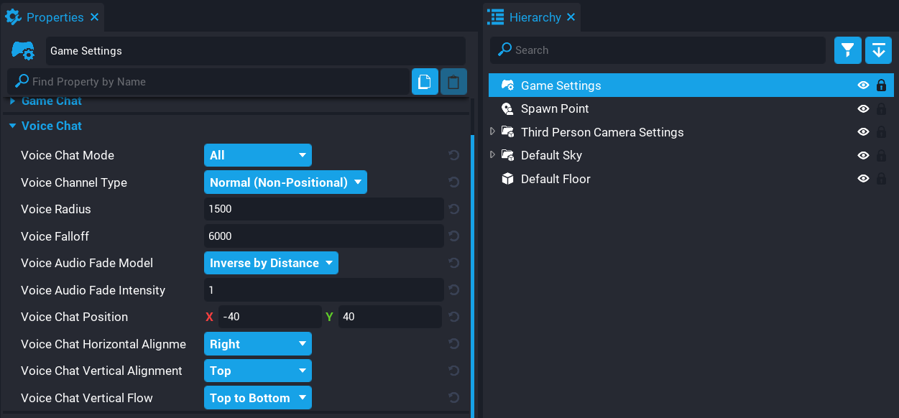
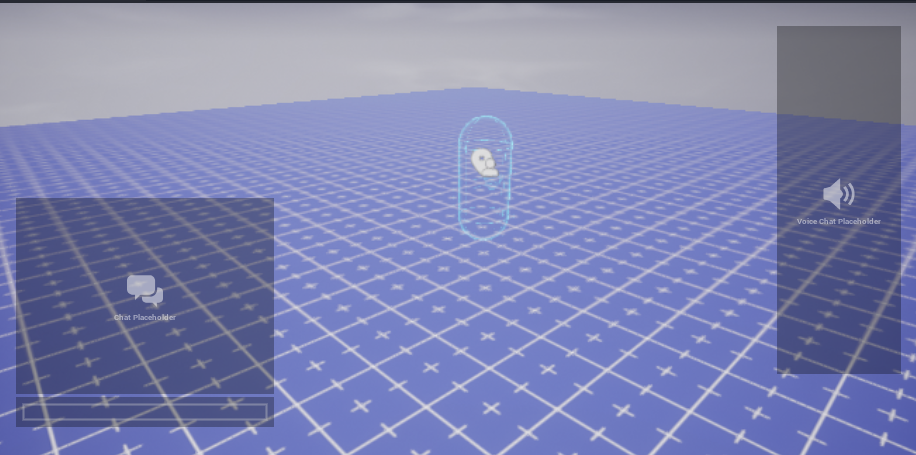

# Voice Chat

## Summary

The `Voice Chat` system in **Core** allows for the players to talk to each other in game by using a microphone. The **Voice Chat** system can allow for players on the same team to talk to each other to discuss tactics, or open to all.This can make games much more enjoyable and can improve the experience for players.

## Enabling Voice Chat

All new projects created have **Voice Chat** enabled by default with the **Voice Chat Mode** property set to **All**. Existing projects prior to **Voice Chat** will require enabling it and republishing the game.

**Voice Chat** settings can be found on the **Game Settings** object.

{: .center loading="lazy" }

There are several properties to the **Voice Chat** system. Let's go over what each one does.

### Voice Chat Mode

- **None**

    **Voice Chat** will be disabled for the game.

- **All**

    **Voice Chat** will be enabled for the game, and all players can talk to each other regardless of what team they are on.

- **Team**

    **Voice Chat** will be enabled for the game, and only players on the same team can chat with each other.

### Voice Channel Type

- **Normal (Non-Positional)**

    When players talk they will hear each other no matter where they are positioned in the game world.

- **Positional**

    As players move away from each other, their voices will become quieter. As players move towards each other, the voices will become louder. This is also known as **Proximity Chat**.

### Voice Radius

The radius at which the voices can be heard at full volume.

### Voice Falloff

If the distance from the sound's origin is greater than the sound's radius, the sound will gradually diminish over the falloff distance. The max range a sound can be heard at is the **Radius** + **Falloff**.

### Voice Audio Fade Model

- **Inverse by Distance**

    Fades voice quickly at first, buts slows down as you get further from conversational distance. Formally, the attenuation increases in inverse proportion to the distance. This option models real life acoustics, and will sound the most natural.

- **Linear by Distance**

    Fades voice slowly at first, but speeds up as you get further from conversational distance. Formally, the attenuation increases in linear proportion to the distance. The **Audio Fade Intensity** factor is the negative slope of the attenuation curve. This option can be thought of as a compromise between realistic acoustics and a radio channel with no distance attenuation.

- **Exponential by Distance**

    Fades voice extremely quickly beyond conversational distance + 1. Formally, the attenuation increases in inverse proportion to the distance raised to the power of the **Audio Fade Intensity** factor. It shares a curve shape similar to realistic attenuation, but allows for much steeper rolloff. This option can be used to apply a 'cocktail party effect' to the audio space; by tuning the **Audio Fade Intensity**, this model allows nearby participants to be understandable while mixing farther participants' conversation into a bearable and non-intrusive chatter.

### Voice Audio Fade Intensity

Defines how rapidly voice decreases with distance.

### Voice Chat Position

A **Voice Chat** placeholder will be shown in the editor to show where the **Voice Chat** will appear in game.

The position of the voice chat window can be moved by setting the **X** and **Y** values.

{: .center loading="lazy" }

### Voice Chat Horizontal Alignment

The horizontal alignment for the voice chat window.

The options available are **Left**, **Middle**, and **Right**.

### Voice Chat Vertical Alignment

The vertical alignment for the voice chat window.

The options available are **Top**, **Center**, and **Bottom**.

### Voice Chat Vertical Flow

The vertical alignment for users displayed within the voice chat windows.

The options available are **Top to Bottom** and **Bottom to Top**

## Learn More

[Voice Chat API](../api/voicechat.md)
