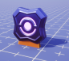

# Reward Points

## Overview

The Reward Points (**RP**) system rewards players for playing games by giving them points they can spend on Core cosmetics. The goal of **RP** is to increase player engagement, to give Perks creators new rewards they can give out to their players, and to encourage players to explore new games.

While they cannot be exchanged for Core Credits, they can be earned for free by playing games. Perks Program creators can add Reward Points to their games to give away a daily **RP** to players of their games.

### Owning, Spending, and Obtaining RP

Perks Program creators will be able to give players **RP** through the Lua API. Using the API, Perks Program creators are able to create their own conditions for giving **RP** to players, such as tying it to an in-game achievement, daily login bonus, or social interaction. This gives Perks Program creators an extra feature to help reward and retain players.

{: .center loading="lazy" }

Games with Reward Points will appear in a dedicated list for players looking to earn RP. This gives games with **RP** extra visibility to players searching for new experiences.

Players are able to earn **RP** in the following ways:

{: .center loading="lazy" }

{: .center loading="lazy" }

## Earning RP in Creator Games

**Perks Program** creators will be able to give players **RP** through the Lua API. **Perks Program** creators will also be able to create their own conditions for giving **RP** to players. Core will be monitoring games that distribute **RP** to prevent creators from abusing the **RP** system or acting in bad faith. When a player is rewarded **RP** by meeting conditions set by a creator, that player will earn equal amounts of **RP** and **XP**.

## Daily RP Limits

A player will be able to earn 500 **RP** from one creator per day across all of that creator's games. This limit is known as the **Creator Daily Cap**.

A player will only be able to earn a maximum of 5000 **RP** every day across all creator games. This limit is known as the **Total Daily Cap**.

If a player cannot receive any more **RP** by fulfilling a creator's condition, then they will also no longer receive additional XP from fulfilling that creator's condition.

Core will be monitoring games that distribute **RP** to prevent creators from abusing the **RP** system or acting in bad faith.

### Retention Bonus

To reward players for logging back into Core frequently, players will earn a higher **Total Daily Cap** and **Creator Daily Cap** for each consecutive day they return.

| Day | Total Daily Cap | Creator Daily Cap |
| :-- | :-------------: | ----------------: |
| 0   |      5000       |               500 |
| 1   |      6000       |               600 |
| 2   |      7000       |               700 |
| 3   |      8000       |               800 |
| 4   |      9000       |               900 |
| 5   |      10000      |              1000 |
| 6   |      11250      |              1125 |
| 7+  |      12500      |              1250 |

If a player loses their login streak, then their caps will reset to Day 0.

## Notifications

When a player reaches their **RP** limit for the current creator, the player will receive a notification that reads "Creator RP Cap Reached".

{: .center loading="lazy" }

When a player reaches the **RP** limit for the day across all creators, the player will receive a notification that reads "Daily RP Cap Reached".

{: .center loading="lazy" }

## Implementing RP with the Core API

Reward Points are granted to the player via Reward Point Events. An example of this can be found in the [daily rewards](../api/player.md#grantrewardpoints) code snippet on the Player API page. Currently only Perks Program creators are able to add these events into their games.

Once you’ve implemented **RP**, you will need to publish your game for them to be activated.

{: .center loading="lazy" }

In the **GAME PUBLISH SETTINGS** screen, click on the empty box at the bottom-left to enable **RP** events in your game.

{: .center loading="lazy" }

### Reward Points Assets

Creators adding Reward Points will have access to three new assets to denote **RP**-related features.

| Reward Points UI Icon | Reward Points UI Flat Icon | Reward Points Medal (RP) |
| :-------------------: | :------------------------: | :----------------------: |
| {: .center loading="lazy" } | {: .center loading="lazy" } | {: .center loading="lazy" } |

<!-- (**Perks Program** creators will be able to enable an in-game widget that will allow players to see how much **RP** the player has earned towards the current **Creator Daily Cap**. The dimensions and position of the widget will be modifiable for **Perks Program** creators via the Core game editor. {: .center loading="lazy"}) -->
