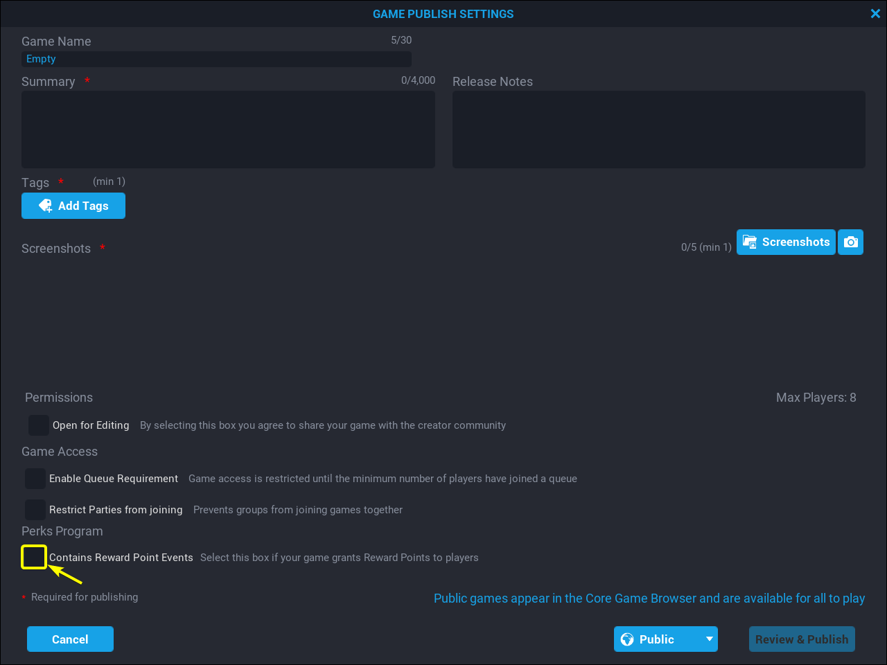

# Reward Points in Core

## Overview

The Grind Currency (“**Core Reward Points**”, or “**RP**”) system rewards players’ engagement with a new currency. This currency can only be spent on platform-level cosmetic items and cannot be exchanged for Core Credits. We will start with Quests as the primary way to earn RP, but also allow **Perks Program** creators to give away an allocation of RP for engagement in their games.

## Goals

The goal of **RP** is to incentivize player engagement in specific game systems and encourage players to explore new games.

### Owning, Spending, and Obtaining RP

You are able to track how many **RP** you have through your **RP** Wallet. **RP** will not expire and cannot be transferred between players. Also, **RP** cannot be exchanged for **Credits** and **Credits** cannot be exchanged for **RP**.

{: .center loading="lazy"}

**RP** is used to purchase Cosmetic Items in Core. Currently **RP** can be used to purchase heroes, mounts, and emotes from the **Shop**. In the future, **RP** will also be used to purchase profile pictures and player housing features.

Players are able to earn **RP** in the following ways:

- Quests
- Games by **Perks Program** creators

Click on the **EARN** button next you your **RP** counter to see a multiple ways you can earn **RP**.

{: .center loading="lazy"}

After clicking on the **EARN** button, you will see a pop up window. Clicking on the **REWARD POINT GAMES** tab in this pop up window will display a list of games that use the **RP** system. Clicking on the **REWARD POINT QUESTS** tab in this pop up window will display a list of quests that you can complete to gain **RP**.

{: .center loading="lazy"}

{: .center loading="lazy"}

## Earning RP in Creator Games

**Perks Program** creators will be able to give players **RP** through the Lua API. **Perks Program** creators will also be able to create their own conditions for giving **RP** to players. Core will be monitoring games that distribute **RP** to prevent creators from abusing the **RP** system or acting in bad faith. When a player is rewarded **RP** by meeting conditions set by a creator, that player will earn equal amounts of **RP** and **XP**.

### Limits

There will be limits on a player's ability to earn **RP**.

- A player will only be able to earn 500 **RP** from one creator per day across all of that creator's games. This limit is known as the **Creator Daily Cap**.
- A plater will only be able to earn a maximum of 5000  **RP** every day across all creator games. This limit is known as the **Total Daily Cap**.
- If a player cannot receive any more **RP** by fulfilling a creator's condition, then they will also no longer receive additional **XP** from fulfilling that creator's condition.

### Retention Bonus

To reward players for logging into Core frequently, players will receive a retention bonus. The retention bonus increases with each consecutive daily login:

- Day 0: 5000 Total Daily Cap, 500 Creator Daily Cap
- Day 1: 6000 Total Daily Cap, 600 Creator Daily Cap
- Day 2: 7000 Total Daily Cap, 700 Creator Daily Cap
- Day 3: 8000 Total Daily Cap, 800 Creator Daily Cap
- Day 4: 9000 Total Daily Cap, 900 Creator Daily Cap
- Day 5: 10000 Total Daily Cap, 1000 Creator Daily Cap
- Day 6: 11250 Total Daily Cap, 1125 Creator Daily Cap
- Day 7+: 12500 Total Daily Cap, 1250 Creator Daily Cap

If a player loses their login streak, then their retention bonus will be reset to Day 0.

### Notifications

When a player reaches their **RP** limit for the current creator, the player will receive a notification that reads "Creator RP Cap Reached".

{: .center loading="lazy"}

When a player reaches the **RP** limit for the day across all creators, the player will receive a notification that reads "Daily RP Cap Reached".

{: .center loading="lazy"}

### Adding RP To your Game

Currently only **Perks Program** creators will be able to add **RP** events into their games. To enable **RP** events in your game, you must publish your game.

{: .center loading="lazy"}

In the **GAME PUBLISH SETTINGS** screen, click on the empty box at the bottom-left to enable the **RP** events in your game.

{: .center loading="lazy"}

### Additional Content

**Perk Program** creators will also be given three new assets related to the **RP** system:

| Reward Points UI Icon | Reward Points UI Flat Icon | Reward Points Medal (RP) |
|:---------:|:--------------:|:-------------:|
| {: .center loading="lazy"} | {: .center loading="lazy"} | {: .center loading="lazy"}

**Perks Program** creators will be able to enable an in-game widget that will allow players to see how much **RP** the player has earned towards the current **Creator Daily Cap**. The dimensions and position of the widget will be modifiable for **Perks Program** creators via the Core game editor.

{: .center loading="lazy"}
