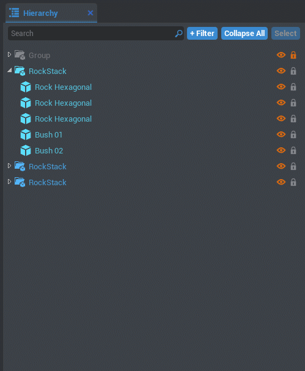

# Art in CORE

!!! warning
    Flagged for Review.
    Incomplete or outdated information may be present.

## Overview

The CORE™ editor comes with all sorts of built-in 3D models and props for using and combining in any way that you can imagine!

By resizing and combining different shapes and props, anything can be made!

**You won't need to understand 3D software or modeling to create beautiful art in CORE.** While some aspects are similar, it's up to you how complex you wish to work. You could skip the art-making phase and use the finished props from the **CORE Content** tab, or you could browse through what other creators have shared on **Community Content**.

{: .center}

### Pre-Made Props & Assets

To find all the 3D models already included in CORE, start by looking in the **CORE Content** tab, found in the bottom left window of the editor.

This window can also be accessed via the dropdown "**View -> CORE Content**". tab

{: .center}

Currently, there are **5 different sections** that contain models to use right away:

- **3D Text**
    - All 3D letters and symbols found on an English keyboard.
- **Basic Shapes**
    - Cubes, cylinders, spheres and more.
- **Nature**
    - Rocks, plant foliage, and all props related to setting the natural world.
- **Props**
    - Whole objects like benches, shields, tables, and various weapon parts.
- **Tilesets**
    - Sets of parts that could be used for constructing houses, cities, and castles.
    - This category also includes handy whitebox (also known as very basic versions of building parts) pieces for level design and planning a map.

These larger categories can be found by clicking the little drop down arrow on the left side of the 3D Objects button label. Each of these categories also have subcategories, that can be opened the same way:

{: .center}

To use any of these models, simply click and drag one out from the CORE Content tab into the scene or the hierarchy.

{: .center}

---

### Move, Rotate, & Scale

{: .center}

The **red**{: style="color: red"}, **blue**{: style="color: blue"}, and **green**{: style="color: green"} arrows indicate the different directions a model can be moved along. Modeling and placement uses 3 main functions: **Move**, **Rotate**, and **Scale**. These different modes can be toggled between by either clicking the different buttons at the top left of the CORE editor, or by using the keys <kbd>W</kbd>, <kbd>E</kbd>, and <kbd>R</kbd>, respectively.

{: .center}

---

### Color Your Way: Changing Model Materials

While CORE does have a distinct art style, all of this can be changed and modified to whatever your vision may be.
The colors and patterns on a 3D model are known as "materials". The easiest way to create a dramatic change is to alter the materials of a model, either to a completely different material, or by editing the settings of a material.

{: .center}

When a model is selected, all of its settings will show up in the **Properties** window. To find the settings for altering a material, scroll down in the Properties window to the section labeled "Base Material". Different objects may have different names for their material slots.

Some models can only have one material, while others are able to have **multiple materials** applied on different parts of the model.

{: .center}

In the case of this "**Craftsman Chair 01**", there are 3 different material slots. One for the wooden base, one for the cushion, and one for the metal details.

There are two ways to change these material slots:

- **Drag a material** from the **Materials** section of the CORE Content tab to the **Material** slot in the **Properties** window. Check out how it's done below:

{: .center}

Or:

- **Double-click the Material slot** and select a material from the pop-up window:

{: .center}

Applying materials in this way allows you to adjust the color of the material. To alter even more options for the material, such as roughness and emissive amount, you can create your own custom material.

#### Creating Your Own Custom Materials

In your own project, you have the ability to create **Custom Materials**. This allows you to customize the settings of a specific material, and apply it to multiple objects. This way when your custom material is updated, it changes all models with that material at once!

!!! info "To read more about creating custom materials, as well as more in depth details about materials, check out our [Materials Guide](custom_materials.md)."

{: .center}

---

### Getting Complex: Combining Models

Using pre-made models in CORE is not the only way to create art. By arranging different props together, your imagination is the limit!

{: .center}
*All of these objects and scenes were created using basic shapes and props combined in CORE.*

The process of making more complex models in CORE is all about groups and folders. Build whatever shapes you would like, and use either folders or groups to combine them.

Using a **folder** to combine objects will allow you to select a single object when clicking. See this below:

{: .center}

Using a **group** to combine objects will select the entire group at once when clicking a single object:

{: .center}

Use whichever method suits your needs more. Groups have two different modes that can be switched between for selection as well--this way you can use groups but still select the contents individually.

{: .center}

As well as the drop down on the top menu, the hotkey <kbd>C</kbd> can be used to toggled between group select and object select.

#### Efficient Game Model Creation

A huge part of creating video games is making sure that they work, and that they run smoothly!

Whenever you create models that **will never change during gameplay** and will always stay stationary--such as a tree--they will need to be kept in a **Static Context** folder. This way their data is never updated while the game plays, so they don't take up power that would be useful for other mechanics.

{: .center}

On the other end, you might make a model that **does move during game runtime**: like a gear that rotates or a windmill. This process of continuous movement is pretty expensive for the game to run--it can cause lag. To better optimize this, place all objects and scripts that will be moving in a **Client Context** folder.

{: .center}

{: .center}

When placing objects in a **"Client Context"** folder, players will not be able to collide with them. They'll just pass right through. To give them collision for gameplay, place other shapes around the whole object that are outside of the Client Context folder, and turn their visibility off. Make sure their "**Collidable**" checkbox is also marked. These settings can be changed from the object's "**Properties**" window.

This is a great way to create **fake collision**. The player will collide with the invisible object, rather than the moving shapes.

---

#### Publishing a Template to Community Content

Now that you've made a template for yourself, let's share it with the world!

Navigate to the template you wish to publish within **Project Content**. Right click it, and select "**Publish to Community Content**". It may prompt you to save, and then a window will open for filling out more details of your template.

{: .center}

{: .center}

In this window, you can name your template and give it a description. Make sure to check the box **Is Public** for other players to find it. When you're ready, click "**Review & Publish**". Confirm that everything looks right, and click "**Publish**".
Now other users can find and search for your template on Community Content!

#### Updating and Republishing Templates

One of the huge benefits of templates is being able to update many objects at the same time! When using several of the same template, changes can be made to one and then automatically sent to update all the others.

{: .center}

You will notice when making changes to a template, it will ask if you would like to "**Deinstance**" the template. Click "**Yes**" when this prompt appears.
A deinstanced template will have text color change from *blue*{: style="color: var(--core-color-templetized)"} to *teal*{: style="color: var(--core-color-deinstanced)"}. It is still a template, but has changes that the other instances of this template will not.

Once you have made changes you would like to send to all other instances of the template, right click the altered template. Click "**Update Template From This**" to send changes. All the templates will now match the updated one!

{: .center}

This will update the template for your project personally, but in order to update a template that has been published to **Community Content**, we will need to re-publish the template.

In your **Project Content**, find the published template that you wish to update. Right click the template, and click "**Republish**". It'll bring up the same window as for publishing a template, so that you may update the description if you like.

{: .center}

"**Download Latest**" will update your local project template with whatever the most recent published version of template exists on **Community Content**.

#### I Change My Mind: Resetting a Deinstanced Template

When you make a change to an instance of a template, the text turns blue and it is "**Deinstanced**". There might be times when you don't like the changes you've made, and you would like to return to your original template.

To do this, right click an object in the template and select "**Reset to Template**". This will revert the template back to the original design!

#### Downloading & Using Other Creator's Templates

Templates made by other people can be downloaded from **Community Content** and re-used as anything you like. This is a great way to focus on getting to your final idea faster than creating everything from scratch!

If you wish to publish a re-used template to Community Content, it must be as its own new and separate template.

{: .center}
