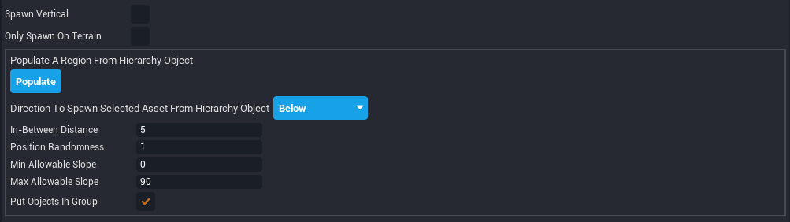

# Environmental Art in CORE

!!! warning
    Flagged for Review.
    Incomplete or outdated information may be present.

## Abstract

Learning modelling basics in CORE by making delicious food. (TODO)

* **Completion time:** ~20 minutes (TODO)
* **Knowledge level:** Basic editor (TODO)
* **Skills you will learn:**
    * Generating terrain
    * Underwater post process effect
    * Fog

{: .center}

## Generating Terrain

1. Generate terrain by navigating to the toolbar and clicking on the **Terrain Creator** button. Click **Generate Terrain** from the drop down menu,

    {: .center}

2. The **Generate Terrain** window will pop up.

    {: .center}

    As you can see there are many different terrain types to choose from out of the box. You can also import height maps for a more customised world (link to height map tutorial).

3. Select **Rolling Hills** and click **Generate**.

    {: .center}

    Voila! Let’s spruce things up a bit by deleting the floor (which is still visible) and changing the material of the terrain.

4. Delete the floor by navigating to the **Object** menu in the top bar and selecting **Remove Old Floor**.

    {: .center}

5. Time to apply a material to the terrain. You can apply any material you wish. If you want to easily find a realistic terrain material go to the search bar in the **CORE Content** tab and search “**Terrain**.”

    Drag the material of your choosing onto the terrain to apply it.

    {: .center}

    {: .center}

## Editing Terrain

1. Let’s carve out an area to make an oasis in this rolling desert. You can edit the terrain by clicking on the pencil icon next to your **Primary** terrain in the **Terrain Creator** drop down menu.

    !!! note "Tip: Primary Terrain is the terrain in your scene with collision enabled. You can have multiple terrains, but only one can have collision."

    {: .center}

    #### Mode and Shape

    {: .center}

    **Mode** allows you to change how you are affecting the terrain.

    *  **Add Terrain**: Raise the terrain level
    {: .image-inline-text}
    *  **Subtract Terrain**: Lower the terrain level
    {: .image-inline-text}
    *  **Smooth Terrain**: Make terrain edges less jagged and hills less prominent
    {: .image-inline-text}
    *  **Level Terrain**: Create a flat plane
    {: .image-inline-text}
    *  **Paint Terrain material**: Change the terrain material with a brush
    {: .image-inline-text}

    **Shape** allows you to customize the brush you use to change the terrain.

    * **Brush Type**: Change the style of the brush you are using. Current options are: Project, Sphere, and Cube.

    * **Size**: Control how large or small the brush is.

    * **Falloff**: Controls how steep changes to the terrain are.

    * **Stride**: Controls how much you need to move the mouse to affect the terrain.

    {: .center}

2. Click and drag on the terrain to lower the terrain level. Experiment with the shape controls. When you find shape settings you like, make a crater in the terrain.

    {: .center}

    Here are the settings I used:

    {: .center}

3. Smooth the terrain by changing the mode from **Subtract Terrain** to **Smooth Terrain**. Note that changing to **Smooth Terrain** mode automatically sets the **Brush Type** to **Sphere**.

    {: .center}

#### Painting

!!! warning "Terrain painting is an experimental feature and it may be disabled."

The paint tools allow you to write an RGBA color value to the terrain. The terrain material then interprets that color value to determine what the surface looks like.

There are three broad categories of materials:

1. Basic materials (non-paintable): These materials provide a predetermined texture and aren't altered by the RGBA color painting. Most materials in the catalog are like this.
2. Color paintable materials: Select materials can be tinted with an RGB color.
3. Textured paintable materials: Select materials can blend between five different materials, based on the values in the RGBA color channel.

The color paintable and texture paintable materials can currently be found in the experimental Terrain Materials section of the library:

{: .center}

!!! warning "The Textured Paintable materials you want to use here are named "4-way Blend". Materials marked "4-way Alpha" are obsolete, incompatible with the painting tools - and will be removed."

Assign a Textured Paintable material to the terrain by dragging and dropping it onto the terrain surface (eg: "Terrain 4-way Blend"). Once assigned, the following section of the Terrain Editor panel allows you to select a material blend:

{: .center}

TODO: wip chris, explain + and - channels

### Adding Water

1. Drag a **Cube** into the scene. Place in the middle of your crater.

    {: .center}

2. Resize the cube until it fills your crater.

    {: .center}

3. Find the **Generic Water** material in the materials section of the **CORE Content** tab. (Or search for “**generic water**” in the **CORE Content** tab search bar). Apply it to our resized cube.

    {: .center}

    Congrats! Your cube is now a pasable pond. Let’s add the ability to swim in it.

### Creating a Swimmable Volume

1. Select the cube we applied the **Generic Water** material to. Under the **Scene** section, uncheck **Collidable**. This will allow the player to pass through the water.

    {: .center}

    Press play and walk into the water

    {: .center}

    Now you can pass through the water, but once inside it doesn’t look like we are underwater at all. We can use the **Underwater Post Process** volume to achieve an underwater effect. The **Underwater** volume will also allow us to swim inside the water.

2. Find the **Underwater Post Process** volume under the **Post Processing > Scene** section in the **CORE Content** tab. Drag it into your scene on top of your water. (Your **Main Viewport** may change color for a second - this is normal).

    {: .center}

    {: .center}

    If you can’t see the blue outline of the **Underwater** volume, press <kbd>V</kbd> to enable Gizmos.

3. Select the cube we applied the **Generic Water** material to. Go to the **Transform** section in the cube’s **Properties** tab and **right click** on the word **Position**. Click **Copy [Position]**.

    Now select the **Underwater Post Process** volume and go its **Transform** section in its **Properties** tab. Right click on Position and select **Paste Last Copied (...)**. Now the **Underwater** volume is positioned where our water is.

4. We need to resize the **Underwater Post Process** volume so it is the same size as our water. Repeat the copy and paste process we just used to change the **Underwater** volume’s **Transform** properties, but with **Scale**.

    Press play and jump in!

    {: .center}

    Success!

5. (Optional) You can customize the **Underwater Post Process** volume so your water looks exactly how you want it to. Select the **Underwater** volume and check out the **Smart** section under its **Properties** tab. You can hover over each property name to read its tooltip and find out what it does

### Adding Details

Let’s add some foliage around our oasis. We can manually place every bush or rock, which is time consuming, or we can use the Object Generator to randomly spawn plants (or anything we want) very quickly.

1. Let’s start by duplicating our water cube. Select the cube and press <kbd>CTRL</kbd> + <kbd>W</kbd> to quickly duplicate the cube. Drag our newly cloned cube above our pond. It will look weird but don’t worry.

    {: .center}

2. Let’s spawn some grass around our water. In the **CORE Content** tab go to **Environment > Foliage** and find the **Grass Short** asset.

3. Open the **Object Generator** by going to the **View** menu in the top bar.

    {: .center}

4. Make sure our duplicate cube is selected in the **Hierarchy**.

    {: .center}

    Make sure the **Grass Short** asset is selected in the **CORE Content** tab.

    {: .center}

    Both the **Cube** and **Grass Short** asset should be highlighted in blue.

    Click **Spawn Selected Asset Under Selected Hierarchy Object**. You now have randomly generated grass!
    If you don’t like how it looks, you can delete the grass and experiment with the settings in the **Object Generator** tab until you settle on something you like.

    #### Using the Object Generator

    {: .center}

    Checking **Randomize Scale** will generate differently sized objects. If you want your scene to feel more realistic, check this box. It is pretty unrealistic to have bushes or rocks that are all the same size - when was the last time you saw that in nature? Even varying the scale a little will make your environment feel more lifelike.

    You can set the **Min Scale** and **Max Scale** to control the range of how big and small your objects spawn.

    
    
    _Randomize Scale unchecked (left) vs. Randomize Scale checked with a Min Scale of 0.7 and a Max Scale of 1.3 (right)_
    {: .image-cluster}

    Check **Use Non-Uniform Scale** if you would like to further fine tune the scale of your objects. You can set the **Min** and **Max Scale** for each of an object’s axis (X, Y, and Z).

    {: .center}

    Yaw is an object’s rotation along the Y-axis. Checking **Randomize Yaw** ensures all of your objects will be facing different directions. This is another box you should keep checked if you want your scene to feel more realistic!

    
    
    _Randomized Yaw unchecked (left) vs. checked (right)_
    {: .image-cluster}

    {: .center}

    If you would like to randomize the color of your spawned objects check **Use Random Color**. Most objects in real life aren’t the same color, however setting the correct min and max RGB values can be tricky… it can be hard to understand if you aren’t already familiar with how RGB values are assigned. Unfortunately we won’t be covering it in this tutorial!

    
    
    _Randomized Color unchecked (left) vs. checked (right)_
    {: .image-cluster}

    {: .center}

    **In-Between Distance** controls how far apart objects are from each other in meters. If **Distance** is set to `5`, each object will spawn in the center of a 5x5 meter square. Higher numbers means objects will spawn further apart.

    
    
    _In-Between Distance set to 5 (left) vs. set to 2 (right)_
    {: .image-cluster}

    **Position Randomness** is a percentage that randomizes the placement of each object based on what **In-Between Distance** is set to. If Distance is set to `5` and **Randomness** is set to `0`, each object will spawn in exactly the center of a 5x5 square. If you set **Randomness** to `1`, each object will spawn up to 5 meters away (100% of **Distance**) from the center of it’s square. If you set **Randomness** to `2`, each object will spawn up to 10 meters away (200% of **Distance**) from the center of it’s square.

    TL;DR: The higher **Position Randomness** is set to, the more displaced objects spawned will be.

    
    
    
    
    _Randomness set to 0 (top left), Randomness set to 0.5 (top right), Randomness set to 1 (bottom left), Randomness set to 3 (bottom right)_
    {: .image-cluster}

    Leave **Spawn Upright** unchecked if you want your objects to spawn aligned to the terrain. It’s best to leave **Spawn Upright** unchecked for organic things like plants and trees.

    
    
    _Spawn Upright unchecked (left) vs. checked (right)_
    {: .image-cluster}

    Checking **Only Spawn On Terrain** ensures spawned objects will only spawn on the terrain - if left unchecked they will spawn on anything underneath the object selected in the **Hierarchy**.

    
    
    _Only Spawn on Terrain checked (left) vs. unchecked (right)_
    {: .image-cluster}

    Keep **Group In Folder** checked to spawn all new objects in a folder. This helps keep your Hierarchy organized.

    You can also spawn individual objects using the **Object Generator**’s settings by placing your cursor in the scene and pressing <kbd>SHIFT</kbd> + <kbd>X</kbd> with an object selected in the **CORE Content** tab. The object will spawn under your cursor. This allows you finer control over an object’s placement without having to worry about randomizing its rotation, scale, or color.

    !!! info "Tip: Templates you’ve created or downloaded from Community Content also work with the object generator!"

5. Continue using the **Object Generator** to decorate your scene. When you are done, delete the duplicate water cube.

## Summary

TODO

{: .center}
