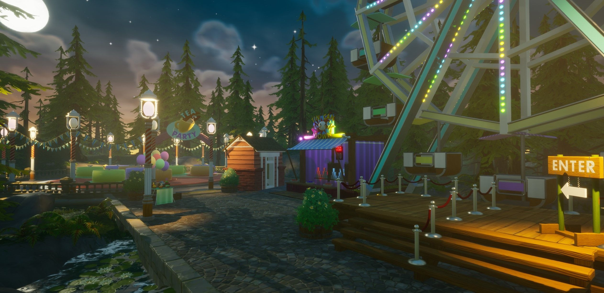

# Visual Effects in CORE

## Overview

VFX is awesome!! We have lots of pre-made effects.

This tutorial goes hand-in-hand with the VFX level that is playable on coregames.com

To get a tour of what is possible with visual effects in CORE, run around this map and then come back to this tutorial to learn how to make effects like this map!

While the map explains many useful things about how to use all the visual effects, this page will go step-by-step through two different ways to use lua in CORE to make something awesome.

{: .center}

### Pre-Made VFX & SFX

CORE comes with tons of visual effects built-in, all with different parameters for messing with.

This window can also be accessed via the dropdown "**View -> CORE Content**". tab

{: .center}

Currently, there are **5 different sections** that contain models to use right away:

- **Character**
    - These vfx are specifically human or character-focused.
- **Environmental**
    - Elemental effects, and effects that are more nature-oriented.
- **Explosions**
    - Definitely things that blow up!!
- **Magic**
    - More ethereal and sparkly effects.
- **Misc**
    - Things that don't fit in other categories--weird stuff!
- **Vehicles**
    - Effects designed to enhance movement and show industrial power.
- **Weapons**
    - These effects were designed specifically with the weapon system, and to go with attacks.

These larger categories can be found by clicking the little drop down arrow on the left side of the Effects button label. Each of these categories also have subcategories, that can be opened the same way:

{: .center}

To use any of these models, simply click and drag one out from the CORE Content tab into the scene or the hierarchy.

{: .center}

### Tutorial: Part One

Let's make a VFX that plays constantly, combined of several parts!

We'll combine several different effects, change lots of the settings, and display several of it around a level.

Perhaps we'll make a torch and light a scene in the darkness.

Blue demon flames, perhaps? Combined with custom materials on props?

### Tutorial: Part Two

Let's make a VFX that gets triggered by the player!

This time we'll make a pickup the player can grab that triggers an effect on the moment of pickup--making things much fancier.