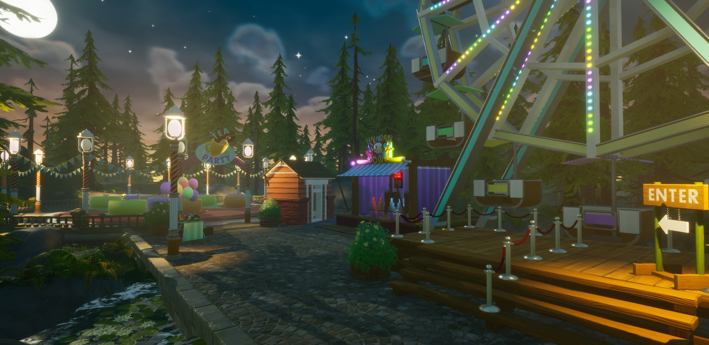

# Art in Core

## Overview

The Core editor comes with a variety of built-in 3D shapes, props, and materials to use as a basis for creating new models. All original models for games are made using this content, which is downloaded with the Core Launcher itself, so that games and projects can be loaded almost instantaneously.

Creators can make games entirely using the finished props provided by Core in the **Core Content** window and models made by other creators in the **Community Content** window.

{: .center loading="lazy" }

## Modeling

### 3D Objects in Core Content

All the 3D models already included in Core, start by looking in the **Core Content** tab, found in the bottom left window of the editor.

{: .center loading="lazy" }

Currently, there are **5 different sections** that contain models to use right away:

- **3D Text**
    - All 3D letters and symbols found on an English keyboard.
- **Basic Shapes**
    - Cubes, cylinders, spheres and more.
- **Nature**
    - Rocks, plant foliage, and all props related to setting the natural world.
- **Props**
    - Whole objects like benches, shields, tables, and various weapon parts.
- **Tilesets**
    - Sets of parts that could be used for constructing houses, cities, and castles.
    - This category also includes handy whitebox (also known as very basic versions of building parts) pieces for level design and planning a map.

These larger categories can be found by clicking the little drop down arrow on the left side of the 3D Objects button label. Each of these categories also have subcategories, that can be opened the same way:

To use any of these models, click and drag one out from the Core Content tab into the **Main Viewport** or the **Hierarchy**.

    <video autoplay loop muted playsinline poster="/img/EditorManual/Abilities/Gem.png">
        <source src="/img/EditorManual/Art/DragOutAsset.webm" type="video/webm" />
        <source src="/img/EditorManual/Art/DragOutAsset.mp4" type="video/mp4" />
    </video>

### Community Content

Models, scripts, and whole collections of useful pieces for games can be found in the **Community Content** window. See the [Community Content](community_content.md) reference to learn more about using these models.

### Materials

The colors and patterns on a 3D model are known as **materials**. The easiest way to create a dramatic change is to alter the materials of a model, either to a completely different material, or by editing the settings of a material.

Materials can be entirely customized, and saved changes to them synchronized across a project. See the [Custom Materials](custom_materials.md) reference to learn more.

### Complex Models

Using pre-made models in Core is not the only way to create art. Models can be combined using **folders** and **groups** to be treated as a single piece.

To learn more about grouping objects, see the [Complex Modeling](modeling_reference.md) reference.

### Templates

Templates allow you to synchronize changes to one model across all of its copies, transfer models between projects, and share them for the rest of the Creator Community to further develop or use in their games.

To learn how to create and share templates, see the [Template](template_reference.md) reference.

## Environmental Art

See the [Environmental Art](environmental_art.md) to learn about the Core Terrain Tools.

## Visual Effects

See the [Visual Effects](vfx_tutorial.md) tutorial to learn more about using Visual Effects in Core.
