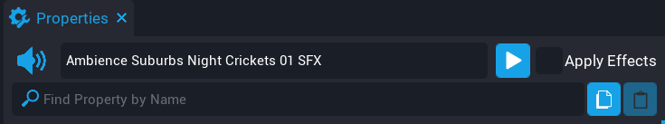

# Audio in Core

!!! warning
    Flagged for Review.
    Incomplete or outdated information may be present.

## Overview

In **Core**, there is a massive, built-in library of high quality audio assets that were designed with the beginner and advanced creator in mind. There are plenty of sound effects, background music tracks, and instruments encompass a wide variety of genres and moodsCoreRE audio assets come with powerful customizable properties that allow you to create a wide variety of soundscapes for your creations.

When a player makes an action like jumping or running in Core, sound effects (like grunts or footsteps) play by default in the client.

Most sounds are dynamically produced, meaning you do not have to worry about repeating sounds sounding monotonous and robotic. For example, the gunshot sounds will never sound the exact same every time and footstep sound effects also change depending on whether a character is running over water or brick.
In most sound effect implementation scenarios, a developer would usually have to write a script for a sound to randomly choose from a set of variations and/or have them slightly varied by pitch/volume/texture every time it is triggered.
The Core audio engine takes care of this for most sounds and you will still have the flexibility to script more dynamic audio via script if you wish to do so.

You can drag and drop an Audio CoreObject from the **Core Content** tab and customize its properties, which is also exposed for use in Lua scripts.

### How to Find Audio

You can simply find audio in the Core Content and look through the many sound types and genres. You can also use the search field to look for something specific. It's always good to listen and try out different sounds since many sounds could have many uses other than what they are labeled as.

### How to Play Audio

{: .center }

After adding your chosen audio asset to the hierarchy, you can you can preview audio by pressing the blue play button to the top right. If you check the button for "Apply Effects" to the right, you will hear a preview of the audio with your customized parameters. If you have attenuation or spatialization options enabled, you will hear those based on your current camera position in the editor.

Alternatively, you can activate audio at any time via script access with the audio function `:Play`. For example, when a player interacts with a doorbell, you may want to activate a bell SFX in a Trigger's script. In such a case, you may want to reference the audio with a "**CoreObject Reference**" custom property or as a child of a script. You can read more about scripting audio triggers and scripts in Lua via the [Audio section of the API documentation](core_api.md#audio).

### Audio Properties

{: .center }

There are several customizable properties to any audio asset. Let's go over what each one does, and how it affects the sound.

#### Enable Spatialization

Enables spatialization of a sound. This will allow your sound to be heard in specific positional channels based on the position of the sound object. For example, if the sound source is to the left of you, it will sound like it is to the left of you. The same goes for any other direction.

#### Enable Attenuation

Enables volume based on distance of a sound. This essentially means the sound will fade out to 0 volume at a distance and vice-versa.

To achieve full 3D positional sound, ensure that you enable both spatialization and attenuation.

Background ambience and music is best suited to have spatialization and attenuation disabled.

For example, a simple way to do "audio zones" an area on your map you want to hear certain music, you can disable spatialization and enable attenuation to easily fade in a music track that will be heard in stereo (left and right speakers) where you want players to hear it. You'll have to adjust radius and falloff accordingly as needed.

#### Enable Occlusion

When enabled the audio will change attenuation if there is geometry between the player and the audio. The audio engine will handle volume attenuation, low pass frequency filters and other digital signal processing effects (DSP) in real time accordingly when geometry occludes the sound source and the listener. Most sounds that exist in 3D space in your game world should have this option enabled.

#### Auto Play

When enabled the sound will automatically upon object spawn.

#### Transient

When enabled the sound will destroy itself after playing. The Transient flag is great for cleaning up a sound after it spawns and finishes playing. Suggested use is at level start or in templates for one-time sounds such as when spawning objects.

You can customize how the audio sounds in an environment with control over spatialization, attenuation, and occlusion. Distance parameters for radius/falloff are given in units of centimeters, so 100 is 1 meter. Radius and falloff values of approximately 2000 are a good starting point for room-scale sounds.

#### Repeat

When enabled the sound will repeat and retrigger after it is done playing. Note that sounds such as ambient backgrounds and music that are designed to seamlessly loop will do so without this enabled. These sounds will require scripting to stop them using `:Stop` after they are called by `:Play` or if they are set to auto play on spawn.

#### Pitch

This will adjust the pitch +/- in cents. At 0 the pitch will remain unmodified. For example +100 cents is +1 half step and +1200 cents is 12 half steps or one full octave.

#### Volume

This will adjust the volume the sound plays at. This is a ratio, so at 0.5 the sound will be at half volume. At 1.0, the sound plays normally.

#### Radius

This is the radius at which the sound plays at full volume in centimeters (cm). At 100, the sound will be heard at full volume up to 1 meter. If the listener is further than this, the sound will attenuate based on the falloff distance value.

#### Falloff

!!! note "This is the radius of the volume falloff distance in centimeters (cm). If the distance from the sound's origin is greater than the sound's radius, the sound will gradually decrease in volume over the falloff distance. The maximum range a sound can be heard is RADIUS + FALLOFF."

When visual gizmos are toggled on (by pressing <kbd>V</kbd> in the editor) Radius and Falloff values can be seen in the editor to help creators have a better visual understanding of how their sounds are heard in their games.

{: .center }

#### Fade In Time

Sets the default fade in time in seconds when the audio is played. When played, it will start at 0 volume and fade in over this many seconds.

#### Fade Out Time

Sets the default fade out time in seconds when the audio is played. When played, it will start at the selected volume and fade out to 0 volume over this many seconds.

#### Start Time

The start time of the sound in seconds. Default is 0. Setting this to anything else will skip the audio ahead that many seconds when the audio is played.

While some audio properties can be applied while sounds are playing (such as the audio properties volume and pitch), others (such as `isSpatializationEnabled`) require the sound to be stopped and restarted to take effect.

## Audio Networking

By default, playback will be networked to all clients. If an Audio object is simply placed in the scene and played, any connected clients within range also hear the sound playing. For client-specific playback, place the Audio object in a Client NetworkContext folder. In such a case, playback would be started by a client script, and different sounds could be heard on each client. Example use case: victory music only playing for the winning team.

### Best Practices for General Audio

- It's not always as it may seem; Like many of our assets in Core, just because something is named or labeled as something specific doesn"t necessarily mean it is only for that use. In professional sound design a lot of commonly heard sounds in games, TV and film are created by using objects and sources you wouldn"t expect. For example, you can use "**Parachute Open 01 SFX**" asset for something else entirely such as a sail unfurling or a flag waving in the wind.
- Size matters; Generally smaller objects are higher in pitch than ones that are much larger. Same goes for volume. A smaller insect will make less sound than a giant one for example. Also think about the size of your map. If you want things such as explosions or gunshots to be heard across the entirety of your map, adjust the falloff and radius values of your sounds accordingly.
- Audio is meant to compliment the visuals and in-game elements on-screen and help immerse players into your game. Pay attention to visual and world elements as they could potentially be things you"d want to implement sound for.
- Know when to enable or disable 3D sound; Is it background music? Is it background nature ambience? Is it emitting from an object inside your 3D world? Make sure you adjust your spatialization, attenuation and radius values accordingly.
- Knobs, parameters, values, oh my! Have fun and experiment. There are more than enough audio properties you can change to create a wide variety of soundscapes in Core.
- Layering! This is an essential part of sound design where combining different sounds can yield interesting results. As mentioned before, think about complementing the visuals; If you create a lightning sword, perhaps you could layer **Electric Spark Short 01 SFX** on top of a **Sword Swing Swipe 01 SFX** sound.

## Audio with Special "Smart Property" parameters

Like many of the other assets in Core such as VFX and materials, there are a handful of audio assets with various smart properties specific to those assets.

Usually you'll find that some audio assets have several similar variations that can be selected via a drop down selection menu.

{: .center }

You'll mostly find this in "**Music Score Sets**" or "**Gunshot Sets**" for example.

Note: As a reminder for smart properties, they can be adjusted and modified via script using: `GetSmartProperty(string)` or `SetSmartProperty(string, value)`. See API documentation regarding Smart properties [here](core_api.md#smartobject). When referencing drop-down strings, keep in mind that Lua is case-sensitive and they must be referenced exactly as they are listed.

Others will have very specific parameters that pertain to that asset in particular, so be sure to read the tooltips when modifying these options.

{: .center }

In this example we're looking at the "**Gunshot Sniper Rifle Set 01 SFX**" asset. The tooltips will help you better understand what these parameters do. It's always a good idea to try things out to find what works best for your game!

The **Extend Resonance** option will ensure that each gunshot will fully resonate instead of being cut off early. This may be useful for larger-scale open world maps when you want your sniper rifle shots to ring out at far distances.

The **Enable Dynamic Distance** option will allow a "designed at distance" sound to be heard the further you are from the source sound. This option exists for the other gun sounds, explosions and other similar big-impact sounds since these sounds generally sound vastly different at a distance compared to most other commonly heard everyday sounds.

Another great example of an extremely easy to use, powerful and versatile sound asset would be our **Explosion Creation & Construction Kit**.

The parameters at this point should already look familiar to you, but here you will find them in a single asset since explosions are one of those sounds that usually require several layers of sound elements.

If each of these sets were individual assets, you could achieve the same results using those with layers of scripts, however we've done the heavy lifting here for you in this case so that you can create an explosion that's right for you! Remember that each sound, even the individual layers are already dynamic enough as-is and will never sound repetitive or the same every time. You could easily just use one layer of the explosion creation kit if you wish and still have a viable explosion sound.

{: .center }

## Core Content Audio Library Overview

There are plenty of audio assets with powerful customizable properties to suit a wide variety of game creation ideas. Let's do a quick overview of what you'll be able to find, and how things are organized in the Core Content library. Audio assets are categorized by a main category based on their ideal usage and have sub-categories.

**Ambience & Backgrounds** - Background ambient sounds that encompasses various environment types

- Industrial
- Military
- Nature
- Room Tones
- SciFi
- Synthetic Drones
- Urban

**Game Sounds** - Sounds that generally relate to gameplay elements such as sounds for win/lose popups, leveling up or other similar meta game events

- Fantasy
- Generic
- Retro
- SciFi

**Instruments** - Musical instruments that you can use to script/import your own music into Core

**Music** - This is where you can find all of the music. More details on music below in the Music section of this doc

- Background Music (BGM)
- Music Stingers

**Player Sounds** - Sounds that relate to the player movement, impacts and voices

- Body Impacts
- Clothing and Gear
- Footsteps
- Player Voice Over
- Slides

**Sound Effects** - This is where the majority of general purpose sound effects live. There are a wide variety of general sound effect categories to suit a wide variety of game scenarios

- Creature
- Sound Design Sweeteners
- Domestic
- Explosions
- Fantasy
- Food
- Funny
- Impacts
- Industrial
- Magic
- Military
- Nature
- SciFi
- Sports
- Vehicles

**UI** - Sounds that are related to user interface interactions and events such as button clicks, pop up window notifications and more

**Utilities** - This where you can find scripts, post-process audio effects and utilities that relate to audio

**Voice Over** - Voice over clips

- Announcer Voice Overs
- Generic Voice Overs

**Weapons** - Sounds relating to anything and everything relating to weapons

- Firing
- Gunshot Sweeteners
- Handling
- Impact
- Melee
- Reload
- Thrown

## Background Music and Music Stingers

Let's talk music! With Core, you'll be happy to find a wide variety of background music (BGM) tracks of all styles, moods, genres and instrumentation to choose from. We'll always be adding more music tracks through future updates and releases.

Music assets are the same as any other audio assets with the same properties, but music assets are utilized in a vastly different way than most sound effects are used in game creation.

You'll find that our music assets are broadly categorized by well-known music genres and styles used in games:

**Action** - Music for adrenaline pumping sequences. These music tracks generally take elements from other styles but primarily cater to more intense game scenarios.

**Ambient** - Ethereal and drone-like soundscapes that fill the air with a musical atmosphere. These can either be dark, neutral or positive.

**Casual & Fun** - Anything fun and upbeat! Music that pairs nicely with casual games. Some tracks in this category may be ideal for "cute' looking games, casual puzzle games or building games.

**Cinematic** - Music that you'll probably hear watching an epic blockbuster or a tear-jerking drama film. Ideal for games that have strong cinematic or narrative elements when looking to express strong emotions in your game.

**Classical**- Travel back in time to classical music of all moods, classical genres and styles.

**Country & Western** - Mostly guitar heavy music with a country twang. Great for anything with a country or western vibe.

**Electronic** - Anything and everything with heavy electronic synth and drum elements. This genre encompasses a wide variety of electronic music subgenres as well such as dubstep, breakbeat, liquid bass, techno, synthwave and much more!

**Fantasy** - Epic and lush high fantasy music that work for all and any fantasy game scenarios.

**Hip-Hop** - Music that bumps! There are many sub-genres of hip-hop here including trap, lofi, chill and more!

**Horror & Dark** - Music that will bring horror, fear and uneasiness to your games. Great for jump scares, horror scenes, disturbing atmospheres and dark mods.

**Lounge & Jazz** - Music to lounge around to. You'll find various jazz subgenres and general chill lounge music here.

**Rock** - Music driven by distorted/overdriven guitars and heavy hitting drums. You'll find various sub-genres of rock here such as Metal, classic rock, punk rock and more!

**World** - Music from various cultures and nationalities all over the world, both ancient and modern.

In each category you'll find a **Music Score Set** of your chosen genre with all of the music tracks in that genre.

{: .center }

You'll also find several **Music Construction Kits** for music tracks that have their own construction kit where either the _SECTIONS_ of a music track are branched out and separated as individual tracks.

{: .center }

There are also kits where various instrument _LAYERS_ are individually separated with their own volume controls that you can design your own version of the music track or drive the volume sliders via script to create highly dynamic music.

For example, you could adjust the drums and heavy strings volumes to be louder as there are more enemies inside a zone, or fade in the volume of those instruments when you either take or do damage, essentially matching the intensity of the music with the intensity of the action on screen.

{: .center }

Music Stingers generally are used as a one-shot triggered sound hooked up to gameplay events such as win or lose conditions or when achievements are unlocked/earned.

### Best Practices, Tips & Tricks for Background Music

It is best to utilize music with Enable Spatialization disabled so that it can be heard in stereo (left and right speaker channels). If you are looking to have music to sound as if it were coming out of a source inside your game world such as a radio or television, you can simply treat it as any other "world object" sound effect that emits from a 3D object in your scene and enable spatialization, attenuation and occlusion.

- An easy way to simply get background music into your game is to:
    - Add the music track of your choice
    - Disable Spatialization
    - Disable Attenuation
    - Disable Occlusion
    - Enable Auto Play

- If you want music played only in certain areas in your map you could easily achieve this several ways:

    - Using the radius and falloff zones without spatialization; Disable spatialization and enable attenuation to easily fade in a music track that will be heard in stereo (left and right speakers) where you want players to hear it. You'll have to adjust radius and falloff accordingly as needed.
    - By trigger zone script; Script a trigger zone that will call `:Play()` and `:Stop()` as needed when a player enters and leaves the zone. Setting a Fade In or Fade Out time makes this a bit more seamless if there are several music tracks being triggered on and off concurrently. Please read the [Lua API documentation](core_api.md#audio) for more scripting details.

- Experiment with pitch! Sometimes slightly changing the pitch of a music track can result in vastly changing the overall mood and feel of a music track. You could also try taking any two same music tracks and slightly adjusting the pitch up or down to make it sound creepy and unnerving.
