# Creating a Boss Fight

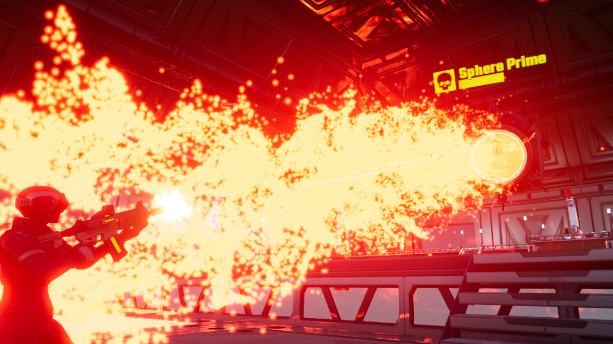{: .center loading="lazy" }

## Overview

In this tutorial you are going to create a multiplayer boss fight. Players will need to disable all of the generators by inserting a pickup that can be found around the map. After all generators have been disabled, the boss will then be vulnerable to damage.

* **Completion Time:** ~3 hours
* **Knowledge Level:** It is recommended to have completed the [Scripting Beginner](lua_basics_helloworld.md) and [Scripting Intermediate](lua_basics_lightbulb.md) tutorials.
* **Skills you will learn:**
    * Using **Community Content**
    * Creating AI using **Activity Handlers**
    * Creating **Damageable Objects**
    * Creating **Projectiles**
    * Creating useable pickups
    * Creating **Curves** for UI animation
    * Changing custom material properties with Lua

## Create a Blank Project

1. Create a new blank project.
2. Delete everything in the **Hierarchy**.

    You will notice the scene preview window will turn black. When you add the assets to the **Hierarchy** in the next section, that includes components such as a Sky Dome.

### Import Asset from Community Content

You will be importing an asset from **Community Content** that will contain various components you will drop into the **Hierarchy** while you follow the tutorial.

1. Open the **Community Content** window.
2. Search for `Boss Fight Tutorial` by **CoreAcademy**.
3. Click **Import**.

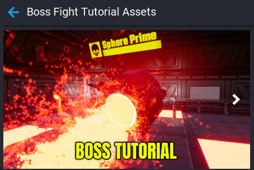{: .center loading="lazy" }

### Add Map Template to Hierarchy

A map has been created for you that you will place into the **Hierarchy**.

1. Click the **Project Content** tab.
2. Click **My Templates** under **All Content**.
3. Add the template **Boss Fight Map** into the **Hierarchy**.
4. Deinstance the **Boss Fight Map** template in the **Hierarchy**.
5. Test the game.

When you test the game, you will be have an environment to move around in.

{: .center loading="lazy" }

## Add Player Weapon

The player needs a weapon for the fight to do damage to the boss and environment objects. In this section you will create a script that gives a weapon to the player when they join the game.

### Create PlayerServer Script

Create a new script called **PlayerServer** and place the **PlayerServer** script inside the group **Boss Fight Map** in the **Hierarchy**.

#### Add Weapon Custom Property

Add the **Advanced Assault Rifle** template onto the **PlayerServer** script as a custom property. Name the custom property `Weapon`.

{: .center loading="lazy" }

#### Edit PlayerServer Script

Edit the **PlayerServer** script and add the code below.

```lua
local WEAPON = script:GetCustomProperty("Weapon")

local function OnPlayerJoined(player)
    local weapon = World.SpawnAsset(WEAPON)

    weapon:Equip(player)
end

Game.playerJoinedEvent:Connect(OnPlayerJoined)
```

The code above will spawn the weapon and equip it on the player when they join.

### The PlayerServer Script

??? "PlayerServer"
    ```lua
    local WEAPON = script:GetCustomProperty("Weapon")

    -- When a player joins, give a weapon
    local function OnPlayerJoined(player)
        local weapon = World.SpawnAsset(WEAPON)

        weapon:Equip(player)
    end

    Game.playerJoinedEvent:Connect(OnPlayerJoined)
    ```

## Test the Damageable Floor Tiles

The map in your **Hierarchy** comes with damageable floor tiles. These tiles are **Damageable Objects** that will spawn a new hot tile which glows and is on fire. If the player stands on that hot tile, they will take damage.

Test the game and make sure the following works.

- Player will spawn with a weapon.
- Player can shoot the floor tiles that will change to hot floor tiles.
- Player can die and respawn.

<div class="mt-video" style="width:100%">
    <video autoplay muted playsinline controls loop class="center" style="width:100%">
        <source src="/img/BossTutorial/test_game_floor_tiles.mp4" type="video/mp4" />
    </video>
</div>

## Create Boss

In this section you will be creating the boss that players will be fighting against. You will be creating some basic AI for the boss to transition between 2 states.

### Create Boss Damageable Object

The boss is going to be a **Damageable Object** that can take damage and die. You will create a **Damageable Object** that will have children components that will automatically be destroyed when the boss reaches 0 health.

#### Add Damageable Object

Add a **Damageable Object** to the **Hierarchy**. You can find this in **Core Content** under **Gameplay Objects**. Name the **Damageable Object** `Boss Damageable Object`.

{: .center loading="lazy" }

#### Set Max Hit Points

Set the **Max Hit Points** to 1000 in the **Properties** of the **Damageable Object**.

#### Set Starting Hit Points

Set the **Starting Hit Points** to 1000 in the **Properties** of the **Damageable Object**.

### Add Boss Geo Template to Hierarchy

A template for what the boss will look like has been included. It also contains some effects, UI, and helper objects that will be used later on in the tutorial.

You will notice there are quite a few components inside the **Boss Geo** template. Some of these will be used later on in the tutorial.

| Object Name | Description |
| ----------- | ----------- |
| Shoot From | Will be used to determine the location of the boss projectile when shooting at a target. |
| EffectsClient | Client script that will listen for when an event is fired so it can play an effect for the boss when shooting a target. |
| Fly Up Text Target | Will be used to position the damage numbers that will fly up and display to the player when shooting the boss. |
| Health Bar | Displays the current health of the boss, this will be updated by a script you will write in a later section. |

#### Add Boss Geo Template

Add the template **Boss Geo** onto the **Boss Damageable Object** in the **Hierarchy** so it becomes a child.

#### Position Boss Damageable Object

Move the **Boss Damageable Object** to the center of the map. Make sure that the **Boss Geo** position is at 0 for **x**, **y**, and **z**.

#### Test the Game

Shoot the boss to make sure it can be destroyed.

## Create Boss Perimeter Trigger

The boss AI will need to know which players are within range so a target can be selected to shoot at. A perimeter trigger will be used to detect players who enter and leave the trigger.

### Add Perimeter Trigger

Add a **Trigger** to the **Boss Damageable Object** and name rename it to `Shoot Perimeter`.

Scale the trigger so it covers the big room.

When scaling the trigger, make sure to cover the big room with the boss. You can make the trigger bigger then the room, but do not overlap the starting room where the players spawn.

{: .center loading="lazy" }

## Create AI Activity Handler

In this section you will be create the AI for the boss. The boss needs to transition between different states depending on what is happening in the game. You will use an **AI Activity Handler** that will have 2 activities for handling the idle and shoot states.

See  for more information about the **AI Activity Handler**.

1. Open the **AI Debugger** from the **Window** menu.
2. Select the **Boss Damageable Object** in the **Hierarchy**.
3. Click **Create New Handler** in the **AI Debugger** window.
4. Rename the new **Activity Handler** in the **Hierarchy** to `Boss AI Handler`.

With the **Activity Handler** created, you will be able to create activities with a script that will be registered with the handler.

{: .center loading="lazy" }

### Create BossAIServer Script

In this section you will be creating the script that will handle the AI for the boss.

#### Create BossAIServer Script

Create a new script called **BossAIServer**, place the script **BossAIServer** as a child of **Boss AI Handler** in the **Hierarchy**.

#### Create Boss Geo Custom Property

Add **Boss Geo** onto the **BossAIServer** script as a custom property and rename it to **BossGeo**.

{: .center loading="lazy" }

#### Create Shoot Perimeter Custom Property

Add **Shoot Perimeter** onto the **BossAIServer** script as a custom property, and rename it to **ShootPerimeter**.

{: .center loading="lazy" }

#### Edit BossAIServer Script

Edit the **BossAIServer** script, and place the follow code into the file.

```lua
local ACTIVITY_HANDLER = script.parent
local BOSS_GEO = script:GetCustomProperty("BossGeo"):WaitForObject()
local SHOOT_PERIMETER = script:GetCustomProperty("ShootPerimeter"):WaitForObject()

-- Current target the AI is focused on
local target = nil

-- Targets in range of the AI
local shootTargets = {}

-- If a player enters the shoot perimeter of the AI, add
-- them to the shootTargets table
function OnPlayerEnterShoot(trigger, player)
    if Object.IsValid(player) and player:IsA("Player") then
        table.insert(shootTargets, player)
    end
end

-- If the player leaves the shoot perimeter of the AI, remove
-- them from the shootTargets table.
function OnPlayerLeftShoot(trigger, player)
    if Object.IsValid(player) and player:IsA("Player") then
        for index, value in ipairs(shootTargets) do
            if value == player then
                table.remove(shootTargets, index)

                if(target == player and Object.IsValid(BOSS_GEO)) then
                    BOSS_GEO:StopRotate()
                end

                break
            end
        end
    end
end

SHOOT_PERIMETER.beginOverlapEvent:Connect(OnPlayerEnterShoot)
SHOOT_PERIMETER.endOverlapEvent:Connect(OnPlayerLeftShoot)
```

The above code handles detecting when a player has entered the perimeter and left.

```lua
local ACTIVITY_HANDLER = script.parent
```

Because the script is a direct child of the **Boss AI Handler**, you can get a reference to the handler by using `script.parent`.

```lua
function OnPlayerEnterShoot(trigger, player)
    if Object.IsValid(player) and player:IsA("Player") then
        table.insert(shootTargets, player)
    end
end
```

The `OnPlayerEnterShoot` function will insert the player who has entered the perimeter trigger to the `shootTargets` table. This is used later on by the shoot activity to determine which player becomes the target for the boss to shoot at.

```lua
function OnPlayerLeftShoot(trigger, player)
    if Object.IsValid(player) and player:IsA("Player") then
        for index, value in ipairs(shootTargets) do
            if value == player then
                table.remove(shootTargets, index)

                if(target == player and Object.IsValid(BOSS_GEO)) then
                    BOSS_GEO:StopRotate()
                end

                break
            end
        end
    end
end
```

The `OnPlayerLeftShoot` function will remove the player who has left the perimeter trigger, as they will no longer be a valid target for the boss to shoot at.

```lua
if(target == player and Object.IsValid(BOSS_GEO)) then
    BOSS_GEO:StopRotate()
end
```

The boss will be rotating towards the target currently selected, but when that target leaves the perimeter, the boss needs to stop rotating until it finds a new target. Using `StopRotate` will interrupt the continuous rotation that will be done in the shoot state later.

### Create Boss Idle State

This is the default state of the boss. When the boss does not have a target in range to shoot at, then the boss will fall back to this state. In this state, the boss will rotate back to the starting position.

You need to create an idle activity and register that activity to the **Boss AI Handler**.

#### Create Activities Table

```lua
local activities = {

    idle = {}

}
```

This table will be used to store the activities for the states that will be added to the **AI Handler** later on.

#### Create Idle Tick Function

```lua
function activities.idle.tick(activity, deltaTime)
    activity.priority = 100
end
```

The activity `tick` function runs every frame even when that activity is not the highest priority. In this case for the idle activity, you want it to be the highest priority when the game starts so the boss starts out in the idle state.

#### Create idle Start Function

```lua
function activities.idle.start(activity, deltaTime)
    Task.Wait(.5)
    BOSS_GEO:RotateTo(Rotation.New(0, 0, 0), 2)
end
```

Each time the idle activity becomes the highest priority, the `start` function will be called. In this case the boss will rotate back to the start position after half a second waiting. This activity will be highest priority when starting the game, and will also become highest priority when the boss can not find any targets.

#### Add Activity to Handler

Activities need to be added to the handler. This can be done by looping over all the activities in the `activities` table created in step 1.

```lua
for k, a in pairs(activities) do
    ACTIVITY_HANDLER:AddActivity(k, activities[k])
end
```

#### Test the Game

The boss will not do anything because it does not know who to target, so it will be in the idle state constantly because it is the highest priority activity.

In the **AI Debugger**, click on the **Boss AI Handler** to see the idle state listed.

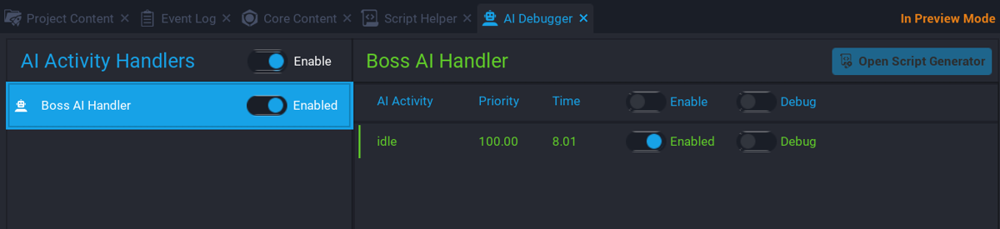{: .center loading="lazy" }

### Create Boss Shoot State

This state will become the highest priority when the boss has a valid target in range.

You will be creating a shoot activity, and adding that activity to the handler.

#### Create Shoot Table

Add a new property called `shoot` table to the `activities` table.

```lua hl_lines="4"
local activities = {

    idle = {},
    shoot = {}

}
```

#### Add Shoot Variables

```lua
local shootCooldownMin = 0
local shootCooldownMax = 3
local shootElapsed = 0
local hasShot = false
local randomCooldown = 0
local isCharging = false
```

The variables above will be used when the shoot activity is the highest priority.

| Name | Description |
| ---- | ----------- |
| `shootCooldownMin` | The minium amount of time the cooldown can be for the boss to shoot again. |
| `shootCooldownMax` | The maximum amount of time the cooldown can be for the boss to shoot again. |
| `shootElapsed` | The amount of time elapsed since last shooting. This is used to work out if the boss can shoot again. |
| `hasShot` | When the boss shoots, this is updated to true. When it is false, then the boss can shoot again. |
| `randomCooldown` | This is the random cooldown time that gets changed on each shot. |
| `isCharging` | Each shot from the boss requires a charge before it can shoot the projectile. |

#### Create GetRandomTarget Function

The boss will select a random target that is in the perimeter. It is possible for the same target to be selected again, so that same target could get shot at more than once.

```lua
local function GetRandomTarget()
    return shootTargets[math.random(#shootTargets)]
end
```

The `GetRandomTarget` function will return a random entry from the `shootTargets` array.

#### Create ShootProjectile Function

```lua
local function ShootProjectile()

end
```

The code for the `shootProjectile` function will be wrote later. This function will handle shooting a projectile at the current target.

#### Create Shoot Tick Function

```lua
function activities.shoot.tick(activity, deltaTime)
    if #shootTargets > 0  then
        activity.priority = 200
    else
        activity.priority = 0
    end
end
```

The `tick` function will run every frame. The `tick` function will check the `shootTargets` array to see if there are any targets in the perimeter for the boss to shoot at. If there are targets, then the priority for the shoot activity gets set to 200. The shoot activity will become the highest priority for the handler. If there are no targets, then the priority is lowered, and idle activity will become highest priority.

#### Create Shoot Priority Function

You need to create the `tickHighestPriority` function, so that when the shoot activity becomes the highest priority, the boss will shoot at the target.

```lua
function activities.shoot.tickHighestPriority(activity, deltaTime)
    if Object.IsValid(target) then
        if(not hasShot) then
            ShootProjectile()
        elseif not isCharging then
            if(randomCooldown == 0) then
                randomCooldown = math.random(shootCooldownMin, shootCooldownMax)
            end

            shootElapsed = shootElapsed + deltaTime

            if shootElapsed >= randomCooldown and hasShot then
                target = GetRandomTarget()

                if Object.IsValid(target) then
                    BOSS_GEO:LookAtContinuous(target, false, 2.0)
                end

                shootElapsed = 0
                randomCooldown = 0
                hasShot = false
            end
        end
    end
end
```

If the boss has not shot a projectile, then the `ShootProjectile` function will be called, otherwise the `tickHighestPriority` function will check if the boss is not charging up the next shot.

```lua
if(randomCooldown == 0) then
    randomCooldown = math.random(shootCooldownMin, shootCooldownMax)
end
```

The above code will only set a random cooldown if `randomCooldown` is 0. This is to provide some randomness to make it harder for players to predict the shooting pattern of the boss.

```lua
shootElapsed = shootElapsed + deltaTime

if shootElapsed >= randomCooldown and hasShot then
```

Here you check if the elapsed time since the boss last shot is greater than or equal to the `randomCooldown` value. You also need to check that `hasShot` is true, indicating that the boss has already shot a projectile. This means the boss will only look for a new target if it already shot at an existing target, and has cooled down.

```lua
if Object.IsValid(target) then
    BOSS_GEO:LookAtContinuous(target, false, 2.0)
end
```

If there is a valid target, then the `BOSS_GEO` is set to look at the target continuously.

#### Create Shoot Start Function

When the shoot activity becomes the highest priority, the `start` function is called. The `start` function will be called every time the shoot activity becomes the highest priority.

```lua
function activities.shoot.start(activity, deltaTime)
    local tmpTarget = GetRandomTarget()
    BOSS_GEO:LookAtContinuous(tmpTarget, false, .5)
    Task.Wait(1)
    target = tmpTarget
    tmpTarget = nil
end
```

The code above will get a random target and store it in the variable `tmpTarget`. This is so that the `BOSS_GEO` has time to switch to the new target before shooting.

### The BossAIServer Script

??? "BossAIServer"
    ```lua
    local ACTIVITY_HANDLER = script.parent
    local BOSS_GEO = script:GetCustomProperty("BossGeo"):WaitForObject()
    local SHOOT_PERIMETER = script:GetCustomProperty("ShootPerimeter"):WaitForObject()

    -- Activities this AI will have and be registered
    local activities = {

        idle = {},
        shoot = {}

    }

    -- Current target the AI is focused on
    local target = nil

    -- Targets in range of the AI
    local shootTargets = {}

    -- Min cooldown for the AI shooting ability
    local shootCooldownMin = 0

    -- Max cooldown for the AI shooting ability
    local shootCooldownMax = 3

    -- Used with cooling down the AI shoot ability
    local shootElapsed = 0

    -- Has the AI shot?
    local hasShot = false

    -- Used for AI shooting cooldown
    local randomCooldown = 0

    -- Is the AI charging the weapon?
    local isCharging = false

    -- Get a random target.
    local function GetRandomTarget()
        return shootTargets[math.random(#shootTargets)]
    end

    -- Shoots a projectile from the AI towards a target
    local function ShootProjectile()

    end

    -- Idle state is the default state
    function activities.idle.tick(activity, deltaTime)
        activity.priority = 100
    end

    -- When returning back to idle, reset the AI rotation
    function activities.idle.start(activity, deltaTime)
        Task.Wait(.5)
        BOSS_GEO:RotateTo(Rotation.New(0, 0, 0), 2)
    end

    -- If the AI has targets in the perimeter, set the priority higher
    -- so the state switches.
    function activities.shoot.tick(activity, deltaTime)
        if #shootTargets > 0  then
            activity.priority = 200
        else
            activity.priority = 0
        end
    end

    -- When the shoot state is highest priority, tick.
    function activities.shoot.tickHighestPriority(activity, deltaTime)

        -- Make sure that there is a valid target to shoot at
        if Object.IsValid(target) then

            -- If the AI has not shot, then shoot.
            if(not hasShot) then
                ShootProjectile()

            -- Each shot requires a charge, this can be instant due to
            -- the random cooldown.
            elseif not isCharging then

                -- Check to see if a random cool down has been set, if not
                -- set a new time.
                if(randomCooldown == 0) then
                    randomCooldown = math.random(shootCooldownMin, shootCooldownMax)
                end

                -- Increase the elapsed time which is used for the cooldown
                shootElapsed = shootElapsed + deltaTime

                -- If the elapsed time is greater than the cooldown and the AI
                -- has shot, then look for a target again.
                if shootElapsed >= randomCooldown and hasShot then
                    target = GetRandomTarget()

                    if Object.IsValid(target) then
                        BOSS_GEO:LookAtContinuous(target, false, 2.0)
                    end

                    shootElapsed = 0
                    randomCooldown = 0
                    hasShot = false
                end
            end
        end
    end

    -- When change to the shoot state, on start we need to select
    -- a random target inside the perimeter.
    function activities.shoot.start(activity, deltaTime)
        local tmpTarget = GetRandomTarget()
        BOSS_GEO:LookAtContinuous(tmpTarget, false, .5)
        Task.Wait(1)
        target = tmpTarget
        tmpTarget = nil
    end

    -- If a player enters the shoot perimeter of the AI, add
    -- them to the shootTargets table
    function OnPlayerEnterShoot(trigger, player)
        if Object.IsValid(player) and player:IsA("Player") then
            table.insert(shootTargets, player)
        end
    end

    -- If the player leaves the shoot perimeter of the AI, remove
    -- them from the shootTargets table.
    function OnPlayerLeftShoot(trigger, player)
        if Object.IsValid(player) and player:IsA("Player") then
            for index, value in ipairs(shootTargets) do
                if value == player then
                    table.remove(shootTargets, index)

                    if(target == player and Object.IsValid(BOSS_GEO)) then
                        BOSS_GEO:StopRotate()
                    end

                    break
                end
            end
        end
    end

    SHOOT_PERIMETER.beginOverlapEvent:Connect(OnPlayerEnterShoot)
    SHOOT_PERIMETER.endOverlapEvent:Connect(OnPlayerLeftShoot)

    -- Loop through the activities table and add them to
    -- the activity handler
    for k, a in pairs(activities) do
        ACTIVITY_HANDLER:AddActivity(k, activities[k])
    end
    ```

### Test the Game

Test the game and make sure the following work.

- Boss tracks the player entering the perimeter.
- When the player is killed, the boss will move back to the idle position.

<div class="mt-video" style="width:100%">
    <video autoplay muted playsinline controls loop class="center" style="width:100%">
        <source src="/img/BossTutorial/boss_tracking.mp4" type="video/mp4" />
    </video>
</div>

## Create Boss Projectile

The boss will be shooting a projectile at the current target. Players who get hit by the projectile will take damage.

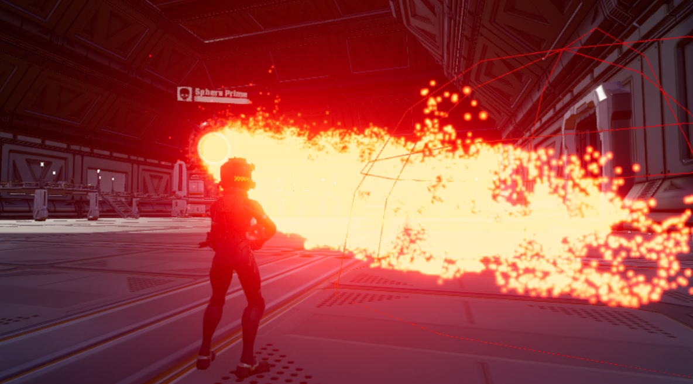{: .center loading="lazy" }

### Create Boss Projectile Code

For the boss to shoot a projectile, it needs a reference to the projectile template, and where to shoot the projectile from.

#### Add ShootPosition Custom Property

Inside the **Boss Geo** group, look for the **Shoot From** object, and drop that into the **BossAIServer** script as a custom property. Call this custom property **ShootPosition**. This will be used by the projectile code to determine where the projectile will be spawned at.

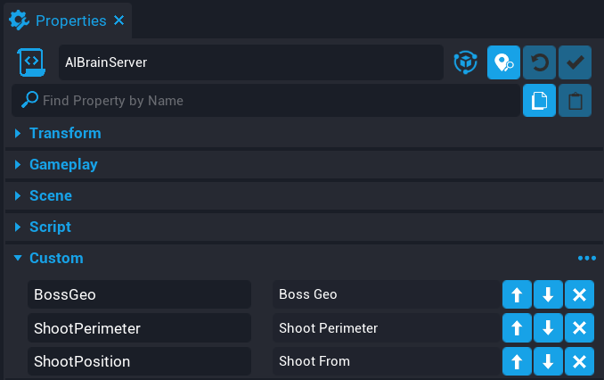{: .center loading="lazy" }

#### Add Projectile Custom Property

In **Project Content** under **My Templates**, find the template called **Boss Projectile** and drop it onto the **BossAIServer** script as a custom property. Call this custom property **Projectile**. This is the template that will be spawned when the boss shoots at a target.

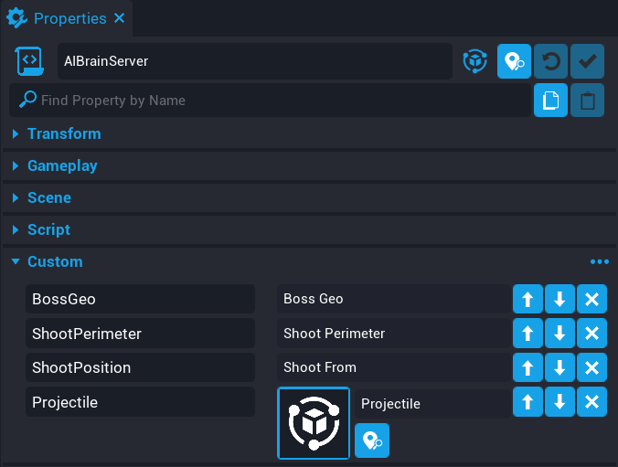{: .center loading="lazy" }

#### Add Property References

```lua
local PROJECTILE = script:GetCustomProperty("Projectile")
local SHOOT_POSITION = script:GetCustomProperty("ShootPosition"):WaitForObject()
```

Add the 2 lines above at the top of your script.

#### Update ShootProjectile Function

In an earlier section, you added the `ShootProjectile` function, which is an empty function. Add the code below in replace of the `ShootProjectile` function.

```lua
local function ShootProjectile()
    if isCharging then
        return
    end

    isCharging = true

    local startPos = SHOOT_POSITION:GetWorldPosition()

    Events.BroadcastToAllPlayers("PlayChargeUpEffect")

    Task.Wait(.5)

    if not Object.IsValid(BOSS_GEO) then
        return
    end

    local direction = BOSS_GEO:GetWorldRotation() * Vector3.FORWARD
    local theProjectile = Projectile.Spawn(PROJECTILE, startPos, direction)

    theProjectile.speed = 7000
    theProjectile.shouldDieOnImpact = false
    theProjectile.lifeSpan = 3.5
    theProjectile.gravityScale = 0.1

    isCharging = false
    hasShot = true
end
```

The `ShootProjectile` function will make sure there is a valid target to shoot at, if there is, spawn a projectile.

```lua
Events.BroadcastToAllPlayers("PlayChargeUpEffect")
```

The **Boss Geo** template you added to your **Hierarchy** comes with an effect script called **EffectsClient** that will play a charge up effect for all players to see. This is added to help players have time to react to the projectile being shot at them.

```lua
local direction = BOSS_GEO:GetWorldRotation() * Vector3.FORWARD
```

The projectile needs to know the direction to head towards. Because the boss rotates when tracking a target, then the direction also changes. You can get the forward direction of an object using `Vector3.FORWARD`, and multiplying the forward direction with the **Boss Geo** rotation will give us the direction the boss is facing.

```lua
local theProjectile = Projectile.Spawn(PROJECTILE, startPos, direction)
```

A projectile is spawned at the `startPos`, and will shoot in the direction the boss is facing.

```lua
theProjectile.shouldDieOnImpact = false
```

Because of the type of projectile effect being used, you do not want the projectile to die on impact, because the trail effect from the projectile would be instantly removed.

### Create Boss Projectile Impact Code

The projectile does not do any damage to the player, or the floor tiles. You need to add impact code to handle what happens to those impacted objects.

#### Create GetDamageable Function

You only want to apply damage to objects that can receive damage. A player and the floor tile implement the **Damageable Objects** interface. This means that the player and floor tile have health, and can die.

Create the function above the `ShootProjectile` function.

```lua
local function GetDamageable(obj)
    if obj:IsA("Damageable") then
        return obj
    else
        return obj:FindAncestorByType("Damageable")
    end
end
```

The `GetDamageable` function will attempt to find an object that is **Damageable**.

#### Create OnImpact Function

You need to know which objects are being impacted by the projectile shot by the boss. Knowing which objects were impacted, allows you to determine if they should receive damage, and how much damage they should receive.

Create the function below the `ShootProjectile` function.

```lua
local function OnImpact(projectile, obj, hit)
    if Object.IsValid(obj) then
        -- CoreDebug.DrawSphere(hit:GetImpactPosition(), 500, { duration = 1 })

        local results = World.FindObjectsOverlappingSphere(hit:GetImpactPosition(), 500, { ignoreObjects = {BOSS_GEO}})

        for index, object in ipairs(results) do
            if Object.IsValid(object) then
                local damage = Damage.New()

                damage.reason = DamageReason.NPC

                if object:IsA("Player") then
                    Events.BroadcastToPlayer(object, "ShakeScreen", .8, 4.6)
                    damage.amount = 40

                    object:ApplyDamage(damage)
                else
                    local damageable = GetDamageable(object)

                    if Object.IsValid(damageable) then
                        damage.amount = 25

                        damageable:ApplyDamage(damage)
                    end
                end
            end
        end
    end
end
```

The `OnImpact` function will be setup as an event handler that will fire every time the projectile impacts an object.

```lua
-- CoreDebug.DrawSphere(hit:GetImpactPosition(), 500, { duration = 1 })
```

The above line can be uncommented to see the impact position and size when the projectile has impacted an object. This is useful if you need to debug the projectile to see where it is impacting on the map. The size of `DrawSphere` needs to be the same as `FindObjectsOverlappingSphere`.

```lua
local results = World.FindObjectsOverlappingSphere(hit:GetImpactPosition(), 500, { ignoreObjects = {BOSS_GEO}})
```

You need to check the objects that the projectile impacts. You want the projectile impact radius to be quite large, so on impact, you grab all the objects that are overlapping a sphere based on the impact position of the projectile. You can pass in objects to be ignored so the overlapping sphere cast does not not return the **BOSS_GEO**.

{: .center loading="lazy" }

```lua
if object:IsA("Player") then
    Events.BroadcastToPlayer(object, "ShakeScreen", .8, 4.6)
    damage.amount = 40

    object:ApplyDamage(damage)
```

You need to check if the object is a **Player** and apply damage. At the same time, a broadcast to the player is done to play a screen shake effect.

```lua
else
    local damageable = GetDamageable(object)

    if Object.IsValid(damageable) then
        damage.amount = 25

        damageable:ApplyDamage(damage)
    end
end
```

If the object is not a **Player**, then attempt to find a **Damageable Object** and apply damage to it. In this case those objects are limited to the floor tile at the moment.

#### Connect impactEvent

You need to connect the `OnImpact` function to the `impactEvent`. This event will fire each time the projectile has impacted an object.

```lua
theProjectile.impactEvent:Connect(OnImpact)
```

Add the above line just after when the projectile is spawned, to the `ShootProjectile` function.

### Test the Game

Make sure the following work.

- The boss targets a player
- The boss shoots a projectile.
- Projectiles damage floor tiles.
- Player can killed by the projectile.

<div class="mt-video" style="width:100%">
    <video autoplay muted playsinline controls loop class="center" style="width:100%">
        <source src="/img/BossTutorial/boss_impact_projectile_function.mp4" type="video/mp4" />
    </video>
</div>

### The Updated BossAIServer Script

??? "BossAIServer"
    ```lua
    local ACTIVITY_HANDLER = script.parent
    local BOSS_GEO = script:GetCustomProperty("BossGeo"):WaitForObject()
    local SHOOT_PERIMETER = script:GetCustomProperty("ShootPerimeter"):WaitForObject()
    local PROJECTILE = script:GetCustomProperty("Projectile")
    local SHOOT_POSITION = script:GetCustomProperty("ShootPosition"):WaitForObject()

    -- Activities this AI will have and be registered
    local activities = {

        idle = {},
        shoot = {}

    }

    -- Current target the AI is focused on
    local target = nil

    -- Targets in range of the AI
    local shootTargets = {}

    -- Min cooldown for the AI shooting ability
    local shootCooldownMin = 0

    -- Max cooldown for the AI shooting ability
    local shootCooldownMax = 3

    -- Used with cooling down the AI shoot ability
    local shootElapsed = 0

    -- Has the AI shot?
    local hasShot = false

    -- Used for AI shooting cooldown
    local randomCooldown = 0

    -- Is the AI charging the weapon?
    local isCharging = false

    -- Get a random target.
    local function GetRandomTarget()
        return shootTargets[math.random(#shootTargets)]
    end

    -- Look for damageable object.
    local function GetDamageable(obj)
        if obj:IsA("Damageable") then
            return obj
        else
            return obj:FindAncestorByType("Damageable")
        end
    end

    local function OnImpact(projectile, obj, hit)
        if Object.IsValid(obj) then
            --CoreDebug.DrawSphere(hit:GetImpactPosition(), 500, { duration = 1 })

            local results = World.FindObjectsOverlappingSphere(hit:GetImpactPosition(), 500, { ignoreObjects = {BOSS_GEO}})

            for index, object in ipairs(results) do
                if Object.IsValid(object) then
                    local damage = Damage.New()

                    damage.reason = DamageReason.NPC

                    if object:IsA("Player") then
                        Events.BroadcastToPlayer(object, "ShakeScreen", .8, 4.6)
                        damage.amount = 40

                        object:ApplyDamage(damage)
                    else
                        local damageable = GetDamageable(object)

                        if Object.IsValid(damageable) then
                            damage.amount = 25

                            damageable:ApplyDamage(damage)
                        end
                    end
                end
            end
        end
    end

    local function ShootProjectile()
        if isCharging then
            return
        end

        isCharging = true

        local startPos = SHOOT_POSITION:GetWorldPosition()

        Events.BroadcastToAllPlayers("PlayChargeUpEffect")

        Task.Wait(.5)

        -- Need to check here if the boss object (collider and geo) is
        -- valid, as it may have been destroyed.

        if not Object.IsValid(BOSS_GEO) then
            return
        end

        -- Get the direction to shoot the projectile.
        local direction = BOSS_GEO:GetWorldRotation() * Vector3.FORWARD
        local theProjectile = Projectile.Spawn(PROJECTILE, startPos, direction)

        theProjectile.speed = 7000
        theProjectile.shouldDieOnImpact = false
        theProjectile.lifeSpan = 3.5
        theProjectile.gravityScale = 0.1

        theProjectile.impactEvent:Connect(OnImpact)

        isCharging = false
        hasShot = true
    end

    -- Idle state is the default state
    function activities.idle.tick(activity, deltaTime)
        activity.priority = 100
    end

    -- When returning back to idle, reset the AI rotation
    function activities.idle.start(activity, deltaTime)
        Task.Wait(.5)
        BOSS_GEO:RotateTo(Rotation.New(0, 0, 0), 2)
    end

    -- If the AI has targets in the perimeter, set the priority higher
    -- so the state switches.
    function activities.shoot.tick(activity, deltaTime)
        if #shootTargets > 0  then
            activity.priority = 200
        else
            activity.priority = 0
        end
    end

    -- When the shoot state is highest priority, tick.
    function activities.shoot.tickHighestPriority(activity, deltaTime)

        -- Make sure that there is a valid target to shoot at
        if Object.IsValid(target) then

            -- If the AI has not shot, then shoot.
            if(not hasShot) then
                ShootProjectile()

            -- Each shot requires a charge, this can be instant due to
            -- the random cooldown.
            elseif not isCharging then

                -- Check to see if a random cool down has been set, if not
                -- set a new time.
                if(randomCooldown == 0) then
                    randomCooldown = math.random(shootCooldownMin, shootCooldownMax)
                end

                -- Increase the elapsed time which is used for the cooldown
                shootElapsed = shootElapsed + deltaTime

                -- If the elapsed time is greater than the cooldown and the AI
                -- has shot, then look for a target again.
                if shootElapsed >= randomCooldown and hasShot then
                    target = GetRandomTarget()

                    if Object.IsValid(target) then
                        BOSS_GEO:LookAtContinuous(target, false, 2.0)
                    end

                    shootElapsed = 0
                    randomCooldown = 0
                    hasShot = false
                end
            end
        end
    end

    -- When change to the shoot state, on start we need to select
    -- a random target inside the perimeter.
    function activities.shoot.start(activity, deltaTime)
        local tmpTarget = GetRandomTarget()
        BOSS_GEO:LookAtContinuous(tmpTarget, false, .5)
        Task.Wait(1)
        target = tmpTarget
        tmpTarget = nil
    end

    -- If a player enters the shoot perimeter of the AI, add
    -- them to the shootTargets table
    function OnPlayerEnterShoot(trigger, player)
        if Object.IsValid(player) and player:IsA("Player") then
            table.insert(shootTargets, player)
        end
    end

    -- If the player leaves the shoot perimeter of the AI, remove
    -- them from the shootTargets table.
    function OnPlayerLeftShoot(trigger, player)
        if Object.IsValid(player) and player:IsA("Player") then
            for index, value in ipairs(shootTargets) do
                if value == player then
                    table.remove(shootTargets, index)

                    if(target == player and Object.IsValid(BOSS_GEO)) then
                        BOSS_GEO:StopRotate()
                    end

                    break
                end
            end
        end
    end

    SHOOT_PERIMETER.beginOverlapEvent:Connect(OnPlayerEnterShoot)
    SHOOT_PERIMETER.endOverlapEvent:Connect(OnPlayerLeftShoot)

    -- Loop through the activities table and add them to
    -- the activity handler
    for k, a in pairs(activities) do
        ACTIVITY_HANDLER:AddActivity(k, activities[k])
    end
    ```

## Update Boss Health Bar

When the boss receives damage, the health bar above the boss should update so players can see how much health the boss has left.

### Create BossHealthUIClient Script

Create a new script called **BossHealthUIClient**, and place that script into the **Scripts** group inside **Boss Geo** in the **Hierarchy**.

#### Add HealthBar Custom Property

The script needs a reference to the health bar for the boss. Inside the **UI** group, add the **Health Bar** object onto the **BossHealthUIClient** script as a custom property. Call the custom property **HealthBar**.

{: .center loading="lazy" }

#### Add Damageable Custom Property

The script also needs a reference to the **Damageable Object** for the boss so the script can access the health properties of the **Damageable Object**. add the **Boss Damageable Object** as a custom property on the **BossHealthUIClient** script. Call the custom property **Damageable**.

{: .center loading="lazy" }

#### Edit BossHealthUIClient Script

```lua
local HEALTHBAR = script:GetCustomProperty("HealthBar"):WaitForObject()
local DAMAGEABLE = script:GetCustomProperty("Damageable"):WaitForObject()

local canTickHealth = false

function Tick()
    if canTickHealth then
        HEALTHBAR.progress = DAMAGEABLE.hitPoints / DAMAGEABLE.maxHitPoints
    end
end

Events.Connect("CanUpdateBossHealthBar", function()
    canTickHealth = true
end)
```

The health bar progress will update as the health of the boss changes. The broadcast event `CanUpdateBossHealthBar` is called on the server, letting the script know that the health bar can be updated after the boss has started receiving damage.

### The BossHealthUIClient Script

??? "BossHealthUIClient"
    ```lua
    local HEALTHBAR = script:GetCustomProperty("HealthBar"):WaitForObject()
    local DAMAGEABLE = script:GetCustomProperty("Damageable"):WaitForObject()

    local canTickHealth = false

    function Tick()
        if canTickHealth then
            HEALTHBAR.progress = DAMAGEABLE.hitPoints / DAMAGEABLE.maxHitPoints
        end
    end

    Events.Connect("CanUpdateBossHealthBar", function()
        canTickHealth = true
    end)
    ```

### Update BossAIServer Script

The client script **BossHealthUIClient** needs to be told that it can update the health bar for the boss. So you need to update the **BossAIServer** to detect when the **Damageable Object** has received damage.

#### Add Damageable Custom Property

Add the **Boss Damageable Object** onto the **BossAIServer** script as a custom property. Call the custom property **Damageable**.

{: .center loading="lazy" }

#### Update BossAIServer Script

You need to update the **BossAIServer** script to listen for any damage received to the **Damageable Object** for the boss.

```lua
local DAMAGEABLE = script:GetCustomProperty("Damageable"):WaitForObject()
```

Add the above line to the top of the **BossAIServer** script.

```lua
local sentUpdateBossHealthBar = false
```

Add the above line to the top of the **BossAIServer** script.

```lua
local function OnDamaged(obj, damage)
    if not sentUpdateBossHealthBar then
        Events.BroadcastToAllPlayers("CanUpdateBossHealthBar")
        sentUpdateBossHealthBar = true
    end
end

DAMAGEABLE.damagedEvent:Connect(OnDamaged)
```

Add the above code to the bottom of the **BossAIServer** script. The `OnDamaged` function will fire when the boss receives damage. It will broadcast to all players letting them know that the health bar for the boss can be updated. This only needs to happen once, so you can use a boolean `sentUpdateBossHealthBar` to prevent additional broadcasts.

### Test the game

Shoot the boss and make sure the health bar updates.

<div class="mt-video" style="width:100%">
    <video autoplay muted playsinline controls loop class="center" style="width:100%">
        <source src="/img/BossTutorial/boss_healthbar_update.mp4" type="video/mp4" />
    </video>
</div>

### The Updated BossAIServer Script

??? "BossAIServer"
    ```lua
    local ACTIVITY_HANDLER = script.parent
    local BOSS_GEO = script:GetCustomProperty("BossGeo"):WaitForObject()
    local SHOOT_PERIMETER = script:GetCustomProperty("ShootPerimeter"):WaitForObject()
    local PROJECTILE = script:GetCustomProperty("Projectile")
    local SHOOT_POSITION = script:GetCustomProperty("ShootPosition"):WaitForObject()
    local DAMAGEABLE = script:GetCustomProperty("Damageable"):WaitForObject()

    -- Activities this AI will have and be registered
    local activities = {

        idle = {},
        shoot = {}

    }

    -- Current target the AI is focused on
    local target = nil

    -- Targets in range of the AI
    local shootTargets = {}

    -- Min cooldown for the AI shooting ability
    local shootCooldownMin = 0

    -- Max cooldown for the AI shooting ability
    local shootCooldownMax = 3

    -- Used with cooling down the AI shoot ability
    local shootElapsed = 0

    -- Has the AI shot?
    local hasShot = false

    -- Used for AI shooting cooldown
    local randomCooldown = 0

    -- Is the AI charging the weapon?
    local isCharging = false

    local sentUpdateBossHealthBar = false

    -- Get a random target.
    local function GetRandomTarget()
        return shootTargets[math.random(#shootTargets)]
    end

    -- Look for damageable object.
    local function GetDamageable(obj)
        if obj:IsA("Damageable") then
            return obj
        else
            return obj:FindAncestorByType("Damageable")
        end
    end

    local function OnImpact(projectile, obj, hit)
        if Object.IsValid(obj) then
            --CoreDebug.DrawSphere(hit:GetImpactPosition(), 500, { duration = 1 })

            local results = World.FindObjectsOverlappingSphere(hit:GetImpactPosition(), 500, { ignoreObjects = {BOSS_GEO}})

            for index, object in ipairs(results) do
                if Object.IsValid(object) then
                    local damage = Damage.New()

                    damage.reason = DamageReason.NPC

                    if object:IsA("Player") then
                        Events.BroadcastToPlayer(object, "ShakeScreen", .8, 4.6)
                        damage.amount = 40

                        object:ApplyDamage(damage)
                    else
                        local damageable = GetDamageable(object)

                        if Object.IsValid(damageable) then
                            damage.amount = 25

                            damageable:ApplyDamage(damage)
                        end
                    end
                end
            end
        end
    end

    local function ShootProjectile()
        if isCharging then
            return
        end

        isCharging = true

        local startPos = SHOOT_POSITION:GetWorldPosition()

        Events.BroadcastToAllPlayers("PlayChargeUpEffect")

        Task.Wait(.5)

        -- Need to check here if the boss object (collider and geo) is
        -- valid, as it may have been destroyed.

        if not Object.IsValid(BOSS_GEO) then
            return
        end

        -- Get the direction to shoot the projectile.
        local direction = BOSS_GEO:GetWorldRotation() * Vector3.FORWARD
        local theProjectile = Projectile.Spawn(PROJECTILE, startPos, direction)

        theProjectile.speed = 7000
        theProjectile.shouldDieOnImpact = false
        theProjectile.lifeSpan = 3.5
        theProjectile.gravityScale = 0.1

        theProjectile.impactEvent:Connect(OnImpact)

        isCharging = false
        hasShot = true
    end

    -- Idle state is the default state
    function activities.idle.tick(activity, deltaTime)
        activity.priority = 100
    end

    -- When returning back to idle, reset the AI rotation
    function activities.idle.start(activity, deltaTime)
        Task.Wait(.5)
        BOSS_GEO:RotateTo(Rotation.New(0, 0, 0), 2)
    end

    -- If the AI has targets in the perimeter, set the priority higher
    -- so the state switches.
    function activities.shoot.tick(activity, deltaTime)
        if #shootTargets > 0  then
            activity.priority = 200
        else
            activity.priority = 0
        end
    end

    -- When the shoot state is highest priority, tick.
    function activities.shoot.tickHighestPriority(activity, deltaTime)

        -- Make sure that there is a valid target to shoot at
        if Object.IsValid(target) then

            -- If the AI has not shot, then shoot.
            if(not hasShot) then
                ShootProjectile()

            -- Each shot requires a charge, this can be instant due to
            -- the random cooldown.
            elseif not isCharging then

                -- Check to see if a random cool down has been set, if not
                -- set a new time.
                if(randomCooldown == 0) then
                    randomCooldown = math.random(shootCooldownMin, shootCooldownMax)
                end

                -- Increase the elapsed time which is used for the cooldown
                shootElapsed = shootElapsed + deltaTime

                -- If the elapsed time is greater than the cooldown and the AI
                -- has shot, then look for a target again.
                if shootElapsed >= randomCooldown and hasShot then
                    target = GetRandomTarget()

                    if Object.IsValid(target) then
                        BOSS_GEO:LookAtContinuous(target, false, 2.0)
                    end

                    shootElapsed = 0
                    randomCooldown = 0
                    hasShot = false
                end
            end
        end
    end

    -- When change to the shoot state, on start we need to select
    -- a random target inside the perimeter.
    function activities.shoot.start(activity, deltaTime)
        local tmpTarget = GetRandomTarget()
        BOSS_GEO:LookAtContinuous(tmpTarget, false, .5)
        Task.Wait(1)
        target = tmpTarget
        tmpTarget = nil
    end

    -- If a player enters the shoot perimeter of the AI, add
    -- them to the shootTargets table
    function OnPlayerEnterShoot(trigger, player)
        if Object.IsValid(player) and player:IsA("Player") then
            table.insert(shootTargets, player)
        end
    end

    -- If the player leaves the shoot perimeter of the AI, remove
    -- them from the shootTargets table.
    function OnPlayerLeftShoot(trigger, player)
        if Object.IsValid(player) and player:IsA("Player") then
            for index, value in ipairs(shootTargets) do
                if value == player then
                    table.remove(shootTargets, index)

                    if(target == player and Object.IsValid(BOSS_GEO)) then
                        BOSS_GEO:StopRotate()
                    end

                    break
                end
            end
        end
    end

    -- When the AI receives damage, broadcast that to the player
    -- who caused the damage.
    local function OnDamaged(obj, damage)
        if not sentUpdateBossHealthBar then
            Events.BroadcastToAllPlayers("CanUpdateBossHealthBar")
            sentUpdateBossHealthBar = true
        end
    end

    DAMAGEABLE.damagedEvent:Connect(OnDamaged)

    SHOOT_PERIMETER.beginOverlapEvent:Connect(OnPlayerEnterShoot)
    SHOOT_PERIMETER.endOverlapEvent:Connect(OnPlayerLeftShoot)

    -- Loop through the activities table and add them to
    -- the activity handler
    for k, a in pairs(activities) do
        ACTIVITY_HANDLER:AddActivity(k, activities[k])
    end
    ```

## Create Damage Feedback

In this section you will be creating a script to show the damage the player is doing to the boss. That damage will show up as numbers that will be visible only to the player applying the damage.

### Create DamageClient Script

#### Create DamageClient Script

Create a new script called **DamageClient**, and place the **DamageClient** script into the **Client** group found under the **Boss Fight Map** group.

#### Add Fly Up Text Target Custom Property

Add the **Fly Up Text Target** on to the **DamageClient** script as a custom property

Name the custom property **FlyupPosition**.

The damage numbers that will show up need to know where to be positioned in the world. The **Fly Up Text Target** object inside the **Client** group found in the **Boss Geo** group will act as a helper object to get a reference to a position in the world.

{: .center loading="lazy" }

#### Add Color Custom Property

Add a new **Color** custom property to the **DamageClient** script. Name the custom property `ImmuneColor`.

The color property will be used to change the color of the fly up text when the boss is immune to damage.

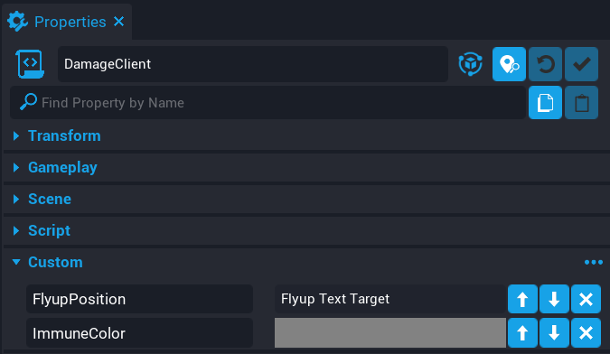{: .center loading="lazy" }

#### Create ShowDamage Function

Add the following code to the **DamageClient** script.

```lua
local FLYUP_POSITION = script:GetCustomProperty("FlyupPosition"):WaitForObject()
local IMMUNE_COLOR = script:GetCustomProperty("ImmuneColor")

local function ShowDamage(damageAmount, isImmune)
    if isImmune then
        UI.ShowFlyUpText("Immune", FLYUP_POSITION:GetWorldPosition(), {

            isBig = true,
            color = IMMUNE_COLOR

        })
    else
        UI.ShowFlyUpText(tostring(damageAmount), FLYUP_POSITION:GetWorldPosition(), {

            isBig = true,
            color = Color.YELLOW

        })
    end
end

Events.Connect("ShowDamage", ShowDamage)
```

The `ShowDamage` event will be called from the server and display the damage the player has done to the boss.

### The DamageClient Script

??? "DamageClient"
    ```lua
    local FLYUP_POSITION = script:GetCustomProperty("FlyupPosition"):WaitForObject()
    local IMMUNE_COLOR = script:GetCustomProperty("ImmuneColor")

    -- Shows a fly up text when the boss is shot. If the boss is immune
    -- then display to the player, otherwise show the damage numbers.
    local function ShowDamage(damageAmount, isImmune)
        if isImmune then
            UI.ShowFlyUpText("Immune", FLYUP_POSITION:GetWorldPosition(), {

                isBig = true,
                color = IMMUNE_COLOR

            })
        else
            UI.ShowFlyUpText(tostring(damageAmount), FLYUP_POSITION:GetWorldPosition(), {

                isBig = true,
                color = Color.YELLOW

            })
        end
    end

    Events.Connect("ShowDamage", ShowDamage)
    ```

### Update BossAIServer Script

The **BossAIServer** script needs to be updated so that when the boss receives damage, it can broadcast the damage to the player who applied the damage.

```lua
Events.BroadcastToPlayer(damage.sourcePlayer, "ShowDamage", damage.amount, false)
```

Add the above line to the bottom of the `OnDamaged` function. The `Damage` object contains the player who is the source of the damage. You can use this to broadcast that players damage amount to them.

### Test the game

When shooting the boss, damage numbers will show up indicating what damage the player is doing.

<div class="mt-video" style="width:100%">
    <video autoplay muted playsinline controls loop class="center" style="width:100%">
        <source src="/img/BossTutorial/damage_feedback.mp4" type="video/mp4" />
    </video>
</div>

### Updated BossAIServer Script

??? "BossAIServer"
    ```lua
    local ACTIVITY_HANDLER = script.parent
    local BOSS_GEO = script:GetCustomProperty("BossGeo"):WaitForObject()
    local SHOOT_PERIMETER = script:GetCustomProperty("ShootPerimeter"):WaitForObject()
    local PROJECTILE = script:GetCustomProperty("Projectile")
    local SHOOT_POSITION = script:GetCustomProperty("ShootPosition"):WaitForObject()
    local DAMAGEABLE = script:GetCustomProperty("Damageable"):WaitForObject()

    -- Activities this AI will have and be registered
    local activities = {

        idle = {},
        shoot = {}

    }

    -- Current target the AI is focused on
    local target = nil

    -- Targets in range of the AI
    local shootTargets = {}

    -- Min cooldown for the AI shooting ability
    local shootCooldownMin = 0

    -- Max cooldown for the AI shooting ability
    local shootCooldownMax = 3

    -- Used with cooling down the AI shoot ability
    local shootElapsed = 0

    -- Has the AI shot?
    local hasShot = false

    -- Used for AI shooting cooldown
    local randomCooldown = 0

    -- Is the AI charging the weapon?
    local isCharging = false

    local sentUpdateBossHealthBar = false

    -- Get a random target.
    local function GetRandomTarget()
        return shootTargets[math.random(#shootTargets)]
    end

    -- Look for damageable object.
    local function GetDamageable(obj)
        if obj:IsA("Damageable") then
            return obj
        else
            return obj:FindAncestorByType("Damageable")
        end
    end

    local function OnImpact(projectile, obj, hit)
        if Object.IsValid(obj) then
            --CoreDebug.DrawSphere(hit:GetImpactPosition(), 500, { duration = 1 })

            local results = World.FindObjectsOverlappingSphere(hit:GetImpactPosition(), 500, { ignoreObjects = {BOSS_GEO}})

            for index, object in ipairs(results) do
                if Object.IsValid(object) then
                    local damage = Damage.New()

                    damage.reason = DamageReason.NPC

                    if object:IsA("Player") then
                        Events.BroadcastToPlayer(object, "ShakeScreen", .8, 4.6)
                        damage.amount = 40

                        object:ApplyDamage(damage)
                    else
                        local damageable = GetDamageable(object)

                        if Object.IsValid(damageable) then
                            damage.amount = 25

                            damageable:ApplyDamage(damage)
                        end
                    end
                end
            end
        end
    end

    local function ShootProjectile()
        if isCharging then
            return
        end

        isCharging = true

        local startPos = SHOOT_POSITION:GetWorldPosition()

        Events.BroadcastToAllPlayers("PlayChargeUpEffect")

        Task.Wait(.5)

        -- Need to check here if the boss object (collider and geo) is
        -- valid, as it may have been destroyed.

        if not Object.IsValid(BOSS_GEO) then
            return
        end

        -- Get the direction to shoot the projectile.
        local direction = BOSS_GEO:GetWorldRotation() * Vector3.FORWARD
        local theProjectile = Projectile.Spawn(PROJECTILE, startPos, direction)

        theProjectile.speed = 7000
        theProjectile.shouldDieOnImpact = false
        theProjectile.lifeSpan = 3.5
        theProjectile.gravityScale = 0.1

        theProjectile.impactEvent:Connect(OnImpact)

        isCharging = false
        hasShot = true
    end

    -- Idle state is the default state
    function activities.idle.tick(activity, deltaTime)
        activity.priority = 100
    end

    -- When returning back to idle, reset the AI rotation
    function activities.idle.start(activity, deltaTime)
        Task.Wait(.5)
        BOSS_GEO:RotateTo(Rotation.New(0, 0, 0), 2)
    end

    -- If the AI has targets in the perimeter, set the priority higher
    -- so the state switches.
    function activities.shoot.tick(activity, deltaTime)
        if #shootTargets > 0  then
            activity.priority = 200
        else
            activity.priority = 0
        end
    end

    -- When the shoot state is highest priority, tick.
    function activities.shoot.tickHighestPriority(activity, deltaTime)

        -- Make sure that there is a valid target to shoot at
        if Object.IsValid(target) then

            -- If the AI has not shot, then shoot.
            if(not hasShot) then
                ShootProjectile()

            -- Each shot requires a charge, this can be instant due to
            -- the random cooldown.
            elseif not isCharging then

                -- Check to see if a random cool down has been set, if not
                -- set a new time.
                if(randomCooldown == 0) then
                    randomCooldown = math.random(shootCooldownMin, shootCooldownMax)
                end

                -- Increase the elapsed time which is used for the cooldown
                shootElapsed = shootElapsed + deltaTime

                -- If the elapsed time is greater than the cooldown and the AI
                -- has shot, then look for a target again.
                if shootElapsed >= randomCooldown and hasShot then
                    target = GetRandomTarget()

                    if Object.IsValid(target) then
                        BOSS_GEO:LookAtContinuous(target, false, 2.0)
                    end

                    shootElapsed = 0
                    randomCooldown = 0
                    hasShot = false
                end
            end
        end
    end

    -- When change to the shoot state, on start we need to select
    -- a random target inside the perimeter.
    function activities.shoot.start(activity, deltaTime)
        local tmpTarget = GetRandomTarget()
        BOSS_GEO:LookAtContinuous(tmpTarget, false, .5)
        Task.Wait(1)
        target = tmpTarget
        tmpTarget = nil
    end

    -- If a player enters the shoot perimeter of the AI, add
    -- them to the shootTargets table
    function OnPlayerEnterShoot(trigger, player)
        if Object.IsValid(player) and player:IsA("Player") then
            table.insert(shootTargets, player)
        end
    end

    -- If the player leaves the shoot perimeter of the AI, remove
    -- them from the shootTargets table.
    function OnPlayerLeftShoot(trigger, player)
        if Object.IsValid(player) and player:IsA("Player") then
            for index, value in ipairs(shootTargets) do
                if value == player then
                    table.remove(shootTargets, index)

                    if(target == player and Object.IsValid(BOSS_GEO)) then
                        BOSS_GEO:StopRotate()
                    end

                    break
                end
            end
        end
    end

    -- When the AI receives damage, broadcast that to the player
    -- who caused the damage.
    local function OnDamaged(obj, damage)
        if not sentUpdateBossHealthBar then
            Events.BroadcastToAllPlayers("CanUpdateBossHealthBar")
            sentUpdateBossHealthBar = true
        end

        Events.BroadcastToPlayer(damage.sourcePlayer, "ShowDamage", damage.amount, false)
    end

    DAMAGEABLE.damagedEvent:Connect(OnDamaged)

    SHOOT_PERIMETER.beginOverlapEvent:Connect(OnPlayerEnterShoot)
    SHOOT_PERIMETER.endOverlapEvent:Connect(OnPlayerLeftShoot)

    -- Loop through the activities table and add them to
    -- the activity handler
    for k, a in pairs(activities) do
        ACTIVITY_HANDLER:AddActivity(k, activities[k])
    end
    ```

## Disable / Disable Player Weapon

When the player spawns in, they can shoot the boss from spawn position and take no damage. It would be good to force the player to be in the perimeter with the boss. To do this, you will be disabling the weapon abilities, and enabling them when the player is in the boss perimeter.

### Update PlayerServer Script

```lua
local players = {}
```

Add the above line to the top of the **PlayerServer** script. You need to keep track of the players in the game so that the weapon for a player can be enabled and disabled at anytime.

```lua
local function EnableWeapon(player)
    if Object.IsValid(player) and players[player.id] and Object.IsValid(players[player.id].weapon) then
        local abilities = players[player.id].weapon:FindDescendantsByType("Ability")

        for index, ability in ipairs(abilities) do
            ability.isEnabled = true
        end
    end
end

local function DisableWeapon(player)
    if Object.IsValid(player) and players[player.id] and Object.IsValid(players[player.id].weapon) then
        local abilities = players[player.id].weapon:FindDescendantsByType("Ability")

        for index, ability in ipairs(abilities) do
            ability.isEnabled = false
        end
    end
end
```

Add the above two functions to the **PlayerServer** script. These functions will handle enabling and disabling the weapon abilities for the player by looping over all the abilities that a weapon has by setting the `isEnabled` property.

```lua
players[player.id] = {

    weapon = weapon

}

DisableWeapon(player)
```

Add the above code to the bottom of the `OnPlayerJoined` function. When the player joins the game, a weapon is spawned and equipped. This weapon is added to the `players` table for the player who joined so you have a reference to it.

```lua
local function OnPlayerLeft(player)
    players[player.id] = nil
end
```

When the player leaves the game, clean up the `players` table by setting the value to `nil`.

```lua
Game.playerLeftEvent:Connect(OnPlayerLeft)

Events.Connect("EnableWeapon", EnableWeapon)
Events.Connect("DisableWeapon", DisableWeapon)
```

Add the above lines to the bottom of the script. The `EnableWeapon` and `DisableWeapon` events, will allow you to broadcast to this script at any point to enable or disable the weapon abilities for a player.

### The Updated PlayerServer Script

??? "PlayerServer"
    ```lua
    local WEAPON = script:GetCustomProperty("Weapon")

    -- Store a list of players in the game so that
    -- the events can be disconnected later when
    -- they leave.
    local players = {}

    -- Enable weapon abilities for the player
    local function EnableWeapon(player)
        if Object.IsValid(player) and players[player.id] and Object.IsValid(players[player.id].weapon) then
            local abilities = players[player.id].weapon:FindDescendantsByType("Ability")

            for index, ability in ipairs(abilities) do
                ability.isEnabled = true
            end
        end
    end

    -- Disable weapon abilities for the player
    local function DisableWeapon(player)
        if Object.IsValid(player) and players[player.id] and Object.IsValid(players[player.id].weapon) then
            local abilities = players[player.id].weapon:FindDescendantsByType("Ability")

            for index, ability in ipairs(abilities) do
                ability.isEnabled = false
            end
        end
    end

    -- When a player joins, give a weapon
    local function OnPlayerJoined(player)
        local weapon = World.SpawnAsset(WEAPON)

        weapon:Equip(player)

        players[player.id] = {

            weapon = weapon

        }

        DisableWeapon(player)
    end

    local function OnPlayerLeft(player)
        players[player.id] = nil
    end

    Game.playerJoinedEvent:Connect(OnPlayerJoined)
    Game.playerLeftEvent:Connect(OnPlayerLeft)

    Events.Connect("EnableWeapon", EnableWeapon)
    Events.Connect("DisableWeapon", DisableWeapon)
    ```

### Update BossAIServer Script

When the player enters or exits the perimeter trigger, you need to enable or disable the weapon abilities for that player.

#### Update OnPlayerEnterShoot Function

```lua hl_lines="5"
function OnPlayerEnterShoot(trigger, player)
    if Object.IsValid(player) and player:IsA("Player") then
        table.insert(shootTargets, player)

        Events.Broadcast("EnableWeapon", player)
    end
end
```

Add line 5 to the `OnPlayerEnterShoot` function. This line will fire the `EnableWeapon` event. The `player` is passed to the event so that the event handler knows which player to enable the weapon abilities for.

#### Update OnPlayerLeftShoot Function

```lua hl_lines="3"
function OnPlayerLeftShoot(trigger, player)
    if Object.IsValid(player) and player:IsA("Player") then
        Events.Broadcast("DisableWeapon", player)

        for index, value in ipairs(shootTargets) do
            if value == player then
                table.remove(shootTargets, index)

                if(target == player and Object.IsValid(BOSS_GEO)) then
                    BOSS_GEO:StopRotate()
                end

                break
            end
        end
    end
end
```

On line 3, a broadcast event is fired that will disable the weapon abilities for the player. This will also fire when the player dies.

### Test the game

Test the following.

- Shooting ability is disabled outside the perimeter.
- Shooting is enabled when inside the perimeter.

<div class="mt-video" style="width:100%">
    <video autoplay muted playsinline controls loop class="center" style="width:100%">
        <source src="/img/BossTutorial/enable_disable_weapon.mp4" type="video/mp4" />
    </video>
</div>

### The Updated BossAIServer Script

??? "BossAIServer"
    ```lua
    local ACTIVITY_HANDLER = script.parent
    local BOSS_GEO = script:GetCustomProperty("BossGeo"):WaitForObject()
    local SHOOT_PERIMETER = script:GetCustomProperty("ShootPerimeter"):WaitForObject()
    local PROJECTILE = script:GetCustomProperty("Projectile")
    local SHOOT_POSITION = script:GetCustomProperty("ShootPosition"):WaitForObject()
    local DAMAGEABLE = script:GetCustomProperty("Damageable"):WaitForObject()

    -- Activities this AI will have and be registered
    local activities = {

        idle = {},
        shoot = {}

    }

    -- Current target the AI is focused on
    local target = nil

    -- Targets in range of the AI
    local shootTargets = {}

    -- Min cooldown for the AI shooting ability
    local shootCooldownMin = 0

    -- Max cooldown for the AI shooting ability
    local shootCooldownMax = 3

    -- Used with cooling down the AI shoot ability
    local shootElapsed = 0

    -- Has the AI shot?
    local hasShot = false

    -- Used for AI shooting cooldown
    local randomCooldown = 0

    -- Is the AI charging the weapon?
    local isCharging = false

    local sentUpdateBossHealthBar = false

    -- Get a random target.
    local function GetRandomTarget()
        return shootTargets[math.random(#shootTargets)]
    end

    -- Look for damageable object.
    local function GetDamageable(obj)
        if obj:IsA("Damageable") then
            return obj
        else
            return obj:FindAncestorByType("Damageable")
        end
    end

    local function OnImpact(projectile, obj, hit)
        if Object.IsValid(obj) then
            --CoreDebug.DrawSphere(hit:GetImpactPosition(), 500, { duration = 1 })

            local results = World.FindObjectsOverlappingSphere(hit:GetImpactPosition(), 500, { ignoreObjects = {BOSS_GEO}})

            for index, object in ipairs(results) do
                if Object.IsValid(object) then
                    local damage = Damage.New()

                    damage.reason = DamageReason.NPC

                    if object:IsA("Player") then
                        Events.BroadcastToPlayer(object, "ShakeScreen", .8, 4.6)
                        damage.amount = 40

                        object:ApplyDamage(damage)
                    else
                        local damageable = GetDamageable(object)

                        if Object.IsValid(damageable) then
                            damage.amount = 25

                            damageable:ApplyDamage(damage)
                        end
                    end
                end
            end
        end
    end

    local function ShootProjectile()
        if isCharging then
            return
        end

        isCharging = true

        local startPos = SHOOT_POSITION:GetWorldPosition()

        Events.BroadcastToAllPlayers("PlayChargeUpEffect")

        Task.Wait(.5)

        -- Need to check here if the boss object (collider and geo) is
        -- valid, as it may have been destroyed.

        if not Object.IsValid(BOSS_GEO) then
            return
        end

        -- Get the direction to shoot the projectile.
        local direction = BOSS_GEO:GetWorldRotation() * Vector3.FORWARD
        local theProjectile = Projectile.Spawn(PROJECTILE, startPos, direction)

        theProjectile.speed = 7000
        theProjectile.shouldDieOnImpact = false
        theProjectile.lifeSpan = 3.5
        theProjectile.gravityScale = 0.1

        theProjectile.impactEvent:Connect(OnImpact)

        isCharging = false
        hasShot = true
    end

    -- Idle state is the default state
    function activities.idle.tick(activity, deltaTime)
        activity.priority = 100
    end

    -- When returning back to idle, reset the AI rotation
    function activities.idle.start(activity, deltaTime)
        Task.Wait(.5)
        BOSS_GEO:RotateTo(Rotation.New(0, 0, 0), 2)
    end

    -- If the AI has targets in the perimeter, set the priority higher
    -- so the state switches.
    function activities.shoot.tick(activity, deltaTime)
        if #shootTargets > 0  then
            activity.priority = 200
        else
            activity.priority = 0
        end
    end

    -- When the shoot state is highest priority, tick.
    function activities.shoot.tickHighestPriority(activity, deltaTime)

        -- Make sure that there is a valid target to shoot at
        if Object.IsValid(target) then

            -- If the AI has not shot, then shoot.
            if(not hasShot) then
                ShootProjectile()

            -- Each shot requires a charge, this can be instant due to
            -- the random cooldown.
            elseif not isCharging then

                -- Check to see if a random cool down has been set, if not
                -- set a new time.
                if(randomCooldown == 0) then
                    randomCooldown = math.random(shootCooldownMin, shootCooldownMax)
                end

                -- Increase the elapsed time which is used for the cooldown
                shootElapsed = shootElapsed + deltaTime

                -- If the elapsed time is greater than the cooldown and the AI
                -- has shot, then look for a target again.
                if shootElapsed >= randomCooldown and hasShot then
                    target = GetRandomTarget()

                    if Object.IsValid(target) then
                        BOSS_GEO:LookAtContinuous(target, false, 2.0)
                    end

                    shootElapsed = 0
                    randomCooldown = 0
                    hasShot = false
                end
            end
        end
    end

    -- When change to the shoot state, on start we need to select
    -- a random target inside the perimeter.
    function activities.shoot.start(activity, deltaTime)
        local tmpTarget = GetRandomTarget()
        BOSS_GEO:LookAtContinuous(tmpTarget, false, .5)
        Task.Wait(1)
        target = tmpTarget
        tmpTarget = nil
    end

    -- If a player enters the shoot perimeter of the AI, add
    -- them to the shootTargets table
    function OnPlayerEnterShoot(trigger, player)
        if Object.IsValid(player) and player:IsA("Player") then
            table.insert(shootTargets, player)

            -- Enable the players weapon if they are in the perimeter
            Events.Broadcast("EnableWeapon", player)
        end
    end

    -- If the player leaves the shoot perimeter of the AI, remove
    -- them from the shootTargets table.
    function OnPlayerLeftShoot(trigger, player)
        if Object.IsValid(player) and player:IsA("Player") then

            -- Disable the players weapon if they are out of the perimeter
            Events.Broadcast("DisableWeapon", player)

            for index, value in ipairs(shootTargets) do
                if value == player then
                    table.remove(shootTargets, index)

                    if(target == player and Object.IsValid(BOSS_GEO)) then
                        BOSS_GEO:StopRotate()
                    end

                    break
                end
            end
        end
    end

    -- When the AI receives damage, broadcast that to the player
    -- who caused the damage.
    local function OnDamaged(obj, damage)
        if not sentUpdateBossHealthBar then
            Events.BroadcastToAllPlayers("CanUpdateBossHealthBar")
            sentUpdateBossHealthBar = true
        end

        Events.BroadcastToPlayer(damage.sourcePlayer, "ShowDamage", damage.amount, false)
    end

    DAMAGEABLE.damagedEvent:Connect(OnDamaged)

    SHOOT_PERIMETER.beginOverlapEvent:Connect(OnPlayerEnterShoot)
    SHOOT_PERIMETER.endOverlapEvent:Connect(OnPlayerLeftShoot)

    -- Loop through the activities table and add them to
    -- the activity handler
    for k, a in pairs(activities) do
        ACTIVITY_HANDLER:AddActivity(k, activities[k])
    end
    ```

## Set Boss to Start Invulnerable

The boss will start invulnerable so it can not receive any damage until 3 shield generators have been disabled.

Enable the property **Start Invulnerable** on the **Boss Damageable Object**.

### Update PlayerServer Script

You need to listen for when the projectiles from the weapon impact an object to determine what to show for the player.

#### Create GetValidTarget Function

```lua
local function GetValidTarget(target)
    if not Object.IsValid(target) then
        return nil
    end

    if target:IsA("Damageable") then
        return target
    end

    return target:FindAncestorByType("Damageable")
end
```

The function `GetValidTarget` will be used to find a target that implements the **Damageable** interface so you can see if that object is invulnerable.

#### Update OnPlayerJoined Function

When a player joins the game they are given a weapon. You need to listen for when a target has been impacted.

```lua
weapon.targetImpactedEvent:Connect(OnImpact)
```

Add the above line just after when you equip the weapon on for the player.

#### Create OnImpact Function

```lua
local function OnImpact(weaponObj, impactData)
    local target = GetValidTarget(impactData.targetObject)

    if Object.IsValid(target) then
        if target.isInvulnerable then
            Events.BroadcastToPlayer(impactData.weaponOwner, "ShowDamage", 0, true)
        end
    end
end
```

The `OnImpact` will look at the object being impacted to see if it is invulnerable. If it is, the owner of the weapon receives a broadcast that will show the damage. The 4th argument is set to true, indicating the object hit is immune to the damage.

### Test the game

When a player shoots the boss, it will display **Immune** in front of the Boss.

{: .center loading="lazy" }

### Updated PlayerServer Script

??? "PlayerServer"
    ```lua
    local WEAPON = script:GetCustomProperty("Weapon")

    -- Store a list of players in the game so that
    -- the events can be disconnected later when
    -- they leave.
    local players = {}

    -- Enable weapon abilities for the player
    local function EnableWeapon(player)
        if Object.IsValid(player) and players[player.id] and Object.IsValid(players[player.id].weapon) then
            local abilities = players[player.id].weapon:FindDescendantsByType("Ability")

            for index, ability in ipairs(abilities) do
                ability.isEnabled = true
            end
        end
    end

    -- Disable weapon abilities for the player
    local function DisableWeapon(player)
        if Object.IsValid(player) and players[player.id] and Object.IsValid(players[player.id].weapon) then
            local abilities = players[player.id].weapon:FindDescendantsByType("Ability")

            for index, ability in ipairs(abilities) do
                ability.isEnabled = false
            end
        end
    end

    -- Look for a valid target that is a damageable object
    local function GetValidTarget(target)
        if not Object.IsValid(target) then
            return nil
        end

        if target:IsA("Damageable") then
            return target
        end

        return target:FindAncestorByType("Damageable")
    end

    -- See if the target is invulnerable, if so, broadcast
    -- to the player for feedback.
    local function OnImpact(weaponObj, impactData)
        local target = GetValidTarget(impactData.targetObject)

        if Object.IsValid(target) then
            if target.isInvulnerable then
                Events.BroadcastToPlayer(impactData.weaponOwner, "ShowDamage", 0, true)
            end
        end
    end

    -- When a player joins, give a weapon
    local function OnPlayerJoined(player)
        local weapon = World.SpawnAsset(WEAPON)

        weapon:Equip(player)
        weapon.targetImpactedEvent:Connect(OnImpact)

        players[player.id] = {

            weapon = weapon

        }

        DisableWeapon(player)
    end

    local function OnPlayerLeft(player)
        players[player.id] = nil
    end

    Game.playerJoinedEvent:Connect(OnPlayerJoined)
    Game.playerLeftEvent:Connect(OnPlayerLeft)

    Events.Connect("EnableWeapon", EnableWeapon)
    Events.Connect("DisableWeapon", DisableWeapon)
    ```

## Adding Player Sprint Ability

Right now the player can be killed fairly easy by the boss as it is hard to get away from the damage of the projectile. Adding a sprint ability to the player will give them more of a chance, and as a side benefit, helps you test your game more quickly because you can move around faster.

### Update PlayerServer Script

Open up the **PlayerServer** script. You will be update the `OnPlayerJoined` and `OnPlayerLeft` functions.

#### Update OnPlayerJoined

You will need to update the `OnPlayerJoined` function so it can setup the bindings for the player when they join.

```lua
local function OnPlayerJoined(player)
    local weapon = World.SpawnAsset(WEAPON)

    weapon:Equip(player)
    weapon.targetImpactedEvent:Connect(OnImpact)

    players[player.id] = {

        pressedEvt = player.bindingPressedEvent:Connect(function(obj, binding)
            if binding == "ability_feet" then
                player.maxWalkSpeed = 1200
            end
        end),

        releasedEvt = player.bindingReleasedEvent:Connect(function(obj, binding)
            if binding == "ability_feet" then
                player.maxWalkSpeed = 640
            end
        end),

        weapon = weapon
    }

    DisableWeapon(player)
end
```

The `OnPlayerJoined` function adds the binding for when a player presses the ++shift++ key. When the ++shift++ key is pressed, it will increase the `maxWalkSpeed` property so the player moves more quickly. When the player releases the ++shift++ key, it will reset the `maxWalkSpeed`.

The returned values for each event are stored in the `players` table so they can be cleaned up later when the player leaves the game. It is good practice to always disconnect any events that are no longer used.

#### Update OnPlayerLeft

The `OnPlayerLeft` function needs to clean up the binding events setup in the `OnPlayerJoined` function.

```lua
local function OnPlayerLeft(player)
    if players[player.id].pressedEvt.isConnected then
        players[player.id].pressedEvt:Disconnect()
    end

    if players[player.id].releasedEvt.isConnected then
        players[player.id].releasedEvt:Disconnect()
    end

    players[player.id] = nil
end
```

The `OnPlayerLeft` function will check to see the if the `pressedEvt` or the `releasedEvt` are connected. If they are, then they will be disconnected so the functions will no longer be called.

#### The Updated PlayerServer Script

??? "PlayerServer"
    ```lua
    local WEAPON = script:GetCustomProperty("Weapon")

    -- Store a list of players in the game so that
    -- the events can be disconnected later when
    -- they leave.
    local players = {}

    -- Enable weapon abilities for the player
    local function EnableWeapon(player)
        if Object.IsValid(player) and players[player.id] and Object.IsValid(players[player.id].weapon) then
            local abilities = players[player.id].weapon:FindDescendantsByType("Ability")

            for index, ability in ipairs(abilities) do
                ability.isEnabled = true
            end
        end
    end

    -- Disable weapon abilities for the player
    local function DisableWeapon(player)
        if Object.IsValid(player) and players[player.id] and Object.IsValid(players[player.id].weapon) then
            local abilities = players[player.id].weapon:FindDescendantsByType("Ability")

            for index, ability in ipairs(abilities) do
                ability.isEnabled = false
            end
        end
    end

    -- Look for a valid target that is a damageable object
    local function GetValidTarget(target)
        if not Object.IsValid(target) then
            return nil
        end

        if target:IsA("Damageable") then
            return target
        end

        return target:FindAncestorByType("Damageable")
    end

    -- See if the target is invulnerable, if so, broadcast
    -- to the player for feedback.
    local function OnImpact(weaponObj, impactData)
        local target = GetValidTarget(impactData.targetObject)

        if Object.IsValid(target) then
            if target.isInvulnerable then
                Events.BroadcastToPlayer(impactData.weaponOwner, "ShowDamage", 0, true)
            end
        end
    end

    -- When a player joins, give a weapon
    local function OnPlayerJoined(player)
        local weapon = World.SpawnAsset(WEAPON)

        weapon:Equip(player)
        weapon.targetImpactedEvent:Connect(OnImpact)

        players[player.id] = {

            pressedEvt = player.bindingPressedEvent:Connect(function(obj, binding)
                if binding == "ability_feet" then
                    player.maxWalkSpeed = 1200
                end
            end),

            releasedEvt = player.bindingReleasedEvent:Connect(function(obj, binding)
                if binding == "ability_feet" then
                    player.maxWalkSpeed = 640
                end
            end),

            weapon = weapon
        }

        DisableWeapon(player)
    end

    -- Clean up the events when a player leaves
    local function OnPlayerLeft(player)
        if players[player.id].pressedEvt.isConnected then
            players[player.id].pressedEvt:Disconnect()
        end

        if players[player.id].releasedEvt.isConnected then
            players[player.id].releasedEvt:Disconnect()
        end

        players[player.id] = nil
    end

    Game.playerJoinedEvent:Connect(OnPlayerJoined)
    Game.playerLeftEvent:Connect(OnPlayerLeft)

    Events.Connect("EnableWeapon", EnableWeapon)
    Events.Connect("DisableWeapon", DisableWeapon)
    ```

## Create Shield Generator

The shield generator will be an object that the player must disable for the boss to become vulnerable to damage. You will create one generator first, update that template, then add 2 more shield generators to the map.

### Add Shield Generator Template

In **Project Content** under **My Templates**, find the template called **Shield Generator** and drop it into your **Hierarchy**.

The **Shield Generator** template will be updated so multiple instances of the template can be placed around the room with the boss in it.

### Create ShieldGeneratorClient Script

The **ShieldGeneratorClient** script will be responsible for turning off the sound and effects of the **Shield Generator** when it receives a broadcast from the server.

#### Create ShieldGeneratorClient Script

Create a script called **ShieldGeneratorClient**, and place the **ShieldGeneratorClient** script into the **Client** group inside the **Shield Generator** group in the **Hierarchy**.

#### Add Sound Custom Property

Add the sound object **Sci-fi Energy Generator Drone 01 SFX** from the **Effects / Audio** group, onto the **ShieldGeneratorClient** script as a custom property. Name the custom property `Sound`.

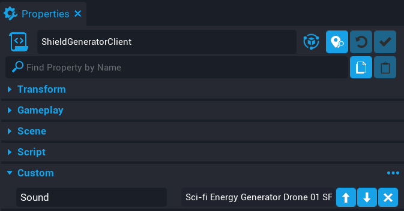{: .center loading="lazy" }

#### Add Effect Custom Property

Add the effect object **Point To Point Electrical Beam VFX** from the **Effects / Audio** group, onto the **ShieldGeneratorClient** script as a custom property. Name the custom property `Effect`.

{: .center loading="lazy" }

#### Add Trigger Custom Property

Add the **Trigger** inside the **Shield Generator** group, onto the **ShieldGeneratorClient** script as a custom property. Name the custom property `Trigger`.

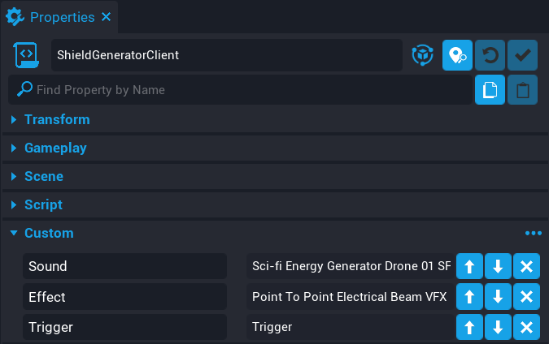{: .center loading="lazy" }

#### Add Mast Custom Property

Add the mast object **Antenna Mast 02** from the **Geo** group, onto the **ShieldGeneratorClient** script as a custom property. Name the custom property to `Mast`.

{: .center loading="lazy" }

#### Edit ShieldGeneratorClient Script

Add the following code to the **ShieldGeneratorClient** script.

```lua
local SOUND = script:GetCustomProperty("Sound"):WaitForObject()
local EFFECT = script:GetCustomProperty("Effect"):WaitForObject()
local TRIGGER = script:GetCustomProperty("Trigger"):WaitForObject()
local MAST = script:GetCustomProperty("Mast"):WaitForObject()

local function DisableGenerator()
    SOUND:Stop()
    EFFECT:Stop()

    local slot = MAST:GetMaterialSlots()[1]
    local material = slot:GetCustomMaterial()

    material:SetProperty("emissive_boost", 0)
end

Events.Connect("DisableGenerator" .. TRIGGER.id, DisableGenerator)
```

The above code will disable the generator when the broadcast event is fired.

```lua
SOUND:Stop()
EFFECT:Stop()
```

When the function `DisableGenerator` is called, it will turn off the sound and effect to indicate to the player that the shield generator has been disabled.

```lua
local slot = MAST:GetMaterialSlots()[1]
local material = slot:GetCustomMaterial()
```

The **MAST** in the **Geo** group has an emissive material. When the player turns off the shield generator, you can alter the emissive boost amount to give the impression that it has been disabled. Since you know the first slot of the material at index 1 is the emissive material, you can grab a direct reference too it.

```lua
material:SetProperty("emissive_boost", 0)
```

Setting the material property `emissive_boost` to `0` will appear to turn off the mast.

```lua
Events.Connect("DisableGenerator" .. TRIGGER.id, DisableGenerator)
```

The shield generator will be disabled by receiving a broadcast from a server script. Each broadcast event concatenates the `TRIGGER.id` to make sure it is a unique broadcast for that shield generator. If you don not include this, then when the server sends the broadcast to the client, all shield generators will appear to turn off.

??? "ShieldGeneratorClient"
    ```lua
    local SOUND = script:GetCustomProperty("Sound"):WaitForObject()
    local EFFECT = script:GetCustomProperty("Effect"):WaitForObject()
    local TRIGGER = script:GetCustomProperty("Trigger"):WaitForObject()
    local MAST = script:GetCustomProperty("Mast"):WaitForObject()

    -- Disables the generator effect, sound, and Mast material
    local function DisableGenerator()
        SOUND:Stop()
        EFFECT:Stop()

        -- Slot 1 is the emissive material for this object
        local slot = MAST:GetMaterialSlots()[1]

        -- Get the material from the slot
        local material = slot:GetCustomMaterial()

        -- Set the missive to 0 to indicate it has be disabled
        material:SetProperty("emissive_boost", 0)
    end

    Events.Connect("DisableGenerator" .. TRIGGER.id, DisableGenerator)
    ```

### Create ShieldGeneratorServer Script

The **ShieldGeneratorServer** script will be responsible for checking when a player has interacted with the trigger so it can turn off the generator.

#### Create ShieldGeneratorServer Script

Create a script called **ShieldGeneratorServer**, and place the **ShieldGeneratorServer** script inside the **Shield Generator** group in the **Default Context**.

#### Add Trigger Custom Property

Add the **Trigger** onto the **ShieldGeneratorServer** script as a custom property. Name the custom property `Trigger`.

{: .center loading="lazy" }

#### Edit ShieldGeneratorServer Script

Add the following code to the **ShieldGeneratorServer** script.

```lua
local TRIGGER = script:GetCustomProperty("Trigger"):WaitForObject()

local function OnInteracted(trigger, obj)
    if Object.IsValid(obj) and obj:IsA("Player") then
        TRIGGER.isInteractable = false
        Events.Broadcast("GeneratorDisabled", TRIGGER.id)
        Events.BroadcastToAllPlayers("DisableGenerator" .. TRIGGER.id)
    end
end

TRIGGER.interactedEvent:Connect(OnInteracted)
```

The code above will check if the object that is interacting with the trigger is a **Player** type. If it is a **Player** type, then the property `isInteractable` for the trigger, is set to `false` to prevent players interacting with it again.

```lua
Events.Broadcast("GeneratorDisabled", TRIGGER.id)
```

The broadcast event `GeneratorDisabled` is triggered. This will be listened for in the **BossAIServer** script that you will update later on.

```lua
Events.BroadcastToAllPlayers("DisableGenerator" .. TRIGGER.id)
```

You need to broadcast to all the players so the **ShieldGeneratorClient** script knows which shield generator to turn off.

??? "ShieldGeneratorServer"
    ```lua
    local TRIGGER = script:GetCustomProperty("Trigger"):WaitForObject()

    local function OnInteracted(trigger, obj)
        if Object.IsValid(obj) and obj:IsA("Player") then
            TRIGGER.isInteractable = false
            Events.Broadcast("GeneratorDisabled", TRIGGER.id)
            Events.BroadcastToAllPlayers("DisableGenerator" .. TRIGGER.id)
        end
    end

    TRIGGER.interactedEvent:Connect(OnInteracted)
    ```

### Update Shield Generator Template

The shield generator template needs to be updated so you can add instances of the template to the map.

Right click on the **Shield Generator** group, and select **Update Template From This**.

### Add Shield Generators to the Map

The map has 3 places to put a shield generator. Place each shield generator on the platforms.

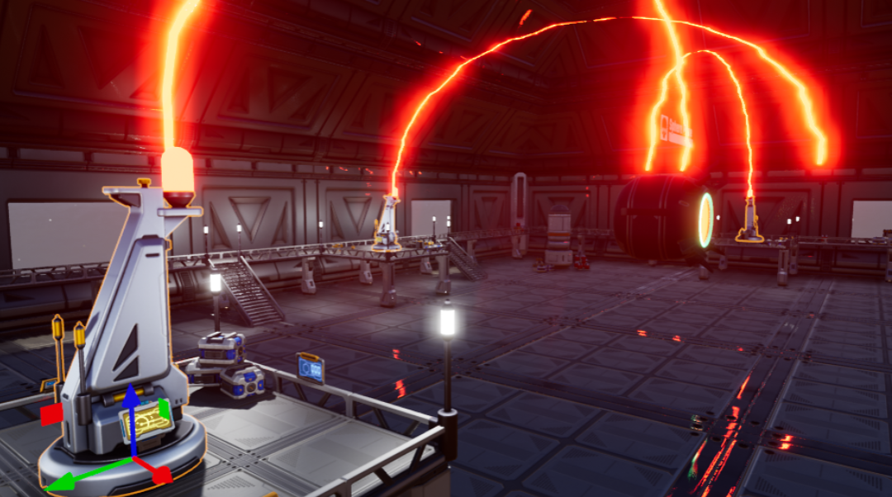{: .center loading="lazy" }

You will notice that the effect for the generators may not meet in the middle where the boss is. This can be fixed by moving the **Effect Target** group for each shield generator. Position each **Effect Target** so the beam is connected to the boss.

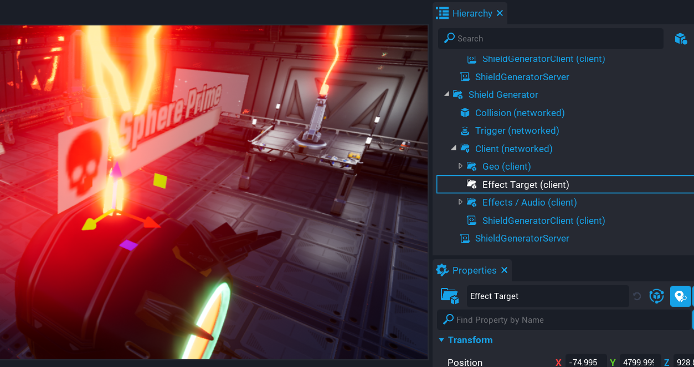{: .center loading="lazy" }

### Update BossAIServer Script

You need to update the **BossAIServer** script so that it knows how many shield generators have been disabled.

#### Add generatorsDisabled Variable

```lua
local generatorsDisabled = 0
```

Add the above variable to the top of the **BossAIServer** script. This is a counter that will be incremented each time a shield generator has been disabled by a player.

#### Create GeneratorDisabled Function

```lua
local function GeneratorDisabled()
    generatorsDisabled = generatorsDisabled + 1

    if generatorsDisabled == 3 then
        DAMAGEABLE.isInvulnerable = false
        Events.BroadcastToAllPlayers("EnableBossHealthBar")
    end
end
```

The `GeneratorDisabled` function will increment the `generatorsDisabled` counter. When it equals 3, then the boss will become vulnerable to damage. This is done by setting the `isInvulnerable` property of a **Damageable Object** to `false`.

```lua
Events.BroadcastToAllPlayers("EnableBossHealthBar")
```

This event is broadcasted to all the players. This will change the color of the boss health bar to indicate to players that it is now vulnerable to damage.

#### Add GeneratorDisabled Event

```lua
Events.Connect("GeneratorDisabled", GeneratorDisabled)
```

The **BossAIServer** needs to listen for when a generator has been disabled so it can update the `generatorsDisabled` disabled count. Add this code to the bottom of the **BossAIServer** script.

### Test the Game

Test the game by running to each shield generator and turning it off. Make sure the following work.

- Sound turns off.
- Effect turns off.
- Mast emissive turns off.
- Boss becomes vulnerable to damage.

!!! tip
    If testing is proving to be a challenge due to the boss shooting you, then you can temporally disable the damage the player receives by commenting out the line in the **BossAIServer** script that applies damage to the player.

### The Updated BossAIServer Script

??? "BossAIServer"
    ```lua
    local ACTIVITY_HANDLER = script.parent
    local BOSS_GEO = script:GetCustomProperty("BossGeo"):WaitForObject()
    local SHOOT_PERIMETER = script:GetCustomProperty("ShootPerimeter"):WaitForObject()
    local PROJECTILE = script:GetCustomProperty("Projectile")
    local SHOOT_POSITION = script:GetCustomProperty("ShootPosition"):WaitForObject()
    local DAMAGEABLE = script:GetCustomProperty("Damageable"):WaitForObject()

    -- Activities this AI will have and be registered
    local activities = {

        idle = {},
        shoot = {}

    }

    -- Current target the AI is focused on
    local target = nil

    -- Targets in range of the AI
    local shootTargets = {}

    -- Min cooldown for the AI shooting ability
    local shootCooldownMin = 0

    -- Max cooldown for the AI shooting ability
    local shootCooldownMax = 3

    -- Used with cooling down the AI shoot ability
    local shootElapsed = 0

    -- Has the AI shot?
    local hasShot = false

    -- Used for AI shooting cooldown
    local randomCooldown = 0

    -- Is the AI charging the weapon?
    local isCharging = false

    local sentUpdateBossHealthBar = false

    -- A counter to keep track on the amount if shields disabled
    local generatorsDisabled = 0

    -- Get a random target.
    local function GetRandomTarget()
        return shootTargets[math.random(#shootTargets)]
    end

    -- Look for damageable object.
    local function GetDamageable(obj)
        if obj:IsA("Damageable") then
            return obj
        else
            return obj:FindAncestorByType("Damageable")
        end
    end

    local function OnImpact(projectile, obj, hit)
        if Object.IsValid(obj) then
            --CoreDebug.DrawSphere(hit:GetImpactPosition(), 500, { duration = 1 })

            local results = World.FindObjectsOverlappingSphere(hit:GetImpactPosition(), 500, { ignoreObjects = {BOSS_GEO}})

            for index, object in ipairs(results) do
                if Object.IsValid(object) then
                    local damage = Damage.New()

                    damage.reason = DamageReason.NPC

                    if object:IsA("Player") then
                        Events.BroadcastToPlayer(object, "ShakeScreen", .8, 4.6)
                        --damage.amount = 40

                        object:ApplyDamage(damage)
                    else
                        local damageable = GetDamageable(object)

                        if Object.IsValid(damageable) then
                            damage.amount = 25

                            damageable:ApplyDamage(damage)
                        end
                    end
                end
            end
        end
    end

    local function ShootProjectile()
        if isCharging then
            return
        end

        isCharging = true

        local startPos = SHOOT_POSITION:GetWorldPosition()

        Events.BroadcastToAllPlayers("PlayChargeUpEffect")

        Task.Wait(.5)

        -- Need to check here if the boss object (collider and geo) is
        -- valid, as it may have been destroyed.

        if not Object.IsValid(BOSS_GEO) then
            return
        end

        -- Get the direction to shoot the projectile.
        local direction = BOSS_GEO:GetWorldRotation() * Vector3.FORWARD
        local theProjectile = Projectile.Spawn(PROJECTILE, startPos, direction)

        theProjectile.speed = 7000
        theProjectile.shouldDieOnImpact = false
        theProjectile.lifeSpan = 3.5
        theProjectile.gravityScale = 0.1

        theProjectile.impactEvent:Connect(OnImpact)

        isCharging = false
        hasShot = true
    end

    -- Idle state is the default state
    function activities.idle.tick(activity, deltaTime)
        activity.priority = 100
    end

    -- When returning back to idle, reset the AI rotation
    function activities.idle.start(activity, deltaTime)
        Task.Wait(.5)
        BOSS_GEO:RotateTo(Rotation.New(0, 0, 0), 2)
    end

    -- If the AI has targets in the perimeter, set the priority higher
    -- so the state switches.
    function activities.shoot.tick(activity, deltaTime)
        if #shootTargets > 0  then
            activity.priority = 200
        else
            activity.priority = 0
        end
    end

    -- When the shoot state is highest priority, tick.
    function activities.shoot.tickHighestPriority(activity, deltaTime)

        -- Make sure that there is a valid target to shoot at
        if Object.IsValid(target) then

            -- If the AI has not shot, then shoot.
            if(not hasShot) then
                ShootProjectile()

            -- Each shot requires a charge, this can be instant due to
            -- the random cooldown.
            elseif not isCharging then

                -- Check to see if a random cool down has been set, if not
                -- set a new time.
                if(randomCooldown == 0) then
                    randomCooldown = math.random(shootCooldownMin, shootCooldownMax)
                end

                -- Increase the elapsed time which is used for the cooldown
                shootElapsed = shootElapsed + deltaTime

                -- If the elapsed time is greater than the cooldown and the AI
                -- has shot, then look for a target again.
                if shootElapsed >= randomCooldown and hasShot then
                    target = GetRandomTarget()

                    if Object.IsValid(target) then
                        BOSS_GEO:LookAtContinuous(target, false, 2.0)
                    end

                    shootElapsed = 0
                    randomCooldown = 0
                    hasShot = false
                end
            end
        end
    end

    -- When change to the shoot state, on start we need to select
    -- a random target inside the perimeter.
    function activities.shoot.start(activity, deltaTime)
        local tmpTarget = GetRandomTarget()
        BOSS_GEO:LookAtContinuous(tmpTarget, false, .5)
        Task.Wait(1)
        target = tmpTarget
        tmpTarget = nil
    end

    -- If a player enters the shoot perimeter of the AI, add
    -- them to the shootTargets table
    function OnPlayerEnterShoot(trigger, player)
        if Object.IsValid(player) and player:IsA("Player") then
            table.insert(shootTargets, player)

            -- Enable the players weapon if they are in the perimeter
            Events.Broadcast("EnableWeapon", player)
        end
    end

    -- If the player leaves the shoot perimeter of the AI, remove
    -- them from the shootTargets table.
    function OnPlayerLeftShoot(trigger, player)
        if Object.IsValid(player) and player:IsA("Player") then

            -- Disable the players weapon if they are out of the perimeter
            Events.Broadcast("DisableWeapon", player)

            for index, value in ipairs(shootTargets) do
                if value == player then
                    table.remove(shootTargets, index)

                    if(target == player and Object.IsValid(BOSS_GEO)) then
                        BOSS_GEO:StopRotate()
                    end

                    break
                end
            end
        end
    end

    -- When the AI receives damage, broadcast that to the player
    -- who caused the damage.
    local function OnDamaged(obj, damage)
        if not sentUpdateBossHealthBar then
            Events.BroadcastToAllPlayers("CanUpdateBossHealthBar")
            sentUpdateBossHealthBar = true
        end

        Events.BroadcastToPlayer(damage.sourcePlayer, "ShowDamage", damage.amount, false)
    end

    -- Each generator that is disabled, increment the counter so
    -- that once all 3 are disabled, the AI becomes vulnerable.
    local function GeneratorDisabled()
        generatorsDisabled = generatorsDisabled + 1

        if generatorsDisabled == 3 then
            DAMAGEABLE.isInvulnerable = false
            Events.BroadcastToAllPlayers("EnableBossHealthBar")
        end
    end

    DAMAGEABLE.damagedEvent:Connect(OnDamaged)

    SHOOT_PERIMETER.beginOverlapEvent:Connect(OnPlayerEnterShoot)
    SHOOT_PERIMETER.endOverlapEvent:Connect(OnPlayerLeftShoot)

    -- Loop through the activities table and add them to
    -- the activity handler
    for k, a in pairs(activities) do
        ACTIVITY_HANDLER:AddActivity(k, activities[k])
    end

    Events.Connect("GeneratorDisabled", GeneratorDisabled)
    ```

## Update Boss Health Bar

When the boss is vulnerable to damage, the health bar needs to be updated so that players are aware the boss can receive damage. To do this, the color of the boss name and health bar will be changed when it is vulnerable.

### Update BossHealthUIClient Script

The **BossHealthUIClient** script needs to change the color of the various UI components that build up the heath bar, and boss name.

#### Add BossName Custom Property

Add the **Boss Name** text object onto the **BossHealthUIClient** as a custom property. Name the custom property `BossName`.

{: .center loading="lazy" }

#### Add SkullBackground Custom Property

Add the **Background** image object onto the **BossHealthUIClient** as a custom property. Name the custom property `SkullBackground`.

{: .center loading="lazy" }

#### Update BossHealthUIClient Script

```lua
local BOSS_NAME = script:GetCustomProperty("BossName"):WaitForObject()
local SKULL_BACKGROUND = script:GetCustomProperty("SkullBackground"):WaitForObject()
```

Add the variable references to the top of the **BossHealthUIClient** client script so you can access those UI components to change the color.

```lua
local function EnableHealthBar()
    HEALTHBAR:SetFillColor(Color.YELLOW)
    BOSS_NAME:SetColor(Color.YELLOW)
    SKULL_BACKGROUND:SetColor(Color.YELLOW)
end
```

Add the `EnableHealthBar` function that will update the various UI components that make up the health bar and boss name that the players will see. The color will be changed to **YELLOW** when the boss is vulnerable to damage. This will make it appear that the health bar has been enabled to players.

```lua
Events.Connect("EnableBossHealthBar", EnableHealthBar)
```

Add the `EnableBossHealthBar` event that will be called from the server, and broadcasted to all players.

### Test the Game

Test the game to make sure the following work.

- All shield generators turn off
- The boss health bar turns yellow

### The Updated BossHealthUIClient Script

??? "BossHealthUIClient"
    ```lua
    local HEALTHBAR = script:GetCustomProperty("HealthBar"):WaitForObject()
    local BOSS_NAME = script:GetCustomProperty("BossName"):WaitForObject()
    local SKULL_BACKGROUND = script:GetCustomProperty("SkullBackground"):WaitForObject()
    local DAMAGEABLE = script:GetCustomProperty("Damageable"):WaitForObject()

    local canTickHealth = false

    -- When the boss can be hurt, the health bar and UI are set to yellow
    -- to indicate that it can take damage.
    local function EnableHealthBar()
        HEALTHBAR:SetFillColor(Color.YELLOW)
        BOSS_NAME:SetColor(Color.YELLOW)
        SKULL_BACKGROUND:SetColor(Color.YELLOW)
    end

    function Tick()
        if canTickHealth then
            HEALTHBAR.progress = DAMAGEABLE.hitPoints / DAMAGEABLE.maxHitPoints
        end
    end

    Events.Connect("EnableBossHealthBar", EnableHealthBar)
    Events.Connect("CanUpdateBossHealthBar", function()
        canTickHealth = true
    end)
    ```

## Create Damageable Barrels

In this section you will be creating groups of barrels that can be placed around the map that the player or boss can destroy by using **Damageable Objects**. In the next section when these barrels have been destroyed, they will drop a pickup the player must use to turn off a shield generator.

### Create Damageable Objects

Create a **Damageable Object** and rename it to `Barrels Damageable Object`.

Set the **Max Hit Points** and **Starting Hit Points** properties to 50. This is so that the group of barrels will take a few shots from the player or the boss to be destroyed.

#### Add Sci-fi Barrel 02

Add some **Sci-fi Barrel 02** objects from **Core Content** as a child of **Barrels Damageable Object**. Place them however you like.

#### Set Destroy on Death Client TemplateId

When the barrels are destroyed, an explosion effect will be played. Add the template **Barrel Basic Explosion** on to the property **Destroy on Death Client TemplateId** on the object **Barrels Damageable Object**.

#### Create Client Context

Add a **Client Context** as a child of **Barrels Damageable Object**. Rename the **Client Context** to `Effects`. This will be used to show an effect to the player to encourage them to investigate the group of barrels.

!!! tip "Client Context Effects, Sounds, and UI"
    Objects such as effects, sounds, and UI will always be in a **Client Context**. Those types of objects do not need to be synced up between the clients. This is an advantage, as it is less network usage, and reduces the load on the server.

#### Add Callout Sparkle Effect

From **Core Content**, add the effect **Callout Sparkle** to the **Effects** group, and change the properties and position until you are happy with it.

#### Create Damageable Object

Create another **Damageable Object** and place it as a child of **Barrels Damageable Object** and rename it to `Barrel Damageable Object Child`. This will be a barrel that can be destroyed on its own by the player if it is shot first.

Set the **Max Hit Points** and **Starting Hit Points** properties to 50.

#### Add Sci-fi Barrel 01

Add one **Sci-fi Barrel 01** object from **Core Content** as a child of **Barrel Damageable Object Child**.

You should have something similar to the picture below.

{: .center loading="lazy" }

### Add Destroy on Death Client Template

When either of the **Damageable Objects** are destroyed, they can automatically spawn a template with no scripting needed for effects by setting the **Destroy on Death Client TemplateId** property.

#### Update Barrels Damageable Object

Add the template **Barrel Basic Explosion** onto the property **Destroy on Death Client TemplateId**.

#### Update Barrel Damageable Object Child

Add the template **Barrel Basic Explosion 2** onto the property **Destroy on Death Client TemplateId**. This is a similar effect to the first explosion template but is a different color.

### Create **Barrels** Template

Create a new template by right clicking on **Barrels Damageable Object** in the **Hierarchy** and selecting **Create New Template From This**.

Place in total, 3 of the **Barrels Damageable Object** template around the map. Later you will be updating the template to drop a pickup for the player to use.

### Test the Game

Test the game to make sure both **Damageable Objects** can be destroyed.

It is a good habit to test your game often when new features or big changes are being done to your game.

<div class="mt-video" style="width:100%">
    <video autoplay muted playsinline controls loop class="center" style="width:100%">
        <source src="/img/BossTutorial/shoot_barrels_test.mp4" type="video/mp4" />
    </video>
</div>

## Creating the Injector Pickup

Players can just run to each shield generator and turn them off. In this section you will add an additional step players need to take that will require them picking up an object when the barrels from the previous section are destroyed.

### Add Injector Pickup Template to Hierarchy

In **Project Content** under **My Templates**, add the template **Injector Pickup** into the **Hierarchy** and deinstance it.

### Create InjectorPickupServer

A server script will be responsible for checking if the player can pick up the injector. Only one injector can be carried by the player.

#### Create InjectorPickupServer Script

Create a script called **InjectorPickupServer**, and place **InjectorPickupServer** script inside the **Injector Pickup** group, in the **Default Context**.

#### Add Trigger Custom Property

Add the trigger object inside the **Injector Pickup** group onto the **InjectorPickupServer** script. Name the custom property `Trigger`.

#### Update Injector Pickup Template

Right click on the **Injector Pickup** template and select **Update Template**. The **Injector Pickup** can be removed from the **Hierarchy** because it will be spawned in automatically when the **Barrels Damageable Object** is destroyed. Later on you will be updating the **Barrels Damageable Object** to spawn in the **Injector Pickup**.

#### Edit InjectorPickupServer Script

Add the below code to the **InjectorPickupServer** script.

```lua
local TRIGGER = script:GetCustomProperty("Trigger"):WaitForObject()

local function PickupItem(trigger, obj)
    if Object.IsValid(obj) and obj:IsA("Player") and not obj.isDead then
        if obj:GetResource("injectors") == 0 then
            obj:SetResource("injectors", 1)
            TRIGGER.parent:Destroy()
        else
            Events.BroadcastToPlayer(obj, "PlayErrorSound")
        end
    end
end

local evt = TRIGGER.interactedEvent:Connect(PickupItem)

TRIGGER.destroyEvent:Connect(function()
    if evt.isConnected then
        evt:Disconnect()
    end
end)
```

The `PickupItem` function will check if the player can pick up the injector.

```lua
if Object.IsValid(obj) and obj:IsA("Player") and not obj.isDead then
```

The line above makes sure it is the player interacting with the trigger, and they are not dead by checking the `isDead` property is false. If a player dies near the injector, they could still pickup the injector, so checking if they are not dead will solve this problem.

```lua
if obj:GetResource("injectors") == 0 then
    obj:SetResource("injectors", 1)
```

The above code will check if the resource `injectors` is 0, and if so, set the `injector` resource value to 1.

```lua
TRIGGER.parent:Destroy()
```

When the player picks up the injector, the parent object will be destroyed so the injector is removed from the world.

```lua
    Events.BroadcastToPlayer(obj, "PlayErrorSound")
```

    If the player already is holding an injector, then broadcast to the player so an error sound is played.

!!! info "`PlayErrorSound` is an event that can be found in the `AudioClient` script that is already setup for you."

```lua
local evt = TRIGGER.interactedEvent:Connect(PickupItem)

TRIGGER.destroyEvent:Connect(function()
    if evt.isConnected then
        evt:Disconnect()
    end
end)
```

The above code will setup the `interactedEvent`, and also handle disconnecting the event when the trigger is destroyed.

!!! info "Disconnecting Event Listeners"
    It is a good habit to disconnect any event listener that is no longer needed to improve the performance of your game. As you game gets bigger, more and more events will likely be used, and if those event listeners are left in memory, it could cause performance issues for your game.

### The InjectorPickupServer Script

??? "InjectorPickupServer"
    ```lua
    local TRIGGER = script:GetCustomProperty("Trigger"):WaitForObject()

    -- Handles checking if the player can pick up the
    -- injector. If they can not, an error sound is played.
    local function PickupItem(trigger, obj)
        if Object.IsValid(obj) and obj:IsA("Player") and not obj.isDead then

            -- Check the players resource to see if they do not already
            -- have an injector.
            if obj:GetResource("injectors") == 0 then
                obj:SetResource("injectors", 1)
                TRIGGER.parent:Destroy()
            else
                Events.BroadcastToPlayer(obj, "PlayErrorSound")
            end
        end
    end

    local evt = TRIGGER.interactedEvent:Connect(PickupItem)

    TRIGGER.destroyEvent:Connect(function()
        if evt.isConnected then
            evt:Disconnect()
        end
    end)
    ```

### Update Barrels Damageable Object

Now that you have the pickup template created, it needs to be added to the **Destroy on Death Networked TemplateId** property.

1. Select one **Barrels Damageable Object** in the **Hierarchy**.
2. Add the **Injector Pickup** template onto the property **Destroy on Death Networked TemplateId**.
3. Update the **Barrels Damageable Object** template.

By updating one **Barrels Damageable Object**, the others will get updated with those changes.

When the **Barrels Damageable Object** is destroy, the **Injector Pickup** will be spawned that the player can pick up. At the moment the player can not do anything with the injector.

### Create PlayerClient Script

The **PlayerClient** script will check when the resource `injectors` value changes so it can show or hide a UI element.

#### Create PlayerClient Script

Create a script called **PlayerClient** and place it into the **Client** group inside the **Boss Fight Map** group.

#### Add Injector Custom Property

Find the **Injector** UI panel in the **UI** group, and add it onto the **PlayerClient** script as a custom property. Name the custom property `Injector`.

{: .center loading="lazy" }

#### Edit PlayerClient Script

Add the following code to the **PlayerClient** script.

```lua
local INJECTOR = script:GetCustomProperty("Injector"):WaitForObject()

local localPlayer = Game.GetLocalPlayer()

local function ResourceChanged(player, resourceName, newAmount)
    if resourceName == "injectors" then
        if newAmount == 0 then
            INJECTOR.visibility = Visibility.FORCE_OFF
        else
            INJECTOR.visibility = Visibility.FORCE_ON
        end
    end
end

localPlayer.resourceChangedEvent:Connect(ResourceChanged)
```

The `ResourceChanged` function will be called when a resource has changed value. The `ResourceChanged` function will check to see if the resource that changed is named `injectors`. If the `newAmount` is `0`, then the visibility of the `INJECTOR` panel is turned off, otherwise it is turned on so players know they are carrying an injector.

### Update ShieldGeneratorServer Script

The player can pick up the injector, but it can not be used. You will need to update the **ShieldGeneratorServer** script so that the shield generator can only be disabled if the injector is inserted.

Open the **ShieldGeneratorServer** script and replace the `OnInteracted` function with the function below.

```lua
local function OnInteracted(trigger, obj)
    if Object.IsValid(obj) and obj:IsA("Player") then
        if obj:GetResource("injectors") > 0 then
            TRIGGER.isInteractable = false
            Events.Broadcast("GeneratorDisabled", TRIGGER.id)
            Events.BroadcastToAllPlayers("DisableGenerator" .. TRIGGER.id)
            obj:SetResource("injectors", 0)
        else
            Events.BroadcastToPlayer(obj, "PlayErrorSound")
        end
    end
end
```

When the shield generator is interacted with, it will check to see if the player has an injector by checking the `injectors` resource.

```lua
obj:SetResource("injectors", 0)
```

If the player is able to turn off the shield generator, then set the `injector` resource to `0`. This will trigger the `resourceChangeEvent` in the `PlayerClient` script that will update the UI.

```lua
Events.BroadcastToPlayer(obj, "PlayErrorSound")
```

If the player does not have an injector, a broadcast is sent to them to play an error sound.

### Test the Game

Test the game and make sure the following work.

- Shield generator can not be disabled without an injector.
- Barrels drop an injector when destroyed.
- Injector can be picked up, and UI updates.
- Only one injector can be picked up at a time.
- Shield generator can be disabled with an injector.

<div class="mt-video" style="width:100%">
    <video autoplay muted playsinline controls loop class="center" style="width:100%">
        <source src="/img/BossTutorial/insert_injector.mp4" type="video/mp4" />
    </video>
</div>

### Updated ShieldGeneratorServer Script

??? "ShieldGeneratorServer"
    ```lua
    local TRIGGER = script:GetCustomProperty("Trigger"):WaitForObject()

    -- When the console for the generator is intereacted, check
    -- if the player has an injector for them to be able to turn
    -- off the generator.
    local function OnInteracted(trigger, obj)
        if Object.IsValid(obj) and obj:IsA("Player") then
            if obj:GetResource("injectors") > 0 then
                TRIGGER.isInteractable = false
                Events.Broadcast("GeneratorDisabled", TRIGGER.id)
                Events.BroadcastToAllPlayers("DisableGenerator" .. TRIGGER.id)
                obj:SetResource("injectors", 0)
            else
                Events.BroadcastToPlayer(obj, "PlayErrorSound")
            end
        end
    end

    TRIGGER.interactedEvent:Connect(OnInteracted)
    ```

## Update Game State for Players

If a player joins the boss fight late, then they need to know about what has happened in the game so far. In this case for the boss fight, they need to know the state of the shield generators so they can be disabled. In this section you will be sending the game state to those later joining players so they can be synced up with the rest of the players in the game.

### Update PlayerServer Script

You need to keep track of what shield generators have been disabled on the server and send the state of the changed shield generators to the player that joined.

```lua
local GeneratorsTurnedOff = {}
```

Add the above line near the top of the **PlayerServer** script. This table will be used to hold the trigger ID for each shield generator that has been disabled.

```lua
local function UpdateGameState(player)
    local GeneratorsIDStr = ""

    for index, id in ipairs(GeneratorsTurnedOff) do
        GeneratorsIDStr = GeneratorsIDStr .. id .. "|"
    end

    Events.BroadcastToPlayer(player, "UpdateGameState", GeneratorsIDStr)
end
```

Add the **UpdateGameState** function just after the **OnPlayerLeft** function. The **UpdateGameState** function will build an ID string of the shield generators that have been disabled and broadcast that string to the player.

```lua
 GeneratorsIDStr = GeneratorsIDStr .. id .. "|"
```

 On each iteration of the loop, the string `GeneratorIDStr` is concatenated with the previous value of `GeneratorIDStr`, and the `id` stored in the array. Each entry is separated with the pipe `|` symbol so that later it will be split by using the pipe `|` as the separator.

```lua
local function GeneratorDisabled(triggerID)
    GeneratorsTurnedOff[#GeneratorsTurnedOff + 1] = triggerID
end
```

Create the `GeneratorDisabled` function after the `UpdateGameState` function.

The `GeneratorDisabled` function is triggered when a shield generator has been disabled. The `GeneratorDisabled` function receives the trigger ID for the shield generator being disabled, this is added to the end of `GeneratorsTurnedOff` table by adding `1` to the current total entries.

```lua
Events.Connect("GeneratorDisabled", GeneratorDisabled)
```

When the shield generator is disabled, the `GeneratorDisabled` event is called.

```lua
Events.ConnectForPlayer("ClientReady", UpdateGameState)
```

The **ClientReady** event will be called when the client is ready to receive the updated game state.

### The Updated PlayerServer Script

??? "PlayerServer"
    ```lua
    local WEAPON = script:GetCustomProperty("Weapon")

    local GeneratorsTurnedOff = {}

    -- Store a list of players in the game so that
    -- the events can be disconnected later when
    -- they leave.
    local players = {}

    -- Look for a valid target that is a damageable object
    local function GetValidTarget(target)
        if not Object.IsValid(target) then
            return nil
        end

        if target:IsA("Damageable") then
            return target
        end

        return target:FindAncestorByType("Damageable")
    end

    -- See if the target is invulnerable, if so, broadcast
    -- to the player for feedback.
    local function OnImpact(weaponObj, impactData)
        local target = GetValidTarget(impactData.targetObject)

        if Object.IsValid(target) then
            if target.isInvulnerable then
                Events.BroadcastToPlayer(impactData.weaponOwner, "ShowDamage", 0, true)
            end
        end
    end

    -- Enable weapon abilities for the player
    local function EnableWeapon(player)
        if Object.IsValid(player) and players[player.id] and Object.IsValid(players[player.id].weapon) then
            local abilities = players[player.id].weapon:FindDescendantsByType("Ability")

            for index, ability in ipairs(abilities) do
                ability.isEnabled = true
            end
        end
    end

    -- Disable weapon abilities for the player
    local function DisableWeapon(player)
        if Object.IsValid(player) and players[player.id] and Object.IsValid(players[player.id].weapon) then
            local abilities = players[player.id].weapon:FindDescendantsByType("Ability")

            for index, ability in ipairs(abilities) do
                ability.isEnabled = false
            end
        end
    end

    -- When a player joins, give a weapon and setup
    -- the binding events for sprinting.
    local function OnPlayerJoined(player)
        local weapon = World.SpawnAsset(WEAPON)

        weapon:Equip(player)
        weapon.targetImpactedEvent:Connect(OnImpact)

        players[player.id] = {

            pressedEvt = player.bindingPressedEvent:Connect(function(obj, binding)
                if binding == "ability_feet" then
                    player.maxWalkSpeed = 1200
                end
            end),

            releasedEvt = player.bindingReleasedEvent:Connect(function(obj, binding)
                if binding == "ability_feet" then
                    player.maxWalkSpeed = 640
                end
            end),

            weapon = weapon
        }

        DisableWeapon(player)
    end

    local function UpdateGameState(player)
        local GeneratorsIDStr = ""

        if #GeneratorsTurnedOff > 0 then
            for index, id in ipairs(GeneratorsTurnedOff) do
                GeneratorsIDStr = GeneratorsIDStr .. id .. "|"
            end
        end

        Events.BroadcastToPlayer(player, "UpdateGameState", GeneratorsIDStr)
    end

    -- Clean up the events when a player leaves
    local function OnPlayerLeft(player)
        if players[player.id].pressedEvt.isConnected then
            players[player.id].pressedEvt:Disconnect()
        end

        if players[player.id].releasedEvt.isConnected then
            players[player.id].releasedEvt:Disconnect()
        end

        players[player.id] = nil
    end

    -- Keep track of the generators that have already been
    -- disabled so that players who join later will get the
    -- same game state.
    local function GeneratorDisabled(triggerID)
        GeneratorsTurnedOff[#GeneratorsTurnedOff + 1] = triggerID
    end

    Game.playerJoinedEvent:Connect(OnPlayerJoined)
    Game.playerLeftEvent:Connect(OnPlayerLeft)

    Events.Connect("EnableWeapon", EnableWeapon)
    Events.Connect("DisableWeapon", DisableWeapon)
    Events.Connect("GeneratorDisabled", GeneratorDisabled)

    Task.Wait()
    Events.ConnectForPlayer("ClientReady", UpdateGameState)
    ```

### Update PlayerClient Script

The **PlayerClient** script needs to be updated so it can update the game state, in this case it will be the shield generators, making sure that any that have been disabled is also disabled for the player that joined.

```lua
local function UpdateGameState(generatorsDisabledIDStr)
    if string.len(generatorsDisabledIDStr) > 0 then
        local generators = {CoreString.Split(generatorsDisabledIDStr, "|")}
        local counter = 0

        for index, generator in ipairs(generators) do
            if string.len(generator) > 1 then
                counter = counter + 1
                Events.Broadcast("DisableGenerator" .. generator)
            end
        end

        if counter == 3 then
            Events.Broadcast("EnableBossHealthBar")
            Events.Broadcast("CanUpdateBossHealthBar")
        end
    end
end
```

Create the above function `UpdateGameState` in the **PlayerClient** script. This function will be called from the **PlayerServer** script when it is ready to send the game state to the player.

```lua
if string.len(generatorsDisabledIDStr) > 0 then
```

There is a possibility that no shield generators have been disabled, so the string `generatorsDisabledIDStr` could be empty. By using the `string.len` function, you can check to see what the length of a string is.

```lua
local generators = {CoreString.Split(generatorsDisabledIDStr, "|")}
```

The string `generatorsDisabledIDStr` is made up of the trigger ID and pipe `|` separator. You can use the `Split` function from the `CoreString` namespace that will split up a string based on the separator passed in as the second argument. Because there could be more than one trigger ID in the string, wrapping the return value of `split` in a table will populate that table with all the split elements.

```lua
for index, generator in ipairs(generators) do
    if string.len(generator) > 1 then
        counter = counter + 1
        Events.Broadcast("DisableGenerator" .. generator)
    end
end
```

You then need to loop over the `generators` array and broadcast to the correct shield generator so it can be disabled.

```lua
if counter == 3 then
    Events.Broadcast("EnableBossHealthBar")
    Events.Broadcast("CanUpdateBossHealthBar")
end
```

If the amount of shield generators disabled is 3, then you need to enable the boss health bar, and also make sure the health bar can be updated when it is receiving damage.

### The Updated PlayerClient Script

??? "PlayerClient"
    ```lua
    local INJECTOR = script:GetCustomProperty("Injector"):WaitForObject()

    local localPlayer = Game.GetLocalPlayer()

    -- Check to see when the players injectors resource changes to the
    -- UI can also be updated.
    local function ResourceChanged(player, resourceName, newAmount)
        if resourceName == "injectors" then
            if newAmount == 0 then
                INJECTOR.visibility = Visibility.FORCE_OFF
            else
                INJECTOR.visibility = Visibility.FORCE_ON
            end
        end
    end

    local function UpdateGameState(generatorsDisabledIDStr)
        if string.len(generatorsDisabledIDStr) > 0 then
            local generators = {CoreString.Split(generatorsDisabledIDStr, "|")}
            local counter = 0

            for index, generator in ipairs(generators) do
                if string.len(generator) > 1 then
                    counter = counter + 1
                    Events.Broadcast("DisableGenerator" .. generator)
                end
            end

            if counter == 3 then
                Events.Broadcast("EnableBossHealthBar")
                Events.Broadcast("CanUpdateBossHealthBar")
            end
        end
    end

    localPlayer.resourceChangedEvent:Connect(ResourceChanged)

    Events.Connect("UpdateGameState", UpdateGameState)

    -- Let the server know the client is ready.
    Task.Wait()
    Events.BroadcastToServer("ClientReady")
    ```

### Test the Game

You will need to test the game in multiplayer preview to make sure the game state is correctly sent to players that join later.

- Play the game with one client.
- Disable one shield generator.
- Add another client to the game.
- Make sure the new client sees that the disabled generator has been disabled.

<div class="mt-video" style="width:100%">
    <video autoplay muted playsinline controls loop class="center" style="width:100%">
        <source src="/img/BossTutorial/game_state_test.mp4" type="video/mp4" />
    </video>
</div>

## Animate Player Health using Curves

Having the health show in the UI for the player will help them be a little more cautious when stepping on the hot floor tiles. You will be using a curve to animate the health UI to pulsate when the health of the player is 50% or lower.

### Enable Player Health Panel

The **Player Health Panel** component in the **UI** container, has the **Visibility** turned off. Set the **Visibility** property to **Inherit from Parent**. In doing so, you will see the heart image in the top left of the screen.

### Add HealthBar Custom Property

Inside the **Player Health Panel**, add **UI Progress Bar** onto the **PlayerClient** script as a custom property. Name the custom property **HealthBar**.

{: .center loading="lazy" }

### Add HealthPulseCurve Custom Property

Add a **SimpleCurve** custom property to the **PlayerClient** script. Name the custom property `HealthPulseCurve`.

{: .center loading="lazy" }

### Edit HealthPulseCurve Curve

The curve will need to constantly animate the heart while the player health is 50% or below. So you need a curve that repeats because the heart will need to shrink and grow.

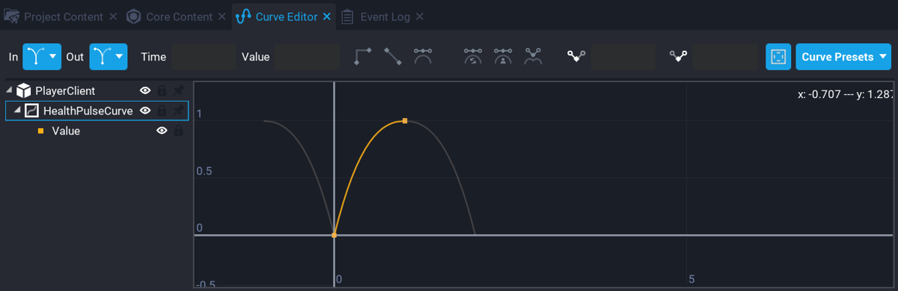{: .center loading="lazy" }

From **Curve Presets**, select **EaseOut**, and then select **Oscillate** for **In** and **Out**.

### Update PlayerClient Script

Add the code below to **PlayerClient**.

```lua
local HEALTH_BAR = script:GetCustomProperty("HealthBar"):WaitForObject()
local HEALTH_PULSE_CURVE = script:GetCustomProperty("HealthPulseCurve")
```

Add the variable references to the top of the **PlayerClient** script.

```lua
local healthElapsedTime = 0

function Tick(deltaTime)
    HEALTH_BAR.progress = localPlayer.hitPoints / localPlayer.maxHitPoints

    if(HEALTH_BAR.progress <= .5) then
        healthElapsedTime = healthElapsedTime + deltaTime

        local value = HEALTH_PULSE_CURVE:GetValue(healthElapsedTime) * 40

        HEALTH_BAR.width = math.floor(value)
        HEALTH_BAR.height = math.floor(value)
    end
end
```

Add the above code to the **PlayerClient** script. This code will handle animating the `HEALTH_BAR` when the health of the player is 50% or lower.

### Test the Game

Test the game and make sure the following work.

- Player taking damage reduces the health bar.
- Health bar at 50% or lower pulsates the health bar.

### Updated PlayerClient Script

??? "PlayerClient"
    ```lua
    local INJECTOR = script:GetCustomProperty("Injector"):WaitForObject()
    local HEALTH_BAR = script:GetCustomProperty("HealthBar"):WaitForObject()
    local HEALTH_PULSE_CURVE = script:GetCustomProperty("HealthPulseCurve")

    local localPlayer = Game.GetLocalPlayer()
    local healthElapsedTime = 0

    function Tick(deltaTime)
        HEALTH_BAR.progress = localPlayer.hitPoints / localPlayer.maxHitPoints

        if(HEALTH_BAR.progress <= .5) then
            healthElapsedTime = healthElapsedTime + deltaTime

            local value = HEALTH_PULSE_CURVE:GetValue(healthElapsedTime) * 40

            HEALTH_BAR.width = math.floor(value)
            HEALTH_BAR.height = math.floor(value)
        end
    end

    local function UpdateGameState(generatorsDisabledIDStr)
        if generatorsDisabledIDStr ~= nil and string.len(generatorsDisabledIDStr) > 1 then
            local generators = {CoreString.Split(generatorsDisabledIDStr, "|")}
            local counter = 0

            for index, generator in ipairs(generators) do
                if string.len(generator) > 1 then
                    counter = counter + 1
                    Events.Broadcast("DisableGenerator" .. generator)
                end
            end

            if counter == 3 then
                Events.Broadcast("EnableBossHealthBar")
                Events.Broadcast("CanUpdateBossHealthBar")
            end
        end
    end

    -- Check to see when the players injectors resource changes to the
    -- UI can also be updated.
    local function ResourceChanged(player, resourceName, newAmount)
        if resourceName == "injectors" then
            if newAmount == 0 then
                INJECTOR.visibility = Visibility.FORCE_OFF
            else
                INJECTOR.visibility = Visibility.FORCE_ON
            end
        end
    end

    localPlayer.resourceChangedEvent:Connect(ResourceChanged)

    Events.Connect("UpdateGameState", UpdateGameState)

    -- Let the server know the client is ready.
    Task.Wait()
    Events.BroadcastToServer("ClientReady")
    ```

## Polish up the Game

In this section you will add a little bit of polish to the game.

### Add Boss Destroyed Template

When the boss is killed, nothing happens. It is not very satisfying.

Add the template **Boss Death Explosion** onto the property **Destroy on Death Client TemplateId** on the **Boss Damageable Object**. When the boss is killed, an explosion effect will be spawned for all players.

### Update BossAIServer

When the boss is killed, the music needs to change to victory music for all players.

Open up the **BossAIServer** script and add the following code.

```lua
local function OnDied()
    Events.BroadcastToAllPlayers("PlayVictoryMusic")
end
```

Add the above code just after the `OnDamaged` event. The `OnDied` function will fire when the boss has been killed and broadcast to all players so the music changes to play the victory music.

```lua
DAMAGEABLE.diedEvent:Connect(OnDied)
```

Add the above line to the end of the **BossAIServer** script. This line will listen for when the damageable object for the boss has died, and then trigger the `OnDied` function.

### Updated BossAIServer Script

??? "BossAIServer"
    ```lua
    local ACTIVITY_HANDLER = script.parent
    local BOSS_GEO = script:GetCustomProperty("BossGeo"):WaitForObject()
    local SHOOT_PERIMETER = script:GetCustomProperty("ShootPerimeter"):WaitForObject()
    local PROJECTILE = script:GetCustomProperty("Projectile")
    local SHOOT_POSITION = script:GetCustomProperty("ShootPosition"):WaitForObject()
    local DAMAGEABLE = script:GetCustomProperty("Damageable"):WaitForObject()

    -- Activities this AI will have and be registered
    local activities = {

        idle = {},
        shoot = {}

    }

    -- Current target the AI is focused on
    local target = nil

    -- Targets in range of the AI
    local shootTargets = {}

    -- Min cooldown for the AI shooting ability
    local shootCooldownMin = 0

    -- Max cooldown for the AI shooting ability
    local shootCooldownMax = 3

    -- Used with cooling down the AI shoot ability
    local shootElapsed = 0

    -- Has the AI shot?
    local hasShot = false

    -- Used for AI shooting cooldown
    local randomCooldown = 0

    -- Is the AI charging the weapon?
    local isCharging = false

    local sentUpdateBossHealthBar = false

    -- A counter to keep track on the amount if shields disabled
    local generatorsDisabled = 0

    -- Get a random target.
    local function GetRandomTarget()
        return shootTargets[math.random(#shootTargets)]
    end

    -- Look for damageable object.
    local function GetDamageable(obj)
        if obj:IsA("Damageable") then
            return obj
        else
            return obj:FindAncestorByType("Damageable")
        end
    end

    local function OnImpact(projectile, obj, hit)
        if Object.IsValid(obj) then
            --CoreDebug.DrawSphere(hit:GetImpactPosition(), 500, { duration = 1 })

            local results = World.FindObjectsOverlappingSphere(hit:GetImpactPosition(), 500, { ignoreObjects = {BOSS_GEO}})

            for index, object in ipairs(results) do
                if Object.IsValid(object) then
                    local damage = Damage.New()

                    damage.reason = DamageReason.NPC

                    if object:IsA("Player") then
                        Events.BroadcastToPlayer(object, "ShakeScreen", .8, 4.6)
                        damage.amount = 40

                        object:ApplyDamage(damage)
                    else
                        local damageable = GetDamageable(object)

                        if Object.IsValid(damageable) then
                            damage.amount = 25

                            damageable:ApplyDamage(damage)
                        end
                    end
                end
            end
        end
    end

    local function ShootProjectile()
        if isCharging then
            return
        end

        isCharging = true

        local startPos = SHOOT_POSITION:GetWorldPosition()

        Events.BroadcastToAllPlayers("PlayChargeUpEffect")

        Task.Wait(.5)

        -- Need to check here if the boss object (collider and geo) is
        -- valid, as it may have been destroyed.

        if not Object.IsValid(BOSS_GEO) then
            return
        end

        -- Get the direction to shoot the projectile.
        local direction = BOSS_GEO:GetWorldRotation() * Vector3.FORWARD
        local theProjectile = Projectile.Spawn(PROJECTILE, startPos, direction)

        theProjectile.speed = 7000
        theProjectile.shouldDieOnImpact = false
        theProjectile.lifeSpan = 3.5
        theProjectile.gravityScale = 0.1

        theProjectile.impactEvent:Connect(OnImpact)

        isCharging = false
        hasShot = true
    end

    -- Idle state is the default state
    function activities.idle.tick(activity, deltaTime)
        activity.priority = 100
    end

    -- When returning back to idle, reset the AI rotation
    function activities.idle.start(activity, deltaTime)
        Task.Wait(.5)
        BOSS_GEO:RotateTo(Rotation.New(0, 0, 0), 2)
    end

    -- If the AI has targets in the perimeter, set the priority higher
    -- so the state switches.
    function activities.shoot.tick(activity, deltaTime)
        if #shootTargets > 0  then
            activity.priority = 200
        else
            activity.priority = 0
        end
    end

    -- When the shoot state is highest priority, tick.
    function activities.shoot.tickHighestPriority(activity, deltaTime)

        -- Make sure that there is a valid target to shoot at
        if Object.IsValid(target) then

            -- If the AI has not shot, then shoot.
            if(not hasShot) then
                ShootProjectile()

            -- Each shot requires a charge, this can be instant due to
            -- the random cooldown.
            elseif not isCharging then

                -- Check to see if a random cool down has been set, if not
                -- set a new time.
                if(randomCooldown == 0) then
                    randomCooldown = math.random(shootCooldownMin, shootCooldownMax)
                end

                -- Increase the elapsed time which is used for the cooldown
                shootElapsed = shootElapsed + deltaTime

                -- If the elapsed time is greater than the cooldown and the AI
                -- has shot, then look for a target again.
                if shootElapsed >= randomCooldown and hasShot then
                    target = GetRandomTarget()

                    if Object.IsValid(target) then
                        BOSS_GEO:LookAtContinuous(target, false, 2.0)
                    end

                    shootElapsed = 0
                    randomCooldown = 0
                    hasShot = false
                end
            end
        end
    end

    -- When change to the shoot state, on start we need to select
    -- a random target inside the perimeter.
    function activities.shoot.start(activity, deltaTime)
        local tmpTarget = GetRandomTarget()
        BOSS_GEO:LookAtContinuous(tmpTarget, false, .5)
        Task.Wait(1)
        target = tmpTarget
        tmpTarget = nil
    end

    -- If a player enters the shoot perimeter of the AI, add
    -- them to the shootTargets table
    function OnPlayerEnterShoot(trigger, player)
        if Object.IsValid(player) and player:IsA("Player") then
            table.insert(shootTargets, player)

            -- Enable the players weapon if they are in the perimeter
            Events.Broadcast("EnableWeapon", player)
        end
    end

    -- If the player leaves the shoot perimeter of the AI, remove
    -- them from the shootTargets table.
    function OnPlayerLeftShoot(trigger, player)
        if Object.IsValid(player) and player:IsA("Player") then

            -- Disable the players weapon if they are out of the perimeter
            Events.Broadcast("DisableWeapon", player)

            for index, value in ipairs(shootTargets) do
                if value == player then
                    table.remove(shootTargets, index)

                    if(target == player and Object.IsValid(BOSS_GEO)) then
                        BOSS_GEO:StopRotate()
                    end

                    break
                end
            end
        end
    end

    -- When the AI receives damage, broadcast that to the player
    -- who caused the damage.
    local function OnDamaged(obj, damage)
        if not sentUpdateBossHealthBar then
            Events.BroadcastToAllPlayers("CanUpdateBossHealthBar")
            sentUpdateBossHealthBar = true
        end

        Events.BroadcastToPlayer(damage.sourcePlayer, "ShowDamage", damage.amount, false)
    end

    -- When the AI has died, broadcast to all players and play
    -- victory music.
    local function OnDied()
        Events.BroadcastToAllPlayers("PlayVictoryMusic")
    end

    -- Each generator that is disabled, increment the counter so
    -- that once all 3 are disabled, the AI becomes vulnerable.
    local function GeneratorDisabled()

        generatorsDisabled = generatorsDisabled + 1

        if generatorsDisabled == 3 then
            DAMAGEABLE.isInvulnerable = false
            Events.BroadcastToAllPlayers("EnableBossHealthBar")
        end
    end

    DAMAGEABLE.damagedEvent:Connect(OnDamaged)
    DAMAGEABLE.diedEvent:Connect(OnDied)

    SHOOT_PERIMETER.beginOverlapEvent:Connect(OnPlayerEnterShoot)
    SHOOT_PERIMETER.endOverlapEvent:Connect(OnPlayerLeftShoot)

    -- Loop through the activities table and add them to
    -- the activity handler
    for k, a in pairs(activities) do
        ACTIVITY_HANDLER:AddActivity(k, activities[k])
    end

    Events.Connect("GeneratorDisabled", GeneratorDisabled)
    ```

### Create Transition Screen using Curves

When a player joins and there are already shield generators that have been disabled, there is a small delay in receiving the update on the client, so players will see the effects turn off. You can hide this by having a transition at the beginning of the game when the player joins.

#### Set Transition Visibility

In the the **UI** container, there is a **Transition** panel that has an image set to black. The visibility for the panel needs to be set to **Inherit from Parent**.

#### Add Transition Custom Property

Add the **Transition** panel onto the **PlayerClient** script as a custom property. Name the custom property **Transition**.

{: .center loading="lazy" }

#### Create TransitionCurve Custom Property

Add a **SimpleCurve** custom property to the **PlayerClient** script. Name the custom property `TransitionCurve`.

{: .center loading="lazy" }

Edit the curve and select **EaseIn** as the **Curve Preset**. The reason for picking this curve is so that the transition stays more opaque at the beginning, and then will speed up towards the end of the duration.

#### Update PlayerClient Script

Update the **PlayerClient** script with the code below.

```lua
local TRANSITION = script:GetCustomProperty("Transition"):WaitForObject()
local TRANSITION_CURVE = script:GetCustomProperty("TransitionCurve")
```

Add the variable references to the top of the **PlayerClient** script.

```lua
local fadeOutTransition = false
local transitionElapsedTime = 0
local fadeDuration = 3
```

Add the above variables to the top of the script. `fadeDuration` controls how long the fade will take.

```lua
if fadeOutTransition and transitionElapsedTime < fadeDuration  then
    transitionElapsedTime = transitionElapsedTime + deltaTime

    local value = TRANSITION_CURVE:GetValue(transitionElapsedTime / fadeDuration)

    TRANSITION.opacity = 1 - value
end
```

Add the above code to the `Tick` function. This will handle fading out the curve based on the duration of `fadeDuration`.

### Updated PlayerClient Script

??? "PlayerClient"
    ```lua
    local INJECTOR = script:GetCustomProperty("Injector"):WaitForObject()
    local HEALTH_BAR = script:GetCustomProperty("HealthBar"):WaitForObject()
    local HEALTH_PULSE_CURVE = script:GetCustomProperty("HealthPulseCurve")
    local TRANSITION = script:GetCustomProperty("Transition"):WaitForObject()
    local TRANSITION_CURVE = script:GetCustomProperty("TransitionCurve")

    local localPlayer = Game.GetLocalPlayer()
    local healthElapsedTime = 0
    local fadeOutTransition = false
    local transitionElapsedTime = 0
    local fadeDuration = 3

    function Tick(deltaTime)
        HEALTH_BAR.progress = localPlayer.hitPoints / localPlayer.maxHitPoints

        if(HEALTH_BAR.progress <= .5) then
            healthElapsedTime = healthElapsedTime + deltaTime

            local value = HEALTH_PULSE_CURVE:GetValue(healthElapsedTime) * 20

            HEALTH_BAR.width = math.floor(value)
            HEALTH_BAR.height = math.floor(value)
        end

        if fadeOutTransition and transitionElapsedTime < fadeDuration  then
            transitionElapsedTime = transitionElapsedTime + deltaTime

            local value = TRANSITION_CURVE:GetValue(transitionElapsedTime / fadeDuration)

            TRANSITION.opacity = 1 - value
        end
    end

    local function UpdateGameState(generatorsDisabledIDStr)
        if generatorsDisabledIDStr ~= nil and string.len(generatorsDisabledIDStr) > 1 then
            local generators = {CoreString.Split(generatorsDisabledIDStr, "|")}
            local counter = 0

            for index, generator in ipairs(generators) do
                if string.len(generator) > 1 then
                    counter = counter + 1
                    Events.Broadcast("DisableGenerator" .. generator)
                end
            end

            if counter == 3 then
                Events.Broadcast("EnableBossHealthBar")
                Events.Broadcast("CanUpdateBossHealthBar")
            end
        end

        fadeOutTransition = true
    end

    -- Check to see when the players injectors resource changes to the
    -- UI can also be updated.
    local function ResourceChanged(player, resourceName, newAmount)
        if resourceName == "injectors" then
            if newAmount == 0 then
                INJECTOR.visibility = Visibility.FORCE_OFF
            else
                INJECTOR.visibility = Visibility.FORCE_ON
            end
        end
    end

    localPlayer.resourceChangedEvent:Connect(ResourceChanged)

    Events.Connect("UpdateGameState", UpdateGameState)

    -- Let the server know the client is ready.
    Task.Wait()
    Events.BroadcastToServer("ClientReady")
    ```

### Test the Game

Do a final game test to make sure all the components you have added while following the tutorial work.

- Transition fades out when the player spawns in.
- Player weapon is disabled and enabled when entering the perimeter.
- Boss tracks the player and shoots at the player.
- Player takes damage and health bar updates.
- Floor tiles can be damaged by the player and boss.
- Barrels can be destroyed and drop a pickup.
- Only one pickup can be carried by the player.
- All shield generators can be disabled.
- Boss health bar changes to yellow and is vulnerable to damage.
- Boss can be killed, and victory music plays.

## Finished Project

The [finished project](https://www.coregames.com/games/15fa6b/boss-fight-tutorial) for this tutorial is available to play and edit.

For feedback and questions, please reach out to us on this tutorial's [forum thread](https://forums.coregames.com/t/advanced-scripting-in-core-boss-fight-tutorial/2062).

## Summary

Boss fights can serve a number of different purposes for your game. They can be used to climax a story, or could simply be a harder enemy where players can test their skills. They can be a great experience for players where it can take a group to cooperate and take down a boss.

**Damageable Objects** have been a key component in this tutorial, and with the knowledge of how they can be used, some interesting mechanics can be done with them to make the experience for the player far more interesting.

Have think about what other interesting mechanics, or improvements can be added to the boss fight, and consider implementing them. Here are a few ideas.

- Scale difficulty based on amount of players in the game.
- Add weak points to boss (i.e. back of boss takes more damage).
- Add more Boss attacks (i.e teleport, ground slam).
- Damageable boss parts that need to be destroyed first.
- Drop pickup from player if they leave the game.

## Learn More

[AI Activities](/tutorials/ai_activity_tutorial.md) | [Damageable Objects](/references/damageable_objects.md) | [Custom Materials](/references/materials.md) | [Curves](/references/curves.md) | [Triggers](/references/triggers.md) | [Weapons](/references/weapons.md)
