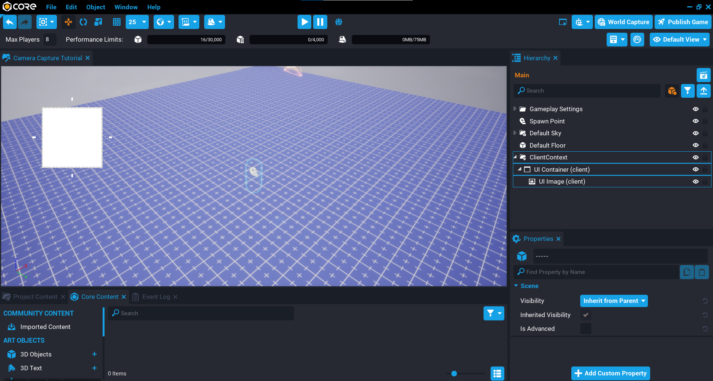
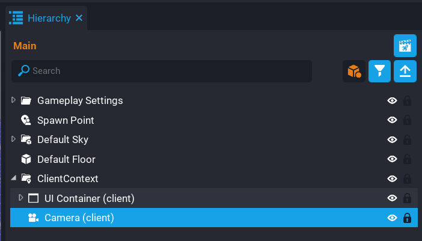
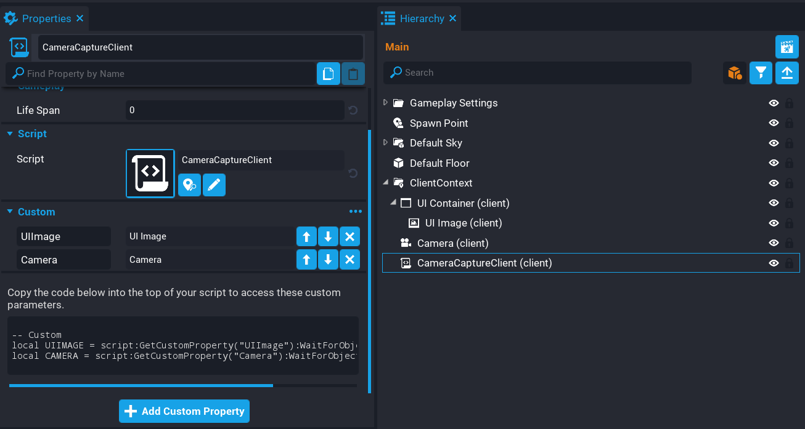
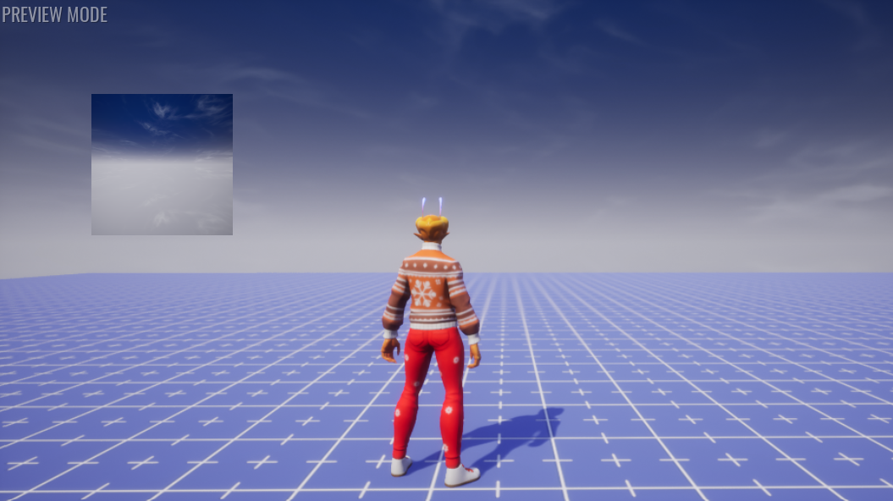
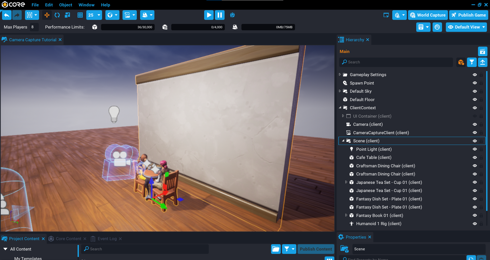

# Camera Captures

## Overview

In this tutorial you will learn how to create camera captures that can be displayed in the UI for your game. Camera capturing allows you to take a picture of the screen viewed through a camera. This could be the full screen, or a camera that is zoomed in on one specific object that could be used as an item in the UI, for example, an inventory item.

* **Completion Time:** 15 minutes.
* **Knowledge Level:** None needed.
* **Skills you will learn:**
    * Learn about the Camera properties that need to be changed for creating camera captures.
    * Creating UI components to display the camera capture.
    * Capturing images and displaying them in the UI from a Lua script.
    * Understanding memory budget.
    * Releasing camera captures.
    * Refreshing camera captures.

---

## Create UI

To view a camera capture, you will create a few [UI](../references/ui.md) components. A **UI Image** will be used to display the camera capture on the screen.

1. Create a **Client Context** in the **Hierarchy** window.
2. Create a **UI Container** inside the **Client Context** folder.
3. Create a **UI Image** inside the **UI Container**. You can move the image around, and change the size.

{: .center loading="lazy" }

## Create Camera

You can create [Camera Captures](../api/cameracapture.md) from any [Camera](../api/camera.md), but it is recommended to setup a dedicated camera for doing the capturing. By having a dedicated camera, you can position it, rotate it, and change various **Camera** properties to get the exact look you want.

Create a new **Camera** inside the [**Client Context**](../references/networking.md) folder.

{: .center loading="lazy" }

### Change Camera Properties

When using a camera for creating camera captures, some properties need to be changed. **Core** will warn you in the **Event Log** about which properties should be changed when you try to create a capture.

Modify the following properties on the Camera you created.

| Property | Property Value |
| -------- | ----- |
| **Use as Default** | This is optional, but for the tutorial it needs to be unchecked. |
| **Attach To Local Player** | Should be left unchecked. |
| **Position Offset** | Should be set to Zero. |
| **Initial Distance** | Should be set to Zero. |
| **Adjustable Distance** | Should be left unchecked. |
| **Base Rotation Mode** | Should be set to Camera. |
| **Rotation Offset** | Should be set to Zero. |
| **Free Control** | Should be left unchecked. |

{: .center loading="lazy" }

## Create CameraCaptureClient Script

To be able to create camera captures, a script will be required that will use the [**Capture**](../api/camera.md) function to create a capture and return it so you can use it.

Create a new script called `CameraCaptureClient` and place it inside the **Client Context** folder in the **Hierarchy**.

{: .center loading="lazy" }

### Create Custom Properties

The **CameraCaptureScript** needs a reference to the **UI Image** and the **Camera** you created earlier.

1. Add the **UI Image** in the **Hierarchy** to the **CameraCaptureScript** as a **Custom Property**.
2. Add the **Camera** in the **Hierarchy** to the **CameraCaptureScript** as a **Custom Property**.

{: .center loading="lazy" }

### Create Property References

Open up the **CameraCaptureScript** and create references to the **UI Image** and **Camera**. The reason you need both of these is because you will use the `CAMERA` to create the camera capture, and the `UIMAGE` to display the camera capture in the UI.

```lua
local UIIMAGE = script:GetCustomProperty("UIImage"):WaitForObject()
local CAMERA = script:GetCustomProperty("Camera"):WaitForObject()
```

## Create Camera Capture

To create a camera capture, you can call the `Capture` function and pass the [resolution size](../api/cameracapture.md) as the first argument. You can create any combination of camera captures, but there is a memory budget which is explained in a later section. If you do reach the limit, further attempts to create camera capture instances will fail. You should then consider reusing or releasing existing captures.

The camera capture is stored in the `capture` variable and passed into the `SetCameraCapture` function. The `UIImage` will be set to the camera capture that will show in the UI. It is good practice to make sure the capture exists to prevent errors, which can be done by using an `if` statement.

```lua
local capture = CAMERA:Capture(CameraCaptureResolution.LARGE)

if capture then
    UIIMAGE:SetCameraCapture(capture)
end
```

### The CameraCaptureClient Script

??? "CameraCaptureClient"
    ```lua
    local UIIMAGE = script:GetCustomProperty("UIImage"):WaitForObject()
    local CAMERA = script:GetCustomProperty("Camera"):WaitForObject()

    local capture = CAMERA:Capture(CameraCaptureResolution.LARGE)

    if capture then
        UIIMAGE:SetCameraCapture(capture)
    end
    ```

### Test the Game

Test the game and see if the UI image displays the camera capture. The captured image isn't very interesting at the moment.

{: .center loading="lazy" }

## Create a Scene to Capture

Create a scene by adding objects from **Core Content** that will be used in the camera capture. Make sure to position the camera so it looks at the scene. Getting the camera in the right position can be trial and error, so play the game often to see what is being captured until you have the camera pointing where you want.

Even with a few objects it is easy to create interesting scenes. The scene in the image below was built using these objects:

- 3D Objects
    - Japanese Temple Wall 01.
    - Cafe Table.
    - Craftsman Dining Chair.
    - Japanese Tea Set - Cup 01.
    - Fantasy Dish Set - Plate 01.
    - Fantasy Book 01, Fantasy Book 02, and Fantasy Book 03.

- Animated Meshes
    - Humanoid 1 Rig (customised).

- Effects / Lighting
    - Steam Volume VFX (for cups).
    - Point Light

- UI
    - Fantasy Frame 007.

{: .center loading="lazy" }

## Test the Game

Test the game to see your scene captured and displayed in the UI.

{: .center loading="lazy" }

## Memory Budget

Each camera capture instance uses a certain amount of the memory based on the resolution size. You are free to create whatever combination (mixed resolutions) of camera captures you need up until the budget is fully consumed.

The total budget is 8 megapixels (8,388,608 pixels). For example:

You could create 2048 captures at the very small resolution.

- 64 x 64 = 4,096
- 8,388,608 / 4,096 = 2048

If you are creating a lot of camera captures at different resolutions, you may want to keep track of how much memory budget you have left before you need to start reusing or releasing existing captures. For the most part, you will not need to worry about doing this unless you are needing a lot of camera captures.

| Resolution Size | Pixel Size | Total Pixels | Maximum Instances |
| --------------- | ---------- | ------------ | ----------------- |
| Very Small | 64 x 64 | 4,096 | 2048 |
| Small | 128 x 128 | 16,384 | 512 |
| Medium | 256 x 256 | 65,536 | 128
| Large | 512 x 512 | 262,144 | 32 |
| Very Large | 1024 x 1024 | 1,048,576 | 8 |

## Releasing Camera Captures

The `Capture` function may return `nil` if the memory budget limit has been reached. To solve this issue, you can release captures. Captures that have been released will be invalid and should no longer be used.

Consider a game that has an inventory system. Using camera capturing, you can display all the inventory icons in the UI by capturing the 3D representation of them. If you hit the memory budget limit, then the rest of the items will not get displayed. This could be because your inventory has a lot of filled slots, so the total memory budget is reached. You could solve this in a few different ways:

- Create paged inventory, making sure the memory budget doesn't hit the limit per page. Each page would reuse or release captures.
- Reduce the resolution size that will allow for more camera captures. For example, 2048 captures can be done at the smallest resolution.

To release a capture image, you will need to store a reference to the captured image when creating the capture.

In the example code below, a function will check if the `capture` is valid before creating a new capture. If it is a valid capture, then it can be released using the `Release` function. By doing this, the image in the UI will revert to its default state. To see this working, the code below will create a capture, wait 1 second, then clear the capture by passing in `true` to the `CreateCapture` function.

```lua
local CAMERA = script:GetCustomProperty("Camera"):WaitForObject()
local UI_IMAGE = script:GetCustomProperty("Image"):WaitForObject()

local capture = nil

local function CreateCapture(clear)
    if capture and capture:IsValid() then
        capture:Release()
    end

    if not clear then
        capture = CAMERA:Capture(CameraCaptureResolution.VERY_LARGE)

        UI_IMAGE:SetCameraCapture(capture)
    end
end

CreateCapture()

Task.Wait(1)

CreateCapture(true)
```

In the video below, the capture image will be displayed, and then released after 1 second. Notice how the captured image is cleared.

<div class="mt-video" style="width:100%">
    <video autoplay muted playsinline controls loop class="center" style="width:100%">
        <source src="/img/CameraCapture/Basics/basics_releasing.mp4" type="video/mp4" />
    </video>
</div>

## Refreshing Camera Captures

Camera captures can be refreshed. This can be useful if the 3D object being used in the capture has changed, or to create things such as mirrors (that is rear view mirror in a car), or surveillance cameras.

In the example code below, the `CreateCapture` function is called from within the `Tick` function. Every .1 second, the `CreateCapture` function will be called again. This function will check if the `capture` variable is a valid capture instance, and if so, `Refresh` it. By doing this, the UI image becomes an animation.

```lua
local CAMERA = script:GetCustomProperty("Camera"):WaitForObject()
local UI_IMAGE = script:GetCustomProperty("Image"):WaitForObject()

local capture = nil

local function CreateCapture()
    if capture and capture:IsValid() then
        capture:Refresh()
    else
        capture = CAMERA:Capture(CameraCaptureResolution.VERY_LARGE)
        UI_IMAGE:SetCameraCapture(capture)
    end
end

function Tick()
    CreateCapture()
    Task.Wait(.1)
end
```

Notice in the video how the image is changing. The Bottle is getting zoomed in.

<div class="mt-video" style="width:100%">
    <video autoplay muted playsinline controls loop class="center" style="width:100%">
        <source src="/img/CameraCapture/Basics/basics_refresh.mp4" type="video/mp4" />
    </video>
</div>

## Summary

You can do some interesting things with camera captures. For example, creating pictures by adding some objects to the scene and moving the capture camera around. Mirrors on a vehicle, and many more ideas. Try it yourself.

## Learn More

[Camera Capture API](../api/cameracapture.md) | [Camera Capture Resolutions](../api/enums.md#cameracaptureresolution) | [Camera API](../api/camera.md) | [UI Reference](../references/ui.md#camera-captures) | [Cosmetic Tutorial](../tutorials/cosmetic_tutorial.md)
