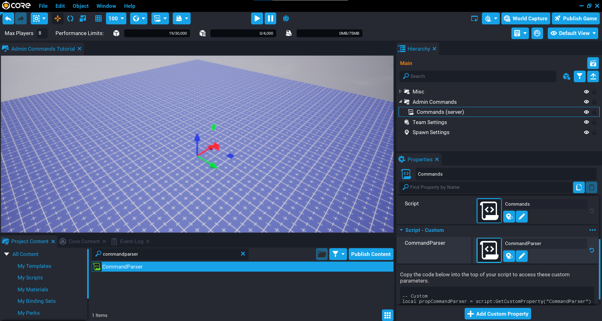

# Chat Commands

## Overview

In this tutorial you are going to create chat commands that can be typed into the chat that will perform an action if the player has permission, by using [chat hooks](../api/chat.md). You will be creating some general commands that can be useful for most games. You will also be creating commands that are aimed specifically at some of the frameworks to show how commands can be used to help test your game.

* **Completion Time:** ~1 hour
* **Knowledge Level:** It is recommended to have completed the [Scripting Beginner](lua_basics_helloworld.md) and [Scripting Intermediate](lua_basics_lightbulb.md) tutorials.
* **Skills you will learn:**
    * Requiring the Command Parser API.
    * Creating permissions.
    * Writing custom commands.

---

## Import Asset from Community Content

You will be importing an asset from **Community Content** that will help you create the admin commands by providing you an API to speed up development.

1. Open the **Community Content** window.
2. Search for `Chat Commands` by **CoreAcademy**.
3. Click **Import**.

{: .center loading="lazy" }

### Enable Player Storage

The Command Parser will need to save the permission for the player persistently when you promote / demote a player. Make sure to enable **Player Storage** in the **Properties** window for the **Game Settings** object.

### Requiring the Command Parser API

To create commands, you will need to require the **CommandParser** script so you have access to all the functions in the API.

#### Create CommandParser Custom Property

Drag and drop the **CommandParser** script on to the script you want to use to create commands.

!!! tip "Context"
    The script that you will be using to create the commands should be in a server context. If you need to create client side commands, then it is recommended to create a separate script. In a later section, server vs client commands will be discussed.

{: .center loading="lazy" }

#### Require the CommandParser API

By requiring the Command Parser API at the top of your script, you will then have access to the functions and permissions. By default the Command Parser comes with the `promote` and `demote` commands, these can be found in the **CommandParser** script.

```lua
local CommandParser = require(script:GetCustomProperty("CommandParser"))
```

## Using Permissions

The Command Parser comes with a basic permission system that allows for special players (usually the creator) to promote and demote other players. For example, if you want to add a moderator to your game that has access to certain commands, you can easily promote a player by using the promote command.

`/promote player permission`

The permissions system will use player storage to save the permission, and also setup a player resource with the permission key. This can then be used client side if you would like to show which players have certain permissions (that is in a player list).

The permission system comes with 3 default permissions:

- `CREATOR`
- `ADMIN`
- `MODERATOR`

Open up the **CommandPermissions** script to see how the permissions are set up.

### Set Creators

The `CREATORS` permission is special. It has no `priority` property, only an array of player names. These player names are what you would consider to be root admins. Any player name in the `names` array will have access to all commands.

!!! warning "Only add player names to the array that you trust (that is co-creators of the game). It is generally a good idea to just have your own name here, and use the `promote` command to promote trusted players to regular admins."

```lua
CREATOR = {

    names = { "CommanderFoo" },
    name = "Creator"

},
```

### Add New Permission

The `priority` value is important, as it determines if the player has access to all the permissions that have a lower priority. For example, the `ADMIN` permission has a priority of `50`, this means any permission with a lower number that `50` will be granted to the player. If you have a command that is available for players with the `MODERATOR` permission, then players with the `ADMIN` permission would also be allowed to use that command.

For example, adding a new permission called `HEAD_MODERATOR` with a `priority` of `40`, would allow access to all `MODERATOR` commands, because the `MODERATOR` permission has a lower `priority` value of `30`, but the `HEAD_MODERATOR` would not have access to the commands for `ADMIN` or `CREATOR`.

```lua
HEAD_MODERATOR = {

    priority = 40,
    name = "Head Moderator"

},
```

### Promote Player

Players with the `CREATOR` permission are allowed to promote other players by using the `promote` command.

The `permission` value of the command, is the key for the permission. So for example, if you want to promote the player `Bob` to `Admin`, you would type the following command into the chat.

`/promote Bob admin`

The permission value (`admin` for the above example) for the command is case insensitive.

### Demote Player

Players with the `CREATOR` permission are allowed to demote other players by using the `demote` command. This will remove the permission from the player, and revert them back to a regular player on the server.

`/demote Bob`

## Creating Custom Commands

In this section you will learn how to use the Command Parser to create your own commands.

### Create a Print Command

You will create a `print` command that will demonstrate how to create a single command that will print a message to the **Event Log**.

```lua
CommandParser.AddCommand("print", function(sender, params, status)
    print("Hello World!")
end)
```

#### Test the Command

Run the command `/print` in the chat, and see the **Event Log**.

<div class="mt-video" style="width:100%">
    <video autoplay muted playsinline controls loop class="center" style="width:100%">
        <source src="/img/ChatCommands/print_basic.mp4" type="video/mp4" />
    </video>
</div>

#### Check Permission

Right now, the `print` command will work for any player that enters it into the chat. You will be changing the `print` command so that it only works for players that have the `CREATOR` permission.

The **CommandParser** has a function called `HasPermission` that accepts 2 arguments:

| Argument | Description |
| -------- | ----------- |
| `sender` | The player who issued the command in the chat. |
| `permission` | The permission to check against the `sender`. |

All the permissions can be accessed via the `permissions` property of the `CommandParser`. By passing in the `CREATOR` permission to the `HasPermission` function, either `true` or `false` will be returned if the `sender` has permission to use the command.

```lua
CommandParser.AddCommand("print", function(sender, params, status)
    if CommandParser.HasPermission(sender, CommandParser.permissions.CREATOR) then
        print("Hello World!")
    end
end)
```

### Provide Command Feedback

It may be useful to know if the command was successful or not. The function callback for each command has 3 parameters.

| Parameter | Description |
| --------- | ----------- |
| `sender` | The player who issued the command in the chat. |
| `params` | The parameters for the command. `params[1]` is the command name. |
| `status` | The status table for this command. |

The `status` parameter is a table that is passed in by reference, which allows you to change the properties on this table and the callee will use those values to provide feedback to the sender and receiver if set.

| Property | Description |
| -------- | ----------- |
| `status.success` | Either `true` or `false` if the command was successful or not. Default is `false`. |
| `status.senderMessage` | A message that will be displayed in the chat for the sender of the command. |
| `status.receiverPlayer` | The player who will receive the message. |
| `status.receiverMessage` | If `status.success` is `true`, and a `receiverPlayer` is set, then the receiver will receive the message in chat. |

For example, take the basic `print` command created early and add feedback to the sender.

```lua
CommandParser.AddCommand("print", function(sender, params, status)
    if CommandParser.HasPermission(sender, CommandParser.permissions.CREATOR) then
        print("Hello World!")
        status.success = true
        status.senderMessage = "Print command was successful."
    end
end)
```

Test the command and make sure a message is received back in the chat.

<div class="mt-video" style="width:100%">
    <video autoplay muted playsinline controls loop class="center" style="width:100%">
        <source src="/img/ChatCommands/print_feedback.mp4" type="video/mp4" />
    </video>
</div>

### Create Print Sub Commands

So far the `print` command is a single command. You will change the `print` command to have 2 sub commands. A sub command is a keyword that follows the main command. For example, `print time`, `print` is the main command, `time` is the sub command.

Instead of passing in a function as the second argument of the `AddCommand` function, a table can be passed in that is made up of key value pairs, where the value is a function.

You will create 2 sub commands.

| Command | Description |
| ------- | ----------- |
| `time` | Prints the current local time in the chat. |
| `word` | Prints the word entered as the 3rd parameter of the chat command. By using the `params` parameter, you have access to each section of the command. |

```lua
CommandParser.AddCommand("print", {

    time = function(sender, params, status)
        status.success = true
        status.senderMessage = "Time is: " .. tostring(DateTime.CurrentTime({ isLocal = true })) .. "."
    end,

    word = function(sender, params, status)
        if params[3] ~= nil then
            status.success = true
            status.senderMessage = "The word was: " .. params[3]
        end
    end

})
```

!!! tip "Commands that don't need the permission to be checked, like the `print` command above, can be placed into a separate script that is in a client context. The CommandParser will check what environment it is being executed in."

Test both commands:

- `/print time`
- `/print word Hello`

<div class="mt-video" style="width:100%">
    <video autoplay muted playsinline controls loop class="center" style="width:100%">
        <source src="/img/ChatCommands/print_sub_commands.mp4" type="video/mp4" />
    </video>
</div>

## Creating General Commands

In this section you will create general commands that could be useful for most games. Try to keep all your general commands in a separate script, and any game specific commands in another script. This will be more modular for when you need to extract just the general commands to be used in another game.

### Teleport

Being able to teleport to a player, or teleporting a player to another player can be a useful command, especially when you need to do some debugging in a published game.

The command needs to support 2 variations.

1. Teleporting the sender to a specific player.
2. Teleporting a player to another player.

To do this, you will need to look at `params[2]` and `params[3]`. If `params[3]` doesn't exist, then you will assume the command sender is the player being teleported.

The Command Parser has a helper function called `GetPlayer` that will validate the value and find a player that matches the name entered in the command.

An extra quality of life addition, is to match the rotation of the player being teleported too.

```lua
-- /tp toplayer
-- /tp player toplayer
CommandParser.AddCommand("tp", function(sender, params, status)
    if CommandParser.HasPermission(sender, CommandParser.permissions.MODERATOR) then
        local playerA = CommandParser.GetPlayer(params[2])
        local playerB = CommandParser.GetPlayer(params[3])

        if playerA ~= nil then
            if playerB ~= nil then
                playerA:SetWorldPosition(playerB:GetWorldPosition())
                playerA:SetWorldRotation(playerB:GetWorldRotation())
            else
                sender:SetWorldPosition(playerA:GetWorldPosition())
                sender:SetWorldRotation(playerA:GetWorldRotation())
            end

            status.success = true
        else
            status.senderMessage = CommandParser.error.INVALID_PLAYER
        end
    else
        status.senderMessage = CommandParser.error.NO_PERMISSION
    end
end)
```

Test the command in multiplayer preview mode.

- Test the sender of the command can teleport to a player.
- Test the sender of the command can teleport a player to another player.
- Test the permission of the command.

<div class="mt-video" style="width:100%">
    <video autoplay muted playsinline controls loop class="center" style="width:100%">
        <source src="/img/ChatCommands/tp_command.mp4" type="video/mp4" />
    </video>
</div>

### Kick

Being able to kick a player from a server for being a nuisance is a good command for moderators to have. This command will be basic and just kick the player to Core World. They have the ability to rejoin, so as a challenge, try and improve on the command by auto kicking them when they rejoin within a certain time frame. This could done by storing a future timestamps and when a player joins, check if the current time is less that the future time. This could be a good way to have a cooling off period of that player.

An additional sub command to kick all players on the server apart from the sender could be good as well. This would allow you to kick all the players and possibly close the server from accepting players so you can do some testing.

By using the [`TransferToGame`](../api/game.md) function, you can transfer a player, or all players to a specific game if you have the game ID. In this case, the game ID will be Core World.

```lua
-- /kick player
-- /kick all
CommandParser.AddCommand("kick", function(sender, params, status)
    if CommandParser.HasPermission(sender, CommandParser.permissions.MODERATOR) then
        local who = CommandParser.ParamIsValid(params[2])

        if who ~= nil then
            if who == "all" then
                for k, player in ipairs(Game.GetPlayers()) do
                    if player ~= sender then
                        player:TransferToGame("e39f3e/core-world")
                    end
                end

                status.success = true
                status.senderMessage = "All players kicked."
            else
                who = CommandParser.GetPlayer(params[2])

                if who ~= nil then
                    who:TransferToGame("e39f3e/core-world")

                    status.success = true
                    status.senderMessage = "Player kicked."
                end
            end
        else
            status.senderMessage = CommandParser.error.INVALID_PLAYER
        end
    else
        status.senderMessage = CommandParser.error.NO_PERMISSION
    end
end)
```

The function [`TransferToGame`](../api/game.md) will not work in local preview. You can still try the command and see if the correct response is displayed. To test this properly, you would need to publish your game and get another player to help, or kick yourself.

<div class="mt-video" style="width:100%">
    <video autoplay muted playsinline controls loop class="center" style="width:100%">
        <source src="/img/ChatCommands/kick_command.mp4" type="video/mp4" />
    </video>
</div>

### Close Server

Debugging a published game could be disruptive to other players on the server. Being able to close a server instance from accepting players is a very useful command. Combined with the `kick` command, it allows you to test a specific instance without disrupting players trying to play the game.

By using [`StopAcceptingPlayers`](../api/game.md), the server instance will close, meaning no other player can join.

```lua
-- /closeserver
CommandParser.AddCommand("closeserver", function(sender, params, status)
    if CommandParser.HasPermission(sender, CommandParser.permissions.ADMIN) then
        Game.StopAcceptingPlayers()
        status.success = true
        status.senderMessage = "Server closed."
    else
        status.senderMessage = CommandParser.error.NO_PERMISSION
    end
end)
```

Test the command in local multiplayer preview by loading up 1 player. After issuing the command, try to add another player. You will notice a message letting you know the instance is not accepting any more players.

<div class="mt-video" style="width:100%">
    <video autoplay muted playsinline controls loop class="center" style="width:100%">
        <source src="/img/ChatCommands/closeserver_command.mp4" type="video/mp4" />
    </video>
</div>

### Fly

Being able to fly can be useful to get to locations quickly in your game. This is really easy to add as a command, as you can use the [`ActivateFlying`](../api/player.md) function to fly, and [`ActivateWalking`](../api/player.md) function to turn it off.

```lua
-- /fly on
-- /fly off
CommandParser.AddCommand("fly", {

    on = function(sender, params, status)
        if CommandParser.HasPermission(sender, CommandParser.permissions.ADMIN) then
            sender:ActivateFlying()
        else
            status.senderMessage = CommandParser.error.NO_PERMISSION
        end
    end,

    off = function(sender, params, status)
        if CommandParser.HasPermission(sender, CommandParser.permissions.ADMIN) then
            sender:ActivateWalking()
        else
            status.senderMessage = CommandParser.error.NO_PERMISSION
        end
    end

})
```

Test the command and make sure you can turn fly on and off.

<div class="mt-video" style="width:100%">
    <video autoplay muted playsinline controls loop class="center" style="width:100%">
        <source src="/img/ChatCommands/fly_command.mp4" type="video/mp4" />
    </video>
</div>

### Speed

If you have a large open world game, then travelling could take quite a while. This time all adds up when you are trying to get to a specific area in your game to test something in a published game. Being able to set the speed of your character could be a useful way to save time.

You will create the command so it can also be applied to any player. It will accept a `walkspeed` parameter that will modify the [`maxWalkSpeed`](../api/player.md) property of the `player`.

```lua
-- /speed player walkspeed
CommandParser.AddCommand("speed", function(sender, params, status)
    if CommandParser.HasPermission(sender, CommandParser.permissions.MODERATOR) then
        local player = CommandParser.GetPlayer(params[2])

        if player ~= nil then
            player.maxWalkSpeed = tonumber(params[3]) or player.maxWalkSpeed
            status.success = true
            status.senderMessage = "Player speed set."
        else
            status.senderMessage = CommandParser.error.INVALID_PLAYER
        end
    else
        status.senderMessage = CommandParser.error.NO_PERMISSION
    end
end)
```

Test the command by entering a speed that is higher than your current walk speed (default is `640`).

<div class="mt-video" style="width:100%">
    <video autoplay muted playsinline controls loop class="center" style="width:100%">
        <source src="/img/ChatCommands/speed_command.mp4" type="video/mp4" />
    </video>
</div>

### Kill

Being able to kill a player can be useful if they are in a bad state where teleporting them won't solve the issue. This can also be useful for testing round end conditions.

By calling the [`Die`](../api/player.md) function on a `player`, it will kill them. You can also check if `params[3]` is a player or `all`. If it is `all`, then all players on the server excluding the `sender` will be killed.

```lua
-- /kill all
-- /kill player
CommandParser.AddCommand("kill", function(sender, params, status)
    if CommandParser.HasPermission(sender, CommandParser.permissions.ADMIN) then
        local who = CommandParser.ParamIsValid(params[2])

        if who ~= nil then
            if who == "all" then
                for k, player in ipairs(Game.GetPlayers()) do
                    if player ~= sender then
                        player:Die()
                    end
                end

                status.success = true
                status.senderMessage = "All players killed."
            else
                who = CommandParser.GetPlayer(params[2])

                if who ~= nil then
                    who:Die()
                    status.success = true
                    status.senderMessage = "Player killed."
                end
            end
        else
            status.senderMessage = CommandParser.error.INVALID_PLAYER
        end
    else
        status.senderMessage = CommandParser.error.NO_PERMISSION
    end
end)
```

Test the command in local multiplayer preview. Try killing one player, then trying kill all players using the `all` keyword.

<div class="mt-video" style="width:100%">
    <video autoplay muted playsinline controls loop class="center" style="width:100%">
        <source src="/img/ChatCommands/kill_command.mp4" type="video/mp4" />
    </video>
</div>

### Mute

Being able to mute a player, or all players can be useful if you need to talk to people on the server without being over talked. This command will mute the player in all the channels. As a challenge, you could have it setup to automatically mute people as they join the server. For example, maybe you have a music event in progress, and want to use the in game chat as a way to broadcast the music to the players on the server.

The command will need support for muting all players, and specific players. It would also be nice to have an `unmute` version of the command as well.

By looping over the voice channels using the [`GetChannels`](../api/voicechat.md) function, you can mute the player in those channels by calling the [`MutePlayer`](../api/voicechatchannel.md) function with the player as the argument.

```lua
-- /voice mute all
-- /voice mute player
-- /voice unmute all
-- /voice unmute player
CommandParser.AddCommand("voice", {

    mute = function(sender, params, status)
        if CommandParser.HasPermission(sender, CommandParser.permissions.MODERATOR) then
            local who = CommandParser.ParamIsValid(params[3])

            if who ~= nil then
                if who == "all" then
                    for k, player in ipairs(Game.GetPlayers()) do
                        if player ~= sender then
                            for i, c in pairs(VoiceChat.GetChannels()) do
                                c:MutePlayer(player)
                            end
                        end
                    end

                    status.success = true
                    status.senderMessage = "All players muted."
                else
                    who = CommandParser.GetPlayer(params[3])

                    if who ~= nil then
                        for i, c in pairs(VoiceChat.GetChannels()) do
                            c:MutePlayer(who)
                        end

                        status.success = true
                        status.senderMessage = "Player muted."
                    end
                end
            else
                status.senderMessage = CommandParser.error.INVALID_PLAYER
            end
        else
            status.senderMessage = CommandParser.error.NO_PERMISSION
        end
    end,

    unmute = function(sender, params, status)
        if CommandParser.HasPermission(sender, CommandParser.permissions.MODERATOR) then
            local who = CommandParser.ParamIsValid(params[3])

            if who ~= nil then
                if who == "all" then
                    for k, player in ipairs(Game.GetPlayers()) do
                        if player ~= sender then
                            for i, c in pairs(VoiceChat.GetChannels()) do
                                c:UnmutePlayer(player)
                            end
                        end
                    end

                    status.success = true
                    status.senderMessage = "All players unmuted."
                else
                    who = CommandParser.GetPlayer(params[3])

                    if who ~= nil then
                        for i, c in pairs(VoiceChat.GetChannels()) do
                            c:UnmutePlayer(who)
                        end

                        status.success = true
                        status.senderMessage = "Player unmuted."
                    end
                end
            else
                status.senderMessage = CommandParser.error.INVALID_PLAYER
            end
        else
            status.senderMessage = CommandParser.error.NO_PERMISSION
        end
    end

})
```

This command would need to be tested in published game. You can test it locally to see if it executes correctly.

<div class="mt-video" style="width:100%">
    <video autoplay muted playsinline controls loop class="center" style="width:100%">
        <source src="/img/ChatCommands/mute_command.mp4" type="video/mp4" />
    </video>
</div>

### Grant Reward Points

If you are in the [Perks Program](../references/perks/program.md), then you will have the ability to [grant reward points](../references/perks/reward_points.md) to players. This could be login based, or granted based on what the player does in game (that is finish a mission). Having the option to reward points could be useful.

By using the [`GrantRewardPoints`](../api/player.md) function, you can grant reward points to a player. You can also turn this command into an `all` command, so that it can be applied to all players on the server.

If a specific player is receiving the reward points, then by setting a `receiverMessage` value and `receiverPlayer` value, that player will receive a message that they were granted points.

```lua
-- /grantrp player amount
-- /grantrp all amount
CommandParser.AddCommand("grantrp", function(sender, params, status)
    if CommandParser.HasPermission(sender, CommandParser.permissions.ADMIN) then
        local who = CommandParser.ParamIsValid(params[2])

        if who ~= nil then
            local amount = tonumber(params[3]) or 250

            if who == "all" then
                for k, player in ipairs(Game.GetPlayers()) do
                    player:GrantRewardPoints(amount, "Awarded Points")
                end

                status.success = true
                status.senderMessage = "All players granted reward points."
            else
                who = CommandParser.GetPlayer(params[2])

                if who ~= nil then
                    who:GrantRewardPoints(amount, "Awarded Points")
                    status.success = true
                    status.senderMessage = "Player granted reward points."
                    status.receiverMessage = "You have been granted " .. tostring(amount) .. " reward points."
                    status.receiverPlayer = who
                end
            end
        else
            status.senderMessage = CommandParser.error.INVALID_PLAYER
        end
    else
        status.senderMessage = CommandParser.error.NO_PERMISSION
    end
end)
```

The command will work even if the player has reached the creators maximum points amount, they just won't receive any more points.

<div class="mt-video" style="width:100%">
    <video autoplay muted playsinline controls loop class="center" style="width:100%">
        <source src="/img/ChatCommands/grantrp_command.mp4" type="video/mp4" />
    </video>
</div>

### Reset Storage

Sometimes player data can get into a bad state, or even in testing features, it would be nice to have an option to reset the storage data for a player.

This command will accept either a specific player, or reset all players storage who are on the current server instance. This is done by setting the player's data to an empty table, and calling [`SetPlayerData`](../api/storage.md).

```lua
-- /resetstorage player
-- /resetstorage all
CommandParser.AddCommand("resetstorage", function(sender, params, status)
    if CommandParser.HasPermission(sender, CommandParser.permissions.ADMIN) then
        local who = CommandParser.ParamIsValid(params[2])

        if who ~= nil then
            if who == "all" then
                for k, player in ipairs(Game.GetPlayers()) do
                    if player ~= sender then
                        Storage.SetPlayerData(player, {})
                    end
                end

                status.success = true
                status.senderMessage = "All players reset."
            else
                who = CommandParser.GetPlayer(params[2])

                if who ~= nil then
                    Storage.SetPlayerData(who, {})
                    status.success = true
                    status.senderMessage = "Player reset."
                    status.receiverMessage = "You have been reset."
                    status.receiverPlayer = who
                end
            end
        else
            status.senderMessage = CommandParser.error.INVALID_PLAYER
        end
    else
        status.senderMessage = CommandParser.error.NO_PERMISSION
    end
end)
```

<div class="mt-video" style="width:100%">
    <video autoplay muted playsinline controls loop class="center" style="width:100%">
        <source src="/img/ChatCommands/resetstorage_command.mp4" type="video/mp4" />
    </video>
</div>

### Invisible

A useful moderating command that can be used to watch players, is the option to go invisible to other players in the game. This can be useful to watch how players are playing your game, especially when combined with commands such as `fly`.

By setting the [`isVisible`](../api/player.md) property of the sender, the sender's character can be hidden to other players on the server.

```lua
-- /invisible on
-- /invisible off
CommandParser.AddCommand("invisible", {

    on = function(sender, params, status)
        if CommandParser.HasPermission(sender, CommandParser.permissions.ADMIN) then
            sender.isVisible = false
        end
    end,

    off = function(sender, params, status)
        if CommandParser.HasPermission(sender, CommandParser.permissions.ADMIN) then
            sender.isVisible = true
        end
    end

})
```

Test the command to make sure your player's character can go invisible and visible.

<div class="mt-video" style="width:100%">
    <video autoplay muted playsinline controls loop class="center" style="width:100%">
        <source src="/img/ChatCommands/invisible_command.mp4" type="video/mp4" />
    </video>
</div>

### Give

The `give` command can be used to give items to player. In this example, you will write a command that will allow you to give specific resources to players. If you would like to give perks to players, take a look at the [Perks Part 2 Tutorial](../tutorials/perks_tutorial_part2.md).

Any resource that can be given to a player needs to have data set. This is so that the `give` command can work for a wide range of resources, and so that the command callback can retrieve the data about the resource being given to the player.

Commands can access data from a lookup table. That data is supplied by you by using the `AddCommandData` function that accepts 2 arguments.

1. The key for this data.
2. A table with the data.

For example, if there is resources for coins and gems in your game:

```lua
CommandParser.AddCommandData("coins", {

    name = "Coins",
    resourceKey = "coins",
    storageKey = "c"

})

CommandParser.AddCommandData("gems", {

    name = "Gems",
    resourceKey = "gems",
    storageKey = "g"

})
```

By using the `GetCommandData` function and passing in the key. The data will be retrieved for you. This helps with creating just a single command instead of multiple commands for each resource.

```lua
-- /give resource player resourcekey amount
CommandParser.AddCommand("give", {

    resource = function(sender, params, status)
        if CommandParser.HasPermission(sender, CommandParser.permissions.MODERATOR) then
            local who = CommandParser.GetPlayer(CommandParser.ParamIsValid(params[3]))

            if who ~= nil then
                local commandData = CommandParser.GetCommandData(params[4])

                if commandData ~= nil then
                    local playerData = Storage.GetPlayerData(who)
                    local amount = tonumber(params[5]) or 0

                    who:AddResource(commandData.resourceKey, amount)

                    if not playerData[commandData.storageKey] then
                        playerData[commandData.storageKey] = amount
                    else
                        playerData[commandData.storageKey] = playerData[commandData.storageKey] + amount
                    end

                    Storage.SetPlayerData(who, playerData)

                    status.success = true
                    status.senderMessage = "Resource successfully given."
                    status.receiverMessage = "You have been gifted " .. tostring(amount) .. " " .. commandData.name .. "."
                    status.receiverPlayer = who
                else
                    status.senderMessage = "Command data \"" .. item .. "\" does not exist."
                end
            else
                status.senderMessage = CommandParser.error.INVALID_PLAYER
            end
        else
            status.senderMessage = CommandParser.error.NO_PERMISSION
        end
    end

})
```

Test the command by giving the player either of the resources setup. In the video below, a script in a client context was created to display the amount of resources the player has in the **Event Log** when the resource changes.

<div class="mt-video" style="width:100%">
    <video autoplay muted playsinline controls loop class="center" style="width:100%">
        <source src="/img/ChatCommands/give_command.mp4" type="video/mp4" />
    </video>
</div>

### Help

A useful command that will display a list of the commands in the chat, is a `help` command. This command will loop through the main commands that have been registered, and broadcast it to the sender of the command.

The key for each command is inserted into the `msg` table. Before it is broadcasted, each entry in the `msg` table is concatenated with a new line.

```lua
-- /help
CommandParser.AddCommand("help", function(sender, params, status)
    if CommandParser.HasPermission(sender, CommandParser.permissions.MODERATOR) then
        local msg = { "Commands:" }

        for k, c in pairs(CommandParser.commands) do
            table.insert(msg, "/" .. k)
        end

        if #msg > 0 then
            Chat.BroadcastMessage(table.concat(msg, "\n"), { players = sender })
        end
    else
        status.senderMessage = CommandParser.error.NO_PERMISSION
    end
end)
```

Test the command to make sure all the commands are listed in the chat. If you have a lot of commands, then the message may get cropped if it exceeds the maximum message length of 280 characters.

<div class="mt-video" style="width:100%">
    <video autoplay muted playsinline controls loop class="center" style="width:100%">
        <source src="/img/ChatCommands/invisible_command.mp4" type="video/mp4" />
    </video>
</div>

### The Server Commands Script

Here are all the commands that was created above.

??? "Server Commands"
    ```lua
    local CommandParser = require(script:GetCustomProperty("CommandParser"))

    -- /tp toplayer
    -- /tp player toplayer
    CommandParser.AddCommand("tp", function(sender, params, status)
        if CommandParser.HasPermission(sender, CommandParser.permissions.MODERATOR) then
            local playerA = CommandParser.GetPlayer(params[2])
            local playerB = CommandParser.GetPlayer(params[3])

            if playerA ~= nil then
                if playerB ~= nil then
                    playerA:SetWorldPosition(playerB:GetWorldPosition())
                    playerA:SetWorldRotation(playerB:GetWorldRotation())
                else
                    sender:SetWorldPosition(playerA:GetWorldPosition())
                    sender:SetWorldRotation(playerA:GetWorldRotation())
                end

                status.success = true
            else
                status.senderMessage = CommandParser.error.INVALID_PLAYER
            end
        else
            status.senderMessage = CommandParser.error.NO_PERMISSION
        end
    end)

    -- /kick player
    -- /kick all
    CommandParser.AddCommand("kick", function(sender, params, status)
        if CommandParser.HasPermission(sender, CommandParser.permissions.MODERATOR) then
            local who = CommandParser.ParamIsValid(params[2])

            if who ~= nil then
                if who == "all" then
                    for k, player in ipairs(Game.GetPlayers()) do
                        if player ~= sender then
                            player:TransferToGame("e39f3e/core-world")
                        end
                    end

                    status.success = true
                    status.senderMessage = "All players kicked."
                else
                    who = CommandParser.GetPlayer(params[2])

                    if who ~= nil then
                        who:TransferToGame("e39f3e/core-world")

                        status.success = true
                        status.senderMessage = "Player kicked."
                    end
                end
            else
                status.senderMessage = CommandParser.error.INVALID_PLAYER
            end
        else
            status.senderMessage = CommandParser.error.NO_PERMISSION
        end
    end)

    -- /closeserver
    CommandParser.AddCommand("closeserver", function(sender, params, status)
        if CommandParser.HasPermission(sender, CommandParser.permissions.ADMIN) then
            Game.StopAcceptingPlayers()
            status.success = true
            status.senderMessage = "Server closed."
        else
            status.senderMessage = CommandParser.error.NO_PERMISSION
        end
    end)

    -- /fly on
    -- /fly off
    CommandParser.AddCommand("fly", {

        on = function(sender, params, status)
            if CommandParser.HasPermission(sender, CommandParser.permissions.ADMIN) then
                sender:ActivateFlying()
            else
                status.senderMessage = CommandParser.error.NO_PERMISSION
            end
        end,

        off = function(sender, params, status)
            if CommandParser.HasPermission(sender, CommandParser.permissions.ADMIN) then
                sender:ActivateWalking()
            else
                status.senderMessage = CommandParser.error.NO_PERMISSION
            end
        end

    })

    -- /voice mute all
    -- /voice mute player
    -- /voice unmute all
    -- /voice unmute player
    CommandParser.AddCommand("voice", {

        mute = function(sender, params, status)
            if CommandParser.HasPermission(sender, CommandParser.permissions.MODERATOR) then
                local who = CommandParser.ParamIsValid(params[3])

                if who ~= nil then
                    if who == "all" then
                        for k, player in ipairs(Game.GetPlayers()) do
                            if player ~= sender then
                                for i, c in pairs(VoiceChat.GetChannels()) do
                                    c:MutePlayer(player)
                                end
                            end
                        end

                        status.success = true
                        status.senderMessage = "All players muted."
                    else
                        who = CommandParser.GetPlayer(params[3])

                        if who ~= nil then
                            for i, c in pairs(VoiceChat.GetChannels()) do
                                c:MutePlayer(who)
                            end

                            status.success = true
                            status.senderMessage = "Player muted."
                        end
                    end
                else
                    status.senderMessage = CommandParser.error.INVALID_PLAYER
                end
            else
                status.senderMessage = CommandParser.error.NO_PERMISSION
            end
        end,

        unmute = function(sender, params, status)
            if CommandParser.HasPermission(sender, CommandParser.permissions.MODERATOR) then
                local who = CommandParser.ParamIsValid(params[3])

                if who ~= nil then
                    if who == "all" then
                        for k, player in ipairs(Game.GetPlayers()) do
                            if player ~= sender then
                                for i, c in pairs(VoiceChat.GetChannels()) do
                                    c:UnmutePlayer(player)
                                end
                            end
                        end

                        status.success = true
                        status.senderMessage = "All players unmuted."
                    else
                        who = CommandParser.GetPlayer(params[3])

                        if who ~= nil then
                            for i, c in pairs(VoiceChat.GetChannels()) do
                                c:UnmutePlayer(who)
                            end

                            status.success = true
                            status.senderMessage = "Player unmuted."
                        end
                    end
                else
                    status.senderMessage = CommandParser.error.INVALID_PLAYER
                end
            else
                status.senderMessage = CommandParser.error.NO_PERMISSION
            end
        end

    })

    -- /speed player walkspeed
    CommandParser.AddCommand("speed", function(sender, params, status)
        if CommandParser.HasPermission(sender, CommandParser.permissions.MODERATOR) then
            local player = CommandParser.GetPlayer(params[2])

            if player ~= nil then
                player.maxWalkSpeed = tonumber(params[3]) or player.maxWalkSpeed
                status.success = true
                status.senderMessage = "Player speed set."
            else
                status.senderMessage = CommandParser.error.INVALID_PLAYER
            end
        else
            status.senderMessage = CommandParser.error.NO_PERMISSION
        end
    end)

    -- /kill all
    -- /kill player
    CommandParser.AddCommand("kill", function(sender, params, status)
        if CommandParser.HasPermission(sender, CommandParser.permissions.ADMIN) then
            local who = CommandParser.ParamIsValid(params[2])

            if who ~= nil then
                if who == "all" then
                    for k, player in ipairs(Game.GetPlayers()) do
                        if player ~= sender then
                            player:Die()
                        end
                    end

                    status.success = true
                    status.senderMessage = "All players killed."
                else
                    who = CommandParser.GetPlayer(params[2])

                    if who ~= nil then
                        who:Die()
                        status.success = true
                        status.senderMessage = "Player killed."
                    end
                end
            else
                status.senderMessage = CommandParser.error.INVALID_PLAYER
            end
        else
            status.senderMessage = CommandParser.error.NO_PERMISSION
        end
    end)

    CommandParser.AddCommand("grantrp", function(sender, params, status)
        if CommandParser.HasPermission(sender, CommandParser.permissions.ADMIN) then
            local who = CommandParser.ParamIsValid(params[2])

            if who ~= nil then
                local amount = tonumber(params[3]) or 250

                if who == "all" then
                    for k, player in ipairs(Game.GetPlayers()) do
                        player:GrantRewardPoints(amount, "Awarded Points")
                    end

                    status.success = true
                    status.senderMessage = "All players granted reward points."
                else
                    who = CommandParser.GetPlayer(params[2])

                    if who ~= nil then
                        who:GrantRewardPoints(amount, "Awarded Points")
                        status.success = true
                        status.senderMessage = "Player granted reward points."
                        status.receiverMessage = "You have been granted " .. tostring(amount) .. " reward points."
                        status.receiverPlayer = who
                    end
                end
            else
                status.senderMessage = CommandParser.error.INVALID_PLAYER
            end
        else
            status.senderMessage = CommandParser.error.NO_PERMISSION
        end
    end)

    CommandParser.AddCommand("invisible", {

        on = function(sender, params, status)
            if CommandParser.HasPermission(sender, CommandParser.permissions.ADMIN) then
                sender.isVisible = false
            end
        end,

        off = function(sender, params, status)
            if CommandParser.HasPermission(sender, CommandParser.permissions.ADMIN) then
                sender.isVisible = true
            end
        end

    })

    CommandParser.AddCommand("resetstorage", function(sender, params, status)
        if CommandParser.HasPermission(sender, CommandParser.permissions.ADMIN) then
            local who = CommandParser.ParamIsValid(params[2])

            if who ~= nil then
                if who == "all" then
                    for k, player in ipairs(Game.GetPlayers()) do
                        if player ~= sender then
                            Storage.SetPlayerData(player, {})
                        end
                    end

                    status.success = true
                    status.senderMessage = "All players reset."
                else
                    who = CommandParser.GetPlayer(params[2])

                    if who ~= nil then
                        Storage.SetPlayerData(who, {})
                        status.success = true
                        status.senderMessage = "Player reset."
                        status.receiverMessage = "You have been reset."
                        status.receiverPlayer = who
                    end
                end
            else
                status.senderMessage = CommandParser.error.INVALID_PLAYER
            end
        else
            status.senderMessage = CommandParser.error.NO_PERMISSION
        end
    end)

    CommandParser.AddCommandData("coins", {

        name = "Coins",
        resourceKey = "coins",
        storageKey = "c"

    })

    CommandParser.AddCommandData("gems", {

        name = "Gems",
        resourceKey = "gems",
        storageKey = "g"

    })

    CommandParser.AddCommand("give", {

        resource = function(sender, params, status)
            if CommandParser.HasPermission(sender, CommandParser.permissions.MODERATOR) then
                local who = CommandParser.GetPlayer(CommandParser.ParamIsValid(params[3]))

                if who ~= nil then
                    local commandData = CommandParser.GetCommandData(params[4])

                    if commandData ~= nil then
                        local playerData = Storage.GetPlayerData(who)
                        local amount = tonumber(params[5]) or 0

                        who:AddResource(commandData.resourceKey, amount)

                        if not playerData[commandData.storageKey] then
                            playerData[commandData.storageKey] = amount
                        else
                            playerData[commandData.storageKey] = playerData[commandData.storageKey] + amount
                        end

                        Storage.SetPlayerData(who, playerData)

                        status.success = true
                        status.senderMessage = "Resource successfully given."
                        status.receiverMessage = "You have been gifted " .. tostring(amount) .. " " .. commandData.name .. "."
                        status.receiverPlayer = who
                    else
                        status.senderMessage = "Command data \"" .. item .. "\" does not exist."
                    end
                else
                    status.senderMessage = CommandParser.error.INVALID_PLAYER
                end
            else
                status.senderMessage = CommandParser.error.NO_PERMISSION
            end
        end

    })

    CommandParser.AddCommand("help", function(sender, params, status)
        if CommandParser.HasPermission(sender, CommandParser.permissions.MODERATOR) then
            local msg = { "Commands:" }

            for k, c in pairs(CommandParser.commands) do
                table.insert(msg, "/" .. k)
            end

            if #msg > 0 then
                Chat.BroadcastMessage(table.concat(msg, "\n"), { players = sender })
            end
        else
            status.senderMessage = CommandParser.error.NO_PERMISSION
        end
    end)
    ```

## Creating Dungeon Crawler Commands

In this section you will be creating commands that can help with testing the **Dungeon Crawler Framework**. These commands could easily be adapted to suit your game.

### Give

The Dungeon Crawler has 2 main resources the player can earn.

- **XP** which is used to level up the player so they can equipment higher gear.
- **Coins** which can be used to purchase better gear.

The `give`command will have 2 sub commands to award these resources to the player. Having these 2 commands will allow you to test the weapons, and difficulty of the enemies to see how much damage they are doing to the player.

The benefit of having commands to alter these resources, is that you aren't modifying the Dungeon Crawler code directly, which keeps it clean.

```lua
-- /give xp player amount
-- /give coins player amount
CommandParser.AddCommand("give", {

    xp = function(sender, params, status)
        if CommandParser.HasPermission(sender, CommandParser.permissions.ADMIN) then
            local who = CommandParser.GetPlayer(params[3])

            if who ~= nil then
                local amount = tonumber(params[4])

                if amount > 0 then
                    CommandParser.AddResource(who, "XP", "XP", amount)
                    status.success = true
                    status.senderMessage = "Player given XP."
                else
                    status.senderMessage = CommandParser.error.INVALID_VALUE
                end
            else
                status.senderMessage = CommandParser.error.INVALID_PLAYER
            end
        else
            status.senderMessage = CommandParser.error.NO_PERMISSION
        end
    end,

    coins = function(sender, params, status)
        if CommandParser.HasPermission(sender, CommandParser.permissions.ADMIN) then
            local who = CommandParser.GetPlayer(params[3])

            if who ~= nil then
                local amount = tonumber(params[4])

                if amount > 0 then
                    CommandParser.AddResource(who, "Coins", "Coins", amount)
                    status.success = true
                    status.senderMessage = "Player given Coins."
                else
                    status.senderMessage = CommandParser.error.INVALID_VALUE
                end
            else
                status.senderMessage = CommandParser.error.INVALID_PLAYER
            end
        else
            status.senderMessage = CommandParser.error.NO_PERMISSION
        end
    end

})
```

By giving yourself XP and Coins, you can test to make sure unlocking and purchasing weapons works correctly.

<div class="mt-video" style="width:100%">
    <video autoplay muted playsinline controls loop class="center" style="width:100%">
        <source src="/img/ChatCommands/crawler_give_command.mp4" type="video/mp4" />
    </video>
</div>

### Reset

Being able to reset your level and coins would also be a good idea to help with testing unlocking and purchasing weapons.

You can set the players resource to `0` to reset it. The Dungeon Crawler is listening for when the player's resources for XP and Coins has changed, so the UI and in world items will react.

```lua
-- /reset level player
-- /reset coins player
CommandParser.AddCommand("reset", {

    level = function(sender, params, status)
        if CommandParser.HasPermission(sender, CommandParser.permissions.ADMIN) then
            local who = CommandParser.GetPlayer(params[3])

            if who ~= nil then
                CommandParser.SetResource(who, "XP", "XP", 0)
                status.success = true
                status.senderMessage = "Player level reset."
            else
                status.senderMessage = CommandParser.error.INVALID_PLAYER
            end
        else
            status.senderMessage = CommandParser.error.NO_PERMISSION
        end
    end,

    coins = function(sender, params, status)
        if CommandParser.HasPermission(sender, CommandParser.permissions.ADMIN) then
            local who = CommandParser.GetPlayer(params[3])

            if who ~= nil then
                CommandParser.SetResource(who, "Coins", "Coins", 0)
                status.success = true
                status.senderMessage = "Player coins reset."
            else
                status.senderMessage = CommandParser.error.INVALID_PLAYER
            end
        else
            status.senderMessage = CommandParser.error.NO_PERMISSION
        end
    end

})
```

<div class="mt-video" style="width:100%">
    <video autoplay muted playsinline controls loop class="center" style="width:100%">
        <source src="/img/ChatCommands/crawler_give_command.mp4" type="video/mp4" />
    </video>
</div>

### Heal

When fighting the enemies, it would be good to have a heal command so you can test the damage of the enemies to make sure they aren't too difficult to fight based on the player's level.

By applying a negative [damage](../api/damage.md) amount, it will heal the player instead of causing damage.

```lua
CommandParser.AddCommand("heal", function(sender, params, status)
    if CommandParser.HasPermission(sender, CommandParser.permissions.ADMIN) then
        local who = CommandParser.GetPlayer(params[2]) or sender

        if who ~= nil then
            who:ApplyDamage(Damage.New(-1000))
        else
            status.senderMessage = CommandParser.error.INVALID_PLAYER
        end
    else
        status.senderMessage = CommandParser.error.NO_PERMISSION
    end
end)
```

<div class="mt-video" style="width:100%">
    <video autoplay muted playsinline controls loop class="center" style="width:100%">
        <source src="/img/ChatCommands/crawler_heal_command.mp4" type="video/mp4" />
    </video>
</div>

### Regen Health

Having to constantly type the `heal` command can be awkward if you are testing combat mechanics out with the enemies. A better way would be to have a command that can regenerate the health of the player automatically.

This command can be turn on and off, and also apply to any player. A task will be spawned that will run every half a second, and heal all players that are in the `regen_players` table. The `regen_task` is self cancelling, meaning that it will cancel its self if there are no players in the `regen_players` table to heal.

When the `off` sub command is executed, it will remove the player from the `regen_players` table.

```lua
local regen_players = {}
local regen_task = nil

-- /regen on player
-- /regen off player
CommandParser.AddCommand("regen", {

    on = function(sender, params, status)
        if CommandParser.HasPermission(sender, CommandParser.permissions.ADMIN) then
            local who = CommandParser.GetPlayer(params[3]) or sender

            if who ~= nil then
                status.success = true

                if regen_players[who.id] == nil then
                    regen_players[who.id] = who
                    status.senderMessage = "Health regen turned on."
                else
                    status.senderMessage = "Health regen already on."
                    return
                end

                if regen_task == nil then
                    regen_task = Task.Spawn(function()
                        local count = 0

                        for id, player in pairs(regen_players) do
                            if Object.IsValid(player) then
                                player:ApplyDamage(Damage.New(-1000))
                                count = count + 1
                            end
                        end

                        if count == 0 then
                            regen_task:Cancel()
                            regen_task = nil
                            regen_players = {}
                        end
                    end)

                    regen_task.repeatCount = -1
                    regen_task.repeatInterval = .5
                end
            else
                status.senderMessage = CommandParser.error.INVALID_PLAYER
            end
        else
            status.senderMessage = CommandParser.error.NO_PERMISSION
        end
    end,

    off = function(sender, params, status)
        if CommandParser.HasPermission(sender, CommandParser.permissions.ADMIN) then
            local who = CommandParser.GetPlayer(params[3]) or sender

            if who ~= nil then
                status.success = true

                if regen_players[who.id] ~= nil then
                    regen_players[who.id] = nil
                    status.senderMessage = "Health regen turned off."
                else
                    status.senderMessage = "Health regen already off."
                end
            else
                status.senderMessage = CommandParser.error.INVALID_PLAYER
            end
        else
            status.senderMessage = CommandParser.error.NO_PERMISSION
        end
    end

})
```

<div class="mt-video" style="width:100%">
    <video autoplay muted playsinline controls loop class="center" style="width:100%">
        <source src="/img/ChatCommands/crawler_regen_command.mp4" type="video/mp4" />
    </video>
</div>

### Kill NPCs

It would be useful to have a command to kill all the currently spawned enemies. This could be used to test enemy drops, or to clear out basic enemies just to get to the final boss quicker for testing.

The Dungeon Crawler uses the **NPC AI Kit** from **Community Content** for the enemies. These get spawned in the **Hierarchy** root, and each enemy has **NPC** in the name. What you will need to do is get all the children in the Hierarchy, see which of those children contain **NPC** in the name, and then find the **NPCAttackServer** script.

The **NPCAttackServer** script exposes a function called `ApplyDamage` that accepts a `Damage` object, and player. You can access the global `ApplyDamage` function by accessing the `context` of the script. In doing so, you can apply enough damage to the enemy to kill them.

```lua
CommandParser.AddCommand("killnpcs", function(sender, params, status)
    if CommandParser.HasPermission(sender, CommandParser.permissions.ADMIN) then
        local objs = World.GetRootObject():GetChildren()
        local count = 0

        for i, c in ipairs(objs) do
            if c.name:find("NPC") then
                local attackServer = c:FindChildByName("NPCAttackServer")

                if attackServer ~= nil then
                    attackServer.context.ApplyDamage(Damage.New(50000), sender)
                    count = count + 1
                end
            end
        end

        status.success = true
        status.senderMessage = "NPC's killed " .. tostring(count) .. "."
    else
        status.senderMessage = CommandParser.error.NO_PERMISSION
    end
end)
```

<div class="mt-video" style="width:100%">
    <video autoplay muted playsinline controls loop class="center" style="width:100%">
        <source src="/img/ChatCommands/crawler_killnpcs_command.mp4" type="video/mp4" />
    </video>
</div>

### Server Commands Script

??? "Server Commands"
    ```lua
    local CommandParser = require(script:GetCustomProperty("CommandParser"))

    -- /give xp player amount
    -- /give coins player amount
    CommandParser.AddCommand("give", {

        xp = function(sender, params, status)
            if CommandParser.HasPermission(sender, CommandParser.permissions.ADMIN) then
                local who = CommandParser.GetPlayer(params[3])

                if who ~= nil then
                    local amount = tonumber(params[4])

                    if amount > 0 then
                        CommandParser.AddResource(who, "XP", "XP", amount)
                        status.success = true
                        status.senderMessage = "Player given XP."
                    else
                        status.senderMessage = CommandParser.error.INVALID_VALUE
                    end
                else
                    status.senderMessage = CommandParser.error.INVALID_PLAYER
                end
            else
                status.senderMessage = CommandParser.error.NO_PERMISSION
            end
        end,

        coins = function(sender, params, status)
            if CommandParser.HasPermission(sender, CommandParser.permissions.ADMIN) then
                local who = CommandParser.GetPlayer(params[3])

                if who ~= nil then
                    local amount = tonumber(params[4])

                    if amount > 0 then
                        CommandParser.AddResource(who, "Coins", "Coins", amount)
                        status.success = true
                        status.senderMessage = "Player given Coins."
                    else
                        status.senderMessage = CommandParser.error.INVALID_VALUE
                    end
                else
                    status.senderMessage = CommandParser.error.INVALID_PLAYER
                end
            else
                status.senderMessage = CommandParser.error.NO_PERMISSION
            end
        end

    })

    -- /reset level player
    -- /reset coins player
    CommandParser.AddCommand("reset", {

        level = function(sender, params, status)
            if CommandParser.HasPermission(sender, CommandParser.permissions.ADMIN) then
                local who = CommandParser.GetPlayer(params[3])

                if who ~= nil then
                    CommandParser.SetResource(who, "XP", "XP", 0)
                    status.success = true
                    status.senderMessage = "Player level reset."
                else
                    status.senderMessage = CommandParser.error.INVALID_PLAYER
                end
            else
                status.senderMessage = CommandParser.error.NO_PERMISSION
            end
        end,

        coins = function(sender, params, status)
            if CommandParser.HasPermission(sender, CommandParser.permissions.ADMIN) then
                local who = CommandParser.GetPlayer(params[3])

                if who ~= nil then
                    CommandParser.SetResource(who, "Coins", "Coins", 0)
                    status.success = true
                    status.senderMessage = "Player coins reset."
                else
                    status.senderMessage = CommandParser.error.INVALID_PLAYER
                end
            else
                status.senderMessage = CommandParser.error.NO_PERMISSION
            end
        end

    })

    -- /heal player
    CommandParser.AddCommand("heal", function(sender, params, status)
        if CommandParser.HasPermission(sender, CommandParser.permissions.ADMIN) then
            local who = CommandParser.GetPlayer(params[2]) or sender

            if who ~= nil then
                who:ApplyDamage(Damage.New(-1000))
            else
                status.senderMessage = CommandParser.error.INVALID_PLAYER
            end
        else
            status.senderMessage = CommandParser.error.NO_PERMISSION
        end
    end)

    local regen_players = {}
    local regen_task = nil

    -- /regen on player
    -- /regen off player
    CommandParser.AddCommand("regen", {

        on = function(sender, params, status)
            if CommandParser.HasPermission(sender, CommandParser.permissions.ADMIN) then
                local who = CommandParser.GetPlayer(params[3]) or sender

                if who ~= nil then
                    status.success = true

                    if regen_players[who.id] == nil then
                        regen_players[who.id] = who
                        status.senderMessage = "Health regen turned on."
                    else
                        status.senderMessage = "Health regen already on."
                        return
                    end

                    if regen_task == nil then
                        regen_task = Task.Spawn(function()
                            local count = 0

                            for id, player in pairs(regen_players) do
                                if Object.IsValid(player) then
                                    player:ApplyDamage(Damage.New(-1000))
                                    count = count + 1
                                end
                            end

                            if count == 0 then
                                regen_task:Cancel()
                                regen_task = nil
                                regen_players = {}
                            end
                        end)

                        regen_task.repeatCount = -1
                        regen_task.repeatInterval = .5
                    end
                else
                    status.senderMessage = CommandParser.error.INVALID_PLAYER
                end
            else
                status.senderMessage = CommandParser.error.NO_PERMISSION
            end
        end,

        off = function(sender, params, status)
            if CommandParser.HasPermission(sender, CommandParser.permissions.ADMIN) then
                local who = CommandParser.GetPlayer(params[3]) or sender

                if who ~= nil then
                    status.success = true

                    if regen_players[who.id] ~= nil then
                        regen_players[who.id] = nil
                        status.senderMessage = "Health regen turned off."
                    else
                        status.senderMessage = "Health regen already off."
                    end
                else
                    status.senderMessage = CommandParser.error.INVALID_PLAYER
                end
            else
                status.senderMessage = CommandParser.error.NO_PERMISSION
            end
        end

    })

    -- /killnpcs
    CommandParser.AddCommand("killnpcs", function(sender, params, status)
        if CommandParser.HasPermission(sender, CommandParser.permissions.ADMIN) then
            local objs = World.GetRootObject():GetChildren()
            local count = 0

            for i, c in ipairs(objs) do
                if c.name:find("NPC") then
                    local attackServer = c:FindChildByName("NPCAttackServer")

                    if attackServer ~= nil then
                        attackServer.context.ApplyDamage(Damage.New(50000), sender)
                        count = count + 1
                    end
                end
            end

            status.success = true
            status.senderMessage = "NPC's killed " .. tostring(count) .. "."
        else
            status.senderMessage = CommandParser.error.NO_PERMISSION
        end
    end)
    ```

## Creating Capture and Hold Commands

In this section you will be creating commands that can help with testing the **Capture and Hold Framework**. Since this is a team based framework, having commands that can help with team testing can be helpful.

### Set Team

Being able to change team will help you test things like the team scoring, making sure that the capture points can be captured by each team.

By setting the [`team`](../api/player.md) property for the player to either `1` or `2`, will switch that player to that team.

```lua
-- /setteam player team
CommandParser.AddCommand("setteam", function(sender, params, status)
    if CommandParser.HasPermission(sender, CommandParser.permissions.ADMIN) then
        local player = CommandParser.GetPlayer(params[2])

        if player ~= nil then
            player.team = tonumber(params[3]) or player.team

            status.success = true
            status.senderMessage = "Player team set."
        else
            status.senderMessage = CommandParser.error.INVALID_PLAYER
        end
    else
        status.senderMessage = CommandParser.error.NO_PERMISSION
    end
end)
```

<div class="mt-video" style="width:100%">
    <video autoplay muted playsinline controls loop class="center" style="width:100%">
        <source src="/img/ChatCommands/capture_setteam_command.mp4" type="video/mp4" />
    </video>
</div>

### Set Team Score

Being able to set the team score will help you test things such as victory screens, making sure the correct team wins the round.

By using the [`SetTeamScore`](../api/game.md) function, you can enter a team ID and a score, and the game will update the score for that team.

```lua
-- /setscore team score
CommandParser.AddCommand("setscore", function(sender, params, status)
    if CommandParser.HasPermission(sender, CommandParser.permissions.ADMIN) then
        Game.SetTeamScore(tonumber(params[2]), tonumber(params[3]))
    else
        status.senderMessage = CommandParser.error.NO_PERMISSION
    end
end)
```

<div class="mt-video" style="width:100%">
    <video autoplay muted playsinline controls loop class="center" style="width:100%">
        <source src="/img/ChatCommands/capture_setscore_command.mp4" type="video/mp4" />
    </video>
</div>

### End Round

Being able to end a round quickly can help test ending round conditions, and to make sure that game correctly starts a new round. Combined with the `setscore` command, this can be a fast way to test various win, lose conditions.

The Capture and Hold framework uses the **Basic Game State** component. To be able to correctly end a round, you need to use the API. Instead of modifying the framework code, you can simply require the **APIBasicGameState** script so you can use it in the command.

The command will also need to correctly broadcast the winning team. This can be done by checking the score of each team. If the score is the same, then a tie is declared.

```lua
local ABGS = require(script:GetCustomProperty("APIBasicGameState"))

-- /endround
CommandParser.AddCommand("endround", function(sender, params, status)
    if CommandParser.HasPermission(sender, CommandParser.permissions.ADMIN) then
        if Game.GetTeamScore(1) > Game.GetTeamScore(2) then
            Events.Broadcast("TeamVictory", 1)
        elseif Game.GetTeamScore(2) > Game.GetTeamScore(1) then
            Events.Broadcast("TeamVictory", 2)
        else
            Events.Broadcast("TieVictory")
        end

        ABGS.SetGameState(ABGS.GAME_STATE_ROUND_END)
    else
        status.senderMessage = CommandParser.error.NO_PERMISSION
    end
end)
```

<div class="mt-video" style="width:100%">
    <video autoplay muted playsinline controls loop class="center" style="width:100%">
        <source src="/img/ChatCommands/capture_endround_command.mp4" type="video/mp4" />
    </video>
</div>

### Server Commands Script

??? "Server Commands"
    ```lua
    local CommandParser = require(script:GetCustomProperty("CommandParser"))
    local ABGS = require(script:GetCustomProperty("APIBasicGameState"))

    -- /setteam player team
    CommandParser.AddCommand("setteam", function(sender, params, status)
        if CommandParser.HasPermission(sender, CommandParser.permissions.ADMIN) then
            local player = CommandParser.GetPlayer(params[2])

            if player ~= nil then
                player.team = tonumber(params[3]) or player.team

                status.success = true
                status.senderMessage = "Player team set."
            else
                status.senderMessage = CommandParser.error.INVALID_PLAYER
            end
        else
            status.senderMessage = CommandParser.error.NO_PERMISSION
        end
    end)

    -- /setscore team score
    CommandParser.AddCommand("setscore", function(sender, params, status)
        if CommandParser.HasPermission(sender, CommandParser.permissions.ADMIN) then
            Game.SetTeamScore(tonumber(params[2]), tonumber(params[3]))
        else
            status.senderMessage = CommandParser.error.NO_PERMISSION
        end
    end)

    -- /endround
    CommandParser.AddCommand("endround", function(sender, params, status)
        if CommandParser.HasPermission(sender, CommandParser.permissions.ADMIN) then
            if Game.GetTeamScore(1) > Game.GetTeamScore(2) then
                Events.Broadcast("TeamVictory", 1)
            elseif Game.GetTeamScore(2) > Game.GetTeamScore(1) then
                Events.Broadcast("TeamVictory", 2)
            else
                Events.Broadcast("TieVictory")
            end

            ABGS.SetGameState(ABGS.GAME_STATE_ROUND_END)
        else
            status.senderMessage = CommandParser.error.NO_PERMISSION
        end
    end)
    ```

## Fun Commands

In this section you will create some fun commands that you can use on yourself or other players for a bit of fun.

### Push

This command will allow you to push players around. If you see them on the edge of a platform, give them a friendly nudge.

By getting setting the player's velocity combined with a direction, it can be easy to launch a player in a certain direction.

```lua
-- /push player direction amount
CommandParser.AddCommand("push", function(sender, params, status)
    if CommandParser.HasPermission(sender, CommandParser.permissions.ADMIN) then
        local who = CommandParser.GetPlayer(CommandParser.ParamIsValid(params[2]))

        if who ~= nil then
            local direction = CommandParser.ParamIsValid(params[3])
            local currentVel = who:GetVelocity()
            local dirVector = who:GetWorldTransform():GetUpVector()
            local amount = tonumber(params[3]) or 2000

            if direction == "left" then
                dirVector = -who:GetWorldTransform():GetRightVector()
            elseif direction == "right" then
                dirVector = who:GetWorldTransform():GetRightVector()
            elseif direction == "forward" then
                dirVector = who:GetWorldTransform():GetForwardVector()
            elseif direction == "back" then
                dirVector = -who:GetWorldTransform():GetForwardVector()
            end

            who:SetVelocity(currentVel + dirVector * amount)
        else
            status.senderMessage = CommandParser.error.INVALID_PLAYER
        end
    else
        status.senderMessage = CommandParser.error.NO_PERMISSION
    end
end)
```

<div class="mt-video" style="width:100%">
    <video autoplay muted playsinline controls loop class="center" style="width:100%">
        <source src="/img/ChatCommands/fun_push_command.mp4" type="video/mp4" />
    </video>
</div>

### Ragdoll

Ragdoll physics can be a lot of fun. This command will enable the ragdoll physics for a few [sockets](../api/animations.md).

By calling the `EnableRagdoll` function on the player, you can specify a socket and weight.

```lua
-- /ragdoll on player
-- /ragdoll off player
CommandParser.AddCommand("ragdoll", {

    on = function(sender, params, status)
        if CommandParser.HasPermission(sender, CommandParser.permissions.ADMIN) then
            local who = CommandParser.GetPlayer(CommandParser.ParamIsValid(params[3]))

            if who ~= nil then
                who:EnableRagdoll("lower_spine", .5)
                who:EnableRagdoll("right_shoulder", .5)
                who:EnableRagdoll("left_shoulder", .5)
            else
                status.senderMessage = CommandParser.error.INVALID_PLAYER
            end
        else
            status.senderMessage = CommandParser.error.NO_PERMISSION
        end
    end,

    off = function(sender, params, status)
        if CommandParser.HasPermission(sender, CommandParser.permissions.ADMIN) then
            local who = CommandParser.GetPlayer(CommandParser.ParamIsValid(params[3]))

            if who ~= nil then
                who:DisableRagdoll("lower_spine")
                who:DisableRagdoll("right_shoulder")
                who:DisableRagdoll("left_shoulder")
            else
                status.senderMessage = CommandParser.error.INVALID_PLAYER
            end
        else
            status.senderMessage = CommandParser.error.NO_PERMISSION
        end
    end

})
```

<div class="mt-video" style="width:100%">
    <video autoplay muted playsinline controls loop class="center" style="width:100%">
        <source src="/img/ChatCommands/fun_ragdoll_command.mp4" type="video/mp4" />
    </video>
</div>

### Jump Count

This command will allow you to set the amount of times a player can jump before needing to touch the ground.

By setting the `maxJumpCount` property for the player, you can control how many times they can jump.

```lua
-- /jumpcount player amount
CommandParser.AddCommand("jumpcount", function(sender, params, status)
    if CommandParser.HasPermission(sender, CommandParser.permissions.ADMIN) then
        local who = CommandParser.GetPlayer(CommandParser.ParamIsValid(params[2]))

        if who ~= nil then
            who.maxJumpCount = tonumber(params[3]) or 1
        else
            status.senderMessage = CommandParser.error.INVALID_PLAYER
        end
    else
        status.senderMessage = CommandParser.error.NO_PERMISSION
    end
end)
```

<div class="mt-video" style="width:100%">
    <video autoplay muted playsinline controls loop class="center" style="width:100%">
        <source src="/img/ChatCommands/fun_jumpcount_command.mp4" type="video/mp4" />
    </video>
</div>

### Jump Height

This command will allow you to set the height of a jump for a player.

By setting the `jumpVelocity` property for the player, you can control how high their jump will go.

```lua
-- /jumpheight player height
CommandParser.AddCommand("jumpheight", function(sender, params, status)
    if CommandParser.HasPermission(sender, CommandParser.permissions.ADMIN) then
        local who = CommandParser.GetPlayer(CommandParser.ParamIsValid(params[2]))

        if who ~= nil then
            who.jumpVelocity = tonumber(params[3]) or 900
        else
            status.senderMessage = CommandParser.error.INVALID_PLAYER
        end
    else
        status.senderMessage = CommandParser.error.NO_PERMISSION
    end
end)
```

<div class="mt-video" style="width:100%">
    <video autoplay muted playsinline controls loop class="center" style="width:100%">
        <source src="/img/ChatCommands/fun_jumpheight_command.mp4" type="video/mp4" />
    </video>
</div>

### Server Commands Script

??? "Server Commands"
    ```lua
    -- /push player direction amount
    CommandParser.AddCommand("push", function(sender, params, status)
        if CommandParser.HasPermission(sender, CommandParser.permissions.ADMIN) then
            local who = CommandParser.GetPlayer(CommandParser.ParamIsValid(params[2]))

            if who ~= nil then
                local direction = CommandParser.ParamIsValid(params[3])
                local currentVel = who:GetVelocity()
                local dirVector = who:GetWorldTransform():GetUpVector()
                local amount = tonumber(params[3]) or 2000

                if direction == "left" then
                    dirVector = -who:GetWorldTransform():GetRightVector()
                elseif direction == "right" then
                    dirVector = who:GetWorldTransform():GetRightVector()
                elseif direction == "forward" then
                    dirVector = who:GetWorldTransform():GetForwardVector()
                elseif direction == "back" then
                    dirVector = -who:GetWorldTransform():GetForwardVector()
                end

                who:SetVelocity(currentVel + dirVector * amount)
            else
                status.senderMessage = CommandParser.error.INVALID_PLAYER
            end
        else
            status.senderMessage = CommandParser.error.NO_PERMISSION
        end
    end)

    -- /ragdoll on player
    CommandParser.AddCommand("ragdoll", {

        on = function(sender, params, status)
            if CommandParser.HasPermission(sender, CommandParser.permissions.ADMIN) then
                local who = CommandParser.GetPlayer(CommandParser.ParamIsValid(params[3]))

                if who ~= nil then
                    who:EnableRagdoll("lower_spine", .5)
                    who:EnableRagdoll("right_shoulder", .5)
                    who:EnableRagdoll("left_shoulder", .5)
                else
                    status.senderMessage = CommandParser.error.INVALID_PLAYER
                end
            else
                status.senderMessage = CommandParser.error.NO_PERMISSION
            end
        end,

        off = function(sender, params, status)
            if CommandParser.HasPermission(sender, CommandParser.permissions.ADMIN) then
                local who = CommandParser.GetPlayer(CommandParser.ParamIsValid(params[3]))

                if who ~= nil then
                    who:DisableRagdoll("lower_spine")
                    who:DisableRagdoll("right_shoulder")
                    who:DisableRagdoll("left_shoulder")
                else
                    status.senderMessage = CommandParser.error.INVALID_PLAYER
                end
            else
                status.senderMessage = CommandParser.error.NO_PERMISSION
            end
        end

    })

    -- /jumpcount player amount
    CommandParser.AddCommand("jumpcount", function(sender, params, status)
        if CommandParser.HasPermission(sender, CommandParser.permissions.ADMIN) then
            local who = CommandParser.GetPlayer(CommandParser.ParamIsValid(params[2]))

            if who ~= nil then
                who.maxJumpCount = tonumber(params[3]) or 1
            else
                status.senderMessage = CommandParser.error.INVALID_PLAYER
            end
        else
            status.senderMessage = CommandParser.error.NO_PERMISSION
        end
    end)

    -- /jumpheight player height
    CommandParser.AddCommand("jumpheight", function(sender, params, status)
        if CommandParser.HasPermission(sender, CommandParser.permissions.ADMIN) then
            local who = CommandParser.GetPlayer(CommandParser.ParamIsValid(params[2]))

            if who ~= nil then
                who.jumpVelocity = tonumber(params[3]) or 900
            else
                status.senderMessage = CommandParser.error.INVALID_PLAYER
            end
        else
            status.senderMessage = CommandParser.error.NO_PERMISSION
        end
    end)
    ```

## Summary

Having commands in your game can help speed up iteration time when it comes to testing features. Not only does it help with local testing, but also for your published game. It can help reduce the amount of time it takes to republish a new version when tracking down bugs, as you will have the tools to debug on the fly.

Commands also are a good way to help moderate your game. Some of the general commands created earlier in the tutorial can be improved on to help remove nuisance players. By having a permission system, you can promote trusted players to help moderate your game across different timezones, which will create a better experience for your players.

<!--## Feedback and Questions

For feedback and questions, join the discussion on this tutorial's [forum thread]().-->

## Learn More

[Chat Hooks](../tutorials/chat_tutorial.md) | [Chat API](../api/chat.md) | [Perks Part 2](../tutorials/perks_tutorial_part2.md) | [Teams](../references/teams.md) | [Player API](../api/player.md) | [Game API](../api/game.md) | [Damage API](../api/damage.md) | [Storage API](../api/storage.md)
