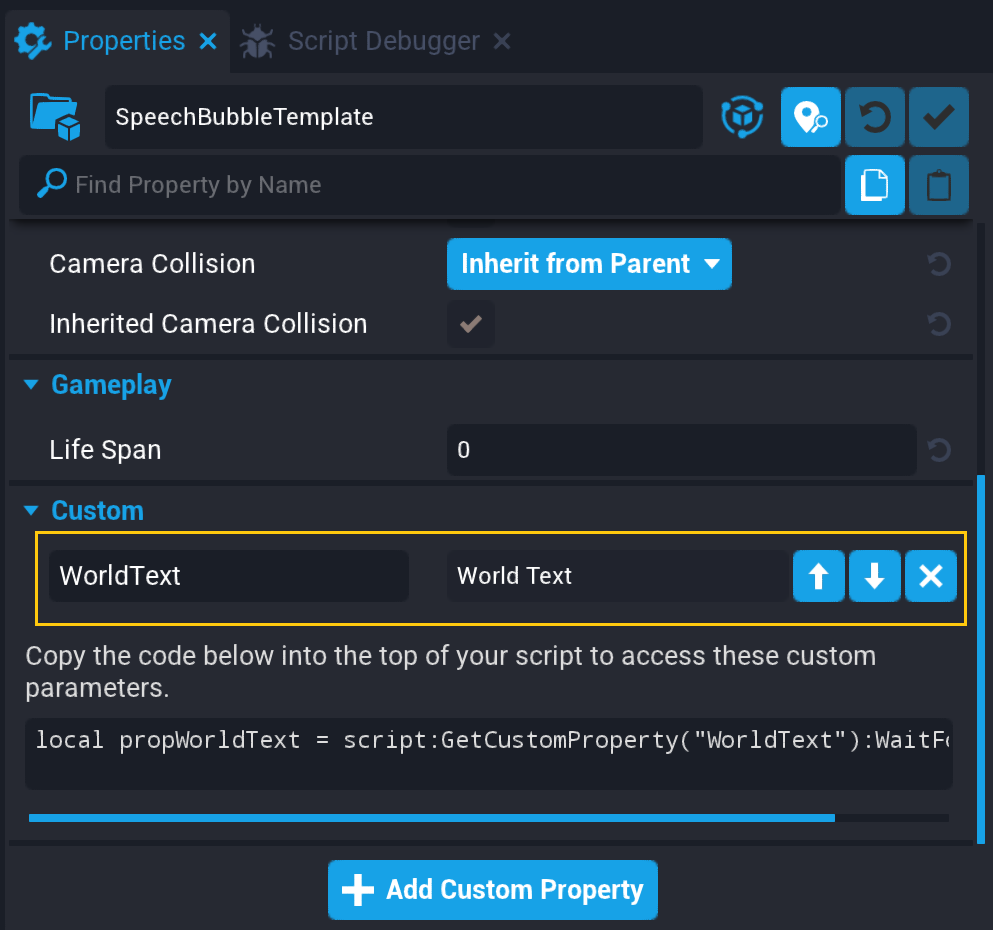
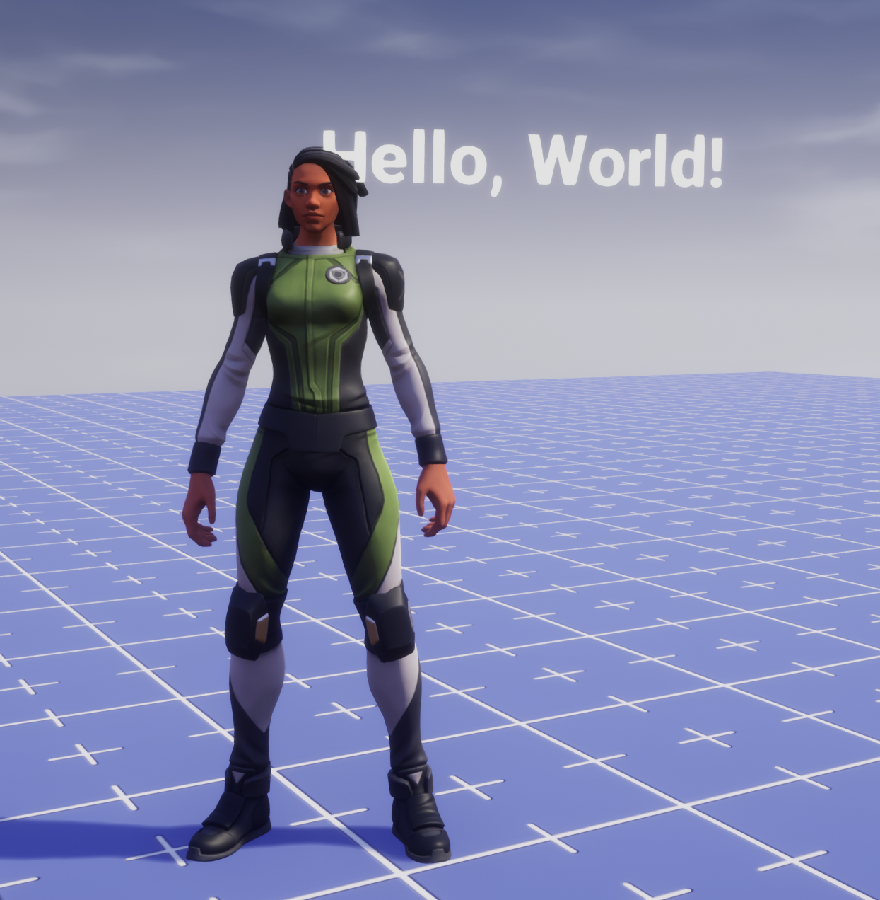
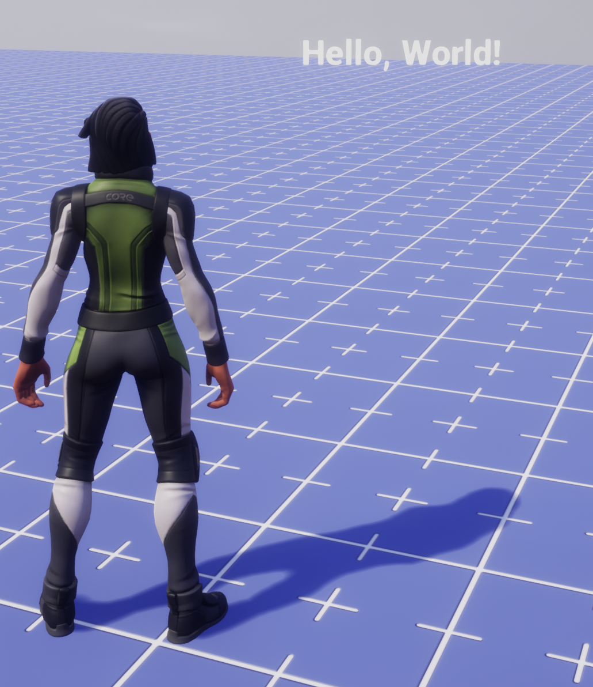
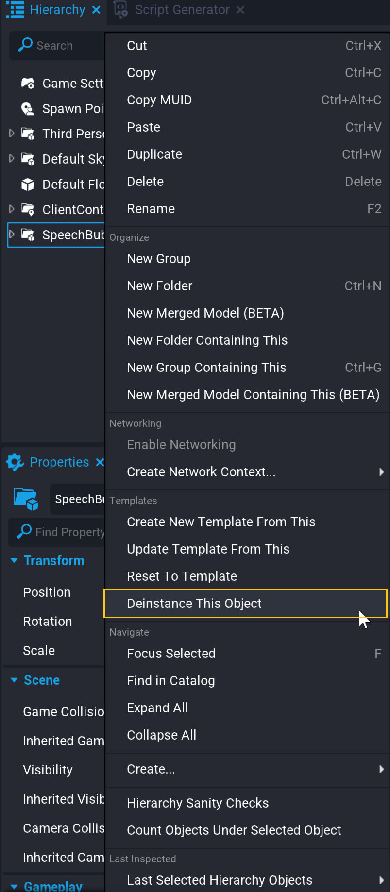
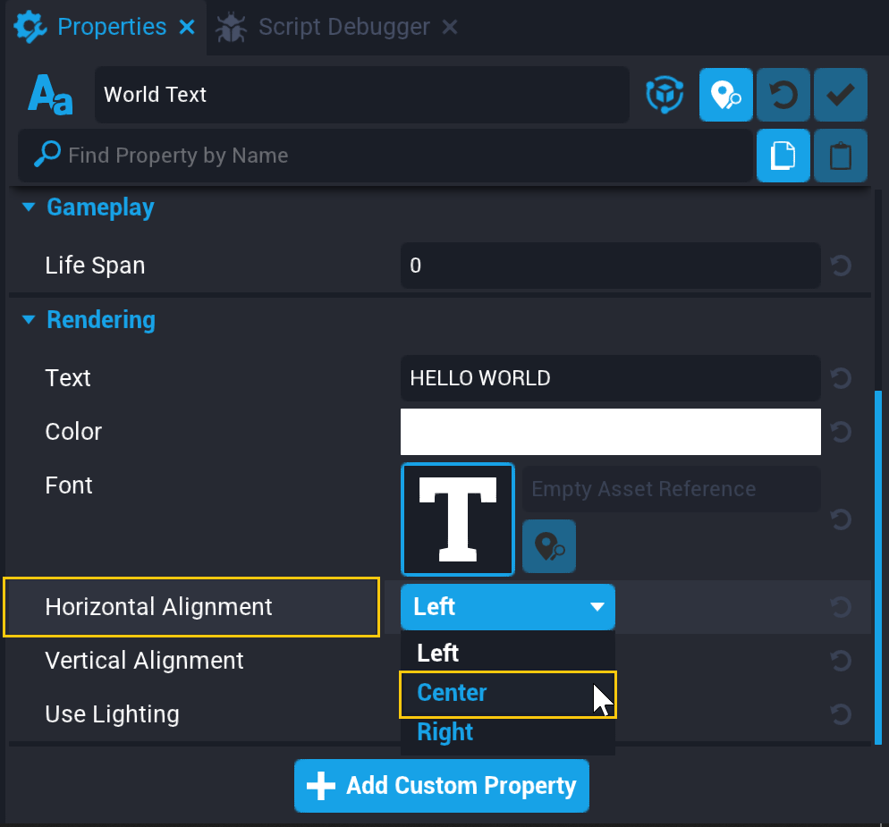

# Chat Hook Tutorial - Create RPG-style Speech Bubbles

The **Chat** namespace allows creators to get the text that players type into the chat window, and to use it to make other code happen, or modify it before it goes into the chat window. There are several examples of ways you can use this to create commands or modify speech in the [**Chat** section of the Core API reference](../api/chat.md), but in this tutorial, we will be making RPG-style speech bubbles that pop up when players enter characters into chat, similar to what you might see in Core World.

## Setting Up the Chat Hooks

**Hooks** are very similar to built-in Core Events, because they are fired automatically by Core when certain behavior happens, but are different from events because you can modify a value before the event is over. In the case of Chat, you can find out that a player typed into chat, find out what they typed, and then change the message or choose not to put it in chat at all.

### Create a New Client Script

This script will be a client-side script that takes the information from the chat window.

!!! info
    Chat hooks can be accessed from both client and server scripts. To write messages in the chat, however, use a client script if it should be seen only by the player who initiated the chat, and a server script if you need to send a message to multiple players.

1. Press the Script  button and select **Create New Script**. Name it `SpeechBubbleScript`.
{: .image-inline-text .image-background }

2. Right click in the **Hierarchy** and select **Create Network Context ...** and **New Client Context**.

3. Find the script you created in the **Project Content** window and drag it into your new Client Context folder.

4. Double click the script to open it.

### Setup a Chat Hook and Function

To start, we'll create a function that connects to the **Chat.receiveMessageHook** and prints the data to the Event Log.

Add this code to the client script that you created.

```lua
function printChatMessage(player, data)
    print(player.name .. " said " .. data.message)
end

Chat.receiveMessageHook:Connect(printChatMessage)
```

### Test the Hook

1. Make sure the **Event Log** window is open, to see the `print` output.
2. Save your script, press the Play button to start a local preview.
3. Press ++Enter++ to open the chat window, and type a message.

You should see your username and the message you wrote print in the **Event Log**.

### Change the Message

The useful thing about hooks is not only getting the data about an event, but also being able to change it. Try these two experiments:

Add the line `data.message = "Something entirely different!"` after the print, like this:

```lua
function printChatMessage(player, data)
    print(player.name .. " said " .. data.message)
    data.message = "Something entirely different"
end

Chat.receiveMessageHook:Connect(printChatMessage)
```

Start a preview and test the chat. Your print message should stay the same, but the text in chat should be changed.

!!! info
    If you want to look for specific words or patterns in the chat message, [this Lua pattern-matching tutorial](https://riptutorial.com/lua/topic/5829/pattern-matching) teaches how to use `find`, `match` and `gmatch` to search through strings of text.

#### Changing the Message to Nothing

If you change the message property of the data you get from the chat hook to an empty sting, it should display nothing at all to the chat. This can be very useful if you want to create user commands that can be done in chat, or use the chat window to get text input from the user.

Test this out by changing `"Something entirely different"` to `""`.

```lua
function printChatMessage(player, data)
    print(player.name .. " said " .. data.message)
    data.message = ""
end

Chat.receiveMessageHook:Connect(printChatMessage)
```

## Creating a Speech Bubble

There are a number of ways to create a container to hold speech bubbles. In **Core World**, these are made using UI positioned on the screen near a player. In this tutorial, we will create them using World Text. This allows you to customize their appearance with the full range of materials and 3D shapes in Core.

### Add a World Text to the Project

1. In **Core Content** find the **World Text** object, and drag it into the scene.
2. Right click the World Text in the Hierarchy and select **New Group Containing This**.
3. Name the Group `SpeechBubbleTemplate`.

### Create a Custom Property and a Template

To make easy to access the text part of the speech bubble, regardless of the text you add later, we will add the text as a custom property on the parent group.

1. With **SpeechBubbleTemplate** selected, open the Properties window.
2. Open the **SpeechBubbleTemplate** folder, and find the **World Text** inside of it.
3. Click and drag the World Text onto the **Add Custom Property** panel in the properties of Speech Bubble Template.
4. Right click **Speech Bubble Template** and select **Create New Template From This**.

You can now delete the copy of **Speech Bubble Template** in the Hierarchy. It should be saved in the **My Templates** section of **Project Content**

## Using the Speech Bubble to Show Text

To finish out the project, we will spawn this new template to show the text that players type into chat above their heads.

### Add the Template as a Custom Property

1. Select your **SpeechBubbleScript** in the **Hierarchy** and open the **Properties** window.
2. In **Project Content**, find **SpeechBubbleTemplate**, and drag it onto the **Add Custom Property** panel of SpeechBubbleScript.

{: .center loading="lazy" }

### Add a Variable Reference to the Template

From here, we'll delete all the experimental code we previously wrote in the script, and replace it code to spawn the speech bubble, and put the player's message in it.

1. Copy the variable text generated by adding the **SpeechBubbleTemplate** as a custom property. It should look like this:

    ```lua
    local propSpeechBubbleTemplate = script:GetCustomProperty("SpeechBubbleTemplate")
    ```

2. Open the **SpeechBubbleScript**, select all its contents, and delete them.
3. Past the variable reference to the speech bubble in the first line of the script.

### Spawn the Template when a Player Chats

Make a `SpawnSpeechBubble` function and connect it to the `Chat.receiveMessageHook` to spawn the template

```lua
local propSpeechBubbleTemplate = script:GetCustomProperty("SpeechBubbleTemplate")

function SpawnSpeechBubble(player, data)
    -- spawn the text bubble
    local bubble = World.SpawnAsset(propSpeechBubbleTemplate)
end

Chat.receiveMessageHook:Connect(SpawnSpeechBubble)
```

Start a preview, type a message into chat, and press ++Enter++ to test the speech bubble spawn. It should show up, but at the world origin of `(0, 0, 0)`.

{: .center loading="lazy" }

### Spawn the Template Over the Player's Head

The next step is to make the chat appear over the player who chatted head, and face the screen for whoever is reading it.

Add these lines after the speech bubble is spawned, in the `SpawnSpeechBubble` function:

```lua
local newBubblePosition = player:GetWorldPosition() + Vector3.UP * 100 -- 100 up from wherever the player is

bubble:SetWorldPosition(newBubblePosition)
bubble:LookAtLocalView() -- magical function to make things face the screen!
```

Press **Play** and type into chat to test the changes to the speech bubble. It should appear by your character's head and facing the correct direction.

{: .center loading="lazy" }

However, the speech bubble doesn't move, and seems to stay in the world indefinitely.

{: .center loading="lazy" }

### Animate and Destroy the Speech Bubble

We'll start with the simplest version of the animation, and in the following step modify it to use a `while` loop and `Lerp` to move more dynamically.

To move the speech bubble up and destroy it, we'll use the `MoveTo` function and the `Destroy` function. To make sure the script waits until the moving is finished, we'll use `Task.Wait`, and to keep that from pausing all the other client scripts, we will also use `Task.Spawn`.

Add this code to the bottom of your `SpawnSpeechBubble` function.

```lua
Task.Spawn(function() -- Spawn a new thread, so we don't interrupt anything else
    local BUBBLE_LIFESPAN = 4 -- how long we want the speech bubble to stick around
    bubble:MoveTo(newBubblePosition + Vector3.UP*200, BUBBLE_LIFESPAN) -- move 200 higher than before
    Task.Wait(BUBBLE_LIFESPAN) -- Wait until the MoveTo is finished
    bubble:Destroy() -- Remove the speech bubble from the world
end)
```

Test this new change out, and you'll see your chat bubble float into the air like a balloon!

Unfortunately, the player can still walk away from the chat bubble, because it moves directly up from where it starts

### Improve the animation

The `MoveTo` function does a great job of moving things at a constant speed for a specified amount of time without requiring creators to calculate exactly where it should be each frame. *However*, in order to keep the bubble over the player's head, we *do* need to recalculate where it should be each frame, so we're going to try a new approach with `SetPosition` and `Vector3.Lerp`.

> `Vector3.Lerp()` takes two points, and a time value, and finds a spot between those points based on the time.

Change your `Task.Spawn` function to use this new strategy:

```lua
Task.Spawn(function() -- Spawn a new thread, so we don't interrupt anything else
    local BUBBLE_LIFESPAN = 4 -- how long we want the speech bubble to stick around

    local startTime = time() -- a value for *right now* in seconds
    while time() < startTime + BUBBLE_LIFESPAN do -- repeat until it's time for the bubble to go
        local timeSinceStart = time() - startTime -- how many seconds since the animation started
        local amountToMoveUp = Vector3.Lerp(Vector3.ZERO, Vector3.UP*200, timeSinceStart / BUBBLE_LIFESPAN) -- finds a value between zero and 200 up based on what % of the time has passed
        bubble:SetWorldPosition(player:GetWorldPosition() + Vector3.UP*100 + amountToMoveUp) -- put the bubble where it should be based on the calculations
        Task.Wait() -- wait exactly one frame
    end
    bubble:Destroy() -- destroy the bubble once that loop is done
end)
```

Test it out again, and watch the stick with the player, float up, and disappear.

### Adjust the Speech Bubble Template

Everything looks beautiful now, and the final step is to update the **SpeechBubbleTemplate** so that the text is centered on its position. You can also use this flow to add audio and VFX to the template, to make it more obvious to players.

1. Drag the **SpeechBubbleTemplate** template from **Project Content** into the **Hierarchy**.
2. Right click **SpeechBubbleTemplate** and select **Deinstance This Object**.
    {: .center loading="lazy" }
3. Select the World Text inside of **SpeechBubbleTemplate** and open the **Properties** window.
4. Find the **Horizontal Align** property and change it to **Center**.
   1. {: .center loading="lazy" }
5. Right-click **SpeechBubbleTemplate** and select **Update Template From This**.

You can add audio and visual effects to this client context folder as well to see how they call out the speech bubble.

## Complete Code

```lua
local propSpeechBubbleTemplate = script:GetCustomProperty("SpeechBubbleTemplate")

function SpawnSpeechBubble(player, data)
    -- spawn the text bubble
    local bubble = World.SpawnAsset(propSpeechBubbleTemplate)
    -- find the World Text from the custom property on the template
    local propWorldText = bubble:GetCustomProperty("WorldText"):WaitForObject()
    -- change the text to the message from chat
    propWorldText.text = data.message

    local newBubblePosition = player:GetWorldPosition() + Vector3.UP * 100 -- 100 up from wherever the player is

    bubble:SetWorldPosition(newBubblePosition)
    bubble:LookAtLocalView() -- magical function to make things face the screen!

    Task.Spawn(function() -- Spawn a new thread, so we don't interrupt anything else
        local BUBBLE_LIFESPAN = 4 -- how long we want the speech bubble to stick around

        local startTime = time() -- a value for *right now* in seconds
        while time() < startTime + BUBBLE_LIFESPAN do -- repeat until it's time for the bubble to go
            local timeSinceStart = time() - startTime -- how many seconds since the animation started
            local amountToMoveUp = Vector3.Lerp(Vector3.ZERO, Vector3.UP*200, timeSinceStart / BUBBLE_LIFESPAN) -- finds a value between zero and 200 up based on what % of the time has passed
            bubble:SetWorldPosition(player:GetWorldPosition() + Vector3.UP*100 + amountToMoveUp) -- put the bubble where it should be based on the calculations
            Task.Wait() -- wait exactly one frame
        end
        bubble:Destroy() -- destroy the bubble once that loop is done
    end)


end

Chat.receiveMessageHook:Connect(SpawnSpeechBubble)
```

## Learn More

[**Chat** in the Core Lua API](../api/chat.md) | [**Vector3** in the Core Lua API](../api/vector3.md)
