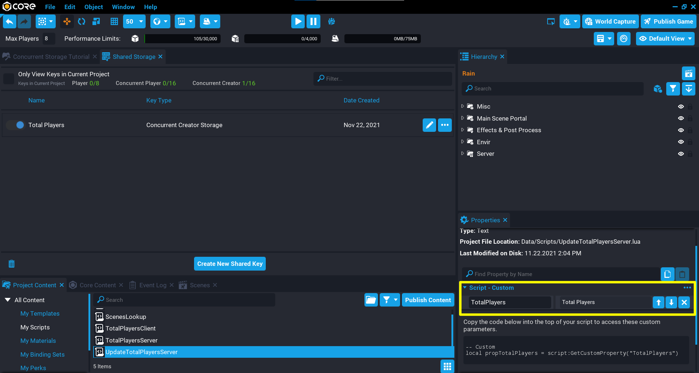
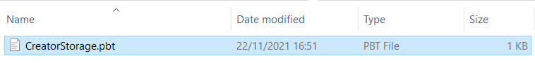
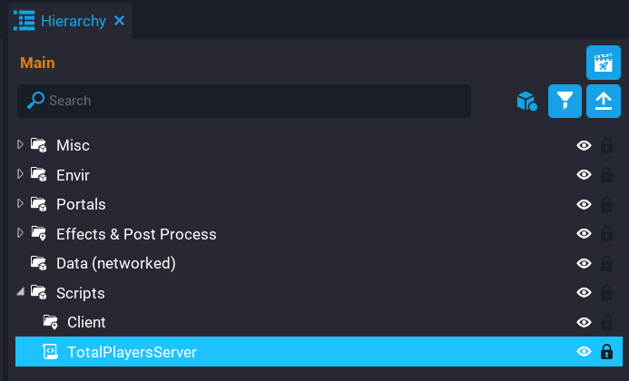
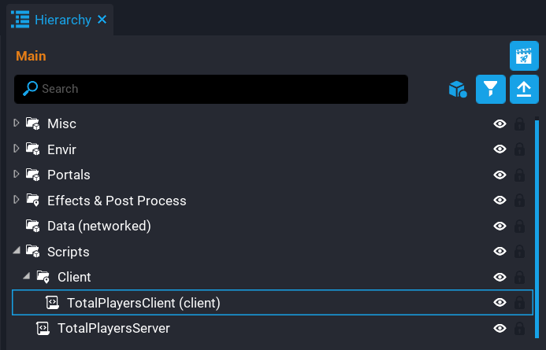
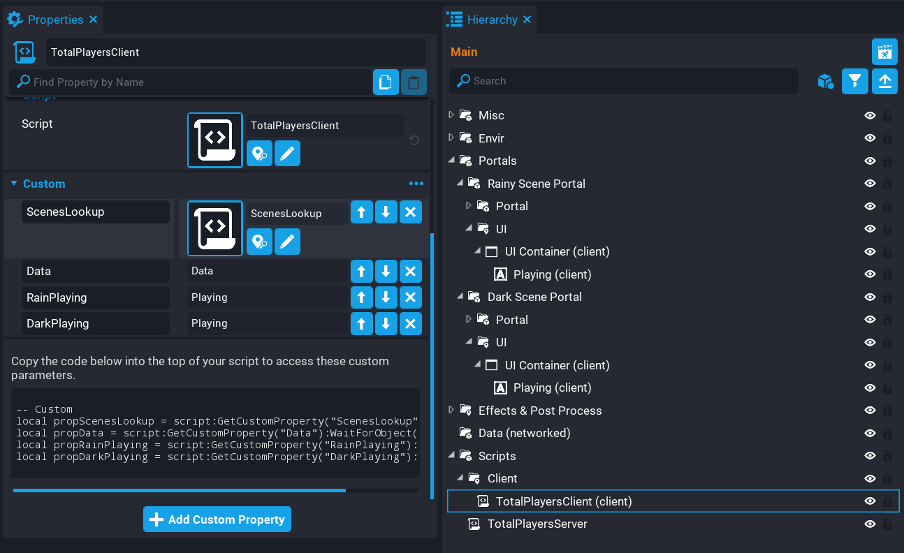
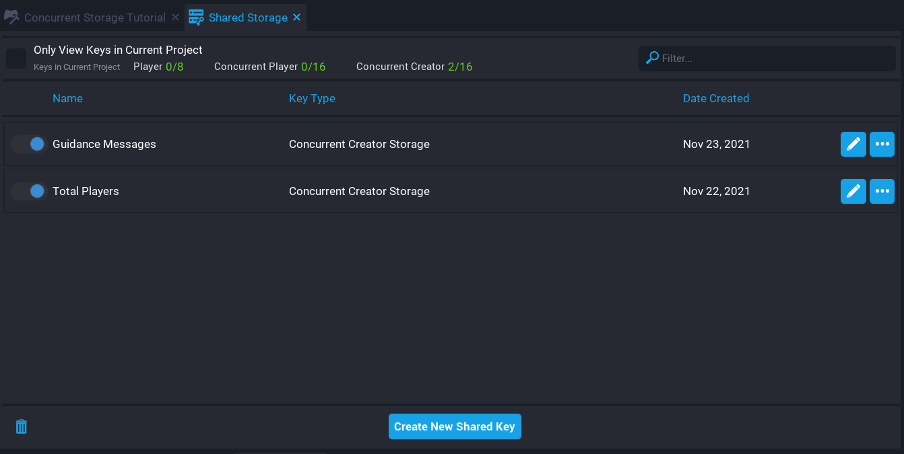
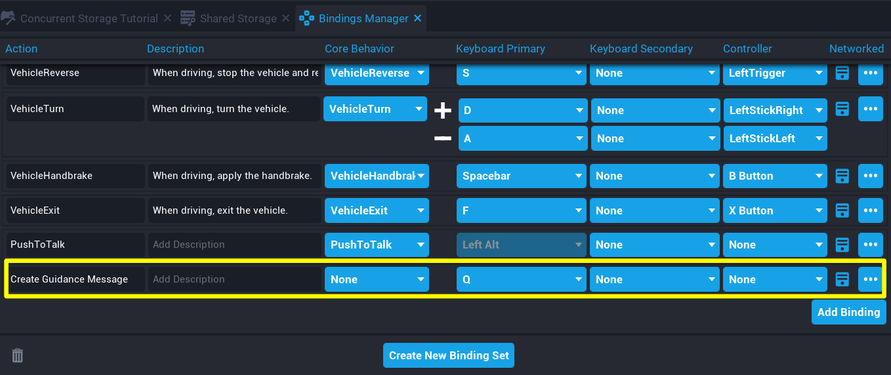
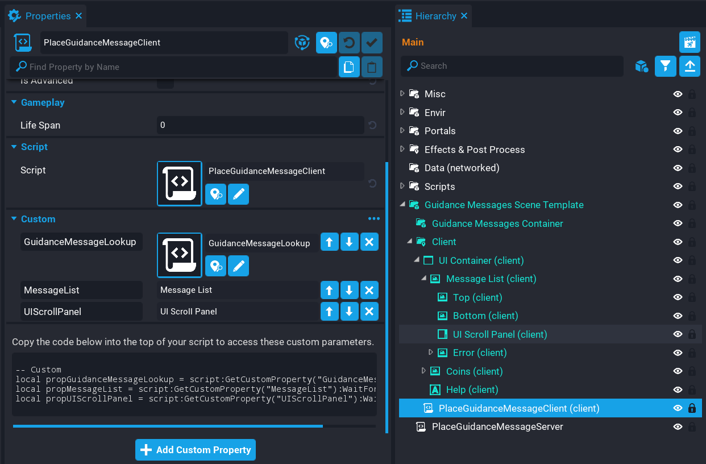
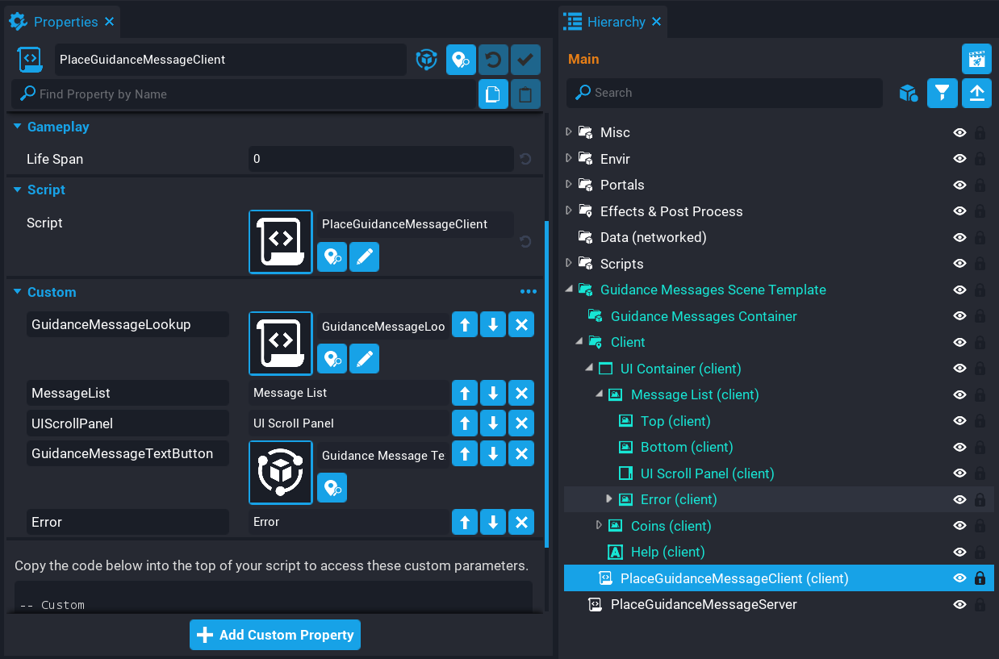
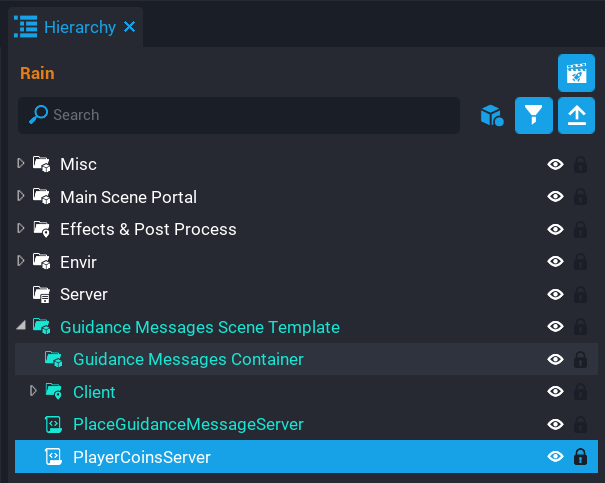

# Concurrent Storage

## Overview

In this tutorial you will create two features using [**Concurrent Storage.**](concurrent_storage.md). You will create a player count tracker to display in the main lobby the number of players in a different scene. You will also create a way for players to place down a guidance message to help other players. Each guidance message will allow coins to be given the player who created it.

<div class="mt-video" style="width:100%">
    <video autoplay muted playsinline controls loop class="center" style="width:100%">
        <source src="/img/ConcurrentStorageTutorial/preview.mp4" type="video/mp4" />
    </video>
</div>

* **Completion Time:** ~2 hours
* **Knowledge Level:** It is recommended to have completed the [Scripting Beginner](lua_basics_helloworld.md), [Scripting Intermediate](lua_basics_lightbulb.md) and [Shared Storage](../references/shared_storage.md) tutorials.
* **Skills you will learn:**
    * Creating concurrent storage keys.
    * Testing concurrent storage keys
    * Set and get concurrent storage data.
    * Listening for concurrent storage changed data.

---

## Create Project

An editable project has been created that you can start from while following this tutorial. It contains the scenes and assets for both parts of this tutorial.

The editable project comes with 3 scenes.

- **Main** scene will be the lobby that players first load into.
- **Rain** scene will be a rainy scene that players can enter from the lobby.
- **Dark** scene will be a nighttime scene that players can enter from the lobby.

Under **Community Projects**, search for `Concurrent`.

{: .center loading="lazy" }

## Enable Concurrent Storage

To use concurrent storage you will need to enable it. You can find the concurrent storage settings for player and creator using the **Game Settings** object.

1. in the **Hierarchy**, open the **Gameplay Settings** folder and select the **Game Settings** object.
2. In the **Properties** window enable **Concurrent Player Storage** and **Concurrent Creator Storage**.

{: .center loading="lazy" }

## Testing Concurrent Storage

Testing concurrent storage should be done in **Multiplayer Preview Mode** with the option **Allow zero clients** enabled. This is because any call to set concurrent storage data needs time to complete. If you test in **Local Preview Mode**, then because the server and client are combined, the server is instantly stopped when the preview ends. For example, if you set concurrent data when the player leaves the game using `playerLeftEvent`, then the data will not save.

### Check Concurrent Storage Key File

When data is saved during testing of a local project, it gets written to file in the local project files. You can check that concurrent storage is being saved correctly by opening this file.

In **My Shared Keys** in the **Project Content** window, right click on a concurrent storage key and select **Show in Explorer**. This will then show you where the file is (if data has been saved already), allowing you to inspect the data and be able to delete it later if you need to reset the key.

For example, if you have a concurrent creator storage key, then the file will be called **CreatorStorage.pbt**. You can open up this file and check the entries to see if the data is being set correctly. This can be done when the game is running, and if your script editor supports detecting changes, then it will update without you needing to reopen it.

{: .center loading="lazy" }

{: .center loading="lazy" }

## About Callbacks

When using any `Set` concurrent storage function, a callback is required that is passed into the concurrent storage function which receives the table data that you can modify and then return back. The concurrent storage API places the callback into a queue which will be executed when the queue reaches it. The function is called a **Callback** because you are passing in a function to concurrent storage that will be called later.

For example, in the code below a function (callback) is passed to `SetConcurrentCreatorData`.

```lua
local function MyFirstCallback(data)
    print("My first callback was executed.")

    return data
end

Storage.SetConcurrentCreatorData(CREATOR_KEY, MyFirstCallback)
```

Callbacks should be efficient, meaning they should execute as quickly as possible, otherwise the concurrent callback queue that holds all the functions it needs to execute could start to time out.

For example, the code below could contain logic that would delay the return of the `data` table. Try and avoid any code that could slow down the return, consider moving it outside of the callback if possible.

```lua
local function MySlowCallback(data)
    local items = obj:GetChildren()

    for i, item in ipairs(items) do
        for key, inventoryData in pairs(inventoryItems) do
            -- More logic that could potentially slow this callback down.
        end
    end

    return data
end

Storage.SetConcurrentCreatorData(CREATOR_KEY, MySlowCallback)
```

## Total Players in Scene

In this section you will be creating a feature that will track the amount of players that are in each scene and display the total players per scene in the main lobby in front of each scene portal. By using Concurrent Storage, you can save to a creator type key when a player joins or leaves a scene. In the main lobby scene, a script will detect any changes to the data and update the player counts for the scenes.

### Create Concurrent Creator Storage Key

From the **Window** menu open up the **Shared Storage** window and create a **Concurrent Creator Storage** key called `Total Players`. This key will keep track of how many players are in each scene.

{: .center loading="lazy" }

### Create TotalPlayersServer Script

Create a new script called `TotalPlayersServer` and place it into the **Scripts** folder in the **Main** scene. The script will be in the **Default Context** because it will need to access the networked **Data** object in the **Hierarchy** so a client script can display the player counts to each player.

{: .center loading="lazy" }

#### Add ScenesLookup Script Custom Property

A script called **ScenesLookup** comes with the project. This script contains a table where the key is the scene name, and the value is a shorthand string that will be used as the key for the data that will be set on the **Data** object in the **Hierarchy**. This keeps the data size small and provides one place to update the table. This script can then be required in other scripts, instead of copying and pasting a table in multiple scripts.

Open up the script to see the code. If you have more scenes you would like to add, then this table should be updated with the scene name and unique storage key.

```lua
local ScenesLookup = {

    ["Rain"] = "r",
    ["Dark"] = "d"

}

return ScenesLookup
```

Add the script as a custom property to the **TotalPlayersServer** script.

{: .center loading="lazy" }

#### Add Data Custom Property

In the **Hierarchy** there is an object called **Data** that is networked. This object contains a [dynamic property](custom_properties.md) called **TotalPlayers**. This property will be updated from the server and read by the client. The **TotalPlayersServer** script needs a reference to it so it can set the dynamic property when the concurrent storage data changes.

Add the **Data** object to the **TotalPlayersServer** script as a custom property.

{: .center loading="lazy" }

#### Add Concurrent Storage Key Custom Property

The **TotalPlayersServer** script will need a net reference to the concurrent creator storage key that you created earlier.

From either the **Shared Storage** window, or from **My Shared Keys** in the **Project Content** window, drag the **Total Players** shared key onto the **TotalPlayersServer** script as a custom property.

{: .center loading="lazy" }

#### Create TotalPlayersServer Code

Open up the **TotalPlayersServer** script and add the following code so you have references to the custom properties. The `SCENES_LOOKUP` variable needs a reference to the table returned by the `ScenesLookup` script, so you will need to `require` the script.

```lua
local TOTAL_PLAYERS_KEY = script:GetCustomProperty("TotalPlayers")
local DATA = script:GetCustomProperty("Data"):WaitForObject()
local SCENES_LOOKUP = require(script:GetCustomProperty("ScenesLookup"))
```

##### Check if Key is Assigned

Because references can be changed, it is a good idea to make sure the concurrent storage key is assigned and not missing. This can be done by checking the property `isAssigned` and converting the `TOTAL_PLAYERS_KEY` to a string to check if is a missing reference. Even if the property is a missing reference, `isAssigned` will return true, so you need this extra check to ensure that you have both.

```lua
if not TOTAL_PLAYERS_KEY.isAssigned or tostring(TOTAL_PLAYERS_KEY) == "Unknown NetReference" then
    warn("Concurrent key not set for scene: " .. Game.GetCurrentSceneName())
end
```

##### Create CreateDataString Function

The `CreateDataString` function will accept a table called `data` as a parameter that will build up the string which will be used as the value when setting the dynamic property on the **Data** object so the client can read it later.

The function will loop over the `data` table and look for a matching scene from the `SCENES_LOOKUP` table. If the scene is not `nil`, then a string is built with the scenes storage key and total players for that scene.

For example, the returned string could be `r:1|d:0`, indicating that the **Rain** scene has 1 player, and the **Dark** scene has 0 players. Each scene entry is separated using the `|` symbol. This will help later on to split up the values.

```lua
local function CreateDataString(data)
    local str = {}

    for sceneKey, totalPlayers in pairs(data) do
        if SCENES_LOOKUP[sceneKey] ~= nil then
            table.insert(str, SCENES_LOOKUP[sceneKey] .. ":" .. tostring(totalPlayers))
        end
    end

    return table.concat(str, "|")
end
```

##### Create UpdateClients Function

The `UpdateClients` function will be called from 2 different points in the script to make sure that the client receives the data string. The dynamic property `TotalPlayers` will have a string set based on the returned value from the function `CreateDataString`.

```lua
local function UpdateClients(key, data)
    DATA:SetCustomProperty("TotalPlayers", CreateDataString(data))
end
```

##### Connect Concurrent Changed Event

Concurrent storage has an event for the creator key type that can listen for any changes to the data. When a player loads or leaves a scene (excluding the **Main** scene), the concurrent storage data is updated, which will trigger the `ConnectToConcurrentCreatorDataChanged` event and call the `UpdateClients` function that will update the dynamic property for the **Data** object in the **Hierarchy**.

```lua
Storage.ConnectToConcurrentCreatorDataChanged(TOTAL_PLAYERS_KEY, UpdateClients)
```

##### Connect Player Joined Event

When a player joins the **Main** scene, a call to `UpdateClients` is done with the current concurrent data. This will set the dynamic property `TotalPlayers` on the **Data** object in the **Hierarchy**.

```lua
Game.playerJoinedEvent:Connect(function(player)
    UpdateClients(nil, Storage.GetConcurrentCreatorData(TOTAL_PLAYERS_KEY))
end)
```

#### The TotalPlayersServer Script

??? "TotalPlayersServer"
    ```lua
    local TOTAL_PLAYERS_KEY = script:GetCustomProperty("TotalPlayers")
    local DATA = script:GetCustomProperty("Data"):WaitForObject()
    local SCENES_LOOKUP = require(script:GetCustomProperty("ScenesLookup"))

    if not TOTAL_PLAYERS_KEY.isAssigned or tostring(TOTAL_PLAYERS_KEY) == "Unknown NetReference" then
        warn("Concurrent key not set for scene: " .. Game.GetCurrentSceneName())
    end

    local function CreateDataString(data)
        local str = {}

        for sceneKey, totalPlayers in pairs(data) do
            if SCENES_LOOKUP[sceneKey] ~= nil then
                table.insert(str, SCENES_LOOKUP[sceneKey] .. ":" .. tostring(totalPlayers))
            end
        end

        return table.concat(str, "|")
    end

    local function UpdateClients(key, data)
        DATA:SetCustomProperty("TotalPlayers", CreateDataString(data))
    end

    Storage.ConnectToConcurrentCreatorDataChanged(TOTAL_PLAYERS_KEY, UpdateClients)

    Game.playerJoinedEvent:Connect(function(player)
        UpdateClients(nil, Storage.GetConcurrentCreatorData(TOTAL_PLAYERS_KEY))
    end)
    ```

### Create TotalPlayersClient Script

Create a new script called `TotalPlayersClient` and place it into the **Client** folder in the **Scripts** folder found in the **Main** scene. This script will handle updating the UI for both scene portals to display the total players in each scene to the player.

{: .center loading="lazy" }

#### Add ScenesLookup Script Custom Property

Just like the **TotalPlayersServer** script, the **TotalPlayersClient** script will also need a reference to the **ScenesLookup** script.

Add the script as a custom property to the **TotalPlayersClient** script.

{: .center loading="lazy" }

#### Add Data Custom Property

In the **Hierarchy** there is a group called **Data** that is networked. This object contains a dynamic property called **TotalPlayers**. This property will be updated from the server and read by the **TotalPlayersClient** script when the property value changes. The **TotalPlayersClient** script needs a reference to it so it can listen for when the dynamic property value changes.

Add the **Data** object to the **TotalPlayersClient** script as a custom property.

{: .center loading="lazy" }

#### Add Portal UI Properties

Each portal has a text object that will display the amount of players in that scene. The **TotalPlayersClient** script will need a reference to both text objects so they can be updated when the value of the dynamic property on the **Data** object changes.

1. Open up the **UI** container in each Portal folder.
2. Find the text object **Playing** and add it as a new custom property.
3. Name the property either `DarkPlaying` or `RainPlaying`, depending on which portal group you are in.

{: .center loading="lazy" }

#### Create TotalPlayersClient Code

Open up the **TotalPlayersClient** script and add the following code so you have references to the custom properties. The `SCENES_LOOKUP` variable needs a reference to the table returned by the **ScenesLookup** script, so you will need to `require` the script.

```lua
local SCENES_LOOKUP = require(script:GetCustomProperty("ScenesLookup"))
local DATA = script:GetCustomProperty("Data"):WaitForObject()
```

##### Create Text Objects Table

Create a table called `SCENE_TEXT_OBJS` that will contain a list of the text objects. The key for each text object should match the name of the scene. This way it will be easier to find the correct text object for the correct portal.

```lua
local SCENE_TEXT_OBJS = {

    Rain = script:GetCustomProperty("RainPlaying"):WaitForObject(),
    Dark = script:GetCustomProperty("DarkPlaying"):WaitForObject()

}
```

##### Create GetTextObject Function

The `GetTextObject` function will get the text object from the `SCENE_TEXT_OBJS` table based on the `scene` parameter. It will loop over the `SCENES_LOOKUP` table to make sure the scene exists, and then check if the scene name exists in the `SCENE_TEXT_OBJS` table. If it does, then it is returned.

```lua
local function GetTextObject(scene)
    for key, value in pairs(SCENES_LOOKUP) do
        if value == scene and SCENE_TEXT_OBJS[key] then
            return SCENE_TEXT_OBJS[key]
        end
    end
end
```

##### Create UpdateTotalPlayers Function

The `UpdateTotalPlayers` function will handle updating the text objects for each scene portal with the amount of players that are in that scene. It will get the string data from the dynamic property `TotalPlayers` on the **Data** object in the **Hierarchy**.

For example, the string dynamic property `TotalPlayers` value could be `r:1|d:0`, where `r` is the key for the **Rain** scene, and `d` is the key for the **Dark** scene. The total players for each scene is separated with `:`.

The function will split the string into parts. Because there is 2 scenes, you will get 2 parts.

1. `r:1`
2. `d:0`

In the loop, each part is then split again using the `:` character. This then gives you the `scene` and `total`, which can then be used to fetch the correct text object and update the total players for that scene so it displays to the player.

```lua
local function UpdateTotalPlayers()
    local str = DATA:GetCustomProperty("TotalPlayers")
    local parts = { CoreString.Split(str, "|") }

    for i, sceneData in ipairs(parts) do
        local scene, total = CoreString.Split(sceneData, ":")
        local textObj = GetTextObject(scene)

        if textObj ~= nil then
            textObj.text = tostring(total) .. " Playing"
        end
    end
end
```

##### Create GetDataString Function

The `GetDataString` function will be called when the dynamic property `TotalPlayers` changes value. It will check the property that changed is `TotalPlayers` and then call the `UpdateTotalPlayers` function.

```lua
local function GetDataString(obj, property)
    if property == "TotalPlayers" then
        UpdateTotalPlayers()
    end
end
```

##### Connect Property Changed Event

The `GetDataString` function will be called when the dynamic property `TotalPlayers` value has changed on the **Data** object in the **Hierarchy**.

```lua
DATA.customPropertyChangedEvent:Connect(GetDataString)
```

##### Add GetDataString Call

There is a possibility that the server has already set the dynamic property `TotalPlayers` before the event `customPropertyChangedEvent` has been connected. So calling `GetDataString` manually will make sure when the players load into the game, they see the correct player count for each portal.

```lua
GetDataString(DATA, "TotalPlayers")
```

#### The TotalPlayersClient Script

??? "TotalPlayersClient"
    ```lua
    local SCENES_LOOKUP = require(script:GetCustomProperty("ScenesLookup"))
    local DATA = script:GetCustomProperty("Data"):WaitForObject()

    local SCENE_TEXT_OBJS = {

        Rain = script:GetCustomProperty("RainPlaying"):WaitForObject(),
        Dark = script:GetCustomProperty("DarkPlaying"):WaitForObject()

    }

    local function GetTextObject(scene)
        for key, value in pairs(SCENES_LOOKUP) do
            if value == scene and SCENE_TEXT_OBJS[key] then
                return SCENE_TEXT_OBJS[key]
            end
        end
    end

    local function UpdateTotalPlayers()
        local str = DATA:GetCustomProperty("TotalPlayers")
        local parts = { CoreString.Split(str, "|") }

        for i, sceneData in ipairs(parts) do
            local scene, total = CoreString.Split(sceneData, ":")
            local textObj = GetTextObject(scene)

            if textObj ~= nil then
                textObj.text = tostring(total) .. " Playing"
            end
        end
    end

    local function GetDataString(obj, property)
        if property == "TotalPlayers" then
            UpdateTotalPlayers()
        end
    end

    DATA.customPropertyChangedEvent:Connect(GetDataString)

    GetDataString(DATA, "TotalPlayers")
    ```

### Create UpdateTotalPlayersServer Script

Each scene (excluding the **Main** scene) needs to update concurrent storage when a player joins or leaves that scene. When they join a scene it will increment the player count, and when leaving the scene it will decrement the player count. This will then update in the **Main** scene with the player count total for the scene portal.

Create a new script called **UpdateTotalPlayersServer** and add the script to the **Server** folder in the **Rain** and **Dark** scenes.

{: .center loading="lazy" }

#### Add Default Storage Key Custom Property

Because the **UpdateTotalPlayersServer** script is in multiple scenes and needs a reference to the concurrent storage key, you can add the custom property on the script directly in the **Project Content** window so that the custom property becomes a default property that will always be on the script when added to the **Hierarchy**.

1. Click on the **UpdateTotalPlayersServer** script in the **Project Content** window.
2. Add the **Total Players** concurrent storage key as a custom property.

{: .center loading="lazy" }

#### Create UpdateTotalPlayersServer Code

Open the **UpdateTotalPlayersServer** script and add the following reference to the concurrent shared key.

```lua
local TOTAL_PLAYERS_KEY = script:GetCustomProperty("TotalPlayers")
```

##### Create Scene Name Variable

You will need a reference to the current scene name the player has joined, which can be retrieved by calling `Game.GetCurrentSceneName()`.

```lua
local currentSceneName = Game.GetCurrentSceneName()
```

##### Create Delta Variable

A delta variable will track the changes between concurrent updates that will be applied on the next update. This variable will get updated when a player leaves or joins.

```lua
local deltaPlayers = 0
```

##### Create Wait Time Variable

This variable will hold a time in seconds between each set concurrent call.

```lua
local waitTime = 5
```

##### Check if Key is Assigned

It is worth adding in a check to make sure the concurrent storage key is assigned and not missing. This can be done by checking the property `isAssigned` and converting the `TOTAL_PLAYERS_KEY` to a string to check if is a missing reference. If the property is a missing reference, then `isAssigned` will return true, so you need this extra check.

```lua
if not TOTAL_PLAYERS_KEY.isAssigned or tostring(TOTAL_PLAYERS_KEY) == "Unknown NetReference" then
    warn("Concurrent key not set for scene: " .. Game.GetCurrentSceneName())
end
```

##### Create UpdateTotalPlayers Function

The `UpdateTotalPlayers` function will check if the current scene is in the `data` table or not. If it is not, then the default value will be set to `0`.

The value of the entry into the `data` table is the current player count plus the `deltaPlayers` amount.

!!! warning "Callback Efficiency and Return Value"
    It is important that the callback (function) is fast to execute and returns back the table it was passed in. If your callback is slow, then it will slow down the updates to the key for any other server instances that are trying to write to it. Using a delta value (that is `deltaPlayers`) is a good way to batch up calls instead of updating concurrent storage every time a player joins or leaves.

```lua
local function UpdateTotalPlayers(data)
    if not data[currentSceneName] then
        data[currentSceneName] = 0
    end

    data[currentSceneName] = data[currentSceneName] + deltaPlayers

    return data
end
```

##### Create PlayerJoined Function

The `PlayerJoined` function will be called when a player joins the scene. It will increment `deltaPlayers` which is used to track the changes between set concurrent storage calls.

```lua
local function PlayerJoined(player)
    deltaPlayers = deltaPlayers + 1
end
```

##### Create PlayerLeft Function

The `PlayerLeft` function will be called when the player leaves the scene. In this case it will decrement the `deltaPlayers` amount.

```lua
local function PlayerLeft(player)
    deltaPlayers = deltaPlayers - 1
end
```

##### Create Tick Function

The `Tick` function will be responsible for updating concurrent storage. The `Tick` function will wait based on the time of `waitTime`. If `deltaPlayers` is `0` or there is already a pending set concurrent call, then you can `return` in the `Tick` function.

If the `Tick` function has not returned, then a call to `SetConcurrentCreatorData` will be made, passing in the `TOTAL_PLAYERS_KEY` and the callback function `UpdateTotalPlayers`. The `deltaPlayers` value is set back to `0`, meaning that the value in `deltaPlayers` was applied to the concurrent storage data.

```lua
function Tick()
    Task.Wait(waitTime)

    if deltaPlayers == 0 or Storage.HasPendingSetConcurrentCreatorData(TOTAL_PLAYERS_KEY) then
        return
    end

    Storage.SetConcurrentCreatorData(TOTAL_PLAYERS_KEY, UpdateTotalPlayers)

    deltaPlayers = 0
end
```

##### Connect Events

Connect the `PlayerJoined` function to the `PlayerJoinedEvent` so that it is fired when a player joins the server.

```lua
Game.playerJoinedEvent:Connect(PlayerJoined)
```

Connect the `PlayerLeft` function to the `playerLeftEvent` so that it is fired when a player leaves the server.

```lua
Game.playerLeftEvent:Connect(PlayerLeft)
```

#### The UpdateTotalPlayersServer Script

??? "UpdateTotalPlayersServer"
    ```lua
    local TOTAL_PLAYERS_KEY = script:GetCustomProperty("TotalPlayers")

    local currentSceneName = Game.GetCurrentSceneName()
    local deltaPlayers = 0
    local waitTime = 5

    if not TOTAL_PLAYERS_KEY.isAssigned or tostring(TOTAL_PLAYERS_KEY) == "Unknown NetReference" then
        warn("Concurrent key not set for scene: " .. currentSceneName)
    end

    local function UpdateTotalPlayers(data)
        if not data[currentSceneName] then
            data[currentSceneName] = 0
        end

        data[currentSceneName] = data[currentSceneName] + deltaPlayers

        return data
    end

    local function PlayerJoined(player)
        deltaPlayers = deltaPlayers + 1
    end

    local function PlayerLeft(player)
        deltaPlayers = deltaPlayers - 1
    end

    function Tick()
        Task.Wait(waitTime)

        if deltaPlayers == 0 or Storage.HasPendingSetConcurrentCreatorData(TOTAL_PLAYERS_KEY) then
            return
        end

        Storage.SetConcurrentCreatorData(TOTAL_PLAYERS_KEY, UpdateTotalPlayers)

        deltaPlayers = 0
    end

    Game.playerJoinedEvent:Connect(PlayerJoined)
    Game.playerLeftEvent:Connect(PlayerLeft)
    ```

### Testing the Game

In **My Shared Keys** in the **Project Content** window, right click on the **Total Players** and select **Show in Explorer**. This will then show you where the file **CreatorStorage.pbt** for the key is kept. If there is no file yet, then enter multiplayer preview mode (with **Allow zero clients** enabled), then exit. You should now see the file.

#### Test the Rain Scene

1. Select the **Rain** scene and enter multiplayer preview mode.
2. Check the **CreatorStorage** file and make sure that the `IntVar` value for the `Rain` key is `1`.
3. Close the client window, and then check the **CreatorStorage** file and make sure the value for `Rain` is `0`.

#### Test the Dark Scene

1. Select the **Dark** scene and enter multiplayer preview mode.
2. Check the **CreatorStorage** file and make sure that the `IntVar` value for the `Dark` key is `1`.
3. Close the client window, and then check the **CreatorStorage** file and make sure the value for `Dark` is `0`.

#### Test the Main Scene

1. Select the **Main** scene and enter multiplayer preview mode.
2. Make sure both scene portals display 0 players.

<div class="mt-video" style="width:100%">
    <video autoplay muted playsinline controls loop class="center" style="width:100%">
        <source src="/img/ConcurrentStorageTutorial/test_total_players.mp4" type="video/mp4" />
    </video>
</div>

## Player Guidance Messages

In this section you will be creating player guidance messages. These are messages that players can place in the world and will persist across different server instances even when the player is offline. Other players will be able to give coins to the player who placed the message if they feel it was helpful. Guidance messages could be used by players to offer tips in the world, for example, warning them that danger is up ahead.

### Create Concurrent Creator Storage Key

From the **Window** menu, open up the **Shared Storage** window and create a **Concurrent Creator Storage** key called `Guidance Messages`. This key will keep track of the messages for each scene a player places.

{: .center loading="lazy" }

### Create Binding

A new binding needs to be created so that a player can press a key that will open up the guidance message UI.

Open up the **Bindings Manager** window found in the **Window** menu, and add a new **Basic Binding** called `Create Guidance Message`. From the **Primary Keyboard** dropdown, select the letter ++Q++.

{: .center loading="lazy" }

### Add Guidance Messages Scene Template

Each scene will need the **Guidance Messages Scene Template** added to the **Hierarchy**. In the last scene you add the template to, deinstance it. You only need to do this in one scene, because once you have made the changes to the template, you will update it and it will be updated across scenes automatically.

{: .center loading="lazy" }

### Create PlaceGuidanceMessageServer Script

Create a new script called `PlaceGuidanceMessageServer` and place it into the **Guidance Messages Scene Template** in the **Default Context**. This script will be responsible for spawning a guidance message asset for the player, and also saving it to concurrent storage so it appears across other instances of the game for the scene it was placed in.

{: .center loading="lazy" }

#### Add Guidance Message Lookup Custom Property

Players will be able to select a message from a list in the UI that is populated by a list of messages defined by you. In **My Scripts**, open up the script **GuidanceMessageLookup**. In this script you can add or remove messages to customize it for your game.

This script will be required by other scripts to that it is a single place to look for the messages. The script will need to be added as a custom property for it to be required.

Add the **GuidanceMessageLookup** script as a custom property on the **PlaceGuidanceMessageServer** script.

#### Add Guidance Message Template Custom Property

When players place a guidance message, it will spawn an asset in the world. To do this the script needs a reference to a template.

Add the template **Guidance Message** from the **My Templates** folder in **Project Content** as a custom property on the **PlaceGuidanceMessageServer** script.

#### Add Guidance Messages Container Custom Property

In the **Hierarchy** inside the **Guidance Messages Scene Template** group, there is a another group called **Guidance Messages Container** that the script needs a reference to. The group **Guidance Messages Container** will contain all spawned guidance message assets.

Add the group **Guidance Messages Container** as a custom property on the **PlaceGuidanceMessageServer** script.

#### Add Concurrent Storage Key Custom Property

The **PlaceGuidanceMessageServer** script will need a net reference to the concurrent creator storage key that you created so it can save the guidance messages.

From either the **Shared Storage** window, or from **My Shared Keys** in the **Project Content** window, add the **Guidance Messages** shared key onto the **PlaceGuidanceMessageServer** script as a custom property.

{: .center loading="lazy" }

#### Create PlaceGuidanceMessageServer Code

Open up the **PlaceGuidanceMessageServer** script and add the following code so you have references to the custom properties. The `GUIDANCE_MESSAGE_LOOKUP` variable needs a reference to the table returned by the `GuidanceMessageLookup` script, so you will need to `require` the script.

```lua
local GUIDANCE_MESSAGE_LOOKUP = require(script:GetCustomProperty("GuidanceMessageLookup"))

local GUIDANCE_MESSAGE = script:GetCustomProperty("GuidanceMessage")
local GUIDANCE_MESSAGES_CONTAINER = script:GetCustomProperty("GuidanceMessagesContainer"):WaitForObject()

local CREATOR_KEY = script:GetCustomProperty("GuidanceMessages")
```

##### Creating Variables

Add the following variables to the script:

| Variable | Description |
| -------- | ----------- |
| `sceneName` | The name of the current scene. This will be used to save and load guidance messages for the current scene. |
| `waitTime` | The amount of time to wait before setting concurrent storage. This will batch up messages instead of calling `SetConcurrentCreatorData` too often. |
| `newMessages` | A queue of new guidance messages that players have created which will periodically be added to concurrent storage. |
| `maxMessages` | The maximum amount of guidance messages per scene. Older guidance messages will be removed automatically. |

```lua
local sceneName = Game.GetCurrentSceneName()
local waitTime = 5
local newMessages = {}
local maxMessages = 5
```

##### Create GetOldestMessageIndex Function

The `GetOldestMessageIndex` function will get an index from the concurrent creator data of the oldest guidance message. It does this by comparing the `entry.ts` property, which is the timestamp of when the guidance message was created, against the last `oldest.ts` guidance message timestamp. The `tableIndex` is returned back, which will contain either `1` or the index of the oldest guidance message.

```lua
local function GetOldestMessageIndex(data)
    local oldest = data[1]
    local tableIndex = 1

    for i, entry in ipairs(data) do
        if i > 1 and entry.ts < oldest.ts then
            oldest = entry
            tableIndex = i
        end
    end

    return tableIndex
end
```

##### Create GetMessage Function

The `GetMessage` function will return a message from the `GUIDANCE_MESSAGE_LOOKUP` table based on the `index` passed in.

```lua
local function GetMessage(index)
    if GUIDANCE_MESSAGE_LOOKUP[index] ~= nil then
        return GUIDANCE_MESSAGE_LOOKUP[index]
    end

    return nil
end
```

##### Create SaveToConcurrentCreatorStorage Function

The `SaveToConcurrentCreatorStorage` is the callback function that is passed to the `SetConcurrentCreatorData` function. The `data` parameter is a table that will contain the latest data for that key, meaning the data will never be stale. Each scene can have different guidance messages, and also a maximum amount of messages. If the total guidance messages in the table for the current scene is greater than or equal to `maxMessages`, then it will fetch the oldest guidance message index using `GetOldestMessageIndex` so it can overwrite an existing entry in the table.

```lua
local function SaveToConcurrentCreatorStorage(data)
    if data[sceneName] == nil then
        data[sceneName] = {}
    end

    for i, message in ipairs(newMessages) do
        local tableIndex = #data[sceneName] + 1

        if #data[sceneName] >= maxMessages then
            tableIndex = GetOldestMessageIndex(data[sceneName])
        end

        data[sceneName][tableIndex] = message
    end

    return data
end
```

##### Create PlaceGuidanceMessage Function

The `PlaceGuidanceMessage` function will handle spawning in the guidance message asset into the world. The asset will be added as a child of `GUIDANCE_MESSAGES_CONTAINER`. The asset will also need to have the dynamic properties set so that when a player opens up the UI of the guidance message, they will be able to see the message, player who created it, date of when it was created, and the amount of coins that player has received for that guidance message.

The name of the asset is set using the id of the player who created the guidance message, and the timestamp. This is done to create a unique name for later on when you will need to check if existing guidance messages are valid or not.

It is recommended to not make constant calls to `SetConcurrentCreatorData`. When a player creates a guidance message, it is inserted into the `newMessages` table that will be periodically checked.

```lua
local function PlaceGuidanceMessage(player, index)
    local msg = GetMessage(tonumber(index))

    if msg ~= nil then
        local timestamp = DateTime.CurrentTime().secondsSinceEpoch
        local pos = player:GetWorldPosition()

        pos.z = pos.z - 150

        local obj = World.SpawnAsset(GUIDANCE_MESSAGE, {

            parent = GUIDANCE_MESSAGES_CONTAINER,
            position = pos

        })

        obj.name = player.id .. ":" .. tostring(timestamp)

        obj:SetCustomProperty("ownerID", player.id)
        obj:SetCustomProperty("ownerName", player.name)
        obj:SetCustomProperty("messageIndex", index)
        obj:SetCustomProperty("created", timestamp)

        table.insert(newMessages, {

            msg = index,
            pid = player.id,
            n = player.name,
            ts = timestamp,
            pos = Vector3.New(math.floor(pos.x), math.floor(pos.y), math.floor(pos.z)),
            c = 0

        })
    end
end
```

##### Create RemoveInvalidChildren Function

The `RemoveInvalidChildren` function will handle cleaning up invalid guidance messages that no longer exist in the concurrent storage. The reason for a guidance message becoming invalid, is that when the `maxMessages` limit is reached, older guidance messages are wrote over. So the server needs to remove older guidance message assets from the world for the current scene.

```lua
local function RemoveInvalidChildren(data)
    local remove = {}
    local children = GUIDANCE_MESSAGES_CONTAINER:GetChildren()

    if data[sceneName] ~= nil then
        for childIndex, child in ipairs(children) do
            local valid = false

            for index, entry in ipairs(data[sceneName]) do
                if child.name == (entry.pid .. ":" .. tostring(entry.ts)) then
                    valid = true
                    break
                end
            end

            if not valid then
                table.insert(remove, child)
            end
        end
    end

    for index, child in pairs(remove) do
        if Object.IsValid(child) then
            child:Destroy()
        end
    end

    remove = {}
end
```

##### Create CreateMissingChildren Function

The `CreateMissingChildren` function will create missing guidance messages that are in concurrent storage. This happens when the server is started, and when the concurrent creator storage key has changed. For example, if a player in a different server instance of your game places down a guidance message, that guidance message will appear in all other instances of the game for players to see.

```lua
local function CreateMissingChildren(data)
    local create = {}
    local children = GUIDANCE_MESSAGES_CONTAINER:GetChildren()

    if data[sceneName] ~= nil then
        for index, entry in ipairs(data[sceneName]) do
            local valid = false

            for childIndex, child in ipairs(children) do
                if child.name == (entry.pid .. ":" .. tostring(entry.ts)) then
                    valid = true
                    break
                end
            end

            if not valid then
                table.insert(create, entry)
            end
        end
    end

    for index, entry in pairs(create) do
        local msg = GetMessage(tonumber(entry.msg))

        if msg ~= nil then
            local obj = World.SpawnAsset(GUIDANCE_MESSAGE, {

                parent = GUIDANCE_MESSAGES_CONTAINER,
                position = entry.pos

            })

            obj.name = entry.pid .. ":" .. tostring(entry.ts)

            obj:SetCustomProperty("ownerID", entry.pid)
            obj:SetCustomProperty("ownerName", entry.n)
            obj:SetCustomProperty("messageIndex", entry.msg)
            obj:SetCustomProperty("created", entry.ts)
            obj:SetCustomProperty("coins", entry.c)
        end
    end

    create = {}
end
```

##### Create GetMessageEntry Function

The `GetMessageEntry` function will fetch a specific guidance message from the table of guidance messages for the current scene.

```lua
local function GetMessageEntry(messages, playerID, timestamp)
    for index, entry in ipairs(messages) do
        if entry.pid == playerID and entry.ts == timestamp then
            return entry
        end
    end
end
```

##### Create UpdateCoins Function

The `UpdateCoins` function will update the amount of coins this guidance message has received. A dynamic property called `coins` is updated with the amount of coins from the `entry.c` value. This will update for any player looking at the guidance message UI.

```lua
local function UpdateCoins(data)
    if data[sceneName] == nil then
        return
    end

    local children = GUIDANCE_MESSAGES_CONTAINER:GetChildren()

    for childIndex, child in ipairs(children) do
        local playerID = child:GetCustomProperty("ownerID")
        local timestamp = child:GetCustomProperty("created")

        if playerID ~= nil and timestamp ~= 0 then
            local entry = GetMessageEntry(data[sceneName], playerID, timestamp)
            local coins = child:GetCustomProperty("coins")

            if entry ~= nil and coins ~= entry.c then
                child:SetCustomProperty("coins", entry.c)
            end
        end
    end
end
```

##### Create UpdateGuidanceMessages Function

The `UpdateGuidanceMessages` function will be called when concurrent creator storage data has changed.

```lua
local function UpdateGuidanceMessages(key, data)
    RemoveInvalidChildren(data)
    CreateMissingChildren(data)
    UpdateCoins(data)
end
```

##### Create Tick Function

The `Tick` function will periodically call `SetConcurrentCreatorData` after the `waitTime` and if there are no pending set calls. This is done so prevent too many calls to `SetConcurrentCreatorData` being queued up, and potentially timing out. If a lot of guidance messages are being created, then it could take a while for them to appear on other instances of your game.

```lua
function Tick()
    Task.Wait(waitTime)

    if #newMessages == 0 or Storage.HasPendingSetConcurrentCreatorData(CREATOR_KEY) then
        return
    end

    Storage.SetConcurrentCreatorData(CREATOR_KEY, SaveToConcurrentCreatorStorage)

    newMessages = {}
end
```

##### Connect Events

The `PlaceGuidanceMessage` event is called from the client when a player attempts to create a guidance message.

```lua
Events.ConnectForPlayer("PlaceGuidanceMessage", PlaceGuidanceMessage)
```

You need to know when the concurrent creator storage data has changed so new guidance messages can be created, old ones updated (that is coins), and invalid ones removed.

```lua
Storage.ConnectToConcurrentCreatorDataChanged(CREATOR_KEY, UpdateGuidanceMessages)
```

##### Call CreateMissingChildren Function

When the server starts up, it needs to create the missing guidance messages.

```lua
CreateMissingChildren(Storage.GetConcurrentCreatorData(CREATOR_KEY))
```

#### The PlaceGuidanceMessageServer Script

??? "PlaceGuidanceMessageServer"
    ```lua
    local GUIDANCE_MESSAGE_LOOKUP = require(script:GetCustomProperty("GuidanceMessageLookup"))

    local GUIDANCE_MESSAGE = script:GetCustomProperty("GuidanceMessage")
    local GUIDANCE_MESSAGES_CONTAINER = script:GetCustomProperty("GuidanceMessagesContainer"):WaitForObject()

    local CREATOR_KEY = script:GetCustomProperty("GuidanceMessages")

    local sceneName = Game.GetCurrentSceneName()
    local waitTime = 5
    local newMessages = {}
    local maxMessages = 5

    local function GetOldestMessageIndex(data)
        local oldest = data[1]
        local tableIndex = 1

        for i, entry in ipairs(data) do
            if i > 1 and entry.ts < oldest.ts then
                oldest = entry
                tableIndex = i
            end
        end

        return tableIndex
    end

    local function GetMessage(index)
        if GUIDANCE_MESSAGE_LOOKUP[index] ~= nil then
            return GUIDANCE_MESSAGE_LOOKUP[index]
        end

        return nil
    end

    local function SaveToConcurrentCreatorStorage(data)
        if data[sceneName] == nil then
            data[sceneName] = {}
        end

        for i, message in ipairs(newMessages) do
            local tableIndex = #data[sceneName] + 1

            if #data[sceneName] >= maxMessages then
                tableIndex = GetOldestMessageIndex(data[sceneName])
            end

            data[sceneName][tableIndex] = message
        end

        return data
    end

    local function PlaceGuidanceMessage(player, index)
        local msg = GetMessage(tonumber(index))

        if msg ~= nil then
            local timestamp = DateTime.CurrentTime().secondsSinceEpoch
            local pos = player:GetWorldPosition()

            pos.z = pos.z - 150

            local obj = World.SpawnAsset(GUIDANCE_MESSAGE, {

                parent = GUIDANCE_MESSAGES_CONTAINER,
                position = pos

            })

            obj.name = player.id .. ":" .. tostring(timestamp)

            obj:SetCustomProperty("ownerID", player.id)
            obj:SetCustomProperty("ownerName", player.name)
            obj:SetCustomProperty("messageIndex", index)
            obj:SetCustomProperty("created", timestamp)

            table.insert(newMessages, {

                msg = index,
                pid = player.id,
                n = player.name,
                ts = timestamp,
                pos = Vector3.New(math.floor(pos.x), math.floor(pos.y), math.floor(pos.z)),
                c = 0

            })
        end
    end

    local function RemoveInvalidChildren(data)
        local remove = {}
        local children = GUIDANCE_MESSAGES_CONTAINER:GetChildren()

        if data[sceneName] ~= nil then
            for childIndex, child in ipairs(children) do
                local valid = false

                for index, entry in ipairs(data[sceneName]) do
                    if child.name == (entry.pid .. ":" .. tostring(entry.ts)) then
                        valid = true
                        break
                    end
                end

                if not valid then
                    table.insert(remove, child)
                end
            end
        end

        for index, child in pairs(remove) do
            if Object.IsValid(child) then
                child:Destroy()
            end
        end

        remove = {}
    end

    local function CreateMissingChildren(data)
        local create = {}
        local children = GUIDANCE_MESSAGES_CONTAINER:GetChildren()

        if data[sceneName] ~= nil then
            for index, entry in ipairs(data[sceneName]) do
                local valid = false

                for childIndex, child in ipairs(children) do
                    if child.name == (entry.pid .. ":" .. tostring(entry.ts)) then
                        valid = true
                        break
                    end
                end

                if not valid then
                    table.insert(create, entry)
                end
            end
        end

        for index, entry in pairs(create) do
            local msg = GetMessage(tonumber(entry.msg))

            if msg ~= nil then
                local obj = World.SpawnAsset(GUIDANCE_MESSAGE, {

                    parent = GUIDANCE_MESSAGES_CONTAINER,
                    position = entry.pos

                })

                obj.name = entry.pid .. ":" .. tostring(entry.ts)

                obj:SetCustomProperty("ownerID", entry.pid)
                obj:SetCustomProperty("ownerName", entry.n)
                obj:SetCustomProperty("messageIndex", entry.msg)
                obj:SetCustomProperty("created", entry.ts)
                obj:SetCustomProperty("coins", entry.c)
            end
        end

        create = {}
    end

    local function GetMessageEntry(messages, playerID, timestamp)
        for index, entry in ipairs(messages) do
            if entry.pid == playerID and entry.ts == timestamp then
                return entry
            end
        end
    end

    local function UpdateCoins(data)
        if data[sceneName] == nil then
            return
        end

        local children = GUIDANCE_MESSAGES_CONTAINER:GetChildren()

        for childIndex, child in ipairs(children) do
            local playerID = child:GetCustomProperty("ownerID")
            local timestamp = child:GetCustomProperty("created")

            if playerID ~= nil and timestamp ~= 0 then
                local entry = GetMessageEntry(data[sceneName], playerID, timestamp)
                local coins = child:GetCustomProperty("coins")

                if entry ~= nil and coins ~= entry.c then
                    child:SetCustomProperty("coins", entry.c)
                end
            end
        end
    end

    local function UpdateGuidanceMessages(key, data)
        RemoveInvalidChildren(data)
        CreateMissingChildren(data)
        UpdateCoins(data)
    end

    function Tick()
        Task.Wait(waitTime)

        if #newMessages == 0 or Storage.HasPendingSetConcurrentCreatorData(CREATOR_KEY) then
            return
        end

        Storage.SetConcurrentCreatorData(CREATOR_KEY, SaveToConcurrentCreatorStorage)

        newMessages = {}
    end

    Events.ConnectForPlayer("PlaceGuidanceMessage", PlaceGuidanceMessage)

    Storage.ConnectToConcurrentCreatorDataChanged(CREATOR_KEY, UpdateGuidanceMessages)

    CreateMissingChildren(Storage.GetConcurrentCreatorData(CREATOR_KEY))
    ```

### Create PlaceGuidanceMessageClient Script

Create a new script called `PlaceGuidanceMessageClient` and place it into the **Guidance Messages Scene Template** in the **Client** folder. This script will be responsible for displaying the UI to the player for creating a guidance message.

{: .center loading="lazy" }

#### Add Guidance Message Lookup Custom Property

Players will be able to select a message from a list in the UI that is populated by a list of messages defined by you. These are stored in the `GuidanceMessageLookup` script.

Add the **GuidanceMessageLookup** script as a custom property on the **PlaceGuidanceMessageClient** script.

#### Add Message List Custom Property

When the player presses the key ++Q++, the message list will become visible to the player so they can select a guidance message.

Open up the **UI Container** and add the **Message List** object to the **PlaceGuidanceMessageClient** script as a custom property.

{: .center loading="lazy" }

#### Add UI Scroll Panel Custom Property

If you have quite a few guidance messages in the `GuidanceMessageLookup` script, then it would be good to have the list scroll. The list is generated dynamically and will be contained within the scroll panel.

Open up the **Message List** object inside of **UI Container** and add the **UI Scroll Panel** object to the **PlaceGuidanceMessageClient** script as a custom property.

{: .center loading="lazy" }

#### Add Text Button Custom Property

Because the message list is dynamically built, a template is used to create each message item.

In **My Templates** in **Project Content**, find the template **Guidance Message Text Button** and add it to the **PlaceGuidanceMessageClient** script as a custom property.

{: .center loading="lazy" }

#### Add Error Custom Property

It is nice to provide some feedback to the player if something goes wrong. If a player tries to place down a guidance message while another guidance message already exists where they are then you need to notify them.

Open up the **Message List** object inside of **UI Container** and add the **Error** object to the **PlaceGuidanceMessageClient** script as a custom property.

{: .center loading="lazy" }

#### Create PlaceGuidanceMessageClient Code

Open up the **PlaceGuidanceMessageClient** script and add the following references to the properties.

```lua
local GUIDANCE_MESSAGE_LOOKUP = require(script:GetCustomProperty("GuidanceMessageLookup"))

local MESSAGE_LIST = script:GetCustomProperty("MessageList"):WaitForObject()
local UI_SCROLL_PANEL = script:GetCustomProperty("UIScrollPanel"):WaitForObject()
local MESSAGE_BUTTON = script:GetCustomProperty("GuidanceMessageTextButton")
local ERROR = script:GetCustomProperty("Error"):WaitForObject()
```

##### Add Variables

Add the following variables to the script:

| Variable | Description |
| -------- | ----------- |
| `localPlayer` | A reference to the local player for this script. |
| `isOpen` | A flag that will be used to determine if the UI is open or not. |
| `canPlace` | A flag to determine if the guidance message can be placed in the current location of the player. |
| `showingError` | The time of when the error message will expire and be hidden to the player. |

```lua
local localPlayer = Game.GetLocalPlayer()
local isOpen = false
local canPlace = true
local showingError = 0
```

##### Create ShowError Function

The `ShowError` function will display an error to the player. It will update the `showingError` variable with the current `time` plus an additional `5` seconds. After 5 seconds, the error will be hidden. If the player triggers another error while the error message is showing, then it resets the timer.

```lua
local function ShowError()
    showingError = time() + 5
    ERROR.visibility = Visibility.FORCE_ON
end
```

##### Create HideError Function

The `HideError` function will hide the error message and reset the `showingError` variable to `0`.

```lua
local function HideError()
    showingError = 0
    ERROR.visibility = Visibility.FORCE_OFF
end
```

##### Create OpenUI Function

The `OpenUI` function will show the cursor and the message list to the player so they can select a guidance message. An event `GuidanceUIOpen` is broadcasted to a script you will be creating later to prevent overlapping UI with the placing of guidance messages and viewing the info of existing guidance messages.

```lua
local function OpenUI()
    UI.SetCursorVisible(true)
    UI.SetCanCursorInteractWithUI(true)
    MESSAGE_LIST.visibility = Visibility.FORCE_ON
    isOpen = true
    Events.Broadcast("GuidanceUIOpen")
end
```

##### Create CloseUI Function

The `CloseUI` function will hide the UI cursor and the message list. An event `GuidanceUIClosed` is broadcasted to a script you will be creating later to prevent overlapping UI with the placing of guidance messages and viewing the info of existing guidance messages.

```lua
local function CloseUI()
    UI.SetCursorVisible(false)
    UI.SetCanCursorInteractWithUI(false)
    MESSAGE_LIST.visibility = Visibility.FORCE_OFF
    HideError()
    isOpen = false
    Events.Broadcast("GuidanceUIClosed")
end
```

##### Create PlaceGuidanceMessage Function

The `PlaceGuidanceMessage` function is a listener for each message that a player can click on. If the player can place the guidance message, then the event `PlaceGuidanceMessage` is broadcasted to the server with the name of the button. The name of the button is the index of each message from the lookup table.

```lua
local function PlaceGuidanceMessage(button)
    if not canPlace then
        ShowError()
        return
    end

    Events.BroadcastToServer("PlaceGuidanceMessage", button.name)
    CloseUI()
end
```

##### Create ActionPressed Function

The `ActionPressed` function is a listener that will check what binding the player has pressed. If the binding is `Create Guidance Message`, then the UI for selecting a guidance message can be selected. The key for this action is ++Q++.

```lua
local function ActionPressed(player, action)
    if action == "Create Guidance Message" then
        if isOpen then
            CloseUI()
        else
            OpenUI()
        end
    end
end
```

##### Create CreateMessageList Function

The `CreateMessageList` function will loop through all of the messages in the lookup table and dynamically position them in the scroll panel. This is done by incrementing the `offset` value after each iteration.

```lua
local function CreateMessageList()
    local offset = 0

    for index, text in ipairs(GUIDANCE_MESSAGE_LOOKUP) do
        local obj = World.SpawnAsset(MESSAGE_BUTTON, { parent = UI_SCROLL_PANEL })

        obj.y = (index * 62) - 62
        obj:FindChildByName("Text").text = text
        obj.name = tostring(index)
        obj.clickedEvent:Connect(PlaceGuidanceMessage)
    end
end
```

##### Create Tick Function

The `Tick` function will check if `showingError` is greater than `0`, meaning that a time was set. If the value is less than the current time, then the error message is automatically hidden by calling `HideError`.

```lua
function Tick()
    if showingError > 0 and showingError < time() then
        HideError()
    end
end
```

##### Connect Action Pressed Event

Connect the `ActionPressed` function to the event `actionPressedEvent` to detect when a specific action has been pressed.

```lua
Input.actionPressedEvent:Connect(ActionPressed)
```

#### Connect Broadcast Events

The following 2 events will handle blocking and unblocking the player from placing a guidance message. This is done to prevent overlapping guidance message, and the 2 events are broadcasted from the **TriggerDetectionClient** script inside the **Guidance Message** template.

```lua
Events.Connect("BlockGuidanceMessage", function(player)
    if player == localPlayer then
        canPlace = false
    end
end)

Events.Connect("UnblockGuidanceMessage", function(player)
    if player == localPlayer then
        canPlace = true
    end
end)
```

##### Call CreateMessageList Function

Call the `CreateMessageList` to dynamically build the list of messages for the player.

```lua
CreateMessageList()
```

#### Update Guidance Messages Scene Template

Update **Guidance Messages Scene Template** so that the template in the scenes get the changes as well. Later on you will be making additional changes, but for testing for it can be updated so you can load each scene.

#### The PlaceGuidanceMessageClient Script

??? "PlaceGuidanceMessageClient"
    ```lua
    local GUIDANCE_MESSAGE_LOOKUP = require(script:GetCustomProperty("GuidanceMessageLookup"))

    local MESSAGE_LIST = script:GetCustomProperty("MessageList"):WaitForObject()
    local UI_SCROLL_PANEL = script:GetCustomProperty("UIScrollPanel"):WaitForObject()
    local MESSAGE_BUTTON = script:GetCustomProperty("GuidanceMessageTextButton")
    local ERROR = script:GetCustomProperty("Error"):WaitForObject()

    local localPlayer = Game.GetLocalPlayer()
    local isOpen = false
    local canPlace = true
    local showingError = 0

    local function ShowError()
        showingError = time() + 5
        ERROR.visibility = Visibility.FORCE_ON
    end

    local function HideError()
        showingError = 0
        ERROR.visibility = Visibility.FORCE_OFF
    end

    local function OpenUI()
        UI.SetCursorVisible(true)
        UI.SetCanCursorInteractWithUI(true)
        MESSAGE_LIST.visibility = Visibility.FORCE_ON
        isOpen = true
        Events.Broadcast("GuidanceUIOpen")
    end

    local function CloseUI()
        UI.SetCursorVisible(false)
        UI.SetCanCursorInteractWithUI(false)
        MESSAGE_LIST.visibility = Visibility.FORCE_OFF
        HideError()
        isOpen = false
        Events.Broadcast("GuidanceUIClosed")
    end

    local function PlaceGuidanceMessage(button)
        if not canPlace then
            ShowError()
            return
        end

        Events.BroadcastToServer("PlaceGuidanceMessage", button.name)
        CloseUI()
    end

    local function ActionPressed(player, action)
        if action == "Create Guidance Message" then
            if isOpen then
                CloseUI()
            else
                OpenUI()
            end
        end
    end

    local function CreateMessageList()
        local offset = 0

        for index, text in ipairs(GUIDANCE_MESSAGE_LOOKUP) do
            local obj = World.SpawnAsset(MESSAGE_BUTTON, { parent = UI_SCROLL_PANEL })

            obj.y = (index * 62) - 62
            obj:FindChildByName("Text").text = text
            obj.name = tostring(index)
            obj.clickedEvent:Connect(PlaceGuidanceMessage)
        end
    end

    function Tick()
        if showingError > 0 and showingError < time() then
            HideError()
        end
    end

    Input.actionPressedEvent:Connect(ActionPressed)

    Events.Connect("BlockGuidanceMessage", function(player)
        if player == localPlayer then
            canPlace = false
        end
    end)

    Events.Connect("UnblockGuidanceMessage", function(player)
        if player == localPlayer then
            canPlace = true
        end
    end)

    CreateMessageList()
    ```

#### Test the Game

Test the game by making sure the following work:

- Pressing ++Q++ opens up the UI with the message list.
- Clicking on a message from the list creates a guidance message.
- Creating another guidance message in the same location as another gives an error.
- Creating guidance messages in different scenes work.
- Exiting preview and entering preview loads that scenes guidance messages.
- Test in multiplayer preview with 2 clients.

!!! tip "Make sure the scene has the updated **Guidance Messages Scene Template**."

<div class="mt-video" style="width:100%">
    <video autoplay muted playsinline controls loop class="center" style="width:100%">
        <source src="/img/ConcurrentStorageTutorial/preview.mp4" type="video/mp4" />
    </video>
</div>

### Create PlayerCoinsServer Script

Deinstance **Guidance Messages Scene Template** in the **Hierarchy** just for the current scene you have loaded.

Create a new script called `PlayerCoinsServer` and place it inside **Guidance Messages Scene Template** in the **Default Context**. This script will handle updating the coins for the guidance message and for the players.

{: .center loading="lazy" }

#### Add Concurrent Storage Key Custom Property

The **PlayerCoinsServer** script will need a net reference to the concurrent creator storage key that you created so it can update the guidance message coins amount.

From either the **Shared Storage** window, or from **My Shared Keys** in the **Project Content** window, add the **Guidance Messages** shared key onto the **PlayerCoinsServer** script as a custom property.

{: .center loading="lazy" }

#### Create PlayerCoinsServer Code

Open up the **PlayerCoinsServer** script and add a reference to the concurrent creator storage key.

```lua
local CREATOR_KEY = script:GetCustomProperty("GuidanceMessages")
```

##### Add Variables

Add the following variables to the script.

| Variable | Description |
| -------- | ----------- |
| `sceneName` | The name of the current scene. This will be used to find a guidance message to update in this scene. |
| `waitTime` | The amount of time to wait before setting concurrent storage. |
| `coinMessageUpdates` | A list of guidance messages that need to be updated. |
| `coinPlayerUpdates` | A list of player data that will need to be updated. |
| `coinsAmount` | The amount of coins to add to the player and guidance message. |

```lua
local sceneName = Game.GetCurrentSceneName()
local waitTime = 5
local coinMessageUpdates = {}
local coinPlayerUpdates = {}
local coinsAmount = 100
```

##### Create SendCoins Function

The `SendCoins` function is triggered when the broadcast event `SendCoins` is broadcasted from the client to the server. This is done when the player clicks on the button to give coins to the player that placed the guidance message.

The if condition checks the sender is not trying to give themself coins, and if the sender has enough coins.

!!! tip "All validation needs to be on a server, never trust the client."

Instead of calling `SetConcurrentPlayerData` and `SetConcurrentCreatorData`, the data is inserted into a table that will periodically be looped over later on. This prevents the concurrent queue for both key types from getting too large.

```lua
local function SendCoins(sender, receiverID, timestamp)
    if sender.id ~= receiverID and sender:GetResource("coins") >= coinsAmount then
        sender:RemoveResource("coins", coinsAmount)

        table.insert(coinPlayerUpdates, {

            pid = sender.id,
            coins = -coinsAmount

        })

        table.insert(coinPlayerUpdates, {

            pid = receiverID,
            coins = coinsAmount

        })

        table.insert(coinMessageUpdates, {

            ts = tonumber(timestamp),
            pid = receiverID

        })
    end
end
```

##### Create PlayerJoined Function

The `PlayerJoined` function will get the players concurrent data by passing in the player's ID. If this is the first time the player has joined the game, they will be given `5000` coins from the start.

Because other players can give coins to other players via the guidance message UI, then you need to check when that player's concurrent data has changed so their `coins` resource is updated correctly for them.

```lua
local function PlayerJoined(player)
    local currentData = Storage.GetConcurrentPlayerData(player.id)

    if currentData.coins == nil then
        currentData.coins = 5000
    end

    player:SetResource("coins", currentData.coins)

    Storage.ConnectToConcurrentPlayerDataChanged(player.id, function(playerID, data)
        if data.coins ~= nil then
            local thePlayer = Game.FindPlayer(playerID)

            if thePlayer ~= nil then
                thePlayer:SetResource("coins", data.coins)
            end
        end
    end)
end
```

##### Create PlayerLeft Function

The `PlayerLeft` event will update the player's concurrent data with their coin amount.

!!! warning "Local Preview and Local Multiplayer Preview"
    The `SetConcurrentPlayerData` will not be called in local preview and local multiplayer preview with **Allow zero clients** turned off. If you have clients connected in multiplayer preview, you must close each client. If you shut down the server, then all clients will not receive an update to their concurrent data.

```lua
local function PlayerLeft(player)
    local coins = player:GetResource("coins")

    Storage.SetConcurrentPlayerData(player.id, function(data)
        data.coins = coins

        return data
    end)
end
```

##### Create GetMessageIndex Function

The `GetMessageIndex` function will return a guidance message index from the `messages`. This is used to get the correct index based on the `playerID` and `timestamp` so the coins can be updated.

```lua
local function GetMessageIndex(messages, playerID, timestamp)
    for index, entry in ipairs(messages) do
        if entry.pid == playerID and entry.ts == timestamp then
            return index
        end
    end
end
```

##### Create UpdateConcurrentCreatorStorage Function

The `UpdateConcurrentCreatorStorage` function is the callback for `SetConcurrentCreatorData`. If there is no data for the current scene, then it will just return back the data table. If there is data for the scene, then it will loop through all the messages in the `coinMessageUpdates` table and update the `c` value by adding the `coinsAmount` for the guidance message. This is done so that players can see the amount of coins other players have give to guidance messages in the UI.

It is important that the `data` table is returned back in the callback.

```lua
local function UpdateConcurrentCreatorStorage(data)
    if data[sceneName] == nil then
        return data
    end

    for i, message in ipairs(coinMessageUpdates) do
        local index = GetMessageIndex(data[sceneName], message.pid, message.ts)

        if index ~= nil then
            data[sceneName][index].c = data[sceneName][index].c + coinsAmount
        end
    end

    return data
end
```

##### Create CheckCreatorPending Function

The `CheckCreatorPending` function will call `SetConcurrentCreatorData` by passing in the `CREATOR_KEY` and the callback function `UpdateConcurrentCreatorStorage` only if there are no updates or no pending calls waiting to be processed or actively running.

```lua
local function CheckCreatorPending()
    if #coinMessageUpdates == 0 or Storage.HasPendingSetConcurrentCreatorData(CREATOR_KEY) then
        return
    end

    Storage.SetConcurrentCreatorData(CREATOR_KEY, UpdateConcurrentCreatorStorage)

    coinMessageUpdates = {}
end
```

##### Create CheckPlayerPending Function

The `CheckPlayerPending` function will loop through the `coinPlayerUpdates` table and update the players concurrent data. A player can still receive coins while they are offline or in a different server instance.

```lua
local function CheckPlayerPending()
    for index, entry in pairs(coinPlayerUpdates) do
        Storage.SetConcurrentPlayerData(entry.pid, function(data)
            if data.coins == nil then
                data.coins = 5000
            end

            data.coins = math.max(0, data.coins + entry.coins)

            return data
        end)

        table.remove(coinPlayerUpdates, index)
    end
end
```

##### Create Tick Function

The `Tick` function will periodically call the `CheckCreatorPending` and `CheckPlayerPending` functions to update concurrent creator and player storage.

```lua
function Tick()
    Task.Wait(waitTime)

    CheckCreatorPending()
    CheckPlayerPending()
end
```

##### Connect Events

Connect up the player events so when a player joins the `PlayerJoined` listener is called, and when a player leaves the `PlayerLeft` listener is called.

```lua
Game.playerJoinedEvent:Connect(PlayerJoined)
Game.playerLeftEvent:Connect(PlayerLeft)
```

Connect up the broadcast `SendCoins` which is broadcasted from the client when they click on the give coins button.

```lua
Events.ConnectForPlayer("SendCoins", SendCoins)
```

#### The PlayerCoinsServer Script

??? "PlayerCoinsServer"
    ```lua
    local CREATOR_KEY = script:GetCustomProperty("GuidanceMessages")

    local sceneName = Game.GetCurrentSceneName()
    local waitTime = 5
    local coinMessageUpdates = {}
    local coinPlayerUpdates = {}
    local coinsAmount = 100

    local function SendCoins(sender, receiverID, timestamp)
        if sender.id ~= receiverID and sender:GetResource("coins") >= coinsAmount then
            sender:RemoveResource("coins", coinsAmount)

            table.insert(coinPlayerUpdates, {

                pid = sender.id,
                coins = -coinsAmount

            })

            table.insert(coinPlayerUpdates, {

                pid = receiverID,
                coins = coinsAmount

            })

            table.insert(coinMessageUpdates, {

                ts = tonumber(timestamp),
                pid = receiverID

            })
        end
    end

    local function PlayerJoined(player)
        local currentData = Storage.GetConcurrentPlayerData(player.id)

        if currentData.coins == nil then
            currentData.coins = 5000
        end

        player:SetResource("coins", currentData.coins)

        Storage.ConnectToConcurrentPlayerDataChanged(player.id, function(playerID, data)
            if data.coins ~= nil then
                local thePlayer = Game.FindPlayer(playerID)

                if thePlayer ~= nil then
                    thePlayer:SetResource("coins", data.coins)
                end
            end
        end)
    end

    local function PlayerLeft(player)
        local coins = player:GetResource("coins")

        Storage.SetConcurrentPlayerData(player.id, function(data)
            data.coins = coins

            return data
        end)
    end

    local function GetMessageIndex(messages, playerID, timestamp)
        for index, entry in ipairs(messages) do
            if entry.pid == playerID and entry.ts == timestamp then
                return index
            end
        end
    end

    local function UpdateConcurrentCreatorStorage(data)
        if data[sceneName] == nil then
            return data
        end

        for i, message in ipairs(coinMessageUpdates) do
            local index = GetMessageIndex(data[sceneName], message.pid, message.ts)

            if index ~= nil then
                data[sceneName][index].c = data[sceneName][index].c + coinsAmount
            end
        end

        return data
    end

    local function CheckCreatorPending()
        if #coinMessageUpdates == 0 or Storage.HasPendingSetConcurrentCreatorData(CREATOR_KEY) then
            return
        end

        Storage.SetConcurrentCreatorData(CREATOR_KEY, UpdateConcurrentCreatorStorage)

        coinMessageUpdates = {}
    end

    local function CheckPlayerPending()
        for index, entry in pairs(coinPlayerUpdates) do
            Storage.SetConcurrentPlayerData(entry.pid, function(data)
                if data.coins == nil then
                    data.coins = 5000
                end

                data.coins = math.max(0, data.coins + entry.coins)

                return data
            end)

            table.remove(coinPlayerUpdates, index)
        end
    end

    function Tick()
        Task.Wait(waitTime)

        CheckCreatorPending()
        CheckPlayerPending()
    end

    Game.playerJoinedEvent:Connect(PlayerJoined)
    Game.playerLeftEvent:Connect(PlayerLeft)

    Events.ConnectForPlayer("SendCoins", SendCoins)
    ```

### Create PlayerCoinsClient Script

Create a new script called `PlayerCoinsClient` and place it inside **Guidance Messages Scene Template** in the **Client** folder. This script will handle updating the coins for the player in the UI.

{: .center loading="lazy" }

#### Add Coins Amount Text Property

Inside the **Guidance Messages Scene Template** group in the **Client** folder, find the text object called **Coins Amount** and added it to the **PlayerCoinsClient** script as a custom property. This text object will be updated when the player's coins resource is updated.

{: .center loading="lazy" }

#### Create PlayerCoinsClient Code

Open up the **PlayerCoinsClient** script and add a reference to the coins property and a variable for a reference to the local player.

```lua
local COINS_AMOUNT = script:GetCustomProperty("CoinsAmount"):WaitForObject()
local localPlayer = Game.GetLocalPlayer()
```

##### Connect Event

Connect the `resourceChangedEvent` which will be called when any of the player's resources changes. In this case you only need to check for when the `coins` resource changes so you can update the `COINS_AMOUNT` text that shows in the bottom right of the screen. This is used to show the player how many coins in total they have.

```lua
localPlayer.resourceChangedEvent:Connect(function(player, resource, newAmount)
    if resource == "coins" then
        COINS_AMOUNT.text = tostring(newAmount)
    end
end)
```

##### Update Coins Text

There could be cases where the player's resources have changed before the `resourceChangedEvent` is connected. Just in case, a manual update of the `COINS_AMOUNT` text is done by accessing the `coins` resource for the local player.

You may find cases in local multiplayer preview where the UI for the coins does not update. Adding 1 frame delay by using `Task.Wait` should solve this problem.

```lua
Task.Wait()

COINS_AMOUNT.text = tostring(localPlayer:GetResource("coins"))
```

#### The PlayerCoinsClient Script

??? "PlayerCoinsClient"
    ```lua
    local COINS_AMOUNT = script:GetCustomProperty("CoinsAmount"):WaitForObject()

    local localPlayer = Game.GetLocalPlayer()

    localPlayer.resourceChangedEvent:Connect(function(player, resource, newAmount)
        if resource == "coins" then
            COINS_AMOUNT.text = tostring(newAmount)
        end
    end)

    Task.Wait()

    COINS_AMOUNT.text = tostring(localPlayer:GetResource("coins"))
    ```

#### Update Guidance Messages Scene Template

Update **Guidance Messages Scene Template** so that the template in the scenes get the changes as well.

#### Test the Game

Test the game in local multiplayer preview. Make sure that you have **Allow zero clients** enabled, and that you close each client instead of closing the server with clients connected.

Make sure the following work:

- Giving coins to your own guidance messages shows an error message.
- Running out of coins shows an error message.
- Giving coins to a guidance message updates the coins in the UI for that guidance message.
- Giving coins to a guidance message updates the player's coins who owns the guidance message.
- Test in each scene.

<div class="mt-video" style="width:100%">
    <video autoplay muted playsinline controls loop class="center" style="width:100%">
        <source src="/img/ConcurrentStorageTutorial/test_coins.mp4" type="video/mp4" />
    </video>
</div>

## Summary

Concurrent storage opens up a lot of possibilities for creators that can help bring their scenes and games together to create a connected experience for the players. The tutorial covered a small glimpse at what could be possible.

Consider improving on the features created in this tutorial.

- Show a total player count in the lobby for all scenes combined.
- Add some sound and effects when placing down guidance messages.
- Create creator guidance messages that can persist longer than player guidance messages.
- Create a leaderboard for the most amount of coins players have received.

<!--## Feedback and Questions

For feedback and questions, join the discussion on this tutorial's [forum thread]().-->

## Learn More

[Storage API](../api/storage.md) | [Persistent Storage Reference](../references/persistent_storage.md) | [Persistent Storage Tutorial](../tutorials/persistent_storage_tutorial.md) | [Shared Storage Reference](../references/shared_storage.md) | [Offline Storage Reference](../references/offline_storage.md) | [Concurrent Storage Reference](../references/concurrent_storage.md)
