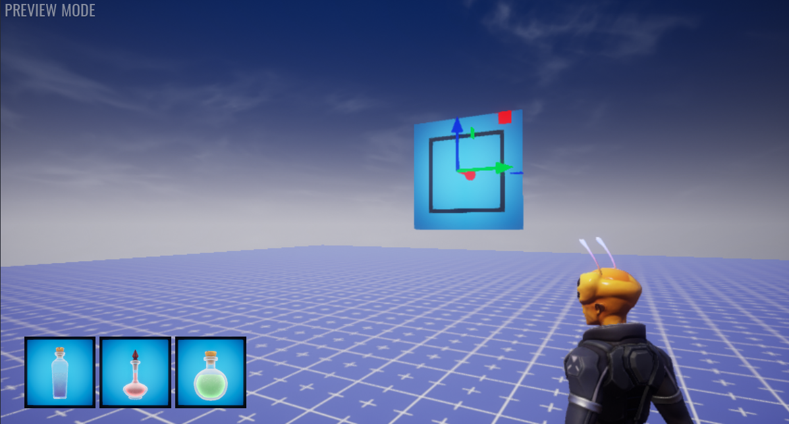

# Converting to Mobile

## Overview

Core is soon becoming available to iOS devices! In preparation, there are new features in the Core Editor that can help preview on different devices and manage mobile limitations. This tutorial will help guide creators to convert their existing games to become mobile-friendly.

* **Completion Time:** ~30 minutes
* **Knowledge Level:** Basic knowledge of the Core Editor.
* **Skills you will learn:**
    * Preview the game in the view of an iOS device.
    * Use Binding Set for players to interact with a touchscreen.
    * Update weapons and abilities to use action bindings.
    * Edit the UI to better fit smaller devices.
    * Improve object count performance by using Detail Relevance.

<!-- TODO: Add image or video of final product -->

## Device Preview

The first step is to open the project and test the new [**Device Preview**](../references/mobile_device_preview/).

### Open a Project

This tutorial will be using the Deathmatch Framework project as an example of converting for an iOS device. This tutorial can be incorporated for any other project.

<!-- TODO: Add image of Deathmatch framework new project -->

### Enable Device Preview

Once the project is open, click the Device Preview button to open an options menu. Activate the Enable option and the Viewport window should now represent a small device.

<!-- TODO: Add image of the Enable option -->

### Touch Screen Buttons and Controls

Press the Play button to test the new Touch Screen buttons and controls. The left mouse button acts as a Touch input.

#### Movement and Camera View

Holding down and dragging the left mouse button will do two different actions based on the cursor position on the screen. If the cursor is on the left half of the screen, then holding and dragging the left mouse button will move the player. If the cursor is on the right half of the screen, then holding and dragging the left mouse button will rotate the camera view.

<!-- TODO: Add image of the Enable option -->

#### Default Buttons

At the top of the device preview, there are four default buttons. Going from left to right, these buttons will close the current game, open the emote window, open the mount window, and open the settings window.

<!-- TODO: Add image of the default buttons -->

#### Control Buttons

Based on the action bindings (will be covered later on), there may be other buttons on the screen. There may be bumpers on the sides, a D-pad on the left side, and up to four buttons on the right side (X, Y, A, B).

<!-- TODO: Add image of the control buttons -->

### Note any Missing Controls

When testing the game, take note of any controls that seem to be missing from the normal game. The next step will fix these problems.

In the Deathmatch Framework project, there is currently no way for the player to shoot or reload with the touch controls.

## Binding Set

A [**Binding Set**](../references/binding_sets/) is a set of actions a creator has defined for the game. Each action can be given multiple bindings for keyboards, controllers, and mobile devices. This is incredibly useful to make a player's actions work across multiple devices.

### Open the Default Binding Set

New projects create a default binding set. Open the Hierarchy and expand the Gameplay Settings folder. Double left click the Default Binding object to open the Bindings Manager window.

<!-- TODO: Add image of the bindings manager window -->

### Change a Binding

There are usually a bunch of default actions such as movement, jumping, and crouching. Try changing the Mount action's Controller input to be the D-pad Up. Then preview the game and press the D-pad up button.

!!! note
    The Controller input for a binding refers to a physical game controller and the on-screen buttons for mobile devices.

<!-- TODO: Add video testing d-pad up mounting -->

### Add Bindings

Scroll down to the bottom of the Bindings Manager window and click the Add Binding button on the bottom right. Then select the Add Basic Binding option.

Set the Action Name, Keyboard Primary, and Controller property for the new binding. Add as many binding needed for the missing actions noted earlier.

<!-- TODO: Add image of new binding -->

### Connect the Bindings

With the new bindings created, it is now time to connect the actions to their functionality. This could be activating a weapon's ability or a script that runs a certain function when an action occurs.

#### Binding an Ability

[Abilities](../tutorials/ability_tutorial/) are easy to bind with actions because it simply requires changing a single property. Select the ability object and open the Properties window. Set the Action Name property to the same action name used when the binding was created.

In this example, the Starting Weapon template has an ability for shooting and reloading so they were both updated.

<!-- TODO: Add image of weapon ability -->

#### Binding with Scripting

Some other actions may require scripting to accomplish the functionality. The [Input](../api/input/) namespace has events for an action being pressed and released.

Here is a simple script that will show fly up text above the player when the player presses the Speak action binding.

```lua
function OnActionPressed(player, action, value)
    if action == "Speak" then
        UI.ShowFlyUpText("Hello", player:GetWorldPosition() + Vector3.UP * 110, {isBig = true})
    end
end

Input.actionPressedEvent:Connect(OnActionPressed)
```

<!-- TODO: Add video of player speaking action -->

## Mobile UI

Mobile devices will naturally have smaller screens than computers so it is important to keep UI within a certain area so all devices can see it.

### Safe Zone

The Safe Zone refers to an area where UI is is guaranteed to be visible on any device's screen.

Open the Device Preview Options menu and activate the Safe Zone option. There should be an orange dotted rectangle on the preview screen representing the safe zone. Make sure all UI is within the safe zone.

<!-- TODO: Add image of safe zone -->

!!! info
    UI Containers have a property named Use Safe Zone. This will help align UI components within the safe zone rather than the whole screen. This should be enabled by default.

### Flip Notch

Some devices also have a notch that can cover up part of the screen. This can lead to hidden UI if the device is flipped upside down and the notch is now on the opposite side of the screen.

Creators can flip the notch by activating the Flip Notch option in the Device Preview Options menu. Make sure all UI is visible from both orientations of the notch.

<!-- TODO: Add video of notch flipping -->

## Performance Limits and Detail Relevance

Due to mobile devices having lower capacity for graphics and memory, there are limitations to Core games published for mobile devices.

The two big limitations for mobile devices are the Object Count Limit is reduced from 30,000 to 10,000 and the Quality Preset is forced to Low.

### Performance Limit

On the top editor toolbar, there is a Performance Limits dropdown menu. This will show the difference in Object Count limits for mobile and non-mobile devices. It will also update the preview to show objects that are designated in the quality range.

<!-- TODO: Add image of Performance Limit -->

### Detail Relevance

There may be some groups of many objects that can severely impact the total object count for mobile games. Detail Relevance can help alleviate that problem by assigning a minimum quality for objects in a Client Context to be rendered.

Create a new Client Context and place some objects as children. With the Client Context selected, open the Properties window and enable the Advance Settings option. Change the Detail Relevance property to Medium+.

<!-- TODO: Add image of detail relevance property-->

Preview the project in different qualities by changing the Performance Limit. The group of objects should be hidden in Low quality but appear for any quality higher up.

<!-- TODO: Add video of group toggling based on quality -->

## Summary

Core games will need some slight tweaking to work on mobile devices. Using a Binding Set will help connect an action to multiple types of device inputs. The Device Preview Options can help preview UI on a variety of devices. There are also performance restrictions on smaller devices that may require some visuals having different version of quality.

## Learn More

[Mobile Device Preview Reference](../references/mobile_device_preview/) | [Binding Set Reference](../references/binding_sets/) | [Abilities Tutorial](../tutorials/ability_tutorial/) | [Input API](../api/input/)

# Tutorial Resources

{: .center loading="lazy" }

<div class="mt-video" style="width:100%">
    <video autoplay muted playsinline controls loop class="center" style="width:100%">
        <source src="/img/CameraCapture/IconGenerator/generator_final.mp4" type="video/mp4" />
    </video>
</div>
